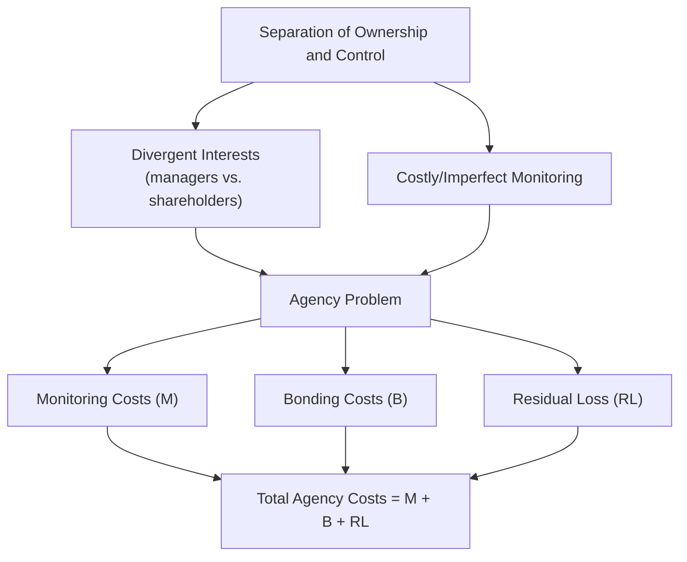
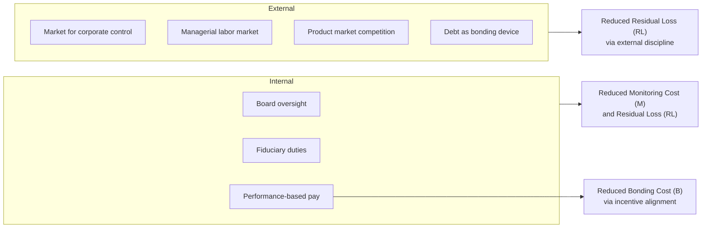

## Agency Costs and the Separation of Ownership and Control

### Historical and Conceptual Origin

The separation of ownership and control refers to the structural feature of large public corporations in which equity ownership is dispersed among numerous shareholders while decision-making authority over the firm's assets and operations is concentrated in professional managers who often own little or no equity themselves. Adolf Berle and Gardiner Means documented this phenomenon empirically in *The Modern Corporation and Private Property* (1932), observing that as share ownership became more widely dispersed across the American public corporation, effective control shifted from owners to a professional managerial class accountable to no single dominant shareholder.

Berle and Means's core concern was normative and somewhat pessimistic: with ownership so diffuse, no individual shareholder holds a large enough stake to justify the cost of monitoring management, creating conditions under which managers could potentially pursue their own interests at shareholders' expense with limited practical accountability. This observation predates, but directly motivates, the formal economic theory of agency costs developed four decades later.

### The Agency Relationship: Formal Definition

Michael Jensen and William Meckling, in their foundational 1976 article "Theory of the Firm: Managerial Behavior, Agency Costs and Ownership Structure," formally defined an **agency relationship** as a contract under which one party (the **principal**) engages another party (the **agent**) to perform some service on the principal's behalf, involving delegation of some decision-making authority to the agent.

**The agency problem** arises whenever two conditions hold simultaneously:

1. **Divergent interests**: The agent's interests are not perfectly aligned with the principal's interests (the agent may value leisure, perquisites, empire-building, risk avoidance for career-preservation reasons, or private control benefits differently than the principal values firm profit).
2. **Information asymmetry and costly monitoring**: The principal cannot costlessly and perfectly observe the agent's effort, decisions, or private information, so the agent has some scope to act on divergent interests without immediate detection or correction.

If either condition were absent — if interests were perfectly aligned, or if monitoring were costless and complete — no agency problem, and therefore no agency cost, would arise. Agency costs are therefore fundamentally a function of the *combination* of self-interested behavior and costly information/monitoring.

### The Three Components of Agency Costs

Jensen and Meckling decompose total agency costs into three additive components:

$$AC = M + B + RL$$

**1. Monitoring costs ($M$)**: Expenditures incurred by the principal to observe, measure, and constrain the agent's behavior. Examples include:

- Auditing of financial statements.
- Board of directors' oversight activities and independent director compensation.
- Formal budgeting and reporting systems that create traceable records of managerial decisions.
- Contractual incentive structures the principal designs and administers to limit divergent behavior.

**2. Bonding costs ($B$)**: Expenditures incurred by the agent to establish and guarantee that they will not take actions harmful to the principal, or to provide a credible mechanism compensating the principal if such actions occur. Examples include:

- Contractual restrictions the agent voluntarily accepts (e.g., non-compete clauses, restrictions on outside employment).
- The agent's own investment in a reputation for trustworthy dealing.
- Structuring compensation to include deferred pay or claw-back provisions that the agent forfeits upon detected misconduct.

**3. Residual loss ($RL$)**: The dollar-equivalent reduction in the principal's welfare resulting from the remaining divergence between the agent's actual decisions and the decisions that would have maximized the principal's welfare, even after optimal (cost-minimizing) levels of monitoring and bonding have been undertaken. Residual loss exists because monitoring and bonding are themselves costly and subject to diminishing returns — it is generally not efficient to eliminate all divergence, since the cost of doing so would exceed the value recovered.

**Key Points**

- Agency costs are borne, in equilibrium, primarily by the agent (or, in the case of managerial agency costs, ultimately reflected in a lower price shareholders are willing to pay for equity ex ante) — a result following from rational anticipation: if outside investors correctly anticipate agency costs, they discount the price paid for equity accordingly, so the *initial* controlling owner/entrepreneur who sells equity to outside shareholders effectively bears the capitalized cost of anticipated future agency problems.
- This anticipation mechanism is a central and often counterintuitive result: it implies that managers/controlling owners have a private incentive to *reduce* agency costs (through voluntary bonding, governance commitments, etc.) even without external legal compulsion, because doing so raises the price outside investors will pay for the firm's securities.
- The efficient (cost-minimizing) level of agency cost is not zero; the optimal level of monitoring and bonding equates their marginal cost to the marginal reduction in residual loss they produce.

### Sources of Managerial Divergence

Agency theory identifies several specific mechanisms through which managerial interests diverge from shareholder wealth maximization:

- **Perquisite consumption**: Managers may consume non-pecuniary benefits (excessive office space, corporate jets, lavish expense accounts) that provide utility to the manager but do not enhance (and may reduce) firm value.
- **Empire building / free cash flow problem**: Michael Jensen's later (1986) free cash flow theory argues managers have incentives to grow the firm beyond its value-maximizing size, since firm size is often correlated with managerial compensation, power, and prestige, even when available cash flow would be better returned to shareholders (via dividends or buybacks) than reinvested in low-return or negative-NPV projects. Managers with substantial free cash flow face weaker capital-market discipline than managers who must raise external capital for every investment (since external capital markets subject financing decisions to independent scrutiny).
- **Managerial risk aversion (entrenchment-driven)**: Because managers typically hold concentrated, undiversified "portfolios" of firm-specific human capital (their career and reputation are tied to one firm) while shareholders hold diversified portfolios, managers may rationally prefer lower-risk corporate strategies than shareholders (who can diversify firm-specific risk away) would prefer, even where a riskier strategy has a higher expected value.
- **Managerial entrenchment**: Actions taken specifically to increase the personal cost to the firm/board of replacing the incumbent manager (e.g., idiosyncratic investments that only the incumbent manager can competently oversee), reducing the effectiveness of external discipline mechanisms like the market for corporate control.
- **Horizon problem**: Managers approaching retirement or planning to depart may have shortened decision horizons relative to the long-run interests of shareholders, potentially favoring near-term reported performance over long-term value creation.

### The Free-Rider Problem in Shareholder Monitoring

A critical second-order collective action problem compounds the basic principal-agent problem in the context of the modern dispersed-ownership public corporation: monitoring managerial behavior is itself a **public good** among shareholders.

If any individual shareholder incurs the cost of monitoring management (reviewing filings, investigating related-party transactions, engaging with the board), the *benefits* of that monitoring (better-disciplined management, higher share price) accrue proportionally to *all* shareholders, not just the one who bore the monitoring cost. Because no individual dispersed shareholder can capture more than their pro-rata share of the benefit from their own monitoring expenditure, each shareholder has an incentive to free-ride on others' monitoring efforts, and the equilibrium level of shareholder monitoring is systematically below the level that would maximize aggregate shareholder value.

**Key Points**

- This free-rider problem is most severe precisely where Berle and Means observed the underlying separation of ownership and control to be most pronounced: firms with the most widely dispersed shareholding.
- The free-rider problem provides the underlying economic rationale for concentrated-ownership institutions (large block-holders, institutional investors with meaningful stakes, private equity ownership structures) that internalize a larger share of the monitoring benefit and therefore have a stronger private incentive to monitor.
- It also explains the economic function of intermediary institutions such as proxy advisory firms and activist hedge funds, which effectively specialize in producing the public good of monitoring and can profit from doing so at scale across a portfolio, or by acquiring a stake large enough to internalize sufficient benefit.

### Diagram: The Agency Cost Structure

### Governance Mechanisms That Reduce Agency Costs

Corporate law, market institutions, and private contracting together supply a set of mechanisms that reduce the components of agency cost:

**Internal governance mechanisms**

- **Board of directors oversight**: Statutory and stock-exchange-listing requirements for board composition (independent director requirements, audit committee composition) function as monitoring-cost-reducing devices, substituting a specialized, semi-professionalized monitor for the collective-action-constrained dispersed shareholder base.
- **Fiduciary duties**: The duty of care and duty of loyalty, enforced through the business judgment rule (for ordinary business decisions, providing a deferential standard protecting good-faith decisions) and heightened scrutiny standards (for self-dealing, conflict-of-interest, or change-of-control transactions), function as judicially supplied gap-filling terms addressing the fundamental incompleteness of the shareholder-manager contract.
- **Executive compensation design**: Linking compensation to firm performance (stock options, restricted stock, performance-vesting equity) is a direct incentive-alignment (bonding-cost-reducing, from the shareholder's perspective) mechanism intended to make the manager's personal wealth co-vary with shareholder wealth, converting a pure agency relationship partially into a residual-claimant-like incentive structure.
- **Say-on-pay and shareholder voting rights**: Provide a (typically advisory, in many jurisdictions) mechanism for shareholders to express approval or disapproval of executive compensation structures and other major corporate actions.

**External/market discipline mechanisms**

- **Market for corporate control**: The threat of a hostile takeover disciplines incumbent management even absent active shareholder monitoring, because persistently poor performance (reflected in a depressed share price relative to potential value under better management) creates a profit opportunity for an acquirer who can replace management and capture the value gap. [Inference] The empirical strength of this disciplining mechanism is affected by the prevalence and legal validity of takeover defenses (poison pills, staggered boards) in a given jurisdiction and period, so its practical force varies across legal regimes rather than being a constant.
- **Managerial labor market reputation**: Managers who perform poorly or are implicated in governance failures face reduced future employment prospects, providing an ex ante, reputation-based incentive independent of any single firm's internal governance.
- **Product market competition**: Firms facing intense product market competition have less organizational slack to absorb agency costs, since competitive pressure directly threatens firm survival, indirectly disciplining managerial slack.
- **Capital market discipline**: Firms that must repeatedly access external capital markets for financing are subject to periodic independent scrutiny by underwriters, credit rating agencies, and prospective investors, which Jensen's free cash flow theory identifies as a disciplining mechanism largely absent for firms with abundant internally generated free cash flow.
- **Debt as a bonding mechanism**: Jensen's free cash flow theory further argues that increasing leverage (debt) can serve as a voluntary managerial bonding mechanism, since contractual debt service obligations reduce the discretionary free cash flow available for managers to divert to non-value-maximizing uses, effectively pre-committing future cash flows away from potential perquisite consumption or empire-building.

### Diagram: Governance Mechanisms Mapped to Agency Cost Components

### Ownership Structure and the Costs of Debt versus Equity

Jensen and Meckling's framework extends agency analysis beyond the shareholder-manager relationship to the **shareholder-bondholder** relationship, identifying a distinct set of agency costs of debt:

- **Asset substitution problem**: Once debt is issued, equity holders (who, together with managers acting in their interest, retain residual control over operating decisions) have an incentive to shift the firm's investment portfolio toward riskier projects than bondholders priced into the original debt terms, since equity holders capture the upside of increased risk (as residual claimants) while bondholders bear a disproportionate share of the downside (since their claim is fixed regardless of how well the risky project performs).
- **Underinvestment problem (debt overhang)**: When a firm has significant outstanding debt, positive-NPV projects may be foregone because much of the project's value would flow to existing bondholders (reducing their default risk) rather than to the equity holders/managers financing the investment, causing value-adding investment to be inefficiently skipped.
- **Bondholder protective mechanisms**: Covenants restricting additional borrowing, dividend payouts, or asset sales; collateral and security interests; and monitoring by credit rating agencies function as the bondholder-side analogues of the monitoring and bonding mechanisms described above, addressing agency costs specific to the debt-equity conflict rather than the manager-shareholder conflict.

**Key Points**

- This yields a core prediction of the framework: the observed capital structure (mix of debt and equity) of a firm reflects, in part, an optimization over the total agency costs associated with each financing source, not merely a tax or bankruptcy-cost trade-off as in simpler capital structure models — a synthesis sometimes referred to as incorporating agency costs into the broader trade-off theory of capital structure.
- The existence of agency costs of debt provides a countervailing consideration against Jensen's free cash flow argument that debt unambiguously reduces agency costs — the optimal leverage level in principle balances the free-cash-flow-discipline benefit of debt against the asset-substitution and underinvestment costs debt itself introduces.

### Empirical and Doctrinal Relevance

**Example**

A stylized illustration of the interaction between agency costs and firm valuation: if outside investors rationally anticipate that a controlling founder-manager, post-IPO, will consume $X$ in annual perquisites and pursue empire-building acquisitions with negative expected NPV of $Y$ in present value, the price investors are willing to pay for newly issued shares will be discounted by approximately the capitalized value of $X$ plus $Y$ relative to a hypothetical world with zero agency costs — meaning the founder-manager, not diffuse future shareholders, bears the primary economic cost of anticipated agency problems through a lower IPO valuation. This is the mechanism underlying the "bonding hypothesis" in cross-listing literature: firms voluntarily subject themselves to stricter disclosure and governance regimes (e.g., cross-listing on an exchange with more stringent listing standards) specifically to credibly reduce anticipated agency costs and thereby command a higher valuation.

**Doctrinal touchpoints**

- The business judgment rule's deferential standard of review for ordinary corporate decisions can be understood, in agency-cost terms, as reflecting a judicial judgment that the residual loss from occasional bad-faith or negligent business decisions is, on average, smaller than the residual loss (in the form of excessive managerial risk-aversion and litigation-driven decision paralysis) that would result from courts second-guessing business decisions with the benefit of hindsight.
- Heightened judicial scrutiny standards for self-dealing and conflict-of-interest transactions (e.g., entire fairness review) reflect the recognition that ordinary market and governance discipline mechanisms are least reliable precisely where a manager or controlling shareholder's interests diverge most sharply and directly from other shareholders' interests.
- Mandatory disclosure regimes under securities law can be understood as a legally imposed monitoring-cost-reduction mechanism, socializing the cost of producing information that would otherwise be undersupplied due to the same free-rider logic affecting shareholder monitoring generally (information about firm performance, once disclosed, is a public good among current and prospective shareholders).

### Conclusion

Agency cost theory supplies the rigorous economic microfoundation for the empirical phenomenon Berle and Means identified: the separation of ownership and control inherent in the modern public corporation. By decomposing the costs of the shareholder-manager relationship into monitoring costs, bonding costs, and residual loss, and by identifying the compounding free-rider problem in shareholder monitoring itself, the framework explains both why agency costs are a pervasive and largely irreducible feature of dispersed corporate ownership, and why corporate law, market institutions (the market for corporate control, capital markets, product market competition), and private contracting (executive compensation design, debt covenants, voluntary bonding) have each evolved specific mechanisms targeting particular components of the underlying agency cost structure. The framework further extends naturally to the shareholder-bondholder relationship, revealing that capital structure choice itself reflects an optimization over competing sets of agency costs rather than a single unified cost to be minimized.

**Next Steps**

- Free cash flow theory and the disciplining role of leverage
- Fiduciary duty doctrine: business judgment rule and entire fairness review
- Executive compensation design and pay-for-performance sensitivity
- The market for corporate control and takeover defense mechanisms
- Shareholder activism and institutional investor monitoring incentives
- Capital structure theory: trade-off theory versus pecking order theory
- Cross-listing and the bonding hypothesis in comparative corporate governance
- Mandatory disclosure regulation as a public-good-provision mechanism