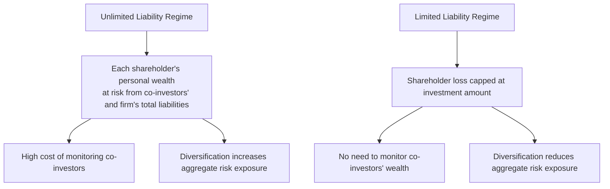
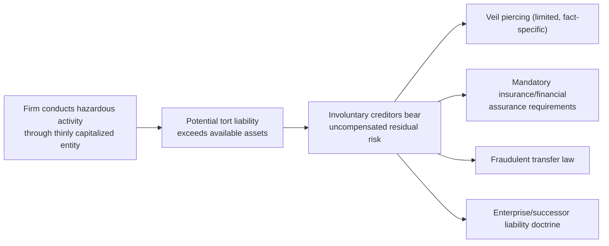

## Limited Liability and Its Economic Consequences

### Definition and Legal Foundation

Limited liability is the legal rule under which the personal assets of a firm's equity investors (shareholders) are shielded from claims against the firm beyond the amount of their investment. If a corporation becomes insolvent or is held liable for damages exceeding its assets, shareholders lose, at most, the value of their shares; creditors and tort claimants generally cannot reach shareholders' personal wealth to satisfy the shortfall. This stands in contrast to unlimited liability regimes (historically applicable to general partnerships and, in some jurisdictions, early corporate forms) in which owners are personally liable, jointly and severally, for the full extent of business obligations.

Limited liability is not a natural or inevitable feature of business organization — it is a state-conferred legal default, historically granted through corporate charters and now standard in general corporate statutes, business trust law, and limited liability company (LLC) statutes. Its economic justification and consequences form a central topic in corporate law and economics because the rule simultaneously solves several efficiency problems while creating others, particularly an externality onto involuntary creditors.

### Economic Rationale: Why Limited Liability Is Efficient for Voluntary Creditors

**1. Reduces the cost of monitoring co-investors**

Under unlimited liability, each shareholder's personal wealth is at risk from the actions and financial condition not only of the firm's managers but also of every other shareholder (since liability can be joint and several). This creates a strong incentive for each shareholder to monitor the wealth and behavior of every other shareholder — an extremely costly undertaking as the number of shareholders grows. Limited liability eliminates this shareholder-monitor-shareholder problem entirely, since each investor's maximum loss is capped at their own investment regardless of co-investors' wealth or conduct.

**2. Enables efficient risk diversification**

Because an investor's downside is capped at the amount invested, limited liability allows investors to hold small stakes across many different firms without fear that any single firm's failure could expose their entire personal wealth. This is a necessary precondition for the kind of broad portfolio diversification central to modern finance theory; unlimited personal liability would make diversification prohibitively risky, since holding stakes in numerous firms would multiply, rather than reduce, an investor's aggregate exposure to catastrophic loss.

**3. Reduces the cost of monitoring management**

Because shareholders' potential losses are bounded, the marginal benefit of costly monitoring of managerial decisions is lower than it would be under unlimited liability (where a single catastrophic managerial decision could expose personal wealth without limit), somewhat reducing (though not eliminating) the agency-cost-driven incentive to monitor described in standard agency theory.

**4. Facilitates liquid, anonymous capital markets**

Limited liability makes shares more fungible and easier to price, because a share's value does not depend on the idiosyncratic personal wealth of its current or prior holders (irrelevant under limited liability, since no shareholder's personal assets are ever at stake regardless of who else holds shares). This supports efficient secondary trading markets, since a purchaser need not investigate the personal solvency of other shareholders before buying shares — a precondition for the depth and liquidity of modern public equity markets.

**5. Facilitates efficient managerial specialization and passive investment**

Limited liability permits a clean separation between those who supply capital (who may have no expertise in or desire to participate in day-to-day management) and those who supply managerial expertise, without requiring passive capital-suppliers to accept unlimited personal risk from decisions they do not control — reinforcing the separation of ownership and control central to the modern public corporation.

### Diagram: Limited Liability's Effect on Investor Risk Exposure

### The Central Cost: Externalization of Risk onto Creditors

The efficiency gains above are counterbalanced by limited liability's central economic cost: it shifts a portion of the firm's downside risk from equity holders onto the firm's creditors, and this shift is priced differently depending on whether the creditor is **voluntary** or **involuntary**.

**Voluntary (contractual) creditors** — lenders, trade creditors, bondholders, employees, and other parties who extend credit or enter contracts with the firm by choice — can, in principle, adjust the terms of their dealings ex ante to compensate for limited liability's risk-shifting effect: charging higher interest rates, demanding collateral or personal guarantees, requiring covenants restricting risky behavior, or simply refusing to deal with thinly capitalized firms. Because voluntary creditors can price-protect themselves, limited liability's risk externalization onto this group is, in a well-functioning credit market, substantially internalized back onto the firm (and ultimately onto shareholders) through the terms voluntary creditors demand.

**Involuntary (non-adjusting) creditors** — most prominently tort victims injured by the firm's activities (e.g., environmental contamination, product defects, workplace accidents affecting third parties) — cannot negotiate ex ante terms with the firm at all, since their "relationship" with the firm arises only after the harm occurs. This population cannot price-protect against the risk that the firm's assets will be insufficient to cover damages, meaning limited liability, for this class of claimant, functions as a pure, uncompensated externality: the firm's shareholders capture the expected value of risky, harm-generating activity while a portion of the expected cost of that activity (the portion exceeding the firm's asset base) falls on injured third parties who had no opportunity to price or decline the risk.

**Key Points**

- This asymmetry between voluntary and involuntary creditors is the central analytical distinction in the law-and-economics literature on limited liability's welfare effects, most prominently developed in Henry Hansmann and Reinier Kraakman's influential critique proposing pro rata unlimited shareholder liability specifically for tort claims (while retaining limited liability for contractual/voluntary creditors).
- Because shareholders do not bear the full expected cost of harm to involuntary creditors, limited liability can, in principle, distort firms' incentives toward excessively risky or hazardous activities relative to the socially efficient level — a direct parallel to the externality logic underlying Pigouvian and strict liability analysis in tort law and environmental law.
- The magnitude of this distortion is theoretically greater for thinly capitalized firms and for activities generating potential harms large relative to firm asset value (e.g., environmental contamination, mass tort exposure, activities conducted through judgment-proof shell subsidiaries).

### Judgment-Proofing and Strategic Undercapitalization

A closely related concern is that limited liability, combined with the ability to organize hazardous activities through separately incorporated, thinly capitalized subsidiaries, can enable **judgment-proofing**: deliberately structuring a firm's capital and asset holdings so that potential tort liability exceeds the assets available to satisfy any judgment, effectively capping the firm's downside exposure below the true expected cost of the activity it conducts.

**Mechanisms of judgment-proofing:**

- Operating hazardous activities through a subsidiary holding minimal assets, with the parent corporation extracting profits (via dividends, management fees, or asset transfers) while leaving the subsidiary undercapitalized relative to the risks it generates.
- Maintaining insufficient or no liability insurance for activities with substantial harm potential, since limited liability removes the market and legal pressure that would otherwise compel adequate insurance coverage.
- Distributing assets to shareholders (dividends, stock buybacks) in anticipation of, or contemporaneously with, activities likely to generate large contingent liabilities.

**Legal responses to judgment-proofing and its incentive effects:**

- **Piercing the corporate veil**: A judicially developed doctrine allowing courts, in specified circumstances (commonly: failure to observe corporate formalities, commingling of personal and corporate assets, undercapitalization at formation, or use of the corporate form to perpetrate fraud or injustice), to disregard limited liability and hold shareholders personally liable. [Inference] Empirical studies of veil-piercing litigation generally find courts invoke the doctrine relatively infrequently and its application is highly fact-specific and jurisdiction-dependent, so it functions more as a backstop against egregious abuse than as a routine check on ordinary risk externalization.
- **Mandatory insurance and financial responsibility requirements**: Regulatory regimes in specific hazardous industries (e.g., environmental law's financial assurance requirements for waste facilities, mandatory auto and workers' compensation insurance) directly address judgment-proofing risk by requiring firms to maintain minimum insurance or bonding levels regardless of limited liability's default risk allocation.
- **Successor liability and enterprise liability doctrines**: In some contexts, courts extend liability across corporate affiliates or successor entities to prevent the corporate form from being used purely to escape accumulated liability through restructuring or asset transfers.
- **Fraudulent conveyance/transfer law**: Allows creditors to unwind asset transfers made with intent to hinder, delay, or defraud creditors, or made for less than reasonably equivalent value while the transferor was insolvent — a general commercial-law backstop against strategic pre-liability asset stripping.

### Diagram: Judgment-Proofing and Legal Countermeasures

### Comparative Treatment: Contract versus Tort Creditors in Doctrine

Corporate law and economics scholarship broadly supports treating limited liability's efficiency justification as strongest, and least controversial, in the contractual-creditor context, while treating the tort/involuntary-creditor context as the primary locus of legitimate policy concern:

| Creditor Type | Can Price-Protect Ex Ante? | Limited Liability's Effect |
| --- | --- | --- |
| Secured lenders | Yes (collateral, covenants) | Efficiently internalized |
| Trade creditors | Partially (credit terms, deposits) | Largely internalized |
| Bondholders | Yes (covenants, credit ratings, interest rate) | Efficiently internalized |
| Employees (wage claims) | Limited | Partially internalized; often addressed via priority in bankruptcy |
| Tort victims (product liability, environmental harm) | No | Externalized; central policy concern |

**Key Points**

- This distinction underlies proposals (most associated with Hansmann and Kraakman) for a **pro rata unlimited liability rule for tort claims only**: each shareholder would be liable for a share of any tort judgment proportional to their percentage ownership of the firm, preserving limited liability's benefits for voluntary/contractual dealings (where it remains efficient) while restoring incentive alignment for the specific class of claim where market pricing cannot discipline risk-taking.
- Critics of reform proposals note practical difficulties: pro rata unlimited liability could reintroduce the very shareholder-monitoring-of-co-investors problem limited liability was designed to eliminate (since an individual shareholder's exposure would again depend on the wealth of other shareholders, if joint-and-several elements remain, or would require costly individualized enforcement against numerous dispersed shareholders even under a strict pro rata regime), potentially undermining share liquidity and diversification benefits.
- [Unverified] The extent to which any jurisdiction has adopted pro rata unlimited shareholder liability specifically for tort claims as a general rule (as opposed to industry-specific financial responsibility regulation) should be checked against current statutory law, as this remains primarily an academic reform proposal rather than a widely adopted legal rule.

### Limited Liability and Capital Structure/Leverage Incentives

Limited liability interacts with capital structure choices in ways connected to, but distinct from, the shareholder-bondholder agency costs discussed in agency cost theory:

- **Asset substitution amplification**: Because equity holders' downside is capped at their investment while their upside is unlimited, limited liability, combined with debt financing, creates option-like payoffs for equity (equity can be modeled as a call option on firm assets with a strike price equal to the face value of debt, per option-pricing approaches to corporate securities). This structure amplifies the incentive, discussed in agency-cost analysis of debt, for equity holders to prefer riskier investment strategies than bondholders priced into their lending terms, since limited liability caps equity's loss from a failed risky bet while preserving full exposure to its potential upside.
- **Leverage and externalization interact**: Higher leverage relative to a firm's asset base increases the portion of a potential tort judgment that would exceed available firm assets, meaning highly leveraged, thinly capitalized firms externalize a larger share of expected tort costs onto involuntary creditors than well-capitalized, low-leverage firms conducting the same hazardous activity.

### Broader Economic Consequences: Effects on Entrepreneurship and Capital Formation

**Positive effects on capital formation:**

- By capping individual investor risk, limited liability lowers the effective cost of raising equity capital from a broad, diversified investor base, which is widely credited in economic history and corporate law scholarship as a significant contributing factor (alongside free transferability of shares and the emergence of formal securities exchanges) to the historical development of large-scale, capital-intensive industrial enterprise and modern public capital markets.
- Encourages entrepreneurial risk-taking by capping the personal financial catastrophe risk faced by founders and early investors, which is frequently cited as a positive-welfare effect insofar as socially valuable but individually risky ventures might otherwise be undersupplied due to excessive personal risk aversion under unlimited liability.

**Distortionary effects:**

- As discussed above, limited liability can distort activity-level and risk-level choices toward excessive hazard in industries where potential harm to third parties is large relative to feasible firm capitalization, and where mandatory insurance or other regulatory backstops are absent or inadequate.
- [Inference] Some scholarship argues that limited liability may also reduce shareholders' incentives to monitor firm risk-taking generally (beyond the tort-specific externality), since a portion of the downside of excessive risk-taking, even in ordinary business contexts, falls on creditors rather than shareholders once a firm is sufficiently close to insolvency — this connects to the broader debt-agency-cost literature on asset substitution rather than being a distinct, independently established empirical claim.

### Extension to LLCs and Alternative Business Entities

The economic logic of limited liability extends beyond the traditional corporate form to limited liability companies (LLCs), limited partnerships (for limited partners), and limited liability partnerships (LLPs), which have proliferated substantially since the late twentieth century, particularly in the United States following widespread state adoption of LLC statutes. These entities generally replicate the core risk-allocation feature (capped owner liability) while offering different governance flexibility and, in many jurisdictions, pass-through tax treatment — meaning the same economic trade-offs (efficient risk-diversification and monitoring benefits for voluntary creditors, externalization risk for involuntary/tort creditors) apply with equal force to these increasingly common alternative entity forms, and the judgment-proofing and veil-piercing doctrines discussed above have direct analogues developed specifically for the LLC context in most jurisdictions.

### Conclusion

Limited liability is a foundational institutional feature of corporate law whose economic function is best understood as an efficient risk-allocation rule for voluntary, price-adjusting creditors — reducing costly shareholder-monitoring-of-co-investors problems, enabling portfolio diversification, and supporting the depth and liquidity of modern capital markets — while simultaneously generating a genuine, uncompensated externality onto involuntary creditors, most importantly tort victims, who cannot price-protect against the risk that a firm's assets will prove insufficient to cover the harms it causes. This dual character explains why the law-and-economics literature on limited liability is not a simple efficiency defense or critique, but rather a nuanced analysis distinguishing contexts where the rule is well-justified (contractual dealings among sophisticated, price-adjusting parties) from contexts where it may require supplementary legal correction (mandatory insurance, veil-piercing, fraudulent transfer law, or more far-reaching reforms such as pro rata unlimited tort liability) to restore efficient incentives for activity-level and risk-level choices where market pricing mechanisms cannot operate.

**Next Steps**

- Piercing the corporate veil: doctrinal standards and empirical patterns
- Hansmann and Kraakman's pro rata unlimited liability proposal for tort claims
- Capital structure theory and the option-pricing model of equity
- Mandatory insurance and financial responsibility regulation in hazardous industries
- Enterprise liability and successor liability across corporate affiliates
- Fraudulent conveyance and fraudulent transfer law
- LLC statutes and the extension of limited liability beyond the corporate form
- Judgment-proofing strategies and their regulation in environmental and product liability law