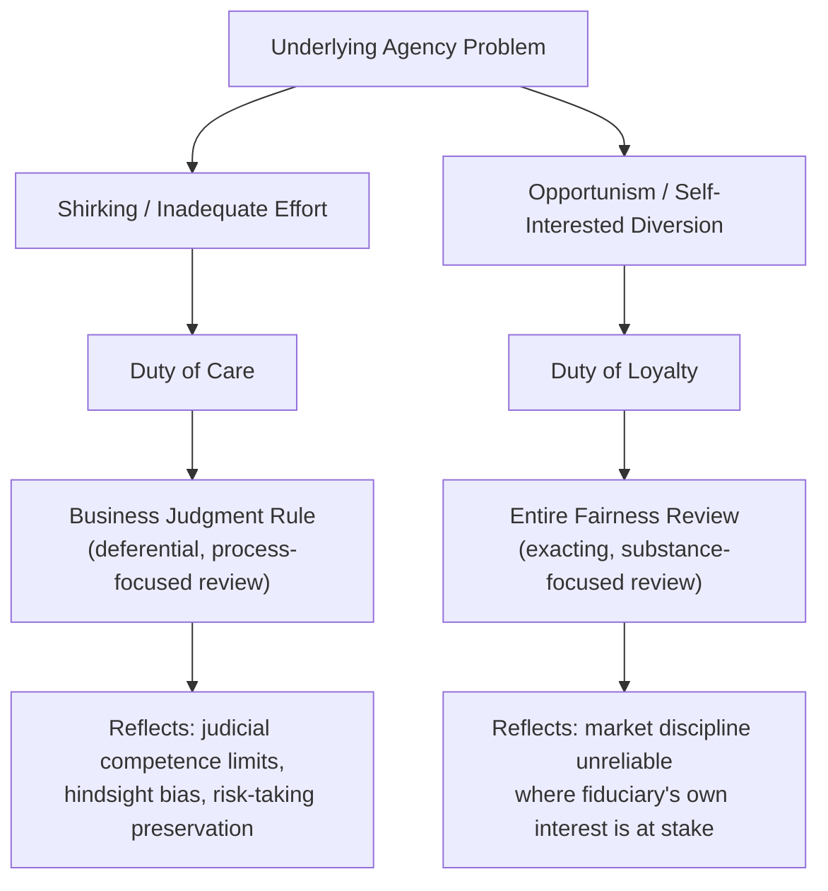
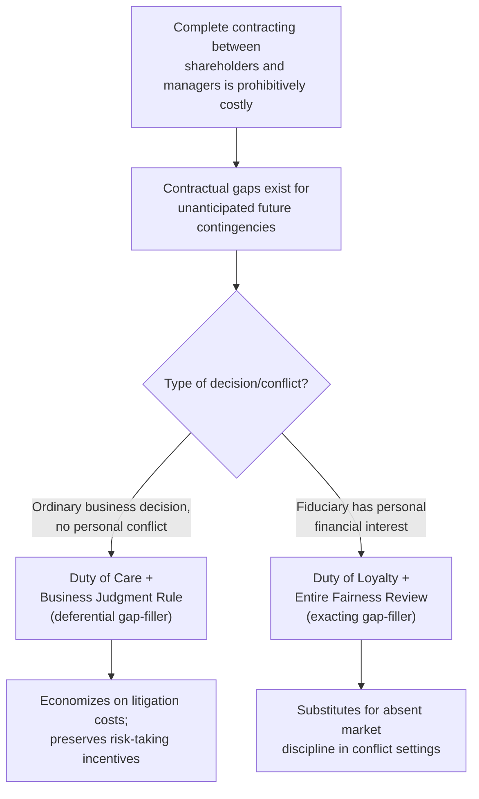

## Fiduciary Duties and Their Economic Rationale

### Conceptual Foundation: Fiduciary Duties as a Response to Incomplete Contracts

A fiduciary relationship arises where one party (the fiduciary — a corporate director, officer, controlling shareholder, trustee, or agent) is granted discretionary power or control over the interests of another party (the beneficiary — shareholders, the corporation, trust beneficiaries) who is comparatively unable to fully monitor or contractually constrain how that discretion is exercised. Corporate fiduciary duties — chiefly the **duty of care** and **duty of loyalty** — are the doctrinal mechanism by which corporate law responds to this structural vulnerability.

The economic starting point is the same incomplete-contracting problem underlying the theory of the firm and agency cost analysis: it is prohibitively costly, and often literally impossible, for shareholders to draft an explicit contract with directors and officers specifying the correct decision for every conceivable future business contingency. Rather than leaving this contractual gap unfilled (which would permit unconstrained managerial opportunism) or requiring costly renegotiation each time an unanticipated contingency arises, corporate law supplies a **standardized, judicially enforced gap-filling term**: the fiduciary duty. In this view, fiduciary duties function as an implied contractual term that the parties (shareholders and managers) would have bargained for themselves ex ante had transaction costs of complete contracting been zero — reducing the cost of forming the shareholder-manager relationship by supplying a low-cost, off-the-rack standard of conduct applicable across the enormous range of business decisions no explicit contract could practically anticipate.

**Key Points**

- This framing directly connects fiduciary duty doctrine to the nexus-of-contracts theory of the firm: most corporate law, including fiduciary duty rules, is best understood as a *default* rule filling contractual gaps, not as an external regulatory imposition unrelated to what rational contracting parties would choose.
- The specific content of fiduciary duties (discussed below) can be understood as economically calibrated: distinct standards apply to different categories of managerial decision because the underlying incomplete-contracting and monitoring problems differ in severity and kind across those categories.
- Fiduciary duties substitute for, and economize on, the same monitoring and bonding costs identified in agency cost theory — rather than requiring shareholders to individually negotiate and monitor compliance with bespoke behavioral constraints, courts supply and enforce a uniform standard applicable to all similarly situated fiduciaries.

### The Duty of Care

The **duty of care** requires directors and officers to act with the level of care, skill, and diligence that a reasonably prudent person would exercise in a similar position when making business decisions — informing themselves of material information reasonably available before acting, and exercising reasonable diligence in the decision-making process.

**Economic function**: The duty of care addresses the agency problem of managerial **shirking** — inadequate effort or diligence in decision-making that reduces firm value, analogous to the team-production shirking problem identified in Alchian-Demsetz's theory of the firm. Absent some legal constraint on care, managers (who bear only a fraction of the value consequences of their own decisions, particularly where their compensation is not fully sensitive to firm performance) would have a private incentive to under-invest effort in decision-making relative to the level that maximizes shareholder wealth.

### The Business Judgment Rule

The **business judgment rule (BJR)** is the operative standard of judicial review applied to duty-of-care claims: courts presume that, in making a business decision, directors acted on an informed basis, in good faith, and in the honest belief that the action was in the corporation's best interest, and will not substitute their own judgment for that of the board absent evidence of gross negligence in the decision-making process, fraud, illegality, or a conflict of interest.

**The economic rationale for judicial deference is multi-part:**

1. **Hindsight bias correction**: Courts reviewing a business decision after the fact know the outcome, but the decision-maker did not. Without a deferential standard, litigation risk would be systematically biased toward punishing decisions that turned out poorly ex post, even where the decision was entirely reasonable given the information available ex ante — a form of outcome-based rather than process-based liability that would poorly align incentives.
2. **Risk-taking incentive preservation**: Because corporate residual claimants (diversified shareholders) generally prefer managers to accept the level of business risk that maximizes expected firm value (since idiosyncratic risk can be diversified away in shareholders' broader portfolios), while individual managers bear concentrated, non-diversifiable career and reputational risk from any single firm's poor outcomes, excessive judicial second-guessing of business decisions would push already risk-averse managers toward even more excessive risk aversion, destroying value from foregone positive-expected-value but risky projects.
3. **Judicial competence limitations**: Courts generally lack the business expertise, information, and speed of decision-making available to directors and officers who directly evaluate a proposed transaction, making them comparatively poor substitute decision-makers for ordinary business judgments.
4. **Litigation cost economization**: A deferential standard reduces the volume of costly derivative litigation over ordinary business outcomes, reserving more intensive (and expensive) judicial scrutiny for the categories of decision (self-dealing, conflicts of interest) where the underlying incentive-alignment problem is genuinely more severe.

**Key Points**

- The business judgment rule is best understood, in economic terms, as an efficient risk-allocation and information-cost-minimizing standard rather than as mere judicial deference to managerial authority for its own sake: it reflects a considered trade-off between the residual loss from occasional undetected bad-faith or careless decisions and the larger aggregate cost that would result from excessive judicial oversight chilling value-maximizing risk-taking.
- The BJR's presumption can be rebutted by evidence the decision-making *process* (not the substantive outcome) was deficient — reflecting the principle that fiduciary duty enforcement targets the quality of the decision-making process, since courts are comparatively well-positioned to evaluate whether adequate information was gathered and considered, but comparatively poorly positioned to evaluate whether a substantive business outcome was, in hindsight, the objectively best choice.

### The Duty of Loyalty

The **duty of loyalty** requires directors, officers, and controlling shareholders to act in the best interests of the corporation and its shareholders generally, rather than in their own personal interest, when a conflict exists between the fiduciary's personal interests and those of the corporation. Duty of loyalty claims arise most commonly in:

- **Self-dealing transactions**: A director or officer has a personal financial interest in a transaction the corporation is entering into (e.g., the corporation purchasing goods or services from a company the director owns).
- **Corporate opportunity doctrine**: A director or officer personally takes advantage of a business opportunity that properly belongs to the corporation, rather than presenting it to the corporation first.
- **Controlling shareholder transactions**: A controlling shareholder causes the corporation to engage in a transaction (e.g., a squeeze-out merger, an intercompany transaction) that benefits the controller at the expense of minority shareholders.
- **Executive compensation determinations**: Where the board setting compensation levels is itself influenced by the very executives whose pay is being determined (a structural conflict addressed through independent compensation committees and, in some contexts, heightened scrutiny).

**Economic function**: The duty of loyalty addresses managerial **opportunism** — the affirmative pursuit of personal gain at the corporation's expense, as distinct from the mere inadequate-effort problem addressed by the duty of care. This is precisely the category of decision Williamson's transaction cost economics identifies as most exposed to hold-up-like exploitation of an informational or positional advantage, and precisely where market discipline mechanisms (the market for corporate control, managerial labor market reputation, product market competition) are least reliable, since the conflicted fiduciary's private interest, rather than firm performance, drives the relevant decision.

### Diagram: Duty of Care versus Duty of Loyalty — Distinct Problems, Distinct Standards

### Entire Fairness Review and Heightened Scrutiny

Where a duty of loyalty conflict is present, courts apply a materially more exacting standard than the business judgment rule — most rigorously, **entire fairness review**, which requires the fiduciary to demonstrate both:

1. **Fair dealing**: The transaction was negotiated and approved through a fair process (timing, structure, disclosure, negotiation).
2. **Fair price**: The economic terms of the transaction were substantively fair to the corporation/minority shareholders, judged against relevant valuation benchmarks.

**Economic rationale for the shift in scrutiny**: The justifications for judicial deference under the business judgment rule specifically presuppose that the decision-maker's incentives are reasonably aligned with the corporation's interest (even if imperfectly, per ordinary agency cost analysis) — the deference is calibrated to a setting where the *primary* risk is inadequate effort or honest business misjudgment, not deliberate self-interested extraction. Once a fiduciary has a personal financial stake in the outcome of a transaction, this alignment assumption breaks down, and the hindsight-bias and risk-preservation rationales for deference no longer apply with the same force, since the concern shifts from discouraging value-maximizing risk-taking to detecting and deterring value-extracting self-dealing.

**Intermediate standards and cleansing mechanisms**: Corporate law also recognizes procedural mechanisms that can shift the standard of review back toward deference even in conflict-of-interest settings, reflecting an economic logic that the underlying incentive-misalignment concern is mitigated when specific safeguards are present:

- **Approval by a fully informed, disinterested board majority or special committee** — independent decision-makers without the personal conflict can substitute for market discipline that would otherwise be absent.
- **Approval by a fully informed, disinterested shareholder vote (ratification)** — shifts decision authority to the party whose interests the duty of loyalty exists to protect.
- **Combining both independent committee approval and disinterested shareholder ratification** — in some jurisdictions' doctrine, satisfying both procedural safeguards can restore business-judgment-rule-level deference (or a similarly deferential standard) even for a transaction that would otherwise trigger entire fairness review, reflecting the view that the underlying conflict-of-interest risk has been adequately neutralized through the procedural safeguard rather than through substantive judicial re-examination.

### The Duty of Loyalty as an Efficient Response to the Limits of Contracting and Market Discipline

**Key Points**

- The heightened scrutiny applied to loyalty violations, relative to care violations, is not an arbitrary doctrinal distinction — it reflects a considered economic judgment about where the various mechanisms discussed in agency cost theory (monitoring, bonding, market discipline) are least likely to independently solve the underlying incentive problem, requiring more robust judicial substitution for the alignment those mechanisms would otherwise provide.
- Delaware corporate law's evolution toward permitting exculpation of directors from monetary liability for duty-of-care violations (but generally not for duty-of-loyalty violations, bad faith, or intentional misconduct) via charter provisions is itself consistent with an economic reading: shareholders, in exercising their own contracting freedom under the nexus-of-contracts framework, have widely chosen to waive the (comparatively low-value, given the BJR's existing deference) additional protection against ordinary care lapses in exchange for reduced director risk-aversion and reduced difficulty recruiting qualified directors — while declining to waive protection against the more severe loyalty-conflict risk, where the underlying incentive-alignment problem is most acute.
- [Inference] The specific doctrinal thresholds (e.g., what counts as "gross negligence" for care claims, or what procedural safeguards suffice to shift the standard of review for conflict transactions) vary across jurisdictions and evolve through case law, so specific numerical or definitional thresholds should be verified against the governing jurisdiction's current case law rather than treated as fixed across all corporate law systems.

### The Duty of Loyalty in Controlling Shareholder Contexts

A related but analytically distinct application arises where a controlling shareholder, rather than a manager, is the fiduciary. Because a controlling shareholder holds sufficient voting power to determine corporate outcomes directly (rather than merely exercising delegated managerial discretion), the underlying economic concern shifts somewhat: the relevant agency problem is not shirking (controllers, holding a large equity stake, are directly incentivized by their own equity value) but rather the extraction of **private benefits of control** at the expense of minority shareholders — for example, a squeeze-out merger priced to transfer value from minority shareholders to the controller, or self-dealing transactions between the controller's other business interests and the controlled corporation.

**Key Points**

- This context illustrates a general principle in fiduciary duty economics: the specific content and intensity of the duty tracks the specific incentive-misalignment risk presented by the type of fiduciary and type of decision at issue, rather than applying a single undifferentiated standard across all corporate actors and all decisions.
- Minority shareholders in a controlled corporation face a particularly acute version of the free-rider-in-monitoring problem discussed in agency cost theory, since they lack the voting power to replace the controller through ordinary corporate democracy (unlike the diffuse-ownership setting where an activist investor or coalition can, in principle, assemble sufficient votes to discipline underperforming management), making judicial fiduciary duty enforcement comparatively more important as a check in the controlling-shareholder context than in some dispersed-ownership settings where market and voting discipline retain more force.

### Fiduciary Duties Beyond Corporate Directors: Trustees and Agents

The same economic logic extends beyond corporate director/officer relationships to other fiduciary contexts governed by analogous, though doctrinally distinct, standards:

- **Trustees**: Owe beneficiaries duties of loyalty and prudence (often codified, e.g., in prudent investor rule statutes governing trust investment management), addressing the same discretionary-control-over-others'-assets structure, typically with less judicial deference than the corporate business judgment rule, reflecting trust law's traditionally more protective posture toward beneficiaries who often have even less capacity to monitor or replace a trustee than corporate shareholders have to monitor or replace directors.
- **Agents generally**: Owe principals duties of loyalty and care under general agency law, the doctrinal ancestor from which corporate fiduciary duty concepts substantially derive.
- **Investment advisers and broker-dealers**: Fiduciary or suitability standards applicable to financial professionals managing client assets reflect the same underlying economic structure — a discretion-holder whose informational and positional advantage over the beneficiary creates opportunity for the same shirking and opportunism problems addressed by corporate fiduciary duties.

[Inference] The degree of judicial deference and the specific content of the duty (e.g., trustee prudent investor standards versus the corporate business judgment rule) differ across these contexts in ways that plausibly reflect differences in the beneficiary's capacity for self-protection, portfolio diversification, and exit options, though a full comparative account of why each context's standard differs precisely as it does is a matter of ongoing doctrinal and economic scholarship rather than a single settled unifying formula.

### Diagram: Fiduciary Duty as a Contractual Gap-Filler

### Enforcement Mechanisms: Derivative Litigation

Because the corporation itself (not individual shareholders directly) is typically the party harmed by a fiduciary breach, and because the board (which may itself be implicated in or unwilling to pursue the claim) ordinarily controls litigation decisions on the corporation's behalf, corporate law provides the **derivative suit** mechanism: an individual shareholder may sue on the corporation's behalf to enforce fiduciary duties, with any recovery generally flowing to the corporation rather than to the individual plaintiff-shareholder directly.

**Key Points**

- The derivative suit mechanism addresses a structural enforcement gap: without it, the free-rider problem in shareholder monitoring identified in agency cost theory would extend to litigation itself, since pursuing a derivative claim is costly to the individual shareholder-plaintiff while any recovery benefits all shareholders proportionally — derivative litigation is, in this sense, itself a privately supplied public good, incentivized primarily through fee-shifting rules that allow a successful plaintiff's attorney to recover fees from the common recovery.
- Procedural prerequisites to derivative litigation (e.g., demand requirements, requiring the shareholder-plaintiff to first demand the board pursue the claim, subject to demand-futility exceptions where the board itself is sufficiently conflicted) function as a further institutional safeguard: they preserve the board's ordinary primacy over litigation decisions (consistent with the general deference rationale of the business judgment rule) while providing an exception precisely where the underlying conflict of interest makes board self-enforcement unreliable — mirroring the general principle that heightened external intervention is reserved for settings where internal/market discipline is least trustworthy.

### Conclusion

Fiduciary duties in corporate law function as judicially supplied, standardized default terms filling the inevitable gaps in the necessarily incomplete contract between dispersed shareholders and the managers and controllers who exercise discretionary authority over corporate assets. The differentiated structure of fiduciary duty doctrine — a deferential business judgment rule for ordinary care-related decisions, contrasted with exacting entire fairness review for loyalty-related conflicts of interest, with intermediate procedural safeguards capable of shifting the applicable standard — reflects a coherent economic logic: judicial scrutiny intensity is calibrated to track where market discipline, monitoring, and bonding mechanisms are least capable of independently aligning fiduciary incentives with beneficiary welfare. This calibration minimizes the combined cost of agency-cost residual loss and the chilling effect that excessive judicial second-guessing would impose on value-maximizing managerial risk-taking, making fiduciary duty doctrine a central practical instantiation of the broader theory-of-the-firm and agency-cost frameworks developed elsewhere in corporate law and economics.

**Next Steps**

- The business judgment rule and its doctrinal limits (waste, illegality, bad faith)
- Entire fairness review and burden-shifting procedural safeguards (MFW-style dual protection)
- Corporate opportunity doctrine and its economic boundaries
- Derivative litigation procedure: demand requirements and demand futility
- Controlling shareholder fiduciary duties and freeze-out/squeeze-out mergers
- Exculpation and indemnification provisions under enabling corporate statutes
- Trust law's prudent investor rule compared to the corporate business judgment rule
- Executive compensation and independent compensation committee design