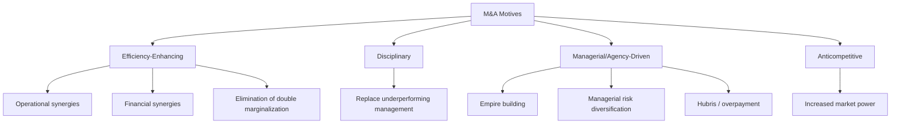
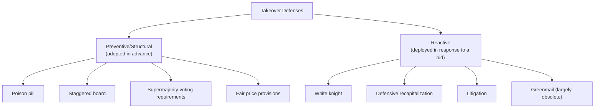
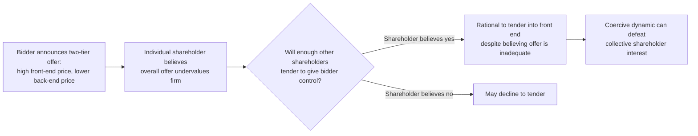

## Mergers, Acquisitions, and Takeover Defenses

### Economic Rationale for Mergers and Acquisitions

M&A activity is analyzed in law and economics primarily as a mechanism for reallocating corporate assets to higher-valued uses and for disciplining underperforming management, but the underlying motivations for a given transaction fall into several distinct categories with different welfare implications:

**Efficiency-enhancing (synergy) motives:**

- **Operational synergies**: Combining complementary assets, technologies, or capabilities to produce output at lower marginal cost or higher quality than either firm could achieve independently (economies of scale and scope).
- **Financial synergies**: Reducing the combined entity's cost of capital through diversification of cash flows, increased debt capacity, or elimination of costly external financing needs.
- **Elimination of double marginalization**: Vertical mergers between firms in a supply relationship can eliminate the inefficiency arising when successive firms each independently mark up price above marginal cost, restoring a portion of the deadweight loss that vertical separation with market power at each stage creates.

**Disciplinary (market for corporate control) motives:**

- As developed in agency cost theory, an acquirer identifying a target trading below its potential value under better management can profit by acquiring control, replacing underperforming management, and capturing the resulting value increase — the market for corporate control functioning as an external governance mechanism disciplining managerial slack that internal monitoring failed to correct.

**Managerial (agency-driven) motives — potentially value-destroying:**

- **Empire building**: Consistent with Jensen's free cash flow theory, managers may pursue acquisitions that increase firm size (and managerial compensation, power, and prestige) even where the transaction has negative expected net present value for the acquirer's shareholders.
- **Diversification for managerial risk reduction**: Managers holding concentrated, non-diversifiable human capital in a single firm may pursue conglomerate diversification to reduce firm-specific (and thus career) risk, even though shareholders holding diversified portfolios receive no corresponding diversification benefit and may prefer the firm remain focused (since shareholders can diversify more cheaply themselves by holding a diversified portfolio of single-industry stocks).
- **Hubris**: Managers may overestimate their ability to realize synergies or to manage an acquired business, leading to overpayment relative to realistic post-merger value (a behavioral explanation, associated with Richard Roll's hubris hypothesis, for the empirically documented tendency of acquiring-firm shareholders to earn low or negative announcement returns in many transactions, contrasted with generally positive announcement returns for target shareholders).

**Anticompetitive motives:**

- Horizontal mergers between competitors can increase market power, enabling supra-competitive pricing — the concern addressed by antitrust/competition law merger review rather than corporate law per se, but relevant to the overall welfare assessment of M&A activity.

### Diagram: Taxonomy of Merger Motives

### Deal Structures

**Statutory merger**: Two corporations combine pursuant to statutory merger provisions, with one entity (the surviving corporation) continuing and the other ceasing to exist by operation of law; target shareholders typically receive cash, acquirer stock, or a combination, and (in most jurisdictions) dissenting shareholders may have **appraisal rights** — a statutory right to have a court determine the "fair value" of their shares as an alternative to accepting the merger consideration, addressing the risk that majority/controller-approved mergers might be priced to disadvantage minority shareholders.

**Asset acquisition**: The acquirer purchases some or all of the target's assets directly (rather than acquiring the target entity itself), often used to avoid assuming unwanted liabilities, though successor liability doctrines can limit this liability-avoidance benefit in specified circumstances (e.g., certain product liability and environmental contexts).

**Stock acquisition / tender offer**: The acquirer purchases target shares directly from shareholders, either through privately negotiated purchases or a public tender offer (an open invitation to all target shareholders to sell their shares at a specified price, typically at a premium to the pre-announcement market price, often conditioned on achieving a minimum tender threshold).

**Key Points**

- The choice of structure carries distinct legal and tax consequences (the cash-versus-stock and merger-versus-asset-purchase distinctions each trigger different tax treatment for target shareholders and different liability allocation between the parties), and structure choice is itself often a negotiated variable reflecting the relative bargaining leverage and risk preferences of the parties.
- Tender offers historically served as the primary vehicle for **hostile** acquisitions (transactions not supported by the target's board), since a tender offer can proceed by appealing directly to shareholders without requiring target board cooperation, whereas a statutory merger typically requires target board approval before it can be submitted to a shareholder vote — this structural distinction is central to understanding why takeover defenses (discussed below) evolved specifically around deterring or delaying hostile tender offers and related mechanisms (like proxy contests to replace an unwilling board).

### Friendly versus Hostile Acquisitions

A **friendly** acquisition proceeds with the negotiated support and recommendation of the target's board of directors. A **hostile** acquisition is pursued despite the target board's opposition, typically via a tender offer directly to shareholders and/or a **proxy contest** (soliciting shareholder votes to replace the incumbent board with directors who will support the transaction).

The central corporate law and economics controversy in this area concerns the appropriate scope of a target board's authority to resist a hostile bid the board believes undervalues the company or is otherwise not in shareholders' best interest, given the competing concern that boards facing a threat to their own continued tenure have an inherent, structural conflict of interest in evaluating that very threat.

### The Central Tension: Board Discretion versus Shareholder Choice

**The case for permitting robust board resistance:**

- A board, with superior information about the company's long-term prospects and strategic alternatives, may be better positioned than dispersed shareholders (facing collective action and free-rider problems in evaluating a complex offer) to assess whether a bid adequately reflects the company's true value, particularly against the risk of an opportunistically timed low-ball bid.
- Permitting boards to negotiate from a position of some resistance (rather than being required to accept the first bid) can increase the acquisition premium ultimately captured by target shareholders, by forcing bidders to raise their offer or by creating an auction dynamic among competing potential acquirers — the "auctioneer" theory of the board's role.
- Boards can use resistance mechanisms to secure procedural protections (fair process, adequate time for shareholders to consider alternatives) that offset the collective action problems shareholders would otherwise face when confronted with a time-pressured tender offer.

**The case against permitting robust board resistance:**

- Because incumbent directors and officers typically face job loss, reduced compensation, and loss of private control benefits if a hostile acquisition succeeds, they have a direct personal financial interest in defeating a bid that may nonetheless be in shareholders' best interest — precisely the structural conflict-of-interest concern that ordinarily triggers heightened fiduciary scrutiny under duty-of-loyalty analysis.
- Entrenchment-motivated resistance undermines the market for corporate control's disciplinary function: if incumbent management can reliably defeat any hostile bid regardless of the bid's merit, the threat of takeover loses its power to discipline managerial slack, reintroducing the very agency costs the market for corporate control mechanism is meant to mitigate.
- Empirical evidence on the net welfare effect of strong takeover defenses is mixed and contested in the literature: [Inference] some studies associate stronger anti-takeover protections with lower firm valuations and weaker managerial accountability (consistent with the entrenchment view), while other analyses find more nuanced or context-dependent effects, so the aggregate empirical verdict should not be treated as unambiguously settled in either direction.

### Categories of Takeover Defenses

**Preventive (structural) defenses** — adopted in advance of any specific takeover threat:

- **Poison pills (shareholder rights plans)**: A contingent right, distributed to existing shareholders, that is triggered if an acquirer's ownership exceeds a specified threshold (e.g., 15–20%) without board approval, typically allowing existing shareholders (other than the triggering acquirer) to purchase additional shares at a substantial discount, massively diluting the hostile acquirer's stake and making a non-negotiated acquisition prohibitively expensive. The board generally retains sole authority to redeem or waive the pill, giving the board substantial leverage to compel a hostile bidder to negotiate directly with the board rather than proceeding unilaterally.
- **Staggered (classified) boards**: Dividing the board into multiple classes with staggered election terms (e.g., three classes, one-third elected annually) means a hostile acquirer who gains control of target shares cannot replace a majority of the board in a single election cycle, extending the time and cost required to gain full board control via a proxy contest.
- **Supermajority voting requirements**: Charter or bylaw provisions requiring a supermajority (e.g., two-thirds or higher) shareholder vote to approve a merger, remove directors without cause, or amend charter provisions related to takeover defenses, raising the coordination cost for an acquirer seeking to assemble sufficient votes.
- **Fair price provisions**: Requiring a supermajority vote for any merger not meeting specified minimum price and procedural conditions, addressing concerns about two-tier, coercive tender offer structures (discussed below).

**Reactive defenses** — adopted or deployed in response to a specific pending or threatened bid:

- **White knight transactions**: Soliciting a competing, board-preferred acquirer to make a rival bid, converting a hostile situation into a friendly, board-negotiated alternative.
- **Defensive recapitalization**: Increasing leverage (e.g., through a large debt-financed share buyback or special dividend) to make the company a less attractive or more expensive target, or to place shares in friendlier hands.
- **Litigation**: Filing suit challenging the legality of the bidder's tender offer or disclosure, or antitrust concerns, primarily to delay the bid and create time for alternative responses.
- **Greenmail** (largely obsolete/restricted in modern practice): Repurchasing a hostile acquirer's already-accumulated stake at a premium in exchange for the acquirer's agreement to cease pursuit of the target, historically criticized as a self-interested use of corporate assets to eliminate a specific threat to incumbent management without benefiting other shareholders proportionally.

### Diagram: Takeover Defense Taxonomy

### Judicial Standards for Reviewing Takeover Defenses

Because takeover defenses are adopted by a board facing a direct, structural conflict of interest regarding its own tenure, courts in leading corporate law jurisdictions (most influentially, Delaware) apply standards of review intermediate between the deferential business judgment rule and the exacting entire fairness standard, reflecting the intermediate severity of the underlying conflict-of-interest concern relative to a pure self-dealing transaction.

**Enhanced scrutiny for defensive measures**: A widely influential doctrinal approach (associated with Delaware's *Unocal* framework) requires a board deploying a takeover defense to demonstrate:

1. **Reasonable grounds for believing a danger to corporate policy and effectiveness existed** — typically satisfied by good-faith investigation and reliance on outside advisors, addressing concern that the bid is coercive, opportunistically timed, or otherwise inadequate.
2. **A defensive response reasonable in relation to the threat posed** — the defense must not be preclusive (making a bid realistically impossible to pursue) or coercive (improperly forcing shareholders' decisions), and must fall within a "range of reasonableness" relative to the specific threat identified.

**Enhanced scrutiny for sale-of-control transactions**: A related but distinct doctrinal line (associated with Delaware's *Revlon* framework) applies once a board has decided to pursue a transaction that will result in a sale of control or breakup of the company, requiring the board's objective to shift toward securing the best value reasonably available to shareholders in the specific transaction at hand — reflecting the economic logic that once control will change hands regardless, the board's residual discretion to pursue non-price-related strategic objectives is reduced, since shareholders' primary remaining interest becomes the price they will realize.

**Key Points**

- These intermediate standards reflect a coherent economic middle ground: neither the extreme of unconditional judicial deference (which would fully permit entrenchment-motivated resistance) nor the extreme of automatic invalidation of any board resistance to a hostile bid (which would eliminate the board's potentially value-enhancing auctioneer/negotiator role), but rather a case-specific inquiry into whether the board's response is proportionate to a genuine, good-faith-identified threat.
- The distinction between "enhanced scrutiny of a defensive measure" and "enhanced scrutiny in a change-of-control context" reflects different underlying economic concerns: the former asks whether resistance itself was a reasonable response to a perceived threat, while the latter asks whether, once a sale is effectively inevitable, the board extracted the best available terms for shareholders rather than favoring a particular acquirer or preserving management's own position.
- [Inference] The precise doctrinal triggers and boundaries of these standards continue to be refined through ongoing case law, and their application can differ meaningfully depending on specific factual circumstances (e.g., whether a poison pill is challenged in isolation versus combined with a staggered board, or whether a "sale of control" has definitively occurred), so specific case outcomes should be checked against current Delaware (or relevant jurisdiction's) case law rather than treated as static rules.

### Coercive Tender Offer Structures and Shareholder Collective Action Problems

A specific economic concern motivating some takeover defenses (particularly fair price provisions) is the **two-tier, front-end-loaded tender offer**: a bidder offers a relatively high price for a first tranche of shares sufficient to gain control (e.g., 51%), while disclosing (or shareholders reasonably anticipate) that remaining shares will subsequently be acquired via a back-end squeeze-out merger at a lower price. This structure can create a prisoner's-dilemma-like collective action problem among target shareholders: even a shareholder who believes the overall offer undervalues the company may rationally tender into the front end, fearing that if enough other shareholders tender, non-tendering shareholders will be left holding shares subject to a less favorable back-end price — a coercive dynamic that can pressure shareholders to tender even against their collective interest in resisting an inadequate overall offer.

**Key Points**

- This coercion concern provides an economic justification for defenses (fair price provisions, and to some extent the negotiating leverage a poison pill provides) that specifically target two-tier, non-uniform offer structures, distinct from the broader entrenchment concern applicable to defenses used against any hostile bid regardless of structure.
- The concern is structurally analogous to collective action and coordination failures studied elsewhere in law and economics (e.g., the free-rider problem in shareholder monitoring), illustrating how dispersed-ownership collective action problems recur across multiple corporate law contexts beyond the ordinary agency-cost setting.

### Regulatory Framework: Disclosure and Procedural Requirements

Beyond state corporate law's fiduciary duty framework governing board conduct, tender offers in jurisdictions with developed securities regulation (e.g., the Williams Act framework in the United States) are typically subject to specific procedural and disclosure requirements: mandatory disclosure by acquirers exceeding a specified beneficial ownership threshold, minimum offer periods giving shareholders adequate time to evaluate a bid, withdrawal rights allowing shareholders to rescind tendered shares during the offer period, and equal treatment requirements (e.g., pro ration of an oversubscribed offer, and requirements that all shareholders receive the same offered price) directly addressing the two-tier coercion concern described above through ex ante regulatory design rather than solely through target-board defensive discretion.

[Unverified] The specific statutory thresholds, offer-period lengths, and procedural details of tender offer regulation vary by jurisdiction and are subject to periodic regulatory amendment, so specific figures should be verified against the current regulatory text of the relevant jurisdiction.

### Diagram: The Coercion Problem in Two-Tier Offers

### Conclusion

Mergers and acquisitions law and economics centers on a fundamental tension between two valuable but potentially conflicting functions the corporate takeover market serves: disciplining underperforming management through the credible threat of control change, and permitting boards sufficient discretion to protect shareholders from coercive, undervalued, or opportunistically timed bids and to negotiate superior terms on shareholders' behalf. Because target boards resisting a hostile bid face an unavoidable structural conflict of interest regarding their own tenure, corporate law has developed intermediate standards of judicial review — enhanced scrutiny of defensive measures and heightened obligations once a sale of control is underway — calibrated to distinguish good-faith, shareholder-value-maximizing resistance from entrenchment-motivated defense, while securities regulation supplements this fiduciary-duty framework with ex ante procedural protections addressing the specific collective-action and coercion problems that unregulated tender offer structures can otherwise exploit.

**Next Steps**

- The market for corporate control as an external governance/disciplining mechanism
- Unocal enhanced scrutiny and Revlon change-of-control duties in Delaware case law
- Appraisal rights and fair value determination in dissenting shareholder litigation
- Antitrust/competition law review of horizontal and vertical mergers
- Poison pill design variations and their interaction with staggered boards
- Empirical studies of acquirer versus target shareholder announcement returns
- Williams Act tender offer disclosure and procedural requirements
- Proxy contests and shareholder activism as alternatives to hostile tender offers