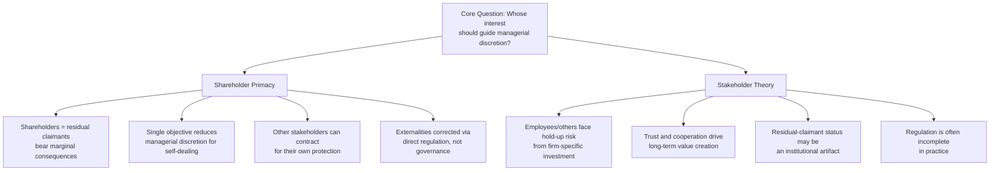

## Shareholder Primacy versus Stakeholder Theory

### Framing the Debate

The shareholder primacy versus stakeholder theory debate concerns the fundamental normative question corporate law and corporate governance must answer: in whose interest, and toward what objective, should a corporation's directors and officers exercise their fiduciary discretion? This is not merely an academic dispute — the answer directly shapes fiduciary duty doctrine, board decision-making standards, disclosure requirements, and the appropriate scope of corporate social and environmental commitments.

**Shareholder primacy** holds that corporate managers should manage the firm to maximize shareholder wealth (typically operationalized as long-term share value), treating other constituencies' interests as relevant only insofar as they are instrumental to, or legally constrained protections for, that objective.

**Stakeholder theory** holds that corporate managers owe obligations to, and should balance the interests of, a broader set of constituencies affected by the firm's conduct — including employees, creditors, customers, suppliers, local communities, and the environment — rather than treating shareholder wealth maximization as the singular or lexically prior objective.

### The Economic Case for Shareholder Primacy

**1. Residual claimant status**

The core economic argument for shareholder primacy, most closely associated with the nexus-of-contracts theory of the firm, rests on shareholders' distinctive position as **residual claimants**: unlike employees, creditors, and suppliers — who hold fixed, contractually specified claims on the firm's cash flows (wages, interest and principal, negotiated prices) — shareholders receive only what remains after all other contractual claims have been satisfied. Because shareholders bear the full marginal consequence (both upside and downside) of variation in firm performance at the margin, this argument holds that directing managerial discretion toward maximizing the residual claim efficiently aligns managerial incentives with overall firm value maximization: maximizing the residual is equivalent, at the margin, to maximizing the total surplus generated by the firm's activities, since all other claimants have already been paid their contractually specified amounts.

**2. Single, measurable objective function reduces agency costs**

A single-minded objective (share price/long-term shareholder wealth) provides a clearer, more measurable standard against which to evaluate managerial performance and design incentive compensation, compared to a multi-constituency balancing standard. Multiplicity of objectives can be exploited by self-interested managers: if managers are accountable to "balance" numerous stakeholder interests without a clear metric or priority ordering, this creates substantial discretion to justify almost any decision (including entrenchment-motivated or self-interested decisions) as serving *some* stakeholder's interest, thereby weakening the practical enforceability of fiduciary constraints and increasing residual agency costs, per the general logic of agency cost theory.

**3. Other stakeholders can contract for their own protection**

Under the nexus-of-contracts view, non-shareholder constituencies are understood as parties who can, and generally do, negotiate explicit contractual protections for their own interests ex ante (wage and benefit terms, loan covenants, supply contract terms, warranty and consumer protection law), reducing the need for corporate governance itself to serve as their protective mechanism. Where genuine market failures leave certain stakeholders unable to adequately self-protect through contract (e.g., diffuse tort victims, as discussed in the limited liability context), the shareholder primacy view generally argues the appropriate remedy is targeted legal intervention in the relevant body of law (tort law, environmental law, labor law, consumer protection law) rather than a generalized reallocation of corporate fiduciary duties across all stakeholders.

**4. Externality-correction should occur at the source, not through corporate governance substitution**

A related argument holds that using corporate fiduciary duties as a vehicle for stakeholder protection is an inefficient, poorly targeted substitute for direct regulation: if a firm's activity generates a genuine externality (pollution, unsafe products, inadequate wages relative to some social standard), the economically superior remedy is a Pigouvian tax, direct regulation, or a mandatory legal minimum standard applicable uniformly across the industry — rather than relying on individual corporate boards' discretionary, non-uniform, and difficult-to-enforce "balancing" of stakeholder interests, which lacks the uniformity, transparency, and direct enforceability of externally imposed legal standards.

### The Economic Case for Stakeholder Theory

**1. Non-shareholder stakeholders often cannot fully contract for protection**

Stakeholder theorists dispute the premise that non-shareholder constituencies can practically achieve complete contractual protection ex ante. Employees, in particular, often make firm-specific human capital investments (specialized skills, relationship capital, foregone alternative career paths) that are economically analogous to the relationship-specific investments generating hold-up risk in Williamson's transaction cost economics and the Grossman-Hart-Moore property rights framework — yet employees typically lack the residual control rights (equivalent to equity ownership) that would protect them against post-investment opportunistic treatment by the firm, since standard employment contracts are comparatively easy for the firm to modify or terminate relative to the sunk, firm-specific investment the employee has already made.

**2. Long-term value creation may require broader stakeholder investment and trust**

A more instrumental (rather than purely distributive) version of stakeholder theory argues that firms achieve superior *long-term* value — including for shareholders — by cultivating trust, cooperation, and specific investment from employees, suppliers, and communities, and that a strict, narrowly interpreted shareholder primacy mandate (particularly if applied with a short-term share-price focus) can undermine the credibility of a firm's commitments to these other constituencies, discouraging exactly the kind of relationship-specific investment and cooperative behavior from stakeholders that generates durable competitive advantage. Under this view, stakeholder-protective governance can be reframed as consistent with, rather than opposed to, long-run shareholder wealth maximization — sometimes termed "enlightened shareholder value" — narrowing, though not eliminating, the practical distance between the two theories.

**3. Concentration of governance rights in shareholders may itself be a historical/institutional artifact, not an efficiency necessity**

Some stakeholder theorists question whether shareholders' residual-claimant status uniquely justifies exclusive governance rights, noting that other stakeholders (particularly long-tenured employees at firms with high firm-specific human capital investment) may bear risk profiles closer to a residual claim than the formal legal categorization suggests, and that the historical concentration of formal voting rights in shareholders reflects contingent legal and institutional development (and diversified shareholders' comparatively low cost of bearing firm-specific risk relative to less-diversified employees) rather than a uniquely efficient allocation dictated by economic first principles alone.

**4. Externalities are frequently under-regulated in practice**

Stakeholder theorists respond to the "regulate at the source" argument by observing that, in practice, direct regulation of many externalities (environmental harm, particularly diffuse or long-latency harms; labor conditions in globally dispersed supply chains; community economic disruption from plant closures) is frequently incomplete, poorly enforced, jurisdictionally fragmented, or politically underprovided relative to the socially efficient level — meaning that relying exclusively on external regulation to correct these externalities may leave substantial, real-world welfare losses uncorrected, providing a practical (if second-best) argument for incorporating some stakeholder consideration into corporate governance as a supplementary check where formal regulation demonstrably falls short.

### Diagram: The Competing Claims Compared

### Doctrinal Manifestations

**Shareholder-primacy-oriented doctrine:**

- The traditional formulation of directors' fiduciary duties as running to "the corporation and its shareholders," with shareholder wealth maximization treated as the touchstone against which the business judgment rule's good-faith requirement is measured.
- The Revlon change-of-control framework's requirement (discussed in the mergers and acquisitions context) that once a sale of control is underway, the board must seek the best value reasonably available to shareholders specifically — a doctrinal instantiation of shareholder primacy at precisely the moment when trade-offs between shareholder value and other constituencies' interests are often most acute (e.g., a sale that maximizes share price but leads to plant closures or workforce reductions).

**Stakeholder-oriented doctrine and legal developments:**

- **Constituency statutes**: A number of jurisdictions have enacted statutes explicitly permitting (though generally not mandating) directors to consider the interests of non-shareholder constituencies (employees, communities, suppliers, the environment) when making business decisions, particularly in the context of evaluating a potential change of control — a direct legislative response to concerns that a strict shareholder-primacy fiduciary standard would categorically preclude considering non-shareholder harms from an otherwise share-price-maximizing transaction.
- **Benefit corporation and similar hybrid legal forms**: Statutory business forms (adopted in various jurisdictions under various names) that explicitly authorize or require directors to consider a specified public benefit alongside shareholder financial return, and often impose enhanced reporting requirements regarding non-financial performance, representing an attempt to create a legally distinct corporate form for enterprises seeking to formally commit to a stakeholder-inclusive or public-benefit mandate rather than relying solely on the discretionary latitude constituency statutes or the business judgment rule might otherwise provide within an ordinary corporate form.
- **ESG (Environmental, Social, and Governance) disclosure and investment trends**: The rise of ESG-focused investing and disclosure frameworks represents a market-based (rather than purely doctrinal) mechanism through which stakeholder-relevant considerations are increasingly incorporated into corporate decision-making and capital allocation, operating partly through the "enlightened shareholder value" logic that non-financial performance can be material to long-term financial returns, and partly through investor preferences that are not purely reducible to expected risk-adjusted financial return. [Inference] The relative weight investors place on financial-materiality versus values-based motivations in ESG investment behavior is a matter of ongoing empirical debate rather than a settled consensus.

### Diagram: Legal Mechanisms Positioned Along the Primacy–Stakeholder Spectrum

### The "Enlightened Shareholder Value" Synthesis

A substantial portion of contemporary corporate law scholarship and practice occupies a middle position sometimes termed **enlightened shareholder value** (or, relatedly, "long-term shareholder value" framings): the ultimate objective remains shareholder wealth maximization, but this objective is understood to require, as an instrumental matter, attention to employee relations, customer trust, community reputation, regulatory compliance, and environmental sustainability, because neglecting these factors predictably damages long-term firm value even where it might appear to benefit short-term reported earnings or share price.

**Key Points**

- This synthesis substantially narrows, but does not fully eliminate, the practical distance between the two theories in many ordinary business contexts, since a well-informed board pursuing genuinely long-term shareholder value will, in most circumstances, reach similar practical decisions to a board balancing stakeholder interests directly.
- The residual disagreement becomes sharpest precisely in situations of genuine trade-off — where a decision unambiguously increases shareholder value at the direct expense of another stakeholder group with no plausible long-term reputational or relationship-based offsetting cost to the firm (e.g., a legally compliant but harsh plant-closure decision, or a compensation-reducing restructuring) — situations where the enlightened shareholder value synthesis collapses back toward straightforward shareholder primacy, since there is no long-term shareholder-value rationale left to reconcile the two objectives.
- This observation is itself often used analytically by scholars on both sides of the debate: shareholder-primacy proponents argue the residual "hard cases" show that stakeholder protection is properly the province of contract and external regulation (since corporate governance offers no principled stopping point once other-regarding management is untethered from the shareholder-value metric), while stakeholder theorists argue the residual hard cases are precisely where corporate governance's stakeholder-protective function is most needed (since it is exactly in these cases that other stakeholders' interests would otherwise go entirely unprotected).

### Comparative and International Dimensions

[Inference] Different national corporate governance systems have historically embodied differing default weightings between shareholder and stakeholder orientations — for example, governance systems in some jurisdictions have featured formal codetermination arrangements giving employees direct board representation or works council consultation rights, reflecting a more institutionally embedded stakeholder orientation than the traditional Anglo-American shareholder-primacy default — though the degree of convergence or persistent divergence between these systems, and the precise current statutory requirements in any given jurisdiction, are subject to ongoing legal change and should be verified against current comparative corporate law scholarship rather than treated as static.

### Conclusion

The shareholder primacy versus stakeholder theory debate reflects a genuine and unresolved tension in the economic theory of corporate governance between two coherent but competing accounts of the firm's proper objective function. Shareholder primacy draws its economic force from shareholders' distinctive residual-claimant status, the agency-cost-reducing clarity of a single measurable objective, and the view that non-shareholder protection is more efficiently achieved through direct contracting and external regulation than through diffuse fiduciary balancing. Stakeholder theory draws its force from the observation that key non-shareholder constituencies — particularly employees making firm-specific investments — often cannot achieve complete contractual protection, that genuine long-term value creation may depend on cultivating stakeholder trust the pure shareholder-primacy frame can undervalue, and that real-world regulatory gaps leave some externalities inadequately addressed absent supplementary governance-level attention. The practical convergence achieved through "enlightened shareholder value" narrows but does not eliminate this tension, which remains sharpest precisely in the hard cases of direct trade-off between shareholder wealth and other stakeholders' interests — cases that continue to animate ongoing doctrinal development in constituency statutes, benefit corporation law, and ESG governance practice.

**Next Steps**

- Nexus-of-contracts theory of the firm and its implications for stakeholder claims
- Constituency statutes and their practical effect on board decision-making
- Benefit corporations and other hybrid social-enterprise legal forms
- ESG disclosure regulation and its relationship to fiduciary duty doctrine
- Employee firm-specific human capital investment and hold-up risk
- Comparative corporate governance: codetermination and works council systems
- Revlon duties and stakeholder trade-offs in change-of-control transactions
- Enlightened shareholder value as a doctrinal and normative synthesis