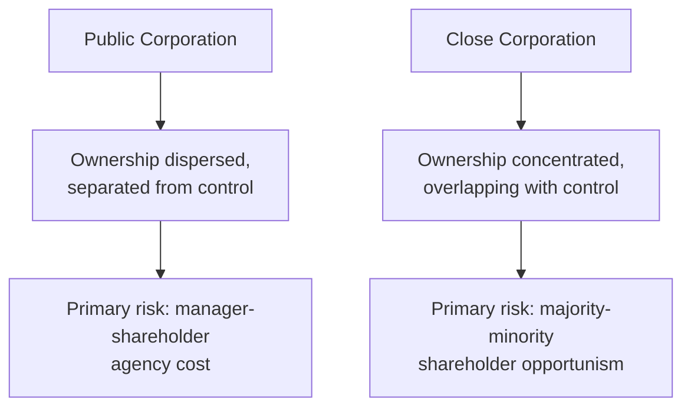
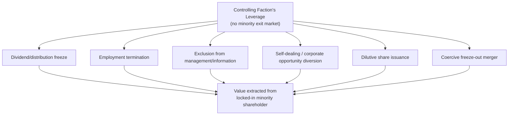
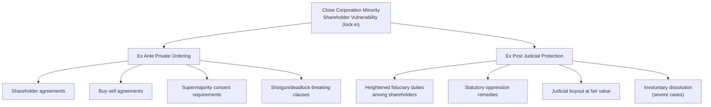

## Close Corporations and Minority Shareholder Protection

### Defining the Close Corporation

A **close corporation** (also called a closely held corporation) is a corporation characterized by a small number of shareholders, the absence of a public trading market for its shares, and — critically for the economic analysis that follows — substantial overlap between ownership and management, with most or all shareholders actively participating in running the business. This structural profile distinguishes close corporations sharply from the public corporation model that dominates the theory of the firm, agency cost, and fiduciary duty frameworks developed for dispersed-ownership enterprises.

**Key structural features distinguishing close corporations from public corporations:**

| Feature | Public Corporation | Close Corporation |
| --- | --- | --- |
| Number of shareholders | Many, dispersed | Few, often family or small partner group |
| Trading market for shares | Liquid public market | No public market; illiquid |
| Ownership–management separation | Substantial (agency cost focus) | Minimal (shareholders often are managers) |
| Exit option | Sell shares on market | Often no ready exit market |
| Primary governance risk | Manager-shareholder agency cost | Majority-minority shareholder opportunism |

This shift in structural profile changes the *primary* economic problem the law must address. In the public corporation, the central concern (as developed in agency cost theory and fiduciary duty doctrine) is the separation of ownership and control and the resulting manager-shareholder agency problem. In the close corporation, ownership and control are typically *not* separated — most shareholders are also managers or directors — so the dominant governance risk shifts to a different axis entirely: the risk that a **majority or controlling shareholder faction will use its control to extract value from, or oppress, a minority shareholder faction**.

### Diagram: Shifted Governance Risk in Close Corporations

### Why the Illiquidity of Close Corporation Shares Is Economically Central

The absence of a public trading market for close corporation shares is not merely a descriptive feature — it is the single structural fact that most sharply distinguishes the economic vulnerability of a close corporation minority shareholder from that of a public corporation minority shareholder, and it explains why specialized minority protection doctrine developed specifically for this entity type.

**The "lock-in" problem**: In a public corporation, a dissatisfied minority shareholder facing majority opportunism, mismanagement, or a fundamental disagreement over corporate direction can exercise the **exit option** — simply selling shares on the public market, typically at a price closely tracking the company's actual economic value (assuming reasonably efficient capital markets), and redeploying that capital elsewhere. This exit option itself functions as an indirect governance discipline (a market-based check on the severity of extractable managerial slack, since persistent poor treatment of minority interests would depress the share price and invite the market-for-corporate-control disciplining mechanisms discussed elsewhere).

In a close corporation, no such market exists. A minority shareholder wishing to exit typically has only two realistic options: sell shares back to the corporation or to the majority shareholders (who, as the only realistic buyers, hold substantial bargaining leverage to set a low purchase price, especially once the minority shareholder's dissatisfaction with majority conduct is evident) or sell to an outside third party (frequently impractical, since an outside buyer would be acquiring a non-controlling, illiquid minority stake in a company they cannot control or easily resell, and would typically also require majority-shareholder consent under common share-transfer restrictions in close corporation charters/shareholder agreements). This absence of a meaningful, arms-length exit option is termed **lock-in**, and it is the central economic vulnerability minority protection doctrine addresses.

**Key Points**

- Lock-in transforms what would, in a liquid-market context, be a governance dispute resolvable through exit into a **bilateral monopoly bargaining problem** structurally similar to the hold-up problem in Williamson's transaction cost economics and the Grossman-Hart-Moore property rights framework: once a minority shareholder's capital is committed and no ready market exit exists, the majority faction gains substantial ex post bargaining leverage that was not necessarily apparent or priced into the minority shareholder's original investment decision.
- This lock-in dynamic is frequently compounded by the minority shareholder's simultaneous role as an employee of the close corporation (a common structural feature, since close corporation shareholders frequently draw their primary economic return through salary rather than dividends, for tax and cash-flow reasons): termination from employment can function as an indirect mechanism for extracting value from a minority shareholder even without directly diluting or disadvantaging their formal shareholding, since it cuts off the primary channel through which the minority shareholder was realizing economic return on their investment.
- Because minority shareholders anticipate this lock-in risk, the risk itself can be understood, in an ex ante sense, as a cost that must be priced into the initial investment or reduced through governance protections — providing the economic rationale for specialized close corporation minority protection doctrine, paralleling the general principle (seen in fiduciary duty and limited liability analysis) that legal intervention is most justified precisely where private contracting and market mechanisms are least able to protect the vulnerable party.

### Common Mechanisms of Majority Oppression

The specific tactics through which a controlling faction can extract value from or disadvantage a locked-in minority shareholder include:

- **Dividend/distribution freeze-out**: The majority, who also control management and set compensation, can withhold dividends indefinitely while instead paying themselves substantial salaries, bonuses, or other compensation for their management roles — extracting the corporation's economic returns through a channel available only to those holding management positions, while a passive or excluded minority shareholder receives no return on their investment despite the underlying business remaining profitable.
- **Termination of employment**: As noted above, terminating a minority shareholder's employment (particularly where employment was the primary channel for realizing investment return) without a corresponding buyout of their equity interest.
- **Exclusion from management and information**: Removing a minority shareholder from the board or from active management roles, and/or restricting the minority shareholder's access to corporate financial information, undermining their ability to monitor majority conduct or make informed decisions about their investment.
- **Self-dealing and diversion of corporate opportunities**: The majority faction using its control to cause the corporation to engage in transactions favorable to majority-controlled entities, or personally taking corporate opportunities that should belong to the close corporation — the same duty-of-loyalty concerns applicable in public corporations, but with the free-rider-in-enforcement problem often less severe (since a close corporation typically has few enough shareholders that the affected minority has a direct, undiluted incentive to pursue enforcement) while the lock-in-driven vulnerability to the underlying misconduct is often more severe.
- **Dilutive share issuances**: Issuing additional shares (particularly to majority-aligned parties) at below-market prices, diluting the minority shareholder's proportional ownership and voting power.
- **Coercive freeze-out mergers**: Structuring a merger or reorganization specifically to eliminate or cash out minority shareholders at a price majority shareholders themselves control, at least absent judicial fair-value or fair-process review.

### Diagram: Mechanisms of Majority Oppression

### Legal Doctrines Addressing Close Corporation Minority Protection

**Heightened fiduciary duties among close corporation shareholders**: A number of jurisdictions have developed doctrine imposing heightened fiduciary obligations — sometimes analogized to the duties partners owe one another in a partnership — running directly between close corporation shareholders themselves (not merely between directors/officers and the corporation, as in the ordinary public corporation fiduciary duty framework), reflecting the recognition that close corporation shareholders often function more like co-venturers in a shared enterprise than like arms-length public market investors, and that the lock-in problem described above creates a vulnerability closely analogous to that between business partners with no independent market for exiting a partnership interest.

**Judicial appraisal and buyout remedies for oppression**: Statutory oppression remedies, available in many jurisdictions, allow a minority shareholder who can demonstrate conduct by the controlling faction that is "oppressive," "unfairly prejudicial," or that defeats the minority shareholder's reasonable expectations regarding their role in and return from the enterprise, to petition a court for relief — commonly including a judicially ordered buyout of the minority shareholder's shares at fair value, effectively creating, through judicial intervention, the exit option that the absence of a public market otherwise denies the minority shareholder.

**Key Points**

- The "reasonable expectations" standard used in many oppression statutes and case law is itself an economically significant departure from ordinary public-corporation fiduciary analysis: it looks not merely to whether formal legal or contractual rights were violated, but to the shared, often informal understanding among the close corporation's founders regarding each participant's expected role (e.g., continued employment, participation in management, expected distribution policy) — reflecting judicial recognition that close corporation arrangements are frequently governed as much by informal, relational understanding as by the formal corporate charter, paralleling the "relational contract" concept in transaction cost economics for long-term, incompletely specified business relationships.
- Judicial buyout remedies directly substitute for the missing market mechanism: by empowering a court to order a fair-value buyout, the law effectively manufactures an exit option that approximates what a liquid public market would otherwise provide, restoring the minority shareholder's practical ability to extract their proportionate share of firm value despite the underlying illiquidity.
- Involuntary dissolution remedies (permitting a court to order the close corporation dissolved and its assets liquidated and distributed, in especially severe cases of oppression or deadlock) represent an even more drastic version of the same exit-substitution logic, generally reserved for situations where a buyout remedy alone is judged insufficient to address the underlying breakdown in the parties' relationship.

### Valuation Discounts and Their Contested Application

A recurring and economically significant doctrinal controversy in close corporation minority buyout and appraisal contexts concerns whether courts should apply **minority discounts** (reducing the per-share value awarded to reflect the shareholder's lack of control) and/or **marketability discounts** (reducing per-share value to reflect the general illiquidity of closely held shares) when valuing a minority shareholder's interest in a court-ordered buyout or appraisal proceeding.

**The case against applying discounts in oppression/buyout contexts**: Applying a minority discount in a proceeding specifically brought *because* the majority has oppressed the minority arguably compounds the very harm the remedy is meant to correct — it would mean the minority shareholder receives a below-pro-rata-value payout precisely because they lack control, when the underlying oppression claim exists precisely because that lack of control was abused. Similarly, applying a marketability discount effectively imposes on the victim of oppression the same illiquidity cost that created their vulnerability to oppression in the first place, arguably shifting the cost of the majority's misconduct onto the minority a second time.

**The case for applying discounts**: A competing view holds that discounts reflect the genuine economic reality of what was actually purchased (an illiquid, non-controlling interest), and that awarding a minority shareholder full pro-rata enterprise value without any discount would give the minority shareholder a windfall relative to what they could have realized through an arms-length sale absent any oppression, over-compensating the plaintiff relative to their actual bargained-for economic position and potentially over-deterring legitimate majority governance decisions by making minority buyout litigation artificially lucrative.

**Key Points**

- [Inference] Jurisdictions differ substantially in how they resolve this tension — some categorically disallow discounts in oppression-remedy buyout contexts (reasoning discounts are inappropriate specifically because the sale is compelled by wrongdoing rather than voluntary), others permit discounts more readily in ordinary appraisal-rights contexts (where a shareholder dissents from a legitimate transaction rather than alleging misconduct), and the doctrinal line can depend on the specific statutory remedy invoked and the specific jurisdiction's case law — so the applicable rule should be verified against the governing jurisdiction's current statutes and precedent rather than assumed uniform.
- This valuation controversy illustrates a recurring theme across minority-protection doctrine: courts must calibrate remedies to correct for the majority's exploitation of the minority's lock-in vulnerability without over-correcting in a way that discourages legitimate governance activity or converts every ordinary business disagreement into leverage for an inflated buyout demand.

### Contractual Ex Ante Protective Mechanisms

Sophisticated close corporation participants frequently attempt to address the lock-in and majority-opportunism risks described above through explicit ex ante contracting, reducing reliance on ex post judicial intervention:

- **Shareholder agreements**: Comprehensive contracts among all shareholders specifying governance rules (board composition, supermajority requirements for major decisions), distribution policy commitments, and dispute resolution mechanisms, functioning as a bespoke, negotiated substitute for the standardized default corporate governance rules that the nexus-of-contracts framework identifies as poorly suited to the atypical, non-arms-length relational structure of a close corporation.
- **Buy-sell agreements**: Provisions specifying in advance the terms (often including a pre-agreed valuation methodology or formula) under which a shareholder's interest will be bought out upon specified triggering events (death, disability, termination of employment, deadlock, voluntary withdrawal), directly manufacturing an agreed-upon exit mechanism ex ante rather than relying on costly and uncertain ex post litigation.
- **Supermajority and unanimous consent requirements**: Requiring supermajority or unanimous shareholder approval for specified major decisions (executive compensation above a threshold, dividend policy changes, new share issuances), giving minority shareholders an effective veto over the specific categories of decision most likely to be used as oppression mechanisms.
- **Mandatory arbitration and deadlock-breaking mechanisms**: Provisions specifying binding arbitration or other structured mechanisms (e.g., a "shotgun" or "Texas shootout" buy-sell clause, under which one party offers a price at which they will either buy the other out or sell to the other party at that same price, incentivizing the offering party to name a genuinely fair price since they cannot predict which side of the transaction they will end up on) to resolve governance deadlocks without resort to costly and uncertain judicial dissolution proceedings.

**Key Points**

- These contractual mechanisms represent the private-ordering counterpart to the judicial oppression and buyout remedies discussed above: to the extent sophisticated parties can anticipate and contractually address lock-in and majority-opportunism risk ex ante, reliance on costly, uncertain, and remedy-imprecise judicial intervention ex post is correspondingly reduced — consistent with the general law-and-economics principle that well-designed ex ante contracting is generally preferable to ex post judicial correction where transaction costs of contracting are not prohibitive.
- The shotgun/Texas-shootout mechanism is a particularly elegant illustration of mechanism-design logic in this context: by making the offering party indifferent between buying and selling at their proposed price (since the other party can force either outcome), it creates a strong incentive for the offering party to propose a price reflecting their genuine, unbiased estimate of fair value, addressing the information asymmetry and strategic pricing incentives that would otherwise plague an ordinary negotiated buyout.
- Even comprehensive ex ante contracting has practical limits: shareholder agreements and buy-sell provisions cannot anticipate every future contingency (the same incomplete-contracting limitation motivating fiduciary duty doctrine generally), and courts frequently must still interpret and fill gaps in these agreements, meaning private ordering substantially reduces but does not entirely eliminate the role of judicial minority-protection doctrine in the close corporation context.

### Diagram: Layered Protection Framework for Close Corporation Minorities

### Conclusion

Close corporation law and economics addresses a governance problem structurally distinct from the manager-shareholder agency cost framework dominating public corporation analysis: because close corporation shareholders typically are the managers, the central vulnerability shifts to the risk that a controlling faction will exploit a minority shareholder's lock-in — the absence of any liquid market exit option — to extract disproportionate value through dividend freezes, employment termination, self-dealing, dilution, or coercive freeze-outs. Legal doctrine responds along two complementary tracks: ex post judicial mechanisms (heightened inter-shareholder fiduciary duties, statutory oppression remedies, judicially ordered buyouts, and, in severe cases, dissolution) that effectively manufacture the exit option the absent public market would otherwise provide, and ex ante contractual mechanisms (shareholder agreements, buy-sell provisions, supermajority requirements, and deadlock-breaking clauses) that allow sophisticated parties to privately design protections tailored to their specific relationship, reducing reliance on costly and outcome-uncertain judicial intervention. The persistent controversy over valuation discounts in buyout proceedings illustrates the underlying calibration challenge common to all minority-protection doctrine: correcting for exploited vulnerability without creating incentives for opportunistic or inflated minority litigation.

**Next Steps**

- Statutory oppression remedies and the "reasonable expectations" standard across jurisdictions
- Shotgun/Texas-shootout buy-sell clause design and mechanism-design properties
- Heightened fiduciary duties among close corporation shareholders (partnership analogy)
- Minority and marketability discounts in appraisal versus oppression-remedy valuation
- Deadlock and involuntary dissolution remedies
- Relational contract theory and its application to close corporation governance
- Employment termination as an indirect minority-oppression mechanism
- Comparative treatment of close corporations versus LLCs for small-enterprise governance