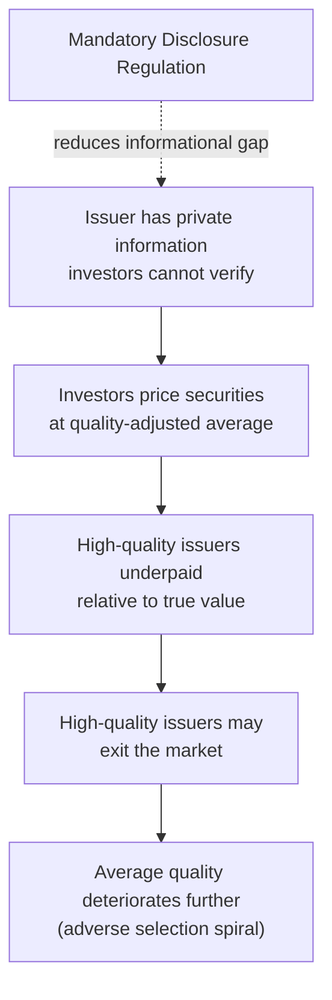
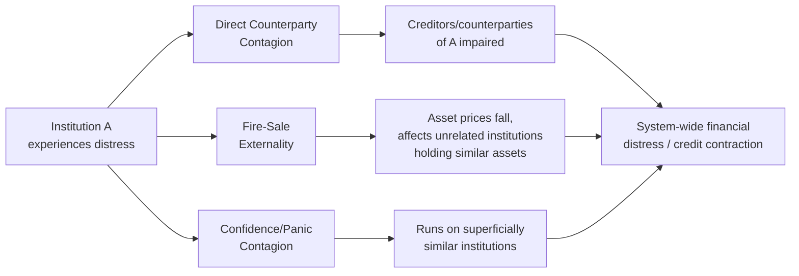
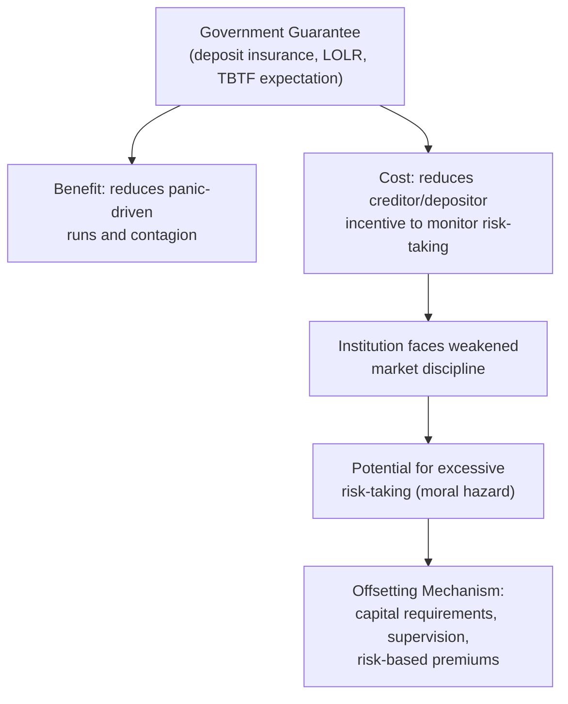
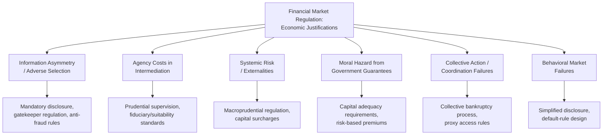

## Economic Rationale for Financial Market Regulation

### Framing the Question: Why Regulate Markets That Are Presumptively Efficient?

Standard neoclassical price theory predicts that competitive markets, absent specific market failures, allocate resources efficiently without regulatory intervention. Financial market regulation must therefore be justified, in economic terms, by identifying specific, well-defined market failures whose costs regulation can plausibly reduce by more than the compliance and enforcement costs regulation itself imposes. Law and economics scholarship on financial regulation is organized substantially around cataloguing these market failures and evaluating whether specific regulatory instruments are well-targeted responses to them, rather than treating regulation as self-evidently justified by the mere existence of financial risk or loss.

**Key Points**

- The economic case for any specific financial regulation should, in principle, be evaluated against the counterfactual of unregulated (or less regulated) private contracting and market discipline — regulation is justified only where private mechanisms (reputation, contract, insurance, diversification) demonstrably fail to correct the underlying problem at lower cost.
- Financial regulation is not a single unified body addressing one problem; different regulatory instruments (disclosure mandates, capital requirements, market conduct rules, deposit insurance, structural separation rules) are typically justified by reference to distinct, specific market failures, and a coherent economic assessment of any given rule requires identifying which failure it targets.

### Information Asymmetry and Adverse Selection

**The core problem**: Financial markets are markets for claims on future, uncertain cash flows (securities, loans, insurance contracts), where the seller (an issuer raising capital, a borrower seeking a loan) typically possesses substantially more information about the true quality of the underlying asset or enterprise than the buyer (an investor, a lender). This structural information asymmetry creates conditions for the classic **adverse selection** (lemons) problem formalized by George Akerlof: if buyers cannot distinguish high-quality from low-quality securities/borrowers, they will rationally price all offerings at an average quality-adjusted price, which is unattractive to genuinely high-quality issuers/borrowers (who are worth more than the average price) and attractive primarily to low-quality issuers/borrowers (who are worth less), causing an adverse selection spiral in which high-quality participants exit the market, average quality (and the price buyers are willing to pay) deteriorates further, and in the extreme case the market can unravel entirely — a market failure resulting not from any single party's misconduct but purely from the structural inability of buyers to verify seller-side private information.

**Regulatory responses targeting information asymmetry:**

- **Mandatory disclosure regimes**: Requiring issuers to disclose specified categories of material information (financial statements, risk factors, material events) on a standardized, periodic basis, addressing the adverse selection problem by reducing the informational gap between issuers and investors.
- **Gatekeeper regulation**: Licensing and liability regimes for auditors, credit rating agencies, and securities analysts, who function as informational intermediaries whose professional reputation and (in some regimes) legal liability create an incentive to certify information accuracy, reducing investors' individual verification costs.
- **Anti-fraud rules**: Prohibiting affirmative misrepresentation or omission of material information in connection with securities transactions, addressing the most acute version of the information asymmetry problem (deliberate deception rather than mere informational gap).

**Key Points**

- The economic case for *mandatory* (as opposed to purely voluntary) disclosure rests on a further market-failure layer: information, once disclosed, has public-good characteristics (non-rivalrous and difficult to exclude non-payers from benefiting, since disclosed information tends to become impounded in market prices that all investors observe), meaning individual issuers may have insufficient private incentive to voluntarily produce the socially optimal quantity of disclosure even where disclosure would, in aggregate, improve market functioning and lower the market-wide cost of capital.
- [Inference] A competing view in the law and economics literature (associated with efficient capital markets and voluntary disclosure theorizing) argues that issuers have strong private incentives to voluntarily disclose favorable information (since non-disclosure is itself informative, a phenomenon sometimes modeled via "unraveling" arguments), suggesting mandatory disclosure's marginal welfare contribution beyond a purely voluntary disclosure equilibrium is a genuinely contested empirical and theoretical question rather than a settled justification, particularly for large, closely followed public issuers where analyst and market scrutiny already generates substantial informational pressure.

### Diagram: Adverse Selection and the Regulatory Response

### Agency Costs in Financial Intermediation

Financial intermediaries (banks, broker-dealers, investment advisers, fund managers) sit between capital suppliers (depositors, investors) and capital users (borrowers, issuers), and the agency cost framework developed for the shareholder-manager relationship extends directly to this intermediation context, with several distinct principal-agent relationships layered on top of one another:

- **Depositor/investor–intermediary agency problem**: Depositors and investors delegate significant discretion over the deployment of their capital to intermediaries, who may have incentives to take on excessive risk, misappropriate funds, or otherwise act contrary to depositor/investor interests, particularly where depositors/investors face substantial costs in monitoring an intermediary's actual portfolio composition and risk-taking behavior.
- **Intermediary–borrower agency problem**: Once a loan is extended or investment made, the same asset-substitution and moral hazard problems discussed in the limited-liability and capital-structure context arise between the intermediary (as creditor) and the borrower (whose equity holders may prefer riskier strategies than the loan terms priced in).
- **Regulatory responses**: Bank supervisory examination, capital adequacy requirements (discussed below), fiduciary and suitability standards for investment advisers and broker-dealers, and mandatory disclosure of fund fees and performance address these layered agency relationships by substituting specialized, systematized monitoring (regulatory examination) for the individually costly and collectively under-provided monitoring that dispersed depositors/investors would otherwise need to undertake themselves — directly paralleling the free-rider-in-monitoring logic developed in corporate agency cost theory, since depositor/investor monitoring of intermediary conduct is itself a public good among the intermediary's many depositors/investors.

### Systemic Risk and Externalities in Interconnected Financial Systems

**The core problem**: Financial institutions are interconnected through interbank lending, derivatives exposures, common asset holdings, and payment system relationships, such that the failure of one institution can transmit financial distress to others through several distinct channels:

- **Direct counterparty contagion**: A failing institution's inability to honor its obligations directly impairs the balance sheets of its creditors and counterparties, potentially triggering a cascading sequence of defaults.
- **Fire-sale externalities**: An institution forced to rapidly liquidate assets to meet obligations or regulatory requirements depresses the market price of those assets, which can trigger mark-to-market losses and, potentially, forced liquidation at other institutions holding similar assets — a pecuniary externality operating purely through price effects rather than direct contractual linkage, meaning even institutions with no direct exposure to the originally distressed institution can be affected.
- **Confidence/panic contagion**: Observed distress at one institution can trigger a loss of confidence in superficially similar institutions (even absent any direct financial linkage), potentially triggering bank runs or withdrawal of short-term funding — a self-fulfilling-expectations dynamic formalized in bank run models (e.g., Diamond-Dybvig-style frameworks) in which a bank facing sufficient withdrawal demand may be forced into costly asset liquidation regardless of its underlying solvency, purely as a consequence of coordination failure among its depositors/creditors.

**Key Points**

- Systemic risk represents a genuine externality distinct from the ordinary agency-cost and information-asymmetry problems discussed above: an individual institution's private risk-management decisions do not fully internalize the cost that institution's potential failure would impose on the broader financial system and real economy, since a substantial portion of failure's cost (contagion to other institutions, disruption of credit intermediation to the broader economy, potential need for public intervention) falls on parties outside the institution's own contractual relationships — directly analogous to the environmental externality logic in Pigouvian economics, but operating through financial rather than physical channels.
- This externality framing provides the core economic justification for macroprudential regulation (regulation targeting system-wide financial stability, as distinct from microprudential regulation targeting individual institution soundness): because no individual institution internalizes the systemic cost of its own risk-taking or interconnectedness, private incentives alone will tend to produce a socially excessive level of systemic risk-taking and interconnection, justifying regulatory tools (capital surcharges for systemically important institutions, liquidity requirements, resolution planning requirements) specifically calibrated to the *systemic* contribution of an institution's activities rather than solely to that institution's own idiosyncratic risk.
- [Inference] The precise magnitude of systemic externalities and the optimal calibration of macroprudential tools (e.g., the appropriate size of capital surcharges for systemically important institutions) remain active areas of empirical and theoretical research subject to ongoing revision, so specific numerical calibrations found in any particular regulatory framework should be understood as policy judgments under uncertainty rather than precisely derived optimal values.

### Diagram: Channels of Systemic Risk Transmission

### Moral Hazard from Government Guarantees

**The core problem**: Government interventions designed to address systemic risk and protect retail depositors/investors — deposit insurance, lender-of-last-resort facilities, and implicit or explicit "too big to fail" expectations of government support for large institutions — themselves create a distinct and important **moral hazard** problem: once an institution's creditors/depositors are protected (fully or partially) against loss regardless of the institution's actual risk-taking, those creditors/depositors have substantially reduced incentive to monitor and price the institution's risk-taking, and the institution correspondingly faces reduced market discipline against excessive risk-taking, since it can capture the upside of risky strategies while a government guarantee (rather than the institution's own creditors) absorbs a substantial portion of the downside.

**Key Points**

- This creates a genuine regulatory trade-off rather than a straightforward justification for guarantees: deposit insurance and similar guarantees address the panic-contagion externality described above (by removing depositors' incentive to run on a bank based on fear of others' withdrawals, since deposits are protected regardless of the bank's actual condition) but simultaneously weaken the market discipline mechanism that would otherwise constrain excessive risk-taking, requiring some substitute mechanism (regulatory capital requirements, supervisory examination, risk-based deposit insurance premiums) to restore risk-taking discipline that the guarantee itself removed.
- The "too big to fail" version of this problem is considered particularly severe in the literature because it applies to large, systemically important institutions specifically, potentially creating a size-based subsidy (a lower funding cost reflecting creditors' correct anticipation of government support) that can, perversely, incentivize institutions to grow larger or more interconnected specifically to increase the likelihood of qualifying for such implicit support — directly counteracting the systemic-risk-reduction goal that resolution and capital regulation frameworks are designed to achieve.
- Capital adequacy requirements (mandating that regulated institutions fund a specified minimum proportion of their assets with loss-absorbing equity capital rather than debt) are, in this framework, understood as a direct response to guarantee-induced moral hazard: by requiring the institution's own shareholders to bear a larger share of potential losses before any government guarantee is triggered, capital requirements restore a portion of the risk-bearing (and therefore risk-taking discipline) that unconditional government guarantees would otherwise remove entirely.

### Diagram: The Moral Hazard Trade-off in Government Guarantees

### Collective Action and Coordination Problems Among Investors

Beyond the free-rider-in-monitoring problem already discussed in the agency cost context, financial markets present additional collective action problems justifying specific regulatory responses:

- **Coordination failure in creditor workouts**: When a firm approaches financial distress, individual creditors acting independently and rationally in their own self-interest (racing to be the first to seize collateral or demand repayment) can collectively produce an outcome (a disorderly, value-destroying liquidation) that is worse for creditors *as a group* than a coordinated workout or orderly reorganization would achieve — the core economic justification, developed further in bankruptcy law and economics, for collective bankruptcy proceedings that impose a coordinated, stay-based resolution process in place of an uncoordinated race among individual creditors.
- **Coordination in shareholder voting and monitoring**: As developed in the agency cost framework, dispersed shareholders face a structural free-rider problem in producing the public good of managerial monitoring, justifying regulatory support for coordination mechanisms (proxy access rules, mandatory disclosure facilitating collective shareholder action) that reduce the transaction costs of organizing dispersed shareholders to act collectively.

### Behavioral Market Failures

A distinct strand of the literature, associated with behavioral law and economics, identifies a further category of justification for certain financial regulations: **systematic deviations from the fully rational, unbiased decision-making assumed in classical financial market failure analysis**, including present bias (undervaluing future consequences relative to immediate gratification, relevant to retirement savings and consumer credit decisions), overconfidence (particularly relevant to excessive trading and inadequate diversification), and framing effects (whereby economically identical disclosures presented in different formats produce systematically different investor decisions).

**Key Points**

- Behavioral market failure justifications are analytically distinct from, though sometimes complementary to, the information-asymmetry and agency-cost justifications discussed above: a behavioral market failure can persist even where information is fully and accurately disclosed, if the *processing* of that information (rather than its availability) is subject to systematic bias.
- Regulatory responses associated with this framework include mandated "cooling-off" periods for certain consumer financial products, simplified and standardized disclosure formats designed to counteract framing effects, and default-rule design in retirement savings contexts (e.g., automatic enrollment defaults exploiting status-quo bias to increase savings rates) — sometimes grouped under the "libertarian paternalism" or "nudge" framework, which seeks to improve decision outcomes while preserving formal freedom of choice.
- [Inference] The appropriate scope and aggressiveness of behaviorally informed financial regulation remains a genuinely contested question in the law and economics literature, with critics arguing that behavioral market failure justifications risk being invoked too readily or paternalistically relative to the more rigorously specified market failures (information asymmetry, externality, agency cost) developed in classical financial regulation theory, so this category should be understood as a more recent and more contested addition to the standard justificatory framework rather than an equally well-established pillar.

### Diagram: Taxonomy of Market Failures Justifying Financial Regulation

### The Cost Side: Regulatory Costs and the Case Against Over-Regulation

A complete economic rationale for financial regulation must weigh the market failures described above against the genuine costs regulation itself imposes, since regulation justified purely by the existence of a market failure without regard to its costs risks being a poorly calibrated or net-welfare-reducing response:

- **Direct compliance costs**: Resources devoted to disclosure preparation, regulatory reporting, and compliance infrastructure represent a genuine social cost, particularly significant (as a proportion of firm size) for smaller regulated entities, potentially creating barriers to entry that reduce market competitiveness — an unintended cost operating in tension with regulation's investor-protection goals.
- **Regulatory arbitrage and shifting activity to less-regulated channels**: Stringent regulation of one class of institution or activity can shift risk-taking activity toward less-regulated substitutes (e.g., historically, shifts of certain financial intermediation activity toward less-regulated non-bank entities), potentially reproducing the underlying systemic risk or information-asymmetry problem in a less-visible, less-regulated form, and in some analyses increasing rather than decreasing aggregate systemic risk if the shifted activity escapes macroprudential oversight entirely.
- **Regulatory capture**: Public choice theory identifies the risk that regulatory agencies, over time, become subject to disproportionate influence by the very industry they regulate (through lobbying, revolving-door employment patterns, or asymmetric information advantages industry participants hold relative to regulators), potentially producing regulation that serves incumbent industry interests (e.g., raising barriers to entry for new competitors) rather than the public interest the regulation was nominally designed to serve.
- **False sense of security / crowding out private diligence**: Extensive regulatory oversight can, in principle, reduce private parties' own incentive to conduct independent due diligence and monitoring, on the assumption that regulators have already performed this function — a potential unintended consequence if regulatory oversight is imperfect but is treated by market participants as a stronger signal of safety than warranted.

**Key Points**

- These cost-side considerations do not eliminate the case for financial regulation given the market failures identified above, but they establish that the economically rigorous version of the rationale for financial regulation is comparative and marginal (does a specific regulatory instrument's marginal benefit in addressing a specific, identified market failure exceed its marginal compliance, arbitrage, and public-choice-distortion costs?) rather than categorical (any degree of information asymmetry or systemic risk automatically justifies any degree of regulatory intervention).
- This comparative framing is the analytical throughline connecting the economic rationale for financial regulation to the broader law-and-economics methodology applied elsewhere in this material (Pigouvian environmental regulation, corporate fiduciary duty calibration, limited liability policy): identify the specific market failure, identify the specific mechanism by which a proposed legal rule addresses that failure, and weigh the resulting benefit against the rule's own implementation and distortion costs.

### Conclusion

The economic rationale for financial market regulation rests on a cluster of distinct, well-specified market failures rather than a single unified justification: information asymmetry and adverse selection between issuers/borrowers and investors/lenders; layered agency costs within financial intermediation chains; systemic risk externalities arising from institutional interconnectedness and fire-sale/contagion dynamics; moral hazard generated by the very government guarantees designed to contain panic-driven contagion; collective action failures among dispersed investors and creditors; and, in a more recent and more contested extension, behavioral departures from fully rational decision-making. Because each of these failures calls for a distinct regulatory instrument — disclosure mandates, prudential supervision, macroprudential capital requirements, collective bankruptcy proceedings, or behaviorally informed disclosure design, respectively — a rigorous law-and-economics assessment of any specific financial regulation requires identifying precisely which market failure it targets and weighing its benefit in addressing that failure against the direct compliance costs, regulatory arbitrage risks, and public-choice distortions regulation itself can introduce.

**Next Steps**

- Mandatory disclosure theory and the efficient capital markets hypothesis debate
- Bank capital regulation and the Basel framework's economic rationale
- Deposit insurance design and risk-based premium structures
- Too-big-to-fail, resolution planning, and living wills regimes
- Bankruptcy law's collective action rationale and the automatic stay
- Behavioral law and economics in consumer financial protection
- Regulatory capture theory and public choice analysis of financial regulators
- Shadow banking and regulatory arbitrage across the financial system