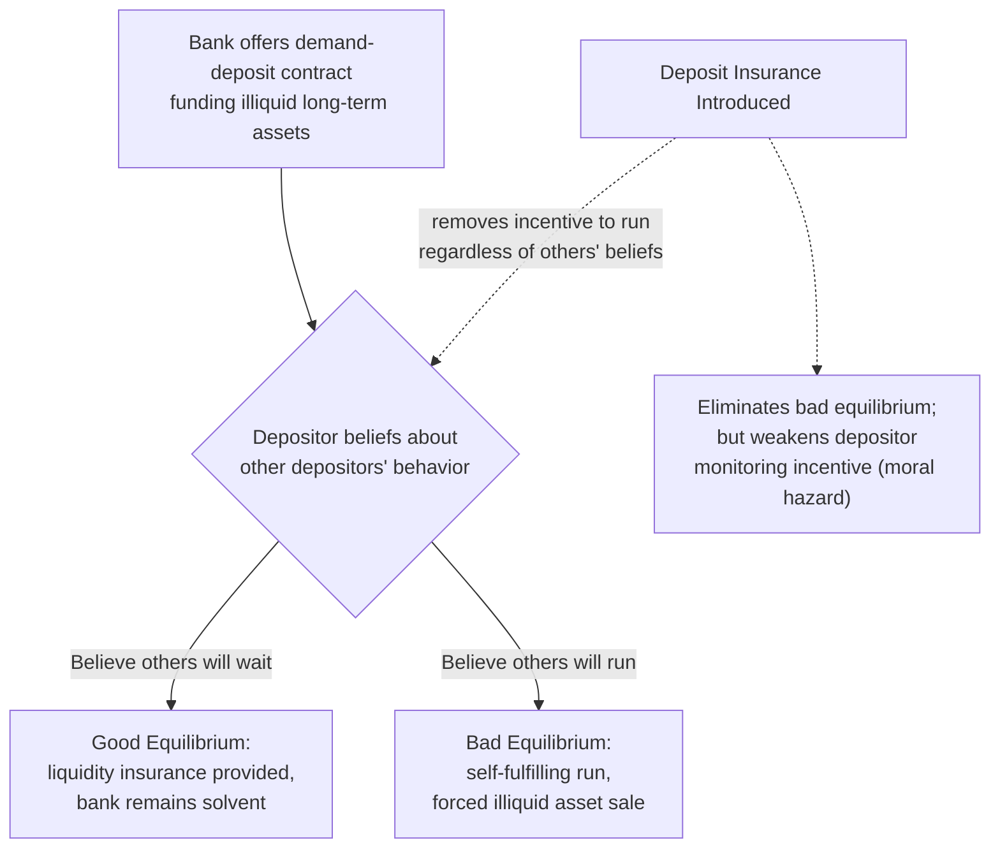
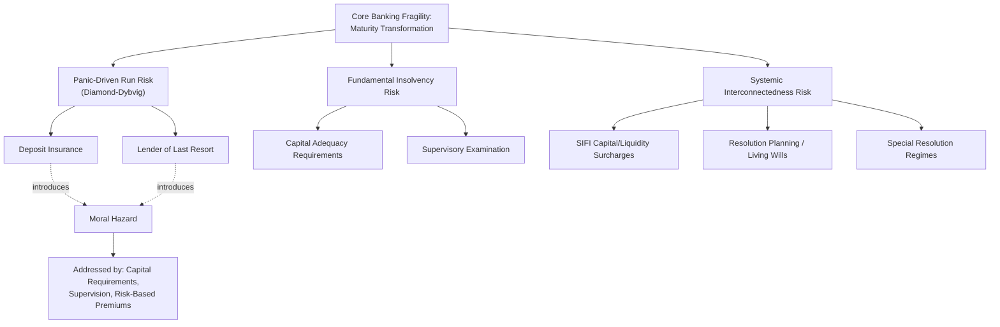

## Banking Regulation and Systemic Risk

### Why Banks Are Regulated Differently from Ordinary Firms

Banks occupy a distinctive position in financial regulation because their core economic function — **maturity transformation** (funding long-term, illiquid loans with short-term, liquid deposits) — creates a structural fragility not present in ordinary non-financial firms. This fragility, combined with banks' central role in the payment system and credit intermediation, is the foundation for treating banking regulation as addressing systemic risk specifically, rather than merely the ordinary information-asymmetry and agency-cost concerns applicable to firms generally.

**Key Points**

- A bank's balance sheet structure — illiquid, long-maturity assets (loans) funded by liquid, short-maturity, callable-on-demand liabilities (deposits) — is inherently a maturity mismatch that, absent any regulatory or institutional safeguard, is vulnerable to a self-fulfilling collapse if enough depositors simultaneously demand withdrawal.
- This structural vulnerability, not merely banks' size or their handling of other people's money in the ordinary agency-cost sense, is what most directly explains why banking regulation developed a distinct, more intensive regulatory apparatus (prudential supervision, capital and liquidity requirements, deposit insurance, lender-of-last-resort facilities) relative to the regulation applicable to non-financial firms of comparable size and public importance.

### The Diamond-Dybvig Bank Run Model

The canonical formal model of bank fragility, developed by Douglas Diamond and Philip Dybvig (1983), demonstrates that bank runs can occur as a **self-fulfilling equilibrium** even at a fundamentally solvent bank, arising purely from a coordination failure among depositors rather than from any underlying insolvency.

**Core logic**: A bank accepts deposits and invests in a long-term, illiquid, but productive investment technology. Depositors face uncertain individual liquidity needs (some will need to withdraw early for idiosyncratic reasons, others can wait). The bank offers a demand-deposit contract that provides valuable liquidity insurance: depositors who need funds early can withdraw a fixed amount, while those who wait longer receive a higher return reflecting the investment's full maturation, and in the "good" equilibrium the bank services early withdrawals for depositors who genuinely need liquidity while later withdrawers earn the investment's productive return.

However, because the bank's assets are illiquid and cannot be fully liquidated at face value on short notice, a **second equilibrium** exists: if each depositor believes that *other* depositors will run (withdraw immediately regardless of their own liquidity needs), then it becomes individually rational for that depositor to also run — since the bank will be forced to sell its illiquid assets at a loss (or exhaust its liquid reserves) to meet the flood of withdrawal demands, and a depositor who waits risks being among those left with a claim on an insolvent, liquidated bank. This is formally a coordination game with multiple equilibria: the same fundamentally solvent bank can experience either a stable, welfare-maximizing outcome or a self-fulfilling run, depending purely on depositors' beliefs about other depositors' behavior — not on any change in the bank's underlying asset quality.

**Key Points**

- The critical economic insight is that bank runs, in this model, are not necessarily evidence of underlying bank insolvency — a run can occur at a bank whose assets, if given time to mature, would fully cover all deposit obligations, meaning the run itself (rather than any prior fundamental problem) can be what actually renders the bank unable to meet its obligations, through costly forced early liquidation of otherwise-sound assets.
- This distinguishes "fundamental" bank failures (driven by genuine asset quality deterioration or insolvency) from "panic-driven" runs (driven purely by the self-fulfilling coordination failure), a distinction with direct regulatory implications: policy tools addressing panic-driven runs (deposit insurance, lender-of-last-resort facilities) are conceptually distinct from, though sometimes overlapping in practice with, tools addressing fundamental solvency problems (capital requirements, supervisory examination).
- [Inference] Distinguishing, in real time during an actual episode of depositor withdrawal, whether a specific run is panic-driven or reflects genuine underlying insolvency concerns is often practically difficult, since the same observed behavior (mass withdrawal) is consistent with both explanations — a genuine empirical and supervisory challenge rather than a purely theoretical distinction.

### Deposit Insurance as a Solution to the Panic Equilibrium

Diamond-Dybvig's most direct policy implication is that **deposit insurance** can eliminate the panic-driven run equilibrium entirely: if depositors know their deposits are protected (up to some insured limit) regardless of the bank's liquidation outcome, an individual depositor no longer has any incentive to run merely because they fear other depositors might run, since their claim is guaranteed independent of the bank's actual liquidation proceeds. This removes the self-fulfilling-beliefs mechanism that generates the bad equilibrium, leaving only the good, liquidity-insurance-providing equilibrium as the relevant outcome.

**Key Points**

- This is the central theoretical justification for deposit insurance as a financial-stability tool, distinct from (though sometimes conflated with) deposit insurance's consumer-protection rationale (protecting unsophisticated retail depositors from loss).
- Deposit insurance's stability benefit, however, is precisely what generates the moral hazard cost discussed in banking regulation's broader trade-off structure: because insured depositors no longer have a personal financial incentive to monitor or price the bank's risk-taking (their return is unaffected by the bank's actual risk profile up to the insured limit), the market discipline that would otherwise constrain excessive bank risk-taking is substantially weakened, requiring supervisory and capital-based substitutes for the monitoring function deposit insurance removes.
- This trade-off — reduced panic risk versus reduced market discipline — is the foundational reason banking regulation is best understood as a coordinated system of complementary tools (deposit insurance *plus* capital requirements *plus* supervisory examination) rather than any single instrument in isolation; removing any one leg while retaining the others tends to reintroduce the specific problem that instrument was designed to address.

### Diagram: The Diamond-Dybvig Dual Equilibrium and Deposit Insurance's Effect

### Capital Adequacy Regulation

**Economic function of bank capital**: Bank capital (primarily common equity) functions as a loss-absorbing buffer: losses on a bank's assets are absorbed first by equity holders before affecting depositors or other creditors, meaning higher capital levels directly reduce the probability that a given magnitude of asset losses renders the bank unable to meet its obligations to depositors and other creditors. Capital regulation mandates minimum capital ratios (capital as a proportion of risk-weighted assets) to ensure this buffer is maintained at a level judged sufficient to absorb plausible loss scenarios.

**Capital regulation as a response to moral hazard**: As developed in the broader financial regulation framework, capital requirements directly counteract the risk-shifting incentive that limited liability combined with deposit insurance (or other government guarantees) would otherwise create: because bank shareholders' liability is capped at their equity investment while depositors are insured against loss, shareholders acting alone would have an incentive to prefer excessively risky asset portfolios (capturing the upside while government-guaranteed depositors bear a disproportionate share of the downside) — precisely the asset-substitution moral hazard problem identified in the limited-liability and capital-structure literature, here amplified by the presence of an explicit government guarantee rather than merely the implicit protection ordinary limited liability provides. Requiring a larger equity cushion forces shareholders to internalize a larger share of potential losses before the government guarantee is triggered, partially restoring risk-taking discipline.

**Risk-weighting and its economic logic**: Modern capital frameworks (e.g., the Basel Accords' internationally coordinated capital standards) generally weight different categories of assets by estimated riskiness when calculating required capital, reflecting the economic principle that a flat capital requirement (applied uniformly regardless of asset risk) would create a perverse incentive for banks to shift their portfolios toward the riskiest assets within any given capital requirement, since a flat requirement effectively subsidizes risk-taking at the margin (the same capital charge applies whether the bank holds safe government securities or high-risk loans).

**Key Points**

- **Procyclicality concern**: A significant critique of risk-weighted capital requirements is that measured asset risk (and therefore required capital) tends to appear lower during economic expansions (when asset prices are rising and default rates are low) and higher during downturns (when asset quality deteriorates), potentially forcing banks to raise additional capital or reduce lending precisely during downturns when credit availability is most needed for the broader economy — a procyclical dynamic that can amplify, rather than dampen, the business cycle, motivating countercyclical capital buffer requirements (additional capital accumulated during expansions specifically to be available for release during downturns) in more recent regulatory frameworks.
- **Regulatory arbitrage of risk weights**: Because risk-weighting relies on specified methodologies (standardized regulatory categories or, in more sophisticated frameworks, banks' own internal risk models subject to regulatory approval), banks have an incentive to structure or classify assets in ways that minimize calculated risk weights and therefore required capital without necessarily reducing genuine underlying risk — an ongoing regulatory design challenge illustrating the general public-choice and regulatory-arbitrage concerns applicable to financial regulation broadly.
- [Inference] The specific numerical capital ratio requirements, risk-weighting methodologies, and the precise design of countercyclical buffers under any given regulatory framework (e.g., specific Basel Accord provisions) are subject to periodic international and national revision, so specific figures should be checked against the current governing regulatory text rather than assumed static.

### Liquidity Regulation

Distinct from capital adequacy (which addresses solvency — whether asset value exceeds liability value), **liquidity regulation** addresses a bank's ability to meet its payment obligations as they come due, directly targeting the maturity-mismatch fragility at the heart of the Diamond-Dybvig framework.

- **Liquidity coverage requirements**: Mandating that banks hold a sufficient stock of high-quality liquid assets to cover net cash outflows under a specified acute short-term stress scenario, directly addressing the risk that a bank, even if fundamentally solvent, could be forced into costly fire-sale asset liquidation if it lacks sufficient readily convertible assets to meet a sudden surge in withdrawal or funding demands.
- **Stable funding requirements**: Mandating that banks fund a sufficient proportion of their illiquid, long-term assets with stable, longer-term funding sources (rather than relying excessively on volatile short-term wholesale funding), directly reducing the degree of maturity mismatch that generates Diamond-Dybvig-style run vulnerability in the first place.

**Key Points**

- Liquidity and capital regulation address distinct, though related, failure modes: a bank can be well-capitalized (assets exceed liabilities by a substantial margin) yet still fail due to a liquidity crisis (unable to convert assets to cash quickly enough to meet immediate obligations, even if those assets are ultimately worth more than the obligations), illustrating why banking regulation requires both categories of tool rather than either alone.
- Liquidity regulation directly reduces reliance on the lender-of-last-resort function (discussed below) by requiring banks to internally maintain a buffer against liquidity shocks, reducing (though not eliminating) the frequency and scale of situations in which emergency central bank lending becomes necessary.

### The Lender-of-Last-Resort Function

Central banks' lender-of-last-resort (LOLR) function — the provision of emergency liquidity to solvent but illiquid banks facing short-term funding pressure — directly operationalizes the Diamond-Dybvig insight that panic-driven illiquidity, even at a fundamentally solvent institution, can trigger otherwise-avoidable failure.

**The classical Bagehot rule**: The traditional formulation of sound LOLR practice (associated with Walter Bagehot's 19th-century writing) holds that central banks should lend freely to solvent institutions facing liquidity pressure, but should do so against good collateral and at a penalty rate (above the market rate prevailing in normal conditions) — the penalty rate component specifically designed to preserve market discipline and deter routine reliance on emergency lending as an ordinary funding source, while the "lend freely against good collateral" component addresses the core panic-prevention function.

**Key Points**

- The requirement that LOLR lending be directed only to *solvent* institutions (as opposed to insolvent ones) reflects the same fundamental-versus-panic-driven distinction discussed above: LOLR lending is conceptually designed to bridge a temporary liquidity gap at a fundamentally sound institution, not to prop up an institution whose assets are genuinely insufficient to cover its liabilities — though, as noted, distinguishing solvency from mere illiquidity in real time during an actual crisis can be genuinely difficult, creating practical ambiguity in applying this distinction.
- The penalty-rate requirement illustrates the same moral-hazard-versus-stability trade-off recurring throughout banking regulation: emergency lending too readily or too cheaply available would reduce banks' incentive to manage their own liquidity risk prudently in normal times, anticipating that central bank support will be available on favorable terms if needed — the LOLR analogue of the same trade-off deposit insurance presents between panic prevention and risk-taking discipline.

### Too Big to Fail, Interconnectedness, and Macroprudential Regulation

**The systemically important financial institution (SIFI) problem**: As developed in the broader financial regulation framework, sufficiently large, interconnected, or otherwise systemically significant institutions may generate an expectation (rational, given historical precedent in various jurisdictions and periods) that government authorities will intervene to prevent their disorderly failure, given the scale of contagion and real-economy disruption such a failure might otherwise cause. This expectation can create a self-reinforcing dynamic: creditors of a perceived SIFI may demand a lower risk premium than the institution's underlying risk profile alone would justify (anticipating government support in a crisis), effectively subsidizing the SIFI's funding costs and potentially incentivizing growth in size or interconnectedness specifically to increase the credibility of this implicit guarantee.

**Regulatory responses specifically targeting systemic significance (macroprudential tools):**

- **Capital and liquidity surcharges for systemically important institutions**: Requiring institutions designated as systemically important to maintain higher capital and liquidity buffers than the baseline requirement applicable to smaller, less interconnected institutions, directly pricing in the additional systemic externality such institutions' potential failure would generate.
- **Resolution planning ("living wills")**: Requiring systemically significant institutions to prepare and maintain credible plans for their own orderly resolution/wind-down in the event of failure, without requiring taxpayer-funded bailout or generating uncontrolled systemic disruption — directly addressing the too-big-to-fail problem by attempting to make the "failure without bailout" outcome genuinely credible and operationally feasible, thereby weakening the implicit-guarantee expectation the SIFI problem otherwise generates.
- **Special resolution regimes**: Statutory frameworks granting resolution authorities specific tools (e.g., the ability to impose losses on certain classes of creditors through statutory "bail-in" mechanisms, transfer of critical operations to a bridge institution) to resolve a failing systemically important institution outside ordinary bankruptcy proceedings, addressing concerns that ordinary bankruptcy processes may be too slow or poorly suited to prevent contagion during the resolution of a large, complex, interconnected financial institution.
- **Countercyclical macroprudential tools**: Beyond countercyclical capital buffers discussed above, tools such as loan-to-value or debt-to-income limits on specific categories of lending (e.g., mortgage lending) that can be tightened during periods of rapid credit growth judged likely to generate systemic vulnerability, addressing systemic risk that accumulates gradually through aggregate credit market dynamics rather than through any single institution's individual risk profile.

**Key Points**

- The shift from purely microprudential regulation (focused on individual institution soundness) to macroprudential regulation (focused on system-wide stability) reflects direct recognition of the systemic externality logic: because no individual institution internalizes the systemic cost its own failure or excessive risk-taking would impose on the broader financial system, regulation calibrated purely to each institution's idiosyncratic risk (the traditional microprudential approach) will tend to under-address the aggregate, system-wide risk that accumulates from the combination of many institutions' individually rational but collectively excessive risk-taking and interconnection.
- [Inference] The empirical effectiveness of resolution planning and bail-in regimes in genuinely eliminating the too-big-to-fail implicit subsidy — as opposed to merely reducing its magnitude or shifting market expectations only partially — remains a subject of ongoing empirical assessment and is likely to continue evolving as these relatively newer regulatory tools are tested (or remain untested) through actual crisis episodes, so claims about their complete effectiveness should be treated with appropriate caution.

### Diagram: Layered Banking Regulation Addressing Distinct Failure Modes

### Shadow Banking and Regulatory Perimeter Concerns

A significant contemporary concern in banking regulation and systemic risk economics is the growth of **shadow banking** — credit intermediation activities that replicate core banking functions (maturity transformation, credit provision) but occur outside the traditional, heavily regulated banking perimeter (e.g., through money market funds, certain securitization structures, and other non-bank financial intermediaries).

**Key Points**

- Shadow banking activities can, in principle, generate the same Diamond-Dybvig-style run vulnerability and systemic contagion risk as traditional banking, since the underlying economic function (funding illiquid assets with liquid, run-prone liabilities) is structurally similar, even though the specific legal and institutional form differs from a traditional deposit-taking bank.
- Because shadow banking entities typically lack access to explicit deposit insurance and, historically, have had less certain access to central bank lender-of-last-resort facilities, they may be *more* vulnerable to panic-driven runs than traditional insured banks in some respects, even as they simultaneously escape the capital, liquidity, and supervisory requirements applicable to traditional banks — illustrating the regulatory arbitrage dynamic discussed in the broader financial regulation framework, where stringent regulation of one channel can shift systemically risky activity toward a less-regulated substitute channel, potentially increasing rather than decreasing aggregate systemic risk if the shift is sufficiently large and the shadow banking sector's own vulnerabilities are not independently addressed.
- [Unverified] The precise current regulatory perimeter and specific rules applicable to various categories of shadow banking activity vary substantially by jurisdiction and continue to evolve, so the applicable regulatory treatment of any specific shadow banking activity or entity type should be verified against current regulatory sources rather than assumed to mirror traditional bank regulation.

### Conclusion

Banking regulation is best understood as a coordinated system of complementary tools, each addressing a distinct failure mode arising from the banking sector's core structural fragility: the maturity mismatch between illiquid long-term assets and liquid, callable-on-demand liabilities. Deposit insurance and lender-of-last-resort facilities directly target the self-fulfilling, panic-driven run equilibrium formalized in the Diamond-Dybvig framework; capital adequacy requirements target both fundamental solvency risk and the moral hazard these same panic-prevention tools introduce by weakening depositor monitoring incentives; liquidity regulation directly reduces the underlying maturity mismatch generating run vulnerability in the first place; and macroprudential tools (SIFI surcharges, resolution planning, special resolution regimes) extend the regulatory framework beyond individual institution soundness to address the systemic externalities that interconnected, too-big-to-fail institutions generate but do not individually internalize. Because deposit insurance and lender-of-last-resort support each simultaneously solve a panic-risk problem while introducing a moral-hazard cost, banking regulation is structurally interdependent: removing any single tool while retaining the others tends to reintroduce precisely the problem that tool was designed to solve, and the ongoing challenge of shadow banking regulatory arbitrage illustrates that the effectiveness of this coordinated system depends on maintaining a regulatory perimeter broad enough to capture activities that replicate banking's core economic function, regardless of their specific legal form.

**Next Steps**

- Diamond-Dybvig model extensions and empirical bank run evidence
- Basel Accord capital and liquidity requirement design and evolution
- Too-big-to-fail, bail-in mechanisms, and special resolution regime design
- Shadow banking regulatory perimeter and money market fund reform
- Countercyclical macroprudential tools and credit cycle management
- Central bank lender-of-last-resort policy and the Bagehot rule in practice
- Deposit insurance design: coverage limits, risk-based premiums, and moral hazard
- Comparative banking regulation architecture across major jurisdictions