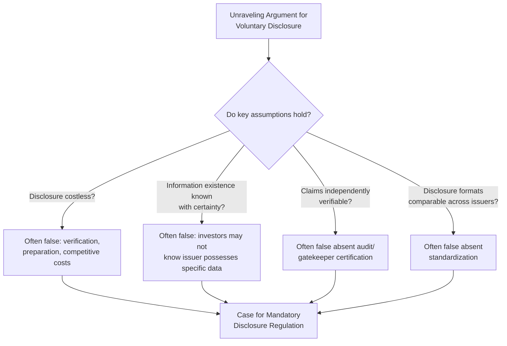
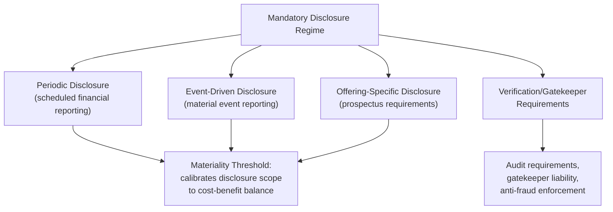
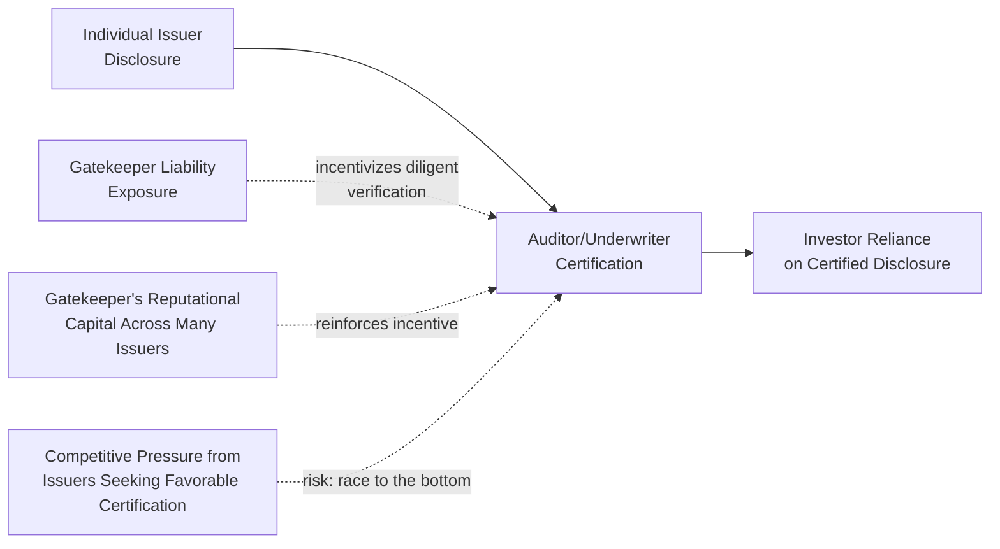

## Securities Law and Mandatory Disclosure Economics

### The Core Question: Why Mandate What Markets Might Provide Voluntarily?

Securities law's mandatory disclosure regime — requiring issuers to publicly disclose specified categories of information on a periodic and event-driven basis — presents a specific puzzle for law and economics analysis: if disclosure is valuable to investors and therefore valuable to issuers seeking to raise capital at the lowest possible cost, why does disclosure need to be legally mandated rather than left to voluntary market provision? This question sits at the center of securities law and economics scholarship and divides the field into two broad camps: those who see mandatory disclosure as correcting a genuine market failure in the private provision of information, and those who question whether mandatory disclosure's marginal contribution beyond a voluntary equilibrium justifies its costs.

### The Unraveling Argument for Voluntary Disclosure

A foundational insight from information economics, sometimes called the "unraveling" result, suggests that voluntary disclosure incentives may be stronger than intuition suggests. If investors know that an issuer possesses information and can costlessly disclose it, but the issuer remains silent, investors will rationally infer the withheld information is unfavorable (since an issuer with favorable information would have every incentive to disclose it to obtain a higher valuation). This inference creates pressure for progressively worse-off issuers to disclose in turn, since even an issuer with only moderately unfavorable information would prefer to disclose and be valued at its true (moderately unfavorable) level rather than be lumped in with issuers whose information is even worse. Iterating this logic, the market can "unravel" toward full voluntary disclosure even absent any legal mandate.

**Key Points**

- The unraveling result, if it held without qualification, would suggest mandatory disclosure regulation is largely redundant — voluntary market incentives alone would drive issuers toward full disclosure of material information.
- However, the unraveling argument depends on strong assumptions that frequently fail in practice: that disclosure is costless, that investors know with certainty the issuer possesses the relevant information (rather than merely suspecting it might exist), that disclosed claims are independently verifiable (since cheap talk alone cannot support unraveling if issuers can costlessly misrepresent information), and that there are no coordination or comparability problems across different issuers' voluntary disclosure choices.
- These qualifications are the analytical entry points through which the case for mandatory disclosure is typically constructed: mandatory disclosure regulation can be understood as addressing precisely the conditions under which the voluntary unraveling mechanism breaks down.

### Diagram: Where the Unraveling Argument Breaks Down

### Market Failures Justifying Mandatory Disclosure

**1. Disclosure as a public good with positive externalities**

Information about a firm's financial condition and prospects, once disclosed, has non-rivalrous and largely non-excludable characteristics from the perspective of the broader market: disclosed information tends to become impounded in market prices that benefit all market participants (not merely the party who bore the cost of extracting or verifying it), and, in an efficient market, price signals generated by one investor's analysis of disclosed information become available (through the observed price itself) to all other investors and to society generally through improved capital allocation. Because an individual issuer bears the full cost of disclosure (preparation, verification, potential competitive disadvantage from revealing information to rivals) while capturing only a portion of the resulting social benefit (accurate pricing benefits the broader capital market and improves aggregate capital allocation efficiency, not just the disclosing issuer's own cost of capital), issuers may under-provide disclosure relative to the socially optimal level even where disclosure would, in aggregate, improve market functioning.

**2. Comparability and standardization benefits**

Even where individual issuers have private incentives to disclose *some* information voluntarily, uncoordinated voluntary disclosure choices (differing formats, differing metrics, differing timing and scope) impose significant costs on investors attempting to compare securities across issuers — costs that a single issuer's voluntary disclosure decision does not account for, since the comparability benefit accrues to investors evaluating the issuer relative to *other* issuers' disclosures, not to the disclosing issuer alone. Mandatory, standardized disclosure formats (specified financial statement line items, standardized risk factor categories, uniform periodic reporting timing) directly address this coordination failure by imposing a common format across all regulated issuers, producing a comparability benefit no individual issuer's voluntary choice could generate alone.

**3. Verification and the gatekeeper problem**

The unraveling argument's dependence on verifiable disclosure highlights a distinct market failure: absent a credible verification mechanism, an issuer's mere claim to have disclosed unfavorable information is not credible, since a dishonest issuer could equally claim favorable information whether or not it is accurate. Mandatory disclosure regimes typically pair disclosure requirements with independent verification mechanisms (mandatory audit requirements, gatekeeper liability for auditors and underwriters, anti-fraud liability for material misstatements) that supply the credibility component voluntary disclosure alone cannot generate, since these verification mechanisms themselves require a coordinated regulatory infrastructure (licensing, liability standards, oversight of the verifying professionals) that is difficult for any individual issuer or investor to construct unilaterally.

**4. Reducing duplicative private information production**

Absent mandatory disclosure, sophisticated investors have an incentive to expend private resources investigating issuers' financial condition individually — producing a form of costly, duplicative information production (multiple analysts and investors independently researching the same underlying facts) that mandatory, centralized disclosure can substantially reduce by making baseline information available to all market participants simultaneously, freeing private research resources to focus on interpretation and analysis rather than basic fact-gathering.

**Key Points**

- These market-failure arguments are complementary, not mutually exclusive: a rigorous economic defense of mandatory disclosure typically draws on several of them simultaneously (public-good under-provision, comparability coordination failure, and the verification/gatekeeper problem together, rather than any single justification standing alone).
- [Inference] The relative empirical importance of each specific market failure — and therefore the appropriate scope and intensity of mandatory disclosure regulation needed to address them — remains a genuinely contested empirical question in securities law and economics scholarship, with some scholars (e.g., in the tradition associated with skepticism toward mandatory disclosure's marginal value for large, closely followed issuers) arguing the practical magnitude of these failures is smaller than commonly assumed, particularly for large-capitalization issuers already subject to extensive analyst coverage and market scrutiny independent of formal disclosure mandates.

### The Efficient Capital Markets Hypothesis and Its Relationship to Disclosure Policy

The **Efficient Capital Markets Hypothesis (ECMH)**, in its semi-strong form, holds that security prices fully and rapidly reflect all publicly available information, such that no investor can consistently earn abnormal risk-adjusted returns through analysis of that publicly available information alone. This hypothesis has a direct and important, but sometimes overstated, relationship to mandatory disclosure policy.

**Key Points**

- If markets are semi-strong-form efficient, mandatory disclosure's primary economic value lies not in helping any individual sophisticated investor "beat the market," but rather in ensuring that the information ultimately reflected in market prices is accurate and complete, since accurate pricing is what generates the broader social benefit of efficient capital allocation (directing capital toward its most productive uses based on prices that genuinely reflect underlying value) — this is sometimes termed the "fundamental value" or "capital allocation" rationale for disclosure, as distinct from a "protecting individual investors from being outmaneuvered" rationale.
- The ECMH also supports a specific, more limited conception of investor protection: because prices in an efficient market already reflect available information, an individual retail investor purchasing at the prevailing market price is not typically disadvantaged relative to more sophisticated investors by their own comparative lack of analytical sophistication (since the price itself already embeds the sophisticated analysis of others) — shifting the primary investor-protection concern in efficient-market settings toward ensuring the *information available to the market as a whole* is accurate, rather than toward protecting any specific individual investor's personal analytical capacity.
- [Inference] The degree to which real-world capital markets actually achieve semi-strong-form efficiency, and the extent to which persistent anomalies or behavioral departures from full efficiency should qualify reliance on ECMH-based disclosure policy justifications, remains a genuinely contested empirical question in financial economics, so the ECMH should be understood as an influential theoretical benchmark informing disclosure policy design rather than an uncontested description of actual market behavior in all contexts.

### The Mandatory versus Voluntary Disclosure Debate: The Skeptical Case

A prominent skeptical position in the law and economics literature (associated substantially with scholarship questioning the marginal value of mandatory disclosure regulation) raises several challenges to the market-failure justifications above:

- **Voluntary incentives may already be strong for large issuers**: Large, actively traded issuers already face substantial voluntary disclosure incentives independent of legal mandate — the desire to minimize cost of capital, maintain analyst coverage and market following, and support liquid trading in their securities — potentially rendering the incremental contribution of mandatory disclosure requirements small for this category of issuer, even if the underlying market-failure logic has some validity in principle.
- **One-size-fits-all standardization costs**: Mandatory, standardized disclosure requirements, designed to address the comparability coordination failure, may impose a rigid format poorly suited to conveying issuer-specific information that would be more efficiently communicated through a tailored, issuer-specific voluntary disclosure approach, and may create compliance costs disproportionate to the incremental informational benefit for issuers whose business or risk profile does not fit neatly within standardized disclosure categories.
- **Empirical difficulty isolating mandatory disclosure's causal effect**: Because virtually all developed securities markets have operated under some mandatory disclosure regime for an extended period, rigorously isolating the causal, marginal contribution of mandatory disclosure (relative to a genuinely voluntary counterfactual) is empirically difficult, and available natural-experiment-style evidence (e.g., studies examining market reactions to changes in disclosure regulation, or comparisons across jurisdictions with differing disclosure intensity) produces a body of evidence that different scholars have interpreted as supporting differing conclusions about mandatory disclosure's net marginal benefit.

**Key Points**

- This skeptical position does not necessarily argue mandatory disclosure regulation should be entirely eliminated, but rather questions whether the specific scope, intensity, and one-size-fits-all design of many actual mandatory disclosure regimes are well-calibrated to the genuine, empirically-supported magnitude of the underlying market failures, as opposed to having expanded beyond what a rigorous cost-benefit analysis would support.
- [Inference] This remains an active and unresolved area of scholarly disagreement rather than a settled question, and reasonable economists and legal scholars continue to draw differing conclusions from the same body of theoretical argument and empirical evidence regarding the appropriate scope of mandatory disclosure.

### The Structure of Mandatory Disclosure Regimes

**Periodic disclosure**: Regular, scheduled reporting (e.g., annual and quarterly financial statements) providing baseline, comparable financial information on an ongoing basis, addressing the comparability coordination failure described above through standardized timing and format.

**Event-driven (current) disclosure**: Requirements to promptly disclose specified material events occurring between periodic reporting dates (e.g., major transactions, executive changes, material litigation developments), addressing the risk that reliance solely on periodic reporting would leave the market operating on stale information for extended intervals between scheduled reports, undermining the accurate, continuously-updated pricing that the fundamental-value rationale for disclosure depends upon.

**Offering-specific disclosure**: Enhanced disclosure requirements specifically applicable at the point a security is initially offered to the public (e.g., prospectus requirements), reflecting the particular acuteness of the information asymmetry problem at the moment of initial capital-raising, when investors have the least accumulated track record or market history for the specific security being offered.

**The materiality standard**: Mandatory disclosure regimes generally do not require disclosure of literally all information an issuer possesses, but rather information meeting a **materiality** threshold — commonly formulated as information a reasonable investor would consider important in making an investment decision, or information that would significantly alter the total mix of information available to the market. This threshold reflects a direct cost-benefit calibration: requiring disclosure of genuinely immaterial information would impose compliance costs without a corresponding informational benefit to investors, and could, in the extreme, obscure genuinely material information within an excessive volume of immaterial disclosure (sometimes termed "information overload").

**Key Points**

- The materiality standard is itself an economically calibrated boundary, not an arbitrary legal threshold: it attempts to identify the point at which the marginal benefit of additional disclosed information to investor decision-making no longer exceeds the marginal preparation, verification, and information-processing cost that additional disclosure would impose.
- [Inference] The precise application of the materiality standard to specific categories of information (e.g., evolving debates over disclosure of certain environmental, social, or cybersecurity-related risks) continues to be refined through case law and regulatory guidance and can vary by jurisdiction, so specific applications should be checked against current regulatory and judicial guidance rather than assumed settled.

### Diagram: The Mandatory Disclosure Architecture

### Anti-Fraud Liability and Gatekeeper Regulation

**Anti-fraud rules**: Prohibitions on material misstatements or omissions in connection with securities transactions supply the enforcement backbone that gives mandatory disclosure requirements practical teeth, addressing the most acute version of the information asymmetry problem — deliberate deception — through private litigation (enabling investors harmed by fraudulent disclosure to seek damages) and public enforcement (regulatory investigation and sanction).

**Gatekeeper liability**: Extending liability exposure to professional intermediaries who certify or facilitate disclosure — auditors who certify financial statements, underwriters who conduct due diligence in connection with securities offerings, and credit rating agencies who assess issuer creditworthiness — reflects a distinct economic logic: because these gatekeepers repeatedly interact with the securities markets across many different issuers and transactions, they can develop reputational capital and specialized verification expertise that individual, one-time issuers cannot replicate, and exposing gatekeepers to liability for negligent or complicit certification creates an incentive for the gatekeeper to genuinely exercise the verification function their certification purports to represent, rather than merely lending a superficial credibility signal without corresponding diligence.

**Key Points**

- Gatekeeper liability functions as a leveraged enforcement mechanism: because a single audit firm or underwriter is involved in disclosure verification across numerous issuers, holding gatekeepers to a meaningful liability or professional-sanction standard can influence disclosure quality market-wide more efficiently than attempting to directly monitor and sanction each individual issuer's disclosure practices in isolation, since the gatekeeper's own reputational and legal exposure creates an ongoing, self-reinforcing incentive for diligent verification across their entire client base.
- The gatekeeper mechanism also illustrates a recurring risk familiar from the broader financial regulation framework: if gatekeepers face competitive pressure from issuers who can choose among competing auditors or underwriters, and if issuers can select the gatekeeper offering the most favorable (least rigorous) certification, a race-to-the-bottom dynamic in gatekeeper diligence can undermine the verification function gatekeeper liability is designed to secure — motivating independent gatekeeper oversight, licensing, and liability regimes that constrain this competitive dynamic.

### Diagram: Gatekeeper Verification as Leveraged Enforcement

### The Cost Side of Mandatory Disclosure

Consistent with the general comparative, marginal-benefit-versus-marginal-cost methodology applied throughout financial regulation analysis, a complete economic assessment of mandatory disclosure regulation must weigh its benefits against genuine costs:

- **Direct compliance costs**: Preparation, verification, and legal review costs associated with mandatory disclosure filings, which can be disproportionately burdensome (as a share of firm size or capital raised) for smaller issuers, potentially deterring smaller firms from accessing public capital markets at all and pushing capital-raising activity toward less-regulated private placement channels.
- **Competitive disclosure costs**: Some required disclosures (e.g., certain categories of business strategy, customer, or competitive information) may provide genuine value to competitors, imposing a real cost on the disclosing issuer beyond mere preparation expense.
- **Information overload**: Excessive disclosure volume, even where each individual disclosed item independently satisfies a materiality threshold, can reduce the practical usability of disclosure for typical investors, potentially undermining rather than advancing the informational goal disclosure regulation is meant to serve.
- **Litigation risk and disclosure conservatism**: Anti-fraud liability exposure can incentivize issuers toward excessively cautious, boilerplate, or overly hedged disclosure specifically to minimize litigation risk, potentially reducing the practical informational value of disclosure relative to a liability regime calibrated to encourage candid, genuinely informative disclosure without excessive defensive hedging.

**Key Points**

- These cost considerations do not undermine the case for mandatory disclosure regulation in principle, but they support the same comparative, marginal methodology developed for financial regulation generally: the appropriate scope and intensity of mandatory disclosure should reflect an ongoing calibration against these costs, potentially justifying differentiated disclosure regimes based on issuer size or sophistication (e.g., scaled disclosure requirements for smaller issuers) rather than a uniform standard applied without regard to the disproportionate cost burden smaller issuers may face.

### Conclusion

Securities law's mandatory disclosure regime occupies a genuinely contested position in law and economics scholarship: the unraveling argument suggests voluntary market incentives alone might, under idealized conditions, drive issuers toward substantial voluntary disclosure, but the conditions required for unraveling to fully operate — costless disclosure, certain investor knowledge of information existence, verifiable claims, and coordinated comparability — frequently fail in practice, providing the analytical foundation for mandatory disclosure's economic justification through public-good under-provision, comparability coordination failure, and the verification/gatekeeper problem. This justification is complemented by anti-fraud liability and gatekeeper regulation, which supply the enforcement and verification infrastructure that transforms disclosure requirements from mere formal obligations into credible, market-relied-upon information. At the same time, a substantial and unresolved skeptical literature questions whether mandatory disclosure's marginal contribution — particularly for large, already closely followed issuers — justifies its compliance costs, competitive costs, and potential for information overload and defensive disclosure conservatism, meaning the appropriate scope and calibration of mandatory disclosure regulation remains an active area of both empirical investigation and policy design rather than a definitively settled question.

**Next Steps**

- The unraveling result and its formal conditions in information economics
- Efficient Capital Markets Hypothesis: forms, evidence, and behavioral critiques
- Gatekeeper liability design: auditors, underwriters, and credit rating agencies
- Materiality standard doctrine and its application to emerging risk categories
- Scaled disclosure regimes for smaller and emerging growth issuers
- Anti-fraud liability standards and private securities litigation
- Comparative securities regulation: mandatory disclosure intensity across jurisdictions
- Behavioral finance critiques of disclosure-based investor protection