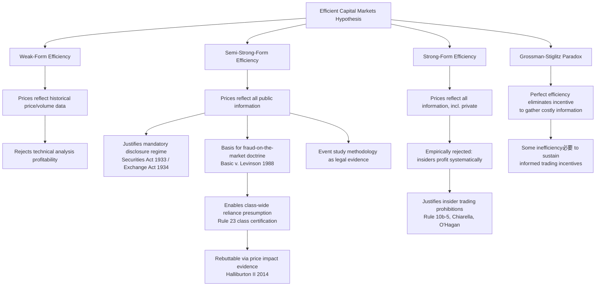

## Efficient Capital Markets Hypothesis and Securities Regulation

### Overview

The Efficient Capital Markets Hypothesis (ECMH), formulated principally by Eugene Fama, holds that security prices in well-functioning markets fully and rapidly incorporate all available information. This proposition has become one of the most consequential ideas in Law and Economics because it directly shapes the theoretical justification for—and critique of—mandatory disclosure regimes, insider trading prohibitions, fraud-on-the-market doctrine, and the broader architecture of securities regulation.

### Theoretical Foundations

#### The Random Walk Precursor

Before Fama's formalization, Louis Bachelier (1900) and later Paul Samuelson (1965) observed that if prices already reflect available information, subsequent price changes must be unpredictable—a "random walk." Any predictable pattern would be arbitraged away by rational traders seeking profit, and the act of exploiting the pattern would itself eliminate it.

#### Fama's Three Forms of Efficiency

Fama's 1970 taxonomy (refined in his 1991 review) divides ECMH into three nested forms based on the information set assumed to be reflected in price:

**Weak-form efficiency**: Prices reflect all information contained in historical price and volume data. Technical analysis (chartism) cannot generate abnormal risk-adjusted returns.

**Semi-strong-form efficiency**: Prices reflect all publicly available information, including financial statements, announcements, and macroeconomic data. Fundamental analysis of public information cannot generate abnormal returns, and prices adjust essentially instantaneously to new public information.

**Strong-form efficiency**: Prices reflect all information, public and private (including insider information). Under this form, even insiders could not systematically profit from material non-public information—an empirically implausible claim, and the form most decisively rejected by evidence (insider trading studies consistently show abnormal returns to those with privileged information).

$$P_t = E[P_t \mid \Omega_t]$$

where $P_t$ is the price at time $t$ and $\Omega_t$ is the full information set assumed available to the market at that time. Under semi-strong efficiency, $\Omega_t$ is restricted to publicly available information.

#### Joint Hypothesis Problem

A foundational methodological point, emphasized by Fama himself: market efficiency can never be tested in isolation. Any empirical test of ECMH is simultaneously a test of (1) the efficiency hypothesis and (2) whatever asset-pricing model (CAPM, Fama-French three-factor, etc.) is used to define "normal" or expected returns. An apparent anomaly could reflect either market inefficiency or a misspecified equilibrium model. This is why decades of anomaly research (value effect, momentum, size effect, post-earnings-announcement drift) have never produced a clean falsification or confirmation of ECMH—each finding is contestable as either mispricing or omitted risk factors.

### Relationship to the Efficient Market Hypothesis Debate

#### Behavioral Finance Critiques

Robert Shiller's excess volatility findings (stock prices fluctuate more than can be justified by subsequent dividend changes), the work of Kahneman and Tversky on systematic cognitive biases, and Richard Thaler's documentation of anomalies (equity premium puzzle, closed-end fund discounts, momentum) collectively challenge strong readings of ECMH. Behavioral finance argues that noise traders, limits to arbitrage (De Long, Shleifer, Summers, and Waldmann's noise trader risk model), and psychological biases can produce persistent mispricing.

#### Grossman-Stiglitz Paradox

Sanford Grossman and Joseph Stiglitz (1980) demonstrated a logical tension within ECMH itself: if prices perfectly reflected all information, no one would have an incentive to gather costly information, since they could free-ride on prices. But if no one gathers information, prices cannot reflect it. The equilibrium resolution is that markets are efficient only up to the point where the marginal cost of information acquisition equals the marginal benefit—implying a degree of *noise* or inefficiency is necessary to sustain the incentive for informed trading. This has direct implications for securities law: it justifies mandatory disclosure as a mechanism to lower the cost of information acquisition without relying solely on private incentives.

### Legal and Regulatory Implications

#### The Case for Mandatory Disclosure

Two competing economic theories address whether disclosure regulation is even necessary:

**Market-forces-suffice view** (associated with George Stigler's early skepticism and later elaborated by Frank Easterbrook and Daniel Fischel): issuers have private incentives to disclose voluntarily because capital markets discount the securities of opaque issuers ("unraveling" argument—if the best-informed firms disclose, progressively less well-positioned firms are forced to follow, or the market assumes the worst).

**Market-failure view**: disclosure is a public good subject to free-riding (once one analyst extracts and publicizes information, others can use it without cost), and information asymmetry between managers and dispersed investors creates adverse selection problems that voluntary markets underprovide. This is the traditional justification underlying the 1933 Securities Act and 1934 Securities Exchange Act mandatory disclosure architecture in the United States.

Easterbrook and Fischel's synthesis (*The Economic Structure of Corporate Law*) argues mandatory disclosure is best justified not by pure market failure but by standardization economies: uniform, comparable disclosure reduces the cost of information processing across firms and reduces duplicative private investigation costs.

#### Fraud-on-the-Market Doctrine

The single most direct legal application of ECMH is the fraud-on-the-market presumption of reliance, adopted by the U.S. Supreme Court in ***Basic Inc. v. Levinson*** (1988). In a traditional common-law fraud claim, a plaintiff must prove individual reliance on the defendant's misrepresentation. In a large, impersonal securities market, most investors never read or rely on any specific corporate statement directly. The Court held that because efficient markets incorporate public material misstatements into price, investors who purchase at the distorted market price are presumed to have relied on the integrity of that price—and, derivatively, on the misstatement that distorted it.

This doctrine was essential to the viability of securities class actions, since it allows plaintiffs to satisfy the reliance element on a class-wide basis (a predicate for class certification under Federal Rule of Civil Procedure 23) rather than requiring individualized proof for each class member.

***Halliburton Co. v. Erica P. John Fund, Inc.*** (2014) ("Halliburton II") preserved the *Basic* presumption but allowed defendants to rebut it at the class certification stage by presenting direct evidence that the alleged misrepresentation did not actually affect the stock price (i.e., a "price impact" defense)—effectively requiring a mini event-study inquiry before certification.

#### Event Studies as Legal Evidence

Because fraud-on-the-market liability and damages calculations depend on showing that a specific disclosure or misrepresentation moved the stock price, the **event study methodology** developed in financial economics (Fama, Fisher, Jensen, and Roll, 1969) has become a standard evidentiary tool in securities litigation. An event study isolates the abnormal return attributable to a corporate announcement:

$$AR_{it} = R_{it} - E[R_{it} \mid X_t]$$

where $AR_{it}$ is the abnormal return for security $i$ at time $t$, $R_{it}$ is the observed return, and $E[R_{it} \mid X_t]$ is the expected return predicted by a market model (commonly the market model $R_{it} = \alpha_i + \beta_i R_{mt} + \varepsilon_{it}$) conditional on market-wide movements. Cumulative abnormal returns (CAR) over an event window are then tested for statistical significance to establish materiality and price impact—now a routine component of both class certification proceedings and damages modeling in securities fraud cases.

#### Insider Trading Regulation

ECMH's semi-strong form (public information is reflected, private information is not) provides the core economic rationale for insider trading prohibitions under Section 10(b) of the Exchange Act and Rule 10b-5. If markets are semi-strong efficient but not strong-form efficient, insiders retain the ability to extract systematic profits from material non-public information, which:

- Undermines allocative efficiency in a more limited sense: informed insider trading can, per Henry Manne's controversial 1966 thesis, actually accelerate price discovery and compensate entrepreneurs for firm-specific information, but at the cost of...
- Reducing outside investor confidence and market liquidity (adverse selection: market makers widen bid-ask spreads to protect against trading with better-informed counterparties, per the Glosten-Milgrom and Kyle models of market microstructure), which raises the cost of capital for issuers generally.

The dominant regulatory view (reflected in SEC enforcement policy) rejects Manne's efficiency defense and treats insider trading as a violation of fiduciary duty (classical theory, ***Chiarella v. United States***, 1980) or duty owed to the source of information (misappropriation theory, ***United States v. O'Hagan***, 1997).

#### Efficient Markets and the Rule 10b-5 Materiality Standard

Materiality under ***TSC Industries v. Northway*** (1976) and ***Basic Inc. v. Levinson*** turns on whether there is a "substantial likelihood" that a reasonable investor would consider the omitted or misstated fact important. In an efficient market, this standard is operationalized empirically: a fact is material if its disclosure would be expected to significantly affect the security's price, which is precisely what event studies are designed to detect.

### Implications for Regulatory Design

#### Rational for a Disclosure-Based (Rather Than Merit-Based) Regime

U.S. federal securities law is fundamentally a disclosure regime, not a merit regime: the SEC does not evaluate whether a security is a "good" investment, only whether adequate information has been disclosed to allow the market to price it. ECMH provides the theoretical foundation for this choice: if markets efficiently process disclosed information into prices, government need not (and, per public choice concerns, should not) substitute its judgment for the market's regarding investment quality. Some U.S. states retain "blue sky" merit review requirements, creating a partial exception to this framework.

#### Efficient Markets and the Debate over Regulation Costs

If markets are efficient, the informational benefit of *additional* mandatory disclosure requirements is subject to diminishing returns—once core material facts are disclosed and impounded into price, further disclosure mandates primarily add compliance cost without commensurate benefit. This logic underlies cost-benefit critiques of expansive disclosure regimes (e.g., debates over Sarbanes-Oxley Section 404 internal control disclosure costs, and Dodd-Frank's specialized disclosure mandates such as conflict minerals reporting).

#### Passive Investing and Index Fund Regulation

ECMH provides the direct theoretical justification for passive/index investing strategies (as elaborated by John Bogle and formalized in William Sharpe's "The Arithmetic of Active Management," 1991): if it is difficult to systematically outperform an efficient market net of costs, low-cost diversified index holding is a rational response. This has downstream regulatory implications for fiduciary duty standards under ERISA and investment adviser regulation, where courts and regulators increasingly treat low-cost index strategies as a benchmark for prudent fiduciary conduct.

### Diagram: ECMH Forms and Legal Doctrine Mapping

### Worked Example: Event Study for a Fraud-on-the-Market Claim

**Scenario**: A public company issues a corrective disclosure revealing that prior revenue figures were materially overstated. Plaintiffs allege the original misstatement inflated the stock price, and the corrective disclosure caused a price decline actionable under Rule 10b-5.

**Step 1 — Define the event window**: Typically a short window (e.g., $[-1, +1]$ trading days) around the corrective disclosure to minimize contamination from confounding information.

**Step 2 — Estimate the market model** using a pre-event estimation window (e.g., 250 trading days ending well before the event window):

$$R_{it} = \hat\alpha_i + \hat\beta_i R_{mt} + \varepsilon_{it}$$

**Step 3 — Compute abnormal returns** during the event window using the estimated $\hat\alpha_i$ and $\hat\beta_i$:

$$AR_{it} = R_{it} - (\hat\alpha_i + \hat\beta_i R_{mt})$$

**Step 4 — Aggregate to cumulative abnormal return (CAR)** across the event window:

$$CAR_i = \sum_{t=-1}^{+1} AR_{it}$$

**Step 5 — Test statistical significance**: If the CAR is statistically significant and negative, this supports both (a) materiality of the corrective disclosure, and (b) an estimate of the per-share inflation attributable to the original misstatement, which feeds directly into damages calculations under an "out-of-pocket" or "inflation-per-share" damages model.

[Inference] The precise damages methodology accepted varies by circuit and is frequently the subject of dueling expert testimony; courts have not converged on a single mandatory event-study specification.

### Illustration: Price Adjustment Under Semi-Strong Efficiency (svg_diagram)

<svg xmlns="http://www.w3.org/2000/svg" viewBox="0 0 700 400">
<text x="350" y="25" text-anchor="middle" font-size="16" font-weight="bold" fill="#1a1a1a">Price Adjustment to Public Announcement (svg_diagram)</text>
<line x1="60" y1="350" x2="650" y2="350" stroke="#333" stroke-width="2" />
<line x1="60" y1="350" x2="60" y2="50" stroke="#333" stroke-width="2" />
<text x="355" y="385" text-anchor="middle" font-size="13" fill="#333">Trading Days Relative to Announcement</text>
<text x="25" y="200" text-anchor="middle" font-size="13" fill="#333" transform="rotate(-90 25 200)">Cumulative Abnormal Return</text>
<line x1="355" y1="50" x2="355" y2="350" stroke="#999" stroke-width="1" stroke-dasharray="4,4" />
<text x="355" y="365" text-anchor="middle" font-size="11" fill="#666">t=0 (Announcement)</text>

<polyline points="60,220 150,222 250,219 320,221 355,221 375,140 400,138 450,139 500,137 600,138 650,138" fill="none" stroke="`#2166ac`" stroke-width="3" />

<polyline points="60,220 150,215 250,222 320,180 355,150 400,100 450,90 500,85 600,80 650,75" fill="none" stroke="`#b2182b`" stroke-width="2" stroke-dasharray="6,3" />

<circle cx="355" cy="221" r="4" fill="#2166ac" />
<circle cx="375" cy="140" r="4" fill="#2166ac" />
<rect x="480" y="200" width="14" height="14" fill="#2166ac" />
<text x="500" y="212" font-size="12" fill="#333">Efficient market: instant adjustment</text>
<rect x="480" y="225" width="14" height="14" fill="#b2182b" />
<text x="500" y="237" font-size="12" fill="#333">Inefficient market: gradual drift</text>
</svg>

### Key Points

- ECMH posits three nested forms of efficiency—weak, semi-strong, and strong—distinguished by the information set reflected in price.
- The joint hypothesis problem means ECMH is never testable in isolation from an asset-pricing model, complicating both empirical finance and litigation-driven event studies.
- Semi-strong efficiency underlies mandatory disclosure regulation and the fraud-on-the-market doctrine (*Basic v. Levinson*), which permits class-wide reliance presumptions in securities fraud litigation.
- The Grossman-Stiglitz paradox shows that perfectly efficient markets would eliminate the incentive to produce information, implying regulation-supported disclosure can substitute for costly private information production.
- Insider trading regulation is justified by the empirical failure of strong-form efficiency: insiders can and do earn abnormal returns from private information.
- *Halliburton II* preserved but qualified the fraud-on-the-market presumption by allowing defendants to rebut it with direct price-impact evidence pre-certification.
- Behavioral finance (Shiller, Thaler, Kahneman/Tversky) provides the principal empirical and theoretical challenge to strong readings of ECMH, documenting persistent anomalies and limits to arbitrage.

### Related Topics

- Mandatory disclosure theory: market failure vs. standardization rationales (Easterbrook and Fischel)
- Insider trading theory: Manne's efficiency thesis vs. fiduciary duty theory (*Chiarella*, *O'Hagan*)
- Market microstructure and adverse selection: Kyle model, Glosten-Milgrom model, bid-ask spread formation
- Behavioral finance and limits to arbitrage: noise trader risk (De Long, Shleifer, Summers, Waldmann)
- Fraud-on-the-market doctrine and class certification standards post-*Halliburton II*
- Event study methodology in securities litigation and damages estimation
- Executive compensation and managerial agency costs under efficient market pricing
- Bankruptcy law and the absolute priority rule (chapter continuity: capital structure and market pricing of distressed debt)
- Public choice theory applied to SEC rulemaking and regulatory capture