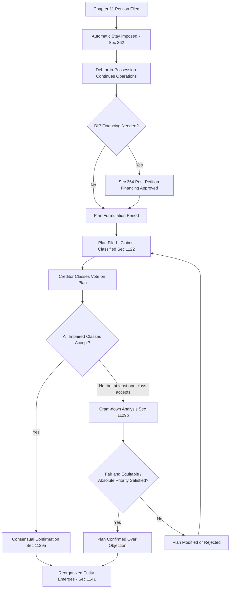

## Corporate Bankruptcy and the Reorganization Process

### Overview

Corporate bankruptcy law addresses the economic problem of financial distress: what happens when a firm's assets are insufficient to satisfy all of its contractual claims. Law and Economics analysis treats bankruptcy not merely as a procedural mechanism but as a substitute for—and complement to—the incomplete contracting that debtors and creditors could not fully negotiate ex ante. Chapter 11 of the U.S. Bankruptcy Code, the primary reorganization vehicle, is best understood as a collective-action solution to a coordination problem among dispersed creditors.

### The Economic Function of Bankruptcy Law

#### The Common Pool Problem

Thomas Jackson's foundational "creditors' bargain" theory (*The Logic and Limits of Bankruptcy Law*, 1986) frames bankruptcy law as the answer to a multi-creditor common pool problem. Outside of bankruptcy, individual creditors have an incentive to race to collect against a distressed debtor's assets first (a "grab race"), even though collective forbearance and orderly liquidation or reorganization would maximize the aggregate pool available to all creditors. This is a classic collective action problem: each individual creditor rationally seizes assets to protect its own claim, but the sum of these individually rational actions destroys value—dismembering a going concern that might be worth more intact.

$$V_{\text{going concern}} > \sum_{i} V_{\text{piecemeal liquidation}, i}$$

Bankruptcy law imposes an automatic stay (11 U.S.C. § 362) that halts individual collection efforts the moment a petition is filed, converting the individual-collection game into a collective proceeding. Jackson's hypothetical bargain framework asks: what set of rules would creditors have agreed to ex ante, behind a veil of ignorance about which creditor they would become, to maximize the value of the collective enterprise? This "creditors' bargain" heuristic underlies the ex post efficiency rationale for mandatory collective bankruptcy proceedings rather than allowing debtors and creditors to freely contract around bankruptcy protections.

#### Going Concern Surplus and the Choice Between Liquidation and Reorganization

The central empirical and economic question in any bankruptcy is whether the debtor's assets are worth more (a) liquidated and sold piecemeal (Chapter 7), or (b) retained together and operated as a going concern, either under existing management or a restructured capital structure (Chapter 11). This going concern surplus—the excess of a firm's value in continued operation over its liquidation value—is the economic justification for reorganization procedures. Where no going concern surplus exists, reorganization is economically wasteful and delays an efficient liquidation, a concern central to debates over Chapter 11 "reform."

### The Absolute Priority Rule

#### Statement of the Rule

The absolute priority rule (APR), codified in 11 U.S.C. § 1129(b)(2), requires that a plan of reorganization cannot be confirmed over the objection of a dissenting class unless that class is paid in full before any junior class (including equity) receives or retains any value. The priority ordering generally follows:

1. Secured creditors (up to collateral value)
2. Administrative and priority claims (11 U.S.C. § 507)
3. Unsecured creditors
4. Preferred equity
5. Common equity

#### Economic Rationale

The APR is generally justified on two grounds: (1) it replicates the priority ordering that creditors and shareholders bargained for ex ante in their financing contracts (respecting the absolute priority of debt over equity established at the time capital was raised), and (2) it prevents wealth transfers from senior to junior claimants that would otherwise occur through the bankruptcy process itself, which would raise the ex ante cost of capital by making debt claims less certain.

#### Deviations from Absolute Priority in Practice

Empirical bankruptcy scholarship (notably work by Lynn LoPucki, Lawrence Weiss, and Julian Franks and Walter Torous) has extensively documented that the APR is frequently violated in negotiated Chapter 11 plans: unsecured creditors and even equity holders often receive distributions notwithstanding senior creditors not being paid in full. This occurs because:

- **Bargaining leverage and delay costs**: senior creditors may accept a deviation to avoid the cost and delay of litigating confirmation, particularly the risk of an extended, expensive cram-down fight.
- **New value exception** (contested doctrinally): pre-*Bank of America v. 203 North LaSalle Street Partnership* (1999) case law in some circuits permitted old equity to retain an interest by contributing "new value" to the reorganized entity, without this violating the APR because the retained interest was purchased rather than gratuitously preserved. *LaSalle* significantly narrowed this exception by requiring any such opportunity be subject to a market test (competing bids), though it did not foreclose the doctrine entirely.
- **Junior class cooperation value**: junior stakeholders (particularly incumbent management/equity) often possess informational advantages or operational continuity value that senior creditors are willing to pay for via a negotiated deviation.

[Inference] The precise frequency and magnitude of APR deviations documented in empirical studies vary by sample period and industry, and post-2005 BAPCPA amendments (shortening the debtor's exclusivity period) may have altered bargaining dynamics relative to earlier studies.

### The Chapter 11 Process

#### Automatic Stay and Debtor-in-Possession Financing

Upon filing, the automatic stay under § 362 halts virtually all collection and enforcement actions against the debtor and its property. The debtor typically continues to operate as a "debtor-in-possession" (DIP) under § 1107-1108, retaining management control absent cause for appointment of a trustee. Post-petition financing (DIP financing) is often necessary to fund continued operations, and § 364 permits the debtor to obtain such financing with priority status (including, in some cases, priming liens senior to existing secured creditors), subject to court approval and adequate protection of existing lienholders' interests.

#### Plan Formulation and Voting

The debtor generally has an exclusivity period (initially 120 days, extendable, capped at 18 months post-BAPCPA) during which only the debtor may file a reorganization plan. The plan classifies claims and interests into classes (§ 1122) based on similarity of legal rights, and each impaired class votes on the plan. Confirmation requires either:

- **Consensual confirmation** (§ 1129(a)): every impaired class accepts the plan (acceptance requires both a majority in number and two-thirds in amount of voting claims within the class), or
- **Cram-down** (§ 1129(b)): if at least one impaired class accepts, the plan may be confirmed over the objection of dissenting classes provided it does not "discriminate unfairly" and is "fair and equitable" as to each dissenting class—the latter requirement incorporating the absolute priority rule for that class.

#### Valuation Disputes

Because confirmation and priority determinations turn on the value of the reorganized enterprise (particularly under cram-down), valuation litigation is central to Chapter 11 practice. Competing valuation methodologies—discounted cash flow (DCF), comparable company multiples, and precedent transaction analysis—frequently produce widely divergent estimates, and courts must resolve battles of dueling financial experts. This valuation uncertainty is itself a source of bargaining leverage that can drive negotiated (non-APR-compliant) settlements, since parties may prefer a negotiated split to the risk and expense of a contested valuation trial.

### Secured Creditor Priority and Adequate Protection

Secured creditors retain their lien priority in bankruptcy but are subject to the automatic stay, which can be lifted under § 362(d) for "cause," including lack of adequate protection of the creditor's interest in collateral (§ 361)—typically periodic cash payments or replacement liens compensating for any diminution in collateral value during the case. The interaction between secured credit theory (why firms use secured debt at all—monitoring cost reduction, per the work of Alan Schwartz and Robert Scott, versus signaling and screening theories) and its treatment in bankruptcy is a persistent subject of Law and Economics debate, since strong secured creditor priority in bankruptcy can undercut incentives for adequate ex ante monitoring by encouraging free-riding by junior, unsecured creditors.

### Fraudulent Conveyance and Preference Law

#### Preferential Transfers

Section 547 permits the trustee (or DIP) to avoid ("claw back") transfers made to creditors within 90 days before filing (one year for insiders) that enable the recipient creditor to receive more than it would have received in a hypothetical Chapter 7 liquidation. The economic rationale mirrors the common pool logic underlying the automatic stay: preference law discourages the same "race to the courthouse" dynamic in the pre-petition period, since without it, informed creditors would have strong incentives to extract last-minute payments from a distressed debtor at the expense of the collective estate.

#### Fraudulent Transfers

Section 548 allows avoidance of transfers made with actual intent to hinder, delay, or defraud creditors, or (more commonly litigated) transfers made for less than "reasonably equivalent value" while the debtor was insolvent or became insolvent as a result (constructive fraudulent transfer). This provision has become central to leveraged buyout (LBO) litigation, where selling shareholders in an LBO can be targeted to recover consideration paid if the LBO rendered the company insolvent and the price paid to shareholders is characterized as not supported by reasonably equivalent value flowing back to the company.

### Priority of Claims and the "Fresh Start" Policy for Corporate Debtors

Unlike individual bankruptcy (where the "fresh start" policy of discharge from personal liability is central), corporate reorganization does not discharge a natural person's future earnings—rather, the "fresh start" for a corporate debtor consists of emerging from Chapter 11 with a court-confirmed capital structure freed of most pre-petition claims (§ 1141(d)), continuing operations as a going concern under new (or renegotiated) ownership and debt terms.

### Comparative Perspective: Chapter 7 Liquidation vs. Chapter 11 Reorganization

| Dimension | Chapter 7 Liquidation | Chapter 11 Reorganization |
| --- | --- | --- |
| Trustee | Independent trustee appointed, liquidates assets | Debtor-in-possession typically retains control |
| Objective | Orderly asset sale, pro rata distribution | Continuation of business as going concern |
| Priority scheme | Strict statutory priority (§ 726) | Absolute priority rule, subject to negotiated deviation |
| Timeline | Relatively fast | Can extend months to years |
| Use case | No going concern surplus; small/simple estates | Going concern surplus exists; complex capital structures |

### Alternative and Emerging Restructuring Mechanisms

#### Prepackaged and Prenegotiated Bankruptcies

To reduce the cost and delay of contested Chapter 11 proceedings, debtors increasingly negotiate a reorganization plan with key creditor constituencies *before* filing (prepackaged) or substantially before filing with an agreed term sheet (prenegotiated), then use the formal Chapter 11 process primarily to bind dissenting minority creditors and implement the plan under judicial cram-down protection. This reduces the "common pool" collective action costs described above by resolving the coordination problem contractually ex ante, using the bankruptcy forum only for its binding, cram-down function.

#### Section 363 Sales

Rather than confirming a reorganization plan, a debtor may sell substantially all assets under § 363(b) as a going concern to a purchaser (often a "stalking horse" bidder subject to a competitive auction process), distributing sale proceeds according to priority. This mechanism, prominently used in large Chapter 11 cases (e.g., the 2009 Chrysler and General Motors bankruptcies), has drawn Law and Economics criticism for potentially circumventing the procedural protections (voting, absolute priority litigation rights) of a traditional plan confirmation process—a concern raised by scholars including LoPucki regarding "forum shopping" and speed-driven sales that may undervalue the estate.

[Speculation] Whether § 363 sales systematically produce lower recoveries than negotiated plans, versus reflecting efficient responses to time-sensitive going-concern value decay, remains empirically contested and is sensitive to case selection effects (distressed sales may be more common precisely where delay-related value destruction is most severe).

### Diagram: Chapter 11 Process Flow

### Worked Example: Absolute Priority and Cram-Down

**Scenario**: A debtor's reorganized enterprise is valued at $100 million. Claims consist of: $60 million secured debt, $50 million unsecured debt, and existing equity. The plan proposes: secured creditors receive $60 million in new secured notes (paid in full), unsecured creditors receive $35 million in new equity and debt (a 70% recovery), and old equity receives 5% of new equity (worth $5 million) despite unsecured creditors not being paid in full.

**Analysis**: If the unsecured creditor class rejects the plan, cram-down under § 1129(b) requires the plan be "fair and equitable" as to that dissenting class. Because old equity (junior to unsecured creditors) is retaining value ($5 million) while the senior unsecured class is not paid in full ($35 million of $50 million, i.e., 70 cents on the dollar), this plan violates the absolute priority rule on its face and cannot be crammed down over the unsecured class's objection—unless old equity can invoke a new-value-type contribution, subject to the market-test requirement following *LaSalle*, or unless the unsecured class is persuaded to accept the plan consensually (converting the analysis from cram-down to consensual confirmation, where APR is not a confirmation requirement).

### Key Points

- Bankruptcy law solves a multi-creditor common pool/collective action problem; Jackson's "creditors' bargain" theory frames mandatory collective procedures as what rational creditors would agree to ex ante.
- The choice between Chapter 7 liquidation and Chapter 11 reorganization economically turns on whether a going concern surplus exists.
- The absolute priority rule requires full payment of senior classes before junior classes receive value under cram-down, but empirical scholarship documents frequent negotiated deviations from strict APR in confirmed plans.
- The automatic stay and preference/fraudulent transfer avoidance provisions (§§ 362, 547, 548) share a common economic logic: preventing value-destructive individual creditor races, both pre- and post-petition.
- Valuation disputes are central to Chapter 11 litigation because confirmation, cram-down eligibility, and distribution amounts all depend on contested enterprise valuation.
- Prepackaged bankruptcies and § 363 asset sales represent market-driven adaptations that reduce collective action costs and delay relative to traditional contested plan confirmation, though § 363 sales raise separate concerns about circumventing procedural creditor protections.

### Related Topics

- Secured credit theory: monitoring cost reduction vs. signaling/screening rationales for security interests
- Fraudulent transfer litigation in leveraged buyouts (LBOs)
- Cross-border and international insolvency coordination (UNCITRAL Model Law, Chapter 15)
- Sovereign debt restructuring and the absence of a sovereign bankruptcy regime
- Efficient capital markets hypothesis and pricing of distressed debt securities (chapter continuity)
- Law and economics of secured transactions under UCC Article 9
- Debtor-in-possession financing terms and creditor control rights ("loan-to-own" strategies)
- Corporate governance during financial distress: fiduciary duty shifts toward creditors (*Credit Lyonnais* doctrine)