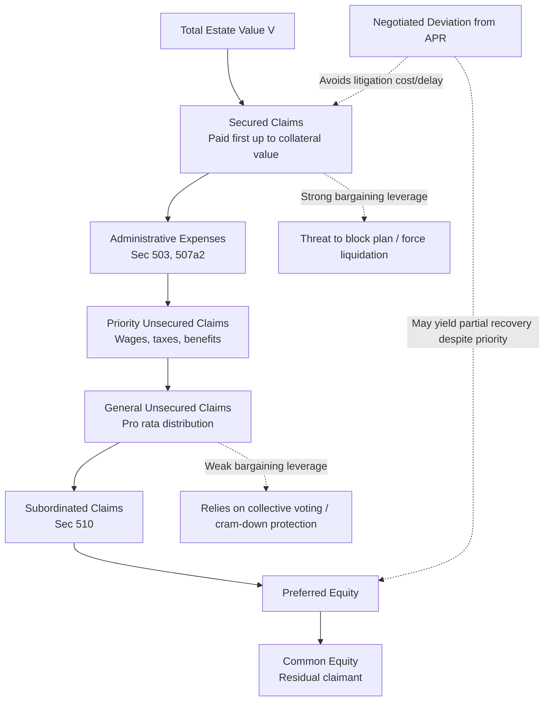

## Priority Rules and Creditor Bargaining in Bankruptcy

### Overview

Priority rules determine the order in which claimants are paid from a debtor's limited assets, and they are the single most consequential structural feature of bankruptcy law for understanding creditor behavior—both inside and outside of formal proceedings. Because priority is the currency of bargaining leverage in bankruptcy, the design of priority rules shapes ex ante lending decisions, ex post negotiation dynamics, and the distribution of value among heterogeneous claimants. This topic extends the absolute priority rule (APR) analysis into a broader treatment of the priority ladder, deviations from strict priority, and the theoretical debates over whether priority rules should track ex ante bargains or be reordered by policy considerations.

### The Statutory Priority Ladder

#### General Ordering Under the Bankruptcy Code

The Bankruptcy Code establishes a hierarchical distribution scheme, applicable in both liquidation (Chapter 7, § 726) and as an input into reorganization cram-down analysis (Chapter 11, § 1129(b)):

1. **Secured claims** — paid first from the value of their specific collateral (§ 506), up to the collateral's value; any shortfall becomes an unsecured deficiency claim
2. **Administrative expenses** — costs of administering the estate, including post-petition trade credit and professional fees (§ 503, § 507(a)(2))
3. **Priority unsecured claims** — a statutorily ranked subset including certain wage claims, employee benefit contributions, and specified tax claims (§ 507(a)(3)-(a)(8))
4. **General unsecured claims** — trade creditors, unsecured lenders, tort claimants, deficiency claims of undersecured creditors — paid pro rata from remaining assets
5. **Subordinated claims** — claims contractually or equitably subordinated (§ 510), including certain claims arising from securities fraud or insider misconduct
6. **Preferred equity**
7. **Common equity** — residual claimants, paid only if a surplus remains after all senior classes are satisfied

$$\text{Recovery}_i = \min\left(\text{Claim}_i, \max\left(0, V - \sum_{j < i} \text{Claim}_j\right)\right)$$

where $V$ is total estate value and classes are indexed $j < i$ in order of seniority to class $i$—illustrating the "waterfall" structure in which junior classes recover only the residual after all senior classes are paid in full.

### Theoretical Justifications for Priority

#### Ex Ante Bargain Theory

The dominant Law and Economics justification (Jackson and Thomas H. Jackson; also Douglas Baird) holds that priority in bankruptcy should track the priority that parties would have or did bargain for outside of bankruptcy. Secured credit is itself a voluntary priority arrangement: a lender extends credit at a lower interest rate in exchange for a senior claim on specific collateral, reflecting compensation for reduced risk. Respecting this ex ante bargain in bankruptcy is efficient because:

- It preserves the incentive value of secured lending as a monitoring and risk-allocation device (Alan Schwartz's signaling/screening theory of secured debt; alternatively, monitoring-cost-reduction theories).
- Reordering priority ex post (i.e., after the parties have already priced their claims based on anticipated priority) constitutes a wealth transfer that, if anticipated, raises the ex ante cost of secured credit for all future borrowers—undermining the very credit markets bankruptcy law depends upon functioning well outside of distress.

#### Involuntary Creditors and the Limits of the Bargain Theory

A significant critique, most associated with Lucian Bebchuk and Jesse Fried (*The Uneasy Case for the Priority of Secured Claims in Bankruptcy*, 1996), argues that the ex ante bargain theory breaks down for involuntary creditors—tort victims, environmental claimants, and certain regulatory claimants—who never had the opportunity to price or negotiate for priority ex ante. Secured creditors can contract for priority and adjust their price (interest rate) accordingly; tort victims cannot renegotiate the "price" of their potential future claim before an injury occurs. Bebchuk and Fried argue this asymmetry justifies limiting secured creditor priority (e.g., through a fixed-fraction limitation preserving a portion of collateral value for unsecured/involuntary creditors), a position that has generated substantial academic debate but has not been adopted into the Bankruptcy Code.

[Inference] The magnitude of externalization of risk onto involuntary creditors via secured credit's priority is difficult to measure empirically and depends on unobservable counterfactuals (how would secured lending markets adjust if priority were curtailed), which is why this remains a largely theoretical rather than empirically resolved debate.

#### Monitoring and Screening Theories of Secured Debt

Separate from the priority-justification debate, Law and Economics scholarship offers several complementary theories of why secured debt exists at all:

- **Reduced monitoring costs**: a senior secured lender can rely on its collateral position and need not monitor the debtor's overall creditworthiness as intensively as an unsecured lender, reducing duplicative monitoring costs across the creditor pool (a public-good/free-rider-reduction rationale).
- **Signaling and screening**: offering collateral signals borrower quality (a low-risk borrower is more willing to pledge collateral, since it expects a lower probability of default and hence a lower probability of losing the pledged asset) or is used by lenders to screen borrower types.
- **Reducing asset substitution / agency costs**: secured debt, by tying a lender's claim to specific assets, reduces the debtor's incentive to shift into riskier assets post-borrowing (a classic Jensen-Meckling agency cost of debt), since doing so would directly threaten the lender's specific collateral.

### Creditor Bargaining Dynamics

#### Bargaining in the "Shadow" of Priority Rules

The Coasean insight that legal entitlements shape bargaining outcomes even when parties negotiate around them applies directly to bankruptcy: priority rules function as default entitlements that determine each party's bargaining leverage (its "threat point" or reservation value) in negotiating a consensual reorganization plan. A senior secured creditor's threat point is strong—it can credibly threaten to block a plan or force liquidation, since it would be paid first regardless. A general unsecured creditor's threat point is comparatively weak.

This creates the persistent empirical phenomenon (documented by LoPucki, Weiss, Franks and Torous, and others; see the prior discussion of Chapter 11) of **negotiated deviations from absolute priority**: senior creditors rationally accept less than their statutorily mandated priority position in exchange for avoiding the cost, delay, and residual risk of forcing a cram-down fight through litigation. The bargaining surplus from avoiding costly litigation is split between classes in a manner that departs from strict priority but may be jointly value-maximizing for the negotiating parties (though potentially at the expense of classes excluded from the negotiation, or through delay costs imposed on the estate generally).

#### Holdout Problems and the Role of Voting Rules

Priority rules interact with the Code's voting and cram-down mechanics (§ 1126, § 1129(b)) to solve a distinct bargaining problem: individual holdout creditors within a class who might otherwise refuse to accept a value-maximizing collective restructuring in hopes of extracting a larger individual side payment. By binding dissenting minority creditors within an accepting class (majority-in-number/two-thirds-in-amount voting thresholds) and providing a cram-down mechanism to bind entire dissenting classes (subject to the fair-and-equitable/APR requirement), the Code reduces individual and class-level holdout leverage that would otherwise obstruct efficient restructurings—directly mirroring the logic of Mancur Olson's collective action theory applied to creditor coordination.

#### Priority and Renegotiation-Proofness

A further consideration in creditor bargaining is renegotiation-proofness: priority rules that can be too easily circumvented through side deals (e.g., senior lenders informally agreeing to subordinate themselves in exchange for undisclosed side payments) create incentive problems and reduce the reliability of the ex ante bargain that priority rules are meant to protect. This is part of the justification for judicial scrutiny of plan negotiations and the statutory requirement (§ 1129(a)(3)) that a plan be "proposed in good faith and not by any means forbidden by law."

### Priority Disputes: Recharacterization and Equitable Subordination

#### Debt Recharacterization

Courts may recharacterize a nominally "secured debt" claim as equity if the economic substance of the transaction resembles an equity investment rather than a loan (factors include inadequate capitalization at inception, absence of a fixed maturity date or market interest rate, and the degree to which repayment is contingent on the success of the business)—a doctrine most consequential for insider or affiliate financing arrangements, where a controlling shareholder's "loan" to its own distressed company may in substance function as risk capital rather than debt.

#### Equitable Subordination

Section 510(c) permits a bankruptcy court to subordinate a claim (or a portion of it) to other claims where the claimant has engaged in inequitable conduct that resulted in injury to other creditors or conferred an unfair advantage on the claimant—commonly applied against insider lenders who exercised excessive control over the debtor or engaged in self-dealing. This doctrine functions as a judicial check against priority rules being strategically exploited by insiders who could otherwise use formal secured-lender status to extract value at the expense of arm's-length creditors.

### Comparative Note: Priority Rules Across Reorganization Regimes

| Jurisdiction/Regime | Priority Approach |
| --- | --- |
| U.S. Chapter 11 | Absolute priority rule with negotiated/cram-down deviations |
| UK Administration/CVA | More flexible, creditor-committee-driven, less rigid statutory priority enforcement |
| EU Restructuring Directive (2019) | Introduces cross-class cram-down with a "relative priority" option alongside absolute priority, permitting member states some flexibility |

[Unverified] The precise implementation details of relative priority rules across individual EU member state transpositions of the Restructuring Directive vary and should be confirmed against current national legislation, as transposition has proceeded unevenly since the Directive's 2019 adoption.

### Diagram: Priority Waterfall and Bargaining Leverage

### Worked Example: Bargaining Leverage Under Different Priority Positions

**Scenario**: Estate value = $80 million. Claims: $50 million secured (Creditor A), $40 million unsecured (Creditor Class B), and existing equity (Class C).

**Strict priority outcome**: A recovers $50 million in full; B recovers the remaining $30 million (75 cents on the dollar); C recovers $0.

**Negotiated outcome reflecting bargaining leverage**: Suppose litigating a contested cram-down would cost the estate $5 million in professional fees and delay-related value erosion, reducing the estate to $75 million if litigated. Creditor A, holding strong leverage (it would be paid in full either way), may accept a modest concession—say, $48 million instead of $50 million—in exchange for Class B's consent to a swift consensual plan, allowing B to recover $32 million (in excess of its strict-priority pro rata share) and allowing C to retain a small equity stake (say, $2 million in reorganized equity) to secure management's cooperation and continuity value. This outcome deviates from absolute priority (C receives value while B is not paid in full) but may be jointly preferred by A, B, and C's negotiating representatives relative to the litigated alternative—illustrating how priority rules function as bargaining chips rather than mechanically executed distribution formulas in most real-world Chapter 11 cases.

### Key Points

- The statutory priority ladder (secured, administrative, priority unsecured, general unsecured, subordinated, preferred equity, common equity) establishes the default distribution waterfall and the baseline bargaining leverage of each class.
- The ex ante bargain theory (Jackson, Baird) justifies respecting contractually established priority (particularly secured credit) as efficient; the Bebchuk-Fried critique highlights the theory's limits for involuntary, non-bargaining creditors like tort victims.
- Priority rules function as legal entitlements that shape bargaining leverage even when parties negotiate around strict priority—explaining the empirically documented prevalence of negotiated APR deviations.
- Cram-down and class voting mechanics solve creditor holdout problems, binding dissenting minorities and (with fair-and-equitable/APR constraints) entire dissenting classes.
- Recharacterization and equitable subordination doctrines act as judicial checks on strategic exploitation of formal priority status, particularly by insider lenders.
- Comparative regimes (EU Restructuring Directive's relative priority option) illustrate that strict absolute priority is a policy choice, not a logical necessity, of reorganization design.

### Related Topics

- Corporate bankruptcy and the reorganization process (chapter continuity: Chapter 11 mechanics and cram-down procedure)
- Secured transactions law and UCC Article 9 perfection/priority rules
- Bebchuk-Fried critique of secured creditor priority and involuntary creditor protection
- Debtor-in-possession financing and priming liens under Section 364
- Equitable subordination doctrine and insider lending scrutiny
- Comparative insolvency law: relative priority under the EU Restructuring Directive
- Tort claimant priority and mass tort bankruptcy (asbestos trusts, Texas Two-Step restructurings)
- Fraudulent conveyance law and priority-adjacent avoidance actions