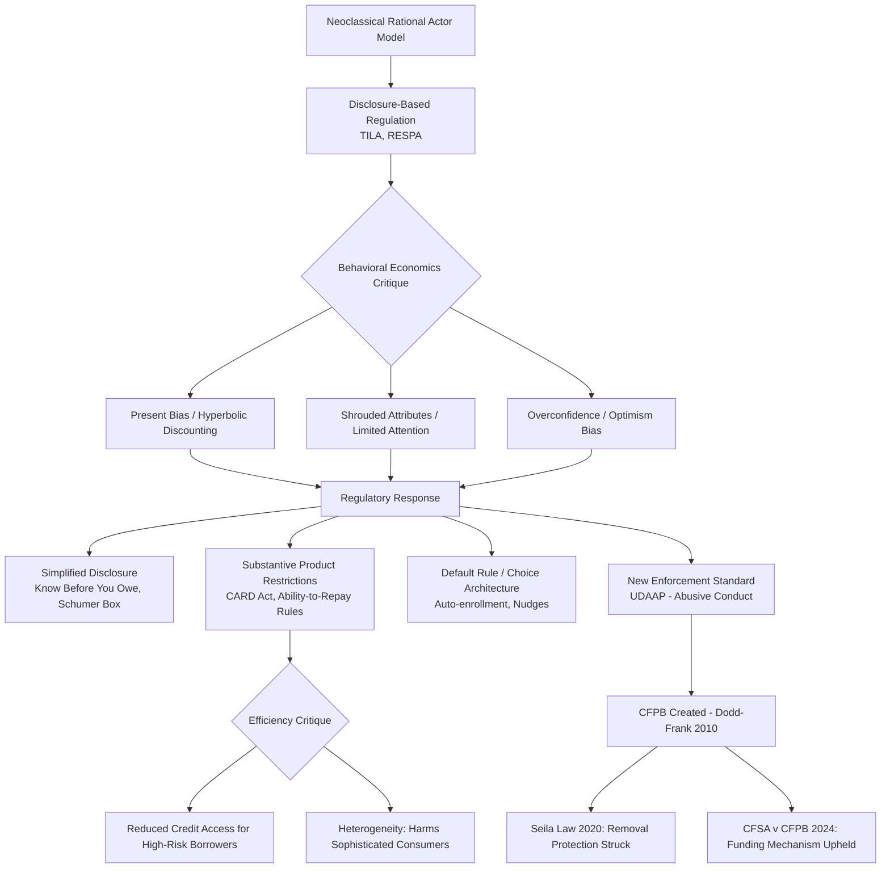

## Consumer Financial Protection and Behavioral Regulation

### Overview

Consumer financial protection regulation addresses market failures in retail financial markets that arise from information asymmetries, cognitive limitations, and behavioral biases affecting individual borrowers and investors—failures that traditional neoclassical Law and Economics analysis, premised on rational actor models, is poorly equipped to fully explain or remedy. This topic surveys the shift from a purely disclosure-based regulatory paradigm toward "behaviorally informed" regulation, exemplified institutionally by the creation of the Consumer Financial Protection Bureau (CFPB) under the Dodd-Frank Act, and examines the competing efficiency and paternalism critiques of this regulatory approach.

### From Rational Choice to Behavioral Foundations

#### The Limits of the Disclosure Paradigm

Traditional consumer financial regulation (Truth in Lending Act (TILA), 1968; Truth in Savings Act) followed the neoclassical disclosure model: mandate standardized disclosure of terms (annual percentage rate (APR), finance charges) on the theory that informed, rational consumers will use disclosed information to select optimal products and that competitive market pressure will discipline sellers of inferior or overpriced products. This model assumes consumers process disclosed information correctly and act in their own long-run interest.

#### Behavioral Economics Critiques

Behavioral economics, drawing on Kahneman and Tversky's prospect theory and heuristics-and-biases research, identifies systematic departures from rational choice that undermine the disclosure paradigm's premises:

- **Present bias / hyperbolic discounting** (Laibson, O'Donoghue and Rabin): consumers systematically overweight present costs and benefits relative to future ones, leading to underestimation of the true cost of revolving credit, underuse of retirement savings vehicles, and susceptibility to short-term "teaser rate" products that impose larger costs later.
- **Overconfidence and optimism bias**: consumers systematically underestimate their probability of incurring late fees, overdrafts, or default, leading to under-appreciation of contingent contract terms (e.g., penalty interest rate triggers, overdraft fees).
- **Limited attention and salience effects** (Gabaix and Laibson's "shrouded attributes" model, 2006): sellers have an incentive to make base prices salient while shrouding contingent or add-on fees (late fees, overdraft charges, penalty rates) that unsophisticated consumers systematically underweight, allowing firms operating in competitive markets to still profit from exploiting inattentive consumers even under price competition on the salient attribute.
- **Framing effects and default rules**: how information or choices are framed or defaulted materially affects consumer decisions independent of the substantive economics involved (Thaler and Sunstein's "libertarian paternalism" and "nudge" framework).

$$U_{\text{perceived}} = u(x_0) + \sum_{t=1}^{T} \beta \delta^t u(x_t)$$

The quasi-hyperbolic discounting model (Laibson), where $\beta < 1$ introduces a discrete present-bias parameter distinct from the standard exponential discount factor $\delta$, formalizes how consumers disproportionately discount future costs relative to a fully rational exponential discounter ($\beta = 1$).

### Institutional Response: The Consumer Financial Protection Bureau

#### Statutory Design and Mandate

The Dodd-Frank Wall Street Reform and Consumer Protection Act (2010) created the CFPB as an independent bureau (originally housed within the Federal Reserve System) with consolidated rulemaking, supervisory, and enforcement authority over consumer financial products previously scattered across multiple federal regulators (the Federal Reserve, FDIC, OCC, FTC, and others). Its mandate under 12 U.S.C. § 5511 includes ensuring that consumers have "timely and understandable information" and are protected from "unfair, deceptive, or abusive acts or practices" (UDAAP authority)—the addition of "abusive" to the traditional "unfair or deceptive" (UDAP) standard being a novel statutory innovation intended to capture behaviorally exploitative conduct not clearly covered by traditional fraud or deception doctrine.

#### The "Abusive" Standard

Under § 1031(d) of Dodd-Frank, an act or practice is abusive if it (1) materially interferes with a consumer's ability to understand a term or condition, or (2) takes unreasonable advantage of a consumer's lack of understanding, inability to protect their interests, or reasonable reliance on the covered entity to act in the consumer's interest. This standard is explicitly designed to reach conduct that exploits behavioral biases and information asymmetries even absent traditional fraud, misrepresentation, or contractual unfairness—a direct legislative embrace of behavioral economics' critique of pure disclosure regulation.

[Inference] The precise contours of "abusive" conduct remain doctrinally underdeveloped relative to longer-established unfair/deceptive standards, since it is a comparatively recent statutory category with a smaller body of adjudicated precedent, and its scope has been the subject of ongoing litigation and shifting agency guidance across different presidential administrations.

#### Constitutional Challenges to CFPB Structure

The CFPB's institutional design—a single director removable only for cause, funded outside the normal congressional appropriations process (through Federal Reserve earnings)—generated significant constitutional litigation. In ***Seila Law LLC v. CFPB*** (2020), the Supreme Court held the for-cause removal restriction on the single director unconstitutional as a violation of separation of powers, while severing that provision and leaving the agency's other authority intact (rather than invalidating the agency as a whole). In ***CFPB v. Community Financial Services Association of America*** (2024), the Court upheld the agency's unusual funding mechanism (draws from the Federal Reserve rather than annual congressional appropriations) against an Appropriations Clause challenge.

### Regulatory Tools Informed by Behavioral Insights

#### Simplified and Standardized Disclosure

Recognizing that disclosure alone fails when consumers cannot process complex information, behaviorally informed regulation emphasizes simplified, standardized disclosure formats designed to be more cognitively accessible—exemplified by the CFPB's "Know Before You Owe" integrated mortgage disclosure forms (combining and simplifying prior TILA and RESPA disclosures) and simplified credit card disclosure ("Schumer box") requirements under the CARD Act of 2009.

#### Ex Ante Product Regulation (Beyond Disclosure)

Where disclosure is judged insufficient to correct behavioral biases, some regulation moves toward direct substantive product restrictions:

- The **CARD Act (2009)** restricted retroactive interest rate increases on existing balances, required 21-day advance notice before payment due dates, and limited fees for exceeding credit limits—substantive terms restrictions rather than pure disclosure mandates, reflecting a judgment that disclosure of these terms was insufficient to prevent consumer harm.
- **Ability-to-repay/qualified mortgage rules** (Dodd-Frank § 1411, implemented via CFPB regulation) require mortgage lenders to make a reasonable, good-faith determination that a borrower has the ability to repay the loan, directly restricting the availability of certain loan products (e.g., no-documentation "liar loans," negative-amortization loans) associated with the 2008 financial crisis, rather than relying solely on disclosure of these products' risks.
- **Payday lending rules**: the CFPB's payday lending rulemaking (subject to significant regulatory back-and-forth across administrations) attempted to impose ability-to-repay requirements on short-term, high-cost credit products, reflecting a behavioral judgment that disclosure of the effective APR (often exceeding 300% annualized) is insufficient to prevent behaviorally biased borrowers from entering debt cycles via loan rollovers.

#### Default Rules and Choice Architecture

Following Thaler and Sunstein's "nudge" framework, some regulatory interventions use default rule design rather than mandates or bans—for example, automatic enrollment (with opt-out rather than opt-out) in employer retirement savings plans, which behavioral research shows dramatically increases participation rates relative to opt-in defaults, without restricting any consumer's ultimate choice.

### The Paternalism and Cost Critique

#### Efficiency Costs of Behaviorally Motivated Regulation

Critics (including Todd Zywicki and other law-and-economics scholars associated with more market-oriented positions) argue that behaviorally informed regulation risks:

- **Reducing credit access for the population it purports to protect**: substantive restrictions on loan terms (e.g., payday lending rate caps or ability-to-repay mandates) may simply eliminate credit access for higher-risk borrowers who rationally value access to expensive credit as a liquidity option superior to the unavailability of credit altogether, rather than reflecting irrational borrowing.
- **Heterogeneity problem**: behavioral biases are not universal; regulations calibrated to protect the most bias-prone consumers may impose welfare losses on the (possibly substantial) fraction of sophisticated, rational consumers who would otherwise benefit from products or terms now restricted or banned.
- **Regulator behavioral bias and public choice concerns**: regulators themselves are subject to cognitive biases and political economy pressures (regulatory capture in reverse—consumer advocacy group influence, or bureaucratic mission-creep incentives to expand jurisdiction), calling into question whether government behavioral intervention reliably improves on private market and individual decision-making, an argument paralleling public choice critiques of regulation generally.

#### The Libertarian Paternalism Defense

Proponents (Sunstein, Thaler, and CFPB-aligned scholars such as former director Richard Cordray's academic allies) respond that:

- Well-designed nudges (default rules) preserve freedom of choice while correcting for documented, replicated behavioral biases, avoiding the heterogeneity critique by not foreclosing any option for sophisticated consumers who opt out.
- Where market failures stem from firms' strategic exploitation of behavioral biases in a competitive market (the Gabaix-Laibson shrouded-attributes result), competition alone cannot correct the problem—firms that stopped shrouding fees would be competed away by firms that continue to shroud them, since unshrouding reveals the true (higher) total cost and drives away naive consumers who would otherwise be profitable; this is a structural market failure argument, not merely a paternalism argument, and applies even under fully rational-actor models on the seller side.

### Comparative and Empirical Evidence

#### The 2008 Financial Crisis as Behavioral Regulation Catalyst

The subprime mortgage crisis is frequently cited (Dodd-Frank's legislative history, and scholarship by economists including Christopher Mayer, Karen Pence, and Shane Sherlund) as evidence that disclosure-based regulation failed to prevent widespread issuance of complex mortgage products (adjustable-rate mortgages with low initial "teaser" rates, negative amortization, interest-only periods) whose true long-run cost was systematically underestimated by borrowers exhibiting present bias and limited financial literacy, and whose risk was underpriced by originators exploiting an originate-to-distribute securitization model that separated origination incentives from long-run credit risk-bearing.

#### Empirical Financial Literacy Research

Annamaria Lusardi and Olivia Mitchell's extensive financial literacy survey research documents persistently low levels of basic financial numeracy (understanding of compound interest, inflation, and risk diversification) across broad segments of the population, providing an empirical foundation for the behavioral regulation paradigm's premise that a meaningful share of consumers cannot be assumed to process standard financial disclosures as sophisticated rational actors.

[Speculation] The causal relationship between measured financial literacy deficits and actual welfare-reducing financial decisions (as opposed to correlation with other factors like income constraints or intentional trade-offs) is contested in the empirical literature, and financial literacy interventions (financial education programs) have shown mixed and often modest measured effects on subsequent financial behavior in randomized evaluations.

### Diagram: From Rational Choice to Behaviorally Informed Regulatory Design

### Worked Example: Shrouded Attributes and Overdraft Fees

**Scenario**: A bank offers "free checking" with no monthly fee but charges a $35 overdraft fee triggered whenever an account balance goes negative, and enrolls consumers by default in overdraft "protection" (allowing transactions to complete despite insufficient funds, rather than declining them) unless the consumer affirmatively opts out.

**Behavioral analysis**: Under the Gabaix-Laibson model, the salient price (zero monthly fee) attracts naive consumers who underestimate their probability of overdrafting (optimism bias) and may not fully process the contingent fee structure. Sophisticated consumers who accurately predict their overdraft probability can avoid the fee entirely (by opting out of overdraft coverage or by careful account monitoring), meaning the shrouded fee functions as a mechanism by which the bank profits disproportionately from naive consumers, while sophisticated consumers free-ride on the "free" checking account. Because a bank that unilaterally stopped charging overdraft fees would need to raise its salient monthly fee (losing naive customers to the still-shrouding, salient-competing next best offering, since naive consumers do not perceive their own overdraft risk), competition does not eliminate this equilibrium—consistent with the model's prediction that shrouding can survive even under Bertrand-style price competition.

**Regulatory response**: The Federal Reserve's Regulation E amendment (2010) requires affirmative consumer opt-in for overdraft coverage on ATM and one-time debit transactions (reversing the prior default), directly using default-rule reform (a nudge) rather than a substantive fee ban, reflecting the behaviorally informed regulatory design philosophy discussed above.

### Key Points

- Behavioral economics (present bias, shrouded attributes, overconfidence) undermines the neoclassical assumption underlying pure disclosure-based consumer financial regulation.
- The CFPB's UDAAP "abusive" standard is a direct statutory embrace of behavioral economics, reaching conduct that exploits cognitive biases even absent traditional fraud or deception.
- Regulatory tools have evolved along a spectrum from simplified disclosure, to substantive product restrictions (CARD Act, ability-to-repay rules), to default-rule "nudges" (auto-enrollment, opt-in overdraft coverage).
- The Gabaix-Laibson shrouded-attributes model shows that competitive markets can sustain exploitative pricing structures even without market power, since unshrouding fees drives away profitable naive consumers—a structural justification for regulation beyond simple market-power or fraud rationales.
- Critics raise credit-access and consumer-heterogeneity concerns: substantive restrictions calibrated to protect biased consumers may reduce welfare for rational consumers who valued the restricted products.
- CFPB institutional design has faced significant constitutional scrutiny (*Seila Law*, *CFSA v. CFPB*), reflecting broader separation-of-powers tensions around independent agency design.

### Related Topics

- Efficient capital markets hypothesis and securities regulation (chapter continuity: rational actor assumptions in market-level vs. individual-level contexts)
- Nudge theory and libertarian paternalism (Thaler and Sunstein) in regulatory design generally
- Payday lending regulation and state usury law interaction with federal preemption
- Ability-to-repay and qualified mortgage rules post-2008 financial crisis
- Public choice theory and regulatory capture applied to independent agency design
- Financial literacy research and randomized evaluation of financial education interventions
- Separation of powers doctrine and independent agency removal protections (*Seila Law*, *Humphrey's Executor* line of cases)
- Retirement savings default rules and automatic enrollment policy (ERISA-adjacent behavioral regulation)