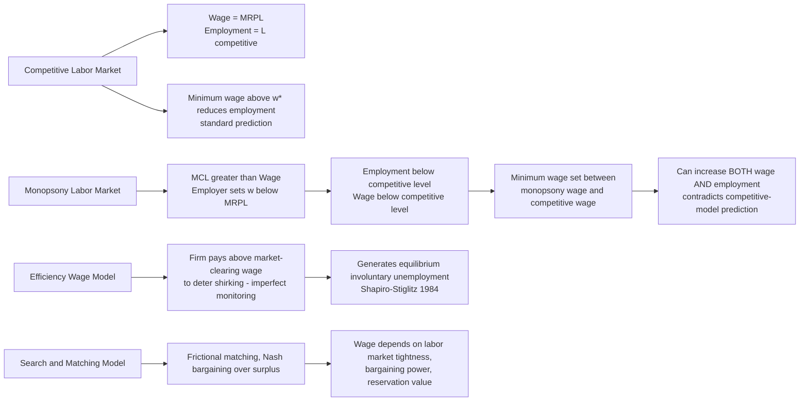

## Economic Theory of Labor Markets and Wage Determination

### Overview

The economic theory of labor markets provides the analytical foundation for the Law and Economics treatment of employment regulation, examining how wages and employment levels are determined, why labor markets may depart from the competitive textbook model, and how these departures justify or undermine specific legal interventions (minimum wage laws, collective bargaining rights, anti-discrimination statutes, and employment-at-will doctrine). This topic surveys the competitive model, its principal departures (monopsony, efficiency wages, search frictions, human capital theory), and their doctrinal implications.

### The Competitive Labor Market Model

#### Basic Supply and Demand Framework

In the textbook competitive model, labor demand derives from firms' profit-maximizing hiring decisions: a firm hires labor up to the point where the marginal revenue product of labor (MRPL) equals the wage rate.

$$MRPL = MPL \times MR = w$$

where $MPL$ is the marginal physical product of labor and $MR$ is marginal revenue from output. Labor supply reflects individual workers' trade-off between labor and leisure, with the labor supply curve typically upward-sloping in wages (subject to a potential backward-bending segment at high wage levels due to the income effect dominating the substitution effect). Market equilibrium wage $w^*$ and employment $L^*$ clear at the intersection of aggregate labor demand and supply.

#### Compensating Wage Differentials

Adam Smith's foundational insight, formalized by Sherwin Rosen (1986), holds that in competitive equilibrium, jobs with undesirable non-wage characteristics (danger, unpleasant conditions, irregular hours) must pay a compensating differential to attract workers, while jobs with desirable non-wage attributes (prestige, safety, flexibility) can pay less. This theory underlies the Law and Economics analysis of workplace safety regulation (OSHA) and workers' compensation systems: if compensating differentials fully and accurately price risk, mandatory safety regulation is redundant or even welfare-reducing (forcing safety expenditures that workers would not have chosen to pay for through reduced wages); if information asymmetries or worker misperception of risk prevent accurate pricing, mandatory regulation may correct an otherwise uncompensated externality-like harm.

#### Human Capital Theory

Gary Becker's human capital theory (*Human Capital*, 1964) models education, training, and experience as investments that increase a worker's future productivity and earnings, subject to standard investment logic (comparing the present value of increased future earnings against the direct and opportunity costs of training). This theory distinguishes:

- **General human capital**: skills valuable to many employers (general education); competitive labor market theory predicts workers, not firms, bear the cost of general training (since a trained worker can costlessly move to a competing employer, a firm investing in general training cannot recoup its investment through wage suppression).
- **Firm-specific human capital**: skills valuable primarily to the current employer; theory predicts costs and returns are shared between firm and worker (since neither party can costlessly redeploy the investment elsewhere, both have incentive to invest and both risk losing return if the relationship terminates)—directly relevant to the economic analysis of at-will employment, severance pay, and wrongful termination liability rules discussed in adjacent employment law topics.

$$w_t = MPL_t^{\text{base}} + \alpha \cdot HC_t$$

where accumulated human capital $HC_t$ raises marginal product and hence wages, with $\alpha$ reflecting the return to a unit of human capital.

### Departures from the Competitive Model

#### Monopsony in Labor Markets

Monopsony arises when a single employer (or a small number of employers, oligopsony) faces the entire (or a substantial share of the) labor supply curve for a given labor market, giving the employer wage-setting power analogous to a monopolist's price-setting power in product markets. Under monopsony, the firm's marginal cost of labor ($MCL$) exceeds the wage, because hiring an additional worker requires raising the wage paid to all inframarginal workers (assuming a single wage is paid to all workers of a given type):

$$MCL = w + L \frac{dw}{dL}$$

The monopsonist hires where $MCL = MRPL$, resulting in both lower employment and a lower wage than the competitive equilibrium. This theoretical result is central to modern Law and Economics debates over minimum wage policy: under monopsony (rather than perfect competition), a minimum wage set between the monopsony wage and the competitive wage can *increase* both employment and wages simultaneously—directly contradicting the standard competitive-model prediction that minimum wages above the market-clearing wage necessarily reduce employment.

Alan Manning's *Monopsony in Motion* (2003) and subsequent empirical labor economics research (David Card and Alan Krueger's earlier fast-food minimum wage studies, and more recent work by Arindrajit Dube, Ellora Derenoncourt, and others exploiting employer concentration measures) have substantially revived monopsony as an empirically relevant model for many local labor markets, particularly low-wage sectors with limited employer competition, though the degree of monopsony power varies significantly by industry, geography, and worker mobility.

[Inference] The magnitude and prevalence of monopsony power across the broader labor market (as opposed to specific documented cases in concentrated local labor markets) remains an actively contested empirical question, and results are sensitive to identification strategy (e.g., border discontinuity designs versus employer concentration indices).

#### Efficiency Wage Theory

Efficiency wage models (Carl Shapiro and Joseph Stiglitz's shirking model, 1984; George Akerlof's gift-exchange model, 1982) explain why firms may rationally pay wages above the market-clearing level even absent monopsony or union pressure. In the Shapiro-Stiglitz shirking model, because worker effort cannot be perfectly monitored, firms pay an "efficiency wage" premium above the competitive wage to raise the cost of job loss (a fired shirking worker cannot immediately find an equivalent-paying job), which induces effort by making detected shirking costly. This model has a striking equilibrium implication: it generates **involuntary unemployment** as an equilibrium feature (rather than a disequilibrium anomaly), since the market-clearing wage is not paid—the very fact that unemployment exists is what disciplines effort, because if the labor market cleared, terminated shirkers could immediately find equivalent employment, eliminating the disciplining threat.

$$w^* > w_{\text{competitive}} \text{, sustained by unemployment } u^* \text{ such that shirking is deterred}$$

#### Search and Matching Frictions

The Diamond-Mortensen-Pissarides (DMP) search-and-matching framework (2010 Nobel Prize) models labor markets as characterized by frictional matching between heterogeneous workers and jobs, rather than instantaneous market clearing. Search frictions generate equilibrium unemployment even in the absence of monopsony or efficiency wage considerations, and wages in this framework are typically determined by Nash bargaining between a matched worker and firm over the surplus created by the match (the difference between the value of the filled position to the firm and the value of continued search to both parties).

$$w = \beta \left(MRPL + \theta c\right) + (1-\beta) b$$

where $\beta$ is the worker's bargaining power, $\theta$ is labor market tightness (vacancies relative to unemployed searchers), $c$ is vacancy posting cost, and $b$ is the worker's reservation value (unemployment benefits or value of leisure/home production). This framework underlies contemporary analysis of unemployment insurance design (higher $b$ from generous UI raises equilibrium wages but may also raise equilibrium unemployment duration) and has become a standard tool in modern labor and macroeconomic policy analysis.

### Wage Determination Under Collective Bargaining

#### The Monopoly Union Model

The simplest union bargaining model treats the union as a monopoly seller of labor that sets the wage unilaterally (subject to the firm's resulting labor demand curve determining employment), analogous to a monopolist choosing price along a downward-sloping demand curve. This model predicts unions raise wages above competitive levels at the cost of reduced employment relative to the competitive equilibrium—a straightforward extension of monopoly theory to the labor supply side.

#### Efficient Bargaining Models

More sophisticated bargaining models (McDonald and Solow, 1981) treat the union and firm as jointly bargaining over both wage and employment levels simultaneously (rather than the union unilaterally setting wage and the firm unilaterally choosing resulting employment), which can produce outcomes on the labor demand curve's interior (a contract curve) rather than strictly on the demand curve itself—potentially yielding both higher wages and higher (or at least not necessarily lower) employment than the monopoly union model predicts, depending on the specific bargaining solution concept applied (Nash bargaining, and the relative bargaining weights of union and firm).

#### Bilateral Monopoly

Where a unionized labor supply faces a monopsonistic employer, the resulting bilateral monopoly has an indeterminate wage outcome in pure theory (the wage falls somewhere in the bargaining range between the union's minimum acceptable wage and the monopsonist's maximum willingness to pay, with the precise outcome determined by relative bargaining power rather than by a unique market-clearing condition)—a scenario with direct historical relevance to company-town labor markets and modern analysis of large employer/union bargaining dynamics (e.g., the United Auto Workers and major automakers).

### Statistical Discrimination and Wage Differentials

#### Becker's Taste-Based Discrimination Model

Becker's *The Economics of Discrimination* (1957) models employer discrimination as a "taste" for discrimination that functions economically like a cost: a discriminating employer behaves as if non-preferred workers' wages carry a psychic cost premium, leading the employer to hire fewer such workers at a given wage, or to require a wage discount to hire them. A key theoretical prediction is that competitive product markets should erode taste-based discrimination over time, since non-discriminating firms can hire discriminated-against workers at a wage discount and gain a cost advantage, competing discriminating firms out of the market—a prediction that has motivated substantial empirical labor economics research into why observed wage gaps by race and gender have proven more persistent than this competitive-erosion prediction would suggest.

#### Statistical Discrimination

Edmund Phelps (1972) and Kenneth Arrow's statistical discrimination models offer an alternative mechanism not dependent on employer "taste": where individual worker productivity is costly to observe directly, employers may rationally use observable group characteristics (race, gender, age) as a proxy for expected productivity if those characteristics are correlated (even only through employer beliefs, which can become self-fulfilling) with unobserved productivity-relevant traits. Unlike taste-based discrimination, statistical discrimination need not be eroded by competition, since it reflects a rational (if potentially self-fulfilling and normatively troubling) response to costly information rather than an inefficiency that a non-discriminating competitor could arbitrage away—this distinction has substantial implications for the design and expected efficacy of anti-discrimination law, which is treated as a related but distinct topic in employment law.

### Diagram: Competitive vs. Monopsony Labor Market Equilibrium

### Worked Example: Monopsony and the Minimum Wage

**Scenario**: A single large employer in a rural labor market faces an upward-sloping labor supply curve $w = 10 + 0.05L$ (wage in dollars, $L$ in workers) and a marginal revenue product of labor $MRPL = 30 - 0.05L$.

**Step 1 — Derive marginal cost of labor**: Total labor cost is $TCL = wL = (10 + 0.05L)L = 10L + 0.05L^2$, so $MCL = 10 + 0.10L$.

**Step 2 — Solve for monopsony equilibrium**: Set $MCL = MRPL$:

$$10 + 0.10L = 30 - 0.05L \implies 0.15L = 20 \implies L^* = 133.3$$

Substituting into the labor supply curve: $w^* = 10 + 0.05(133.3) = \$16.67$.

**Step 3 — Compare to competitive equilibrium**: Under perfect competition, the firm would hire where $w = MRPL$ directly (no wedge from $MCL$), i.e., $10 + 0.05L = 30 - 0.05L \implies L = 200$, $w = \$20$.

**Step 4 — Evaluate a minimum wage**: A minimum wage of $20 (the competitive wage) imposed on the monopsonist eliminates the $MCL$ wedge for hiring decisions up to $L = 200$ (since the firm now faces a flat marginal cost of labor equal to the minimum wage up to the point labor supply would otherwise bind), inducing the firm to hire where $w_{min} = MRPL$: $20 = 30 - 0.05L \implies L = 200$—both wage ($16.67 → $20) and employment (133.3 → 200) increase relative to the unconstrained monopsony outcome, illustrating the theoretical monopsony justification for minimum wage laws in concentrated labor markets. [Inference] Setting the minimum wage above the competitive wage (here, above $20) would revert to the standard prediction of reduced employment, since the monopsony countervailing effect is exhausted once the competitive equilibrium is reached.

### Key Points

- The competitive labor market model predicts wages equal marginal revenue product of labor, with compensating differentials pricing non-wage job attributes and human capital theory explaining wage growth from productivity-enhancing investment.
- Monopsony models predict below-competitive wages and employment, providing a theoretical basis for the empirically revived view that minimum wage increases can raise both wages and employment in concentrated labor markets.
- Efficiency wage theory (Shapiro-Stiglitz) generates involuntary unemployment as an equilibrium outcome, driven by imperfect monitoring of worker effort rather than market failure to clear.
- Search-and-matching (DMP) models explain frictional unemployment and Nash-bargained wage determination, providing the standard modern framework for analyzing unemployment insurance policy design.
- Collective bargaining models (monopoly union vs. efficient bargaining) yield different wage-employment predictions depending on whether unions unilaterally set wages or jointly bargain over wage and employment.
- Taste-based discrimination (Becker) predicts competitive erosion of discriminatory wage gaps over time, while statistical discrimination (Phelps, Arrow) predicts persistence even under full competition—a distinction central to anti-discrimination law's theoretical justification.

### Related Topics

- Minimum wage law and empirical evidence on employment effects (Card-Krueger tradition and modern monopsony-based studies)
- Employment discrimination law: disparate treatment and disparate impact doctrine
- Collective bargaining law and the National Labor Relations Act framework
- At-will employment doctrine and firm-specific human capital investment
- Unemployment insurance design and search theory policy implications
- Occupational safety regulation (OSHA) and the compensating wage differential debate
- Immigration and labor market effects: monopsony and wage-setting power interactions
- Behavioral labor economics: reference-dependent preferences in wage bargaining