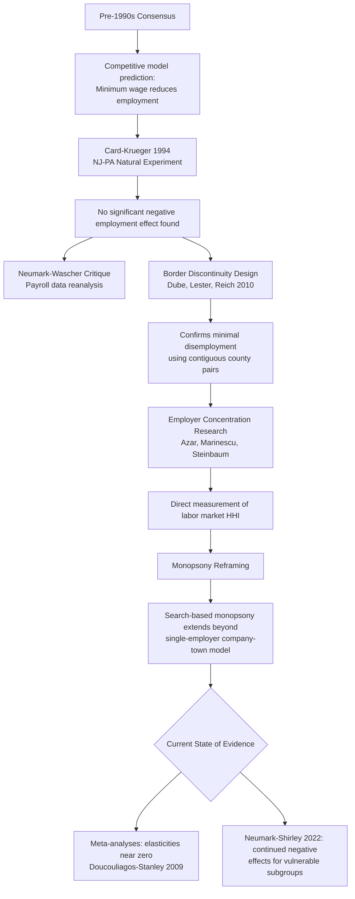

## Minimum Wage Laws and Employment Effects

### Overview

Minimum wage regulation is among the most empirically studied and theoretically contested topics in labor Law and Economics, serving as a paradigmatic case study in how competing theoretical models (competitive vs. monopsonistic labor markets) generate opposite qualitative predictions, and how the accumulation of quasi-experimental empirical evidence over four decades has reshaped both the economics profession's consensus and directly informed policy design. This topic builds on the competitive and monopsony frameworks introduced in the theory of wage determination and examines the specific legal architecture, empirical methodology, and doctrinal debates surrounding minimum wage law.

### Theoretical Predictions Revisited

#### The Competitive Model Prediction

Under the standard competitive labor market model, a minimum wage $w_{min}$ set above the market-clearing wage $w^*$ creates a binding price floor. Because labor demand is downward-sloping in wage, employers reduce quantity of labor demanded to $L_d(w_{min}) < L^*$, while labor supply increases to $L_s(w_{min}) > L^*$, producing a surplus of labor (involuntary unemployment) equal to $L_s(w_{min}) - L_d(w_{min})$, and actual observed employment falls to $L_d(w_{min})$ (the short side of the market governs actual transactions). This is the textbook prediction taught in introductory price theory and was the dominant view among labor economists prior to the 1990s.

#### The Monopsony Model Prediction

As developed in the wage determination topic, under monopsony a minimum wage set between the monopsony wage $w_m$ and the competitive wage $w^*$ can simultaneously raise both the wage and employment, because it eliminates the wedge between marginal cost of labor and the wage that constrains the monopsonist's hiring below the competitive level. Only a minimum wage set above $w^*$ reverts to the standard prediction of reduced employment. This theoretical possibility, long known but treated as a secondary curiosity, was substantially revived as empirically relevant by the "new minimum wage research" beginning in the early 1990s.

### The Empirical Revolution: Card-Krueger and the "New Minimum Wage Research"

#### The New Jersey-Pennsylvania Natural Experiment

David Card and Alan Krueger's 1994 study exploited New Jersey's 1992 minimum wage increase (from $4.25 to $5.05) as a natural experiment, comparing employment changes at fast-food restaurants in New Jersey against a control group of similar restaurants in adjacent eastern Pennsylvania (where the minimum wage did not change), using a difference-in-differences research design:

$$\Delta \text{Employment}_{\text{effect}} = (\bar{E}_{NJ,\text{post}} - \bar{E}_{NJ,\text{pre}}) - (\bar{E}_{PA,\text{post}} - \bar{E}_{PA,\text{pre}})$$

Card and Krueger found no statistically significant negative employment effect—and in their point estimates, a small positive effect—directly contradicting the standard competitive-model prediction. This result generated substantial controversy and methodological scrutiny (including a contemporaneous critique by David Neumark and William Wascher using payroll records rather than the Card-Krueger telephone survey data, which found more consistent negative effects), launching several decades of methodological refinement in minimum wage empirics.

#### Border Discontinuity Designs

Building on the Card-Krueger approach, Arindrajit Dube, T. William Lester, and Michael Reich (2010) developed a border-county-pair design comparing employment in contiguous counties straddling state borders with different minimum wage levels, controlling for local economic conditions that might otherwise confound simple before-after or cross-state comparisons. This approach similarly found minimal disemployment effects, reinforcing the view that earlier studies using broader geographic comparisons may have been confounded by regional economic trends unrelated to minimum wage policy.

#### The Meta-Analysis and Continuing Debate

Subsequent meta-analyses (Hristos Doucouliagos and T.D. Stanley, 2009; and later work) of the accumulated minimum wage literature generally find employment elasticities clustered close to zero, though methodological disagreement persists. Neumark and Peter Shirley's more recent (2022) survey of the post-2000 literature reaches a less unified conclusion, finding a plurality of studies still report negative employment effects, particularly for the most economically vulnerable subgroups (teenagers, and workers in the lowest tail of the wage distribution)—illustrating that the field has not achieved full consensus, notwithstanding substantial movement away from the pre-1990s presumption of large, clearly negative effects.

[Inference] The degree of remaining disagreement in the empirical literature partly reflects genuine differences in identification strategy and data quality across studies, and partly reflects the reality that heterogeneous local labor market conditions (varying degrees of monopsony power across geography and industry) may mean there is no single "true" minimum wage employment elasticity, but rather a distribution of context-dependent effects.

### Reconciling Theory and Evidence: Monopsony as the Leading Explanation

#### Employer Concentration Measures

Contemporary research (José Azar, Ioana Marinescu, and Marshall Steinbaum's work using online job posting data to construct labor market concentration indices, analogous to the Herfindahl-Hirschman Index used in antitrust product market analysis) has documented substantial employer concentration in many local labor markets, particularly for lower-wage occupations with limited employer competition in a given commuting zone—providing direct empirical support for treating monopsony as more than a theoretical curiosity.

$$HHI_{\text{labor}} = \sum_{i=1}^{n} s_i^2$$

where $s_i$ is employer $i$'s share of total employment (or vacancy postings) in a defined local labor market, mirroring the standard antitrust concentration measure applied to the buyer (employer) side of the labor market rather than the seller side of a product market.

#### Monopsony Power Beyond Single-Employer "Company Town" Models

Modern monopsony theory has expanded beyond the classical single-dominant-employer model to incorporate **search-based monopsony** (Boal and Ransom; Manning's *Monopsony in Motion*), in which even markets with multiple competing employers exhibit monopsonistic wage-setting power because of search frictions and worker switching costs (relocation costs, firm-specific human capital, imperfect information about outside offers)—meaning even a labor market with several employers can exhibit upward-sloping labor supply curves to each individual firm, generating monopsony-like wage suppression without requiring a literal single-employer scenario.

### The Legal and Statutory Framework

#### Federal Minimum Wage Under the Fair Labor Standards Act

The Fair Labor Standards Act (FLSA), 29 U.S.C. § 206, establishes the federal minimum wage ($7.25 per hour since 2009, the longest period without a federal increase in the statute's history), applicable to covered employees engaged in interstate commerce, subject to numerous exemptions (executive, administrative, and professional employees under § 213(a)(1); tipped employees subject to a lower cash minimum wage supplemented by tip credit under § 203(m); certain agricultural and seasonal workers).

#### State and Local Minimum Wage Variation

Because the FLSA sets only a federal floor, states and municipalities remain free to set higher minimum wages (though not lower ones for FLSA-covered employment), producing substantial cross-jurisdictional variation exploited by the border-discontinuity empirical literature discussed above. Some jurisdictions (California, Washington State, and various municipalities including Seattle and New York City) have enacted minimum wages substantially above the federal floor (in some cases exceeding $15-17 per hour), generating a distinct and more recent empirical literature (notably the University of Washington's Seattle minimum wage studies) examining effects at wage levels considerably higher relative to local median wages than the increments studied in the original Card-Krueger research—a distinction relevant because monopsony-based employment gains are theoretically bounded (a minimum wage set high enough above the competitive wage reverts to standard disemployment predictions).

#### The Tip Credit System

The FLSA's tip credit provision permits employers to pay tipped employees a lower direct cash wage (as low as $2.13 per hour federally) provided tips bring total compensation up to at least the standard minimum wage, with the employer required to make up any shortfall. Seven U.S. states have eliminated the tip credit entirely, requiring the full state minimum wage to be paid directly by employers regardless of tip income—a policy variation that has generated its own specialized empirical literature on restaurant industry employment and pricing effects, analytically distinct from (though related to) the general minimum wage literature.

### Distributional and Alternative Policy Considerations

#### Who Bears the Incidence of Minimum Wage Increases

Beyond the pure employment-level question, Law and Economics analysis considers price incidence: minimum wage increases may be absorbed through some combination of (a) reduced employment or hours, (b) reduced non-wage benefits or working conditions (a "compensating differential" response operating in reverse), (c) increased consumer prices (particularly salient in the restaurant industry, a heavily studied sector given its high minimum-wage-worker concentration), or (d) reduced firm profit margins. Empirical work (Dube's continuing research, and others) suggests price pass-through is a significant channel of adjustment, potentially explaining why measured employment effects are often smaller than the pure competitive-model prediction would suggest even without invoking monopsony.

#### Alternative and Complementary Policy Instruments

Law and Economics scholarship frequently compares minimum wage laws to alternative redistributive tools, particularly the Earned Income Tax Credit (EITC):

| Dimension | Minimum Wage | EITC |
| --- | --- | --- |
| Funding source | Borne by employers (and possibly consumers) | Funded through general tax revenue |
| Targeting | Targets low-wage workers regardless of household income | Targets low-*household*-income workers directly, phased by earnings and family size |
| Employment effect | Theoretically ambiguous (monopsony vs. competitive) | Generally understood to increase labor force participation (a wage subsidy effect) |
| Efficiency concern | Potential disemployment in competitive markets; potential employer cost-shifting | Phase-out range creates its own implicit marginal tax rate/labor supply distortion |

Many Law and Economics scholars (across a range of political orientations) view minimum wage and EITC as complementary rather than purely substitute policies: minimum wage floors can prevent employers from capturing a share of the EITC subsidy by lowering wages (since a wage floor limits how far the market wage can fall in response to the availability of a wage-supplementing subsidy), a concern raised in analyses by economists including Card and Krueger themselves in later work.

### Diagram: Empirical Research Evolution in Minimum Wage Economics

### Worked Example: Comparing Predicted Effects Across Models at Different Minimum Wage Levels

**Setup**: Local labor market with monopsony wage $w_m = \$12$, competitive wage $w^* = \$16$, and current employment at the monopsony level.

**Case 1 — Minimum wage set at $14** (between $w_m$ and $w^*$): Under the monopsony model, this raises both wage ($12 → $14) and employment (moving along the labor supply curve toward the competitive quantity), consistent with the theoretical mechanism illustrated in the wage determination topic's worked example. Under the competitive model (incorrectly assumed), this same policy would be predicted to reduce employment—illustrating why correctly identifying the underlying market structure is a first-order empirical question before drawing policy conclusions.

**Case 2 — Minimum wage set at $20** (above $w^*$): Both models converge on the same qualitative prediction: because the minimum wage now exceeds even the competitive equilibrium wage, the monopsony countervailing mechanism is exhausted, and further minimum wage increases produce standard disemployment effects in either model, with the demand curve $MRPL$ now directly binding at the higher wage level.

**Policy implication**: [Inference] This theoretical structure suggests that the employment effects of minimum wage increases are likely to become progressively more negative as the minimum wage rises relative to the local median or competitive wage, implying that a minimum wage calibrated appropriately for one local labor market (e.g., a high-cost, high-wage metropolitan area) could have meaningfully different, more adverse employment effects if applied uniformly to a lower-wage rural labor market—an argument frequently raised in favor of geographically differentiated minimum wage policy, though the political economy and administrative feasibility of such differentiation raise separate considerations beyond the pure economic analysis.

### Key Points

- The competitive model predicts minimum wage increases reduce employment; the monopsony model predicts increases can raise both wages and employment when set between the monopsony and competitive wage.
- Card and Krueger's 1994 New Jersey-Pennsylvania natural experiment substantially reshaped the empirical consensus, finding no significant negative employment effect and launching several decades of quasi-experimental minimum wage research.
- Border discontinuity designs and employer concentration measures (labor market HHI) provide methodological refinement and direct empirical support for treating monopsony as empirically relevant, particularly through search-based rather than purely single-employer mechanisms.
- The empirical literature has not reached full consensus: meta-analyses generally find near-zero average employment elasticities, but some recent surveys (Neumark-Shirley) continue to find negative effects for the most vulnerable worker subgroups.
- Price pass-through to consumers and reduced non-wage compensation are alternative adjustment channels that can explain modest observed employment effects independent of monopsony.
- Minimum wage and EITC are frequently analyzed as complementary policy instruments, with minimum wage floors potentially preventing employer capture of EITC-funded wage subsidies.

### Related Topics

- Economic theory of labor markets and wage determination (chapter continuity: monopsony and competitive model foundations)
- Earned Income Tax Credit design and labor supply effects
- Employer concentration and antitrust analysis of labor market power (no-poach agreements, wage-fixing cartels)
- Fair Labor Standards Act exemptions and the tipped minimum wage/tip credit system
- Difference-in-differences and border discontinuity research design methodology in applied microeconomics
- State and local minimum wage preemption doctrine
- Living wage ordinances and municipal minimum wage authority
- Collective bargaining and union wage-setting as an alternative mechanism to statutory minimum wage floors