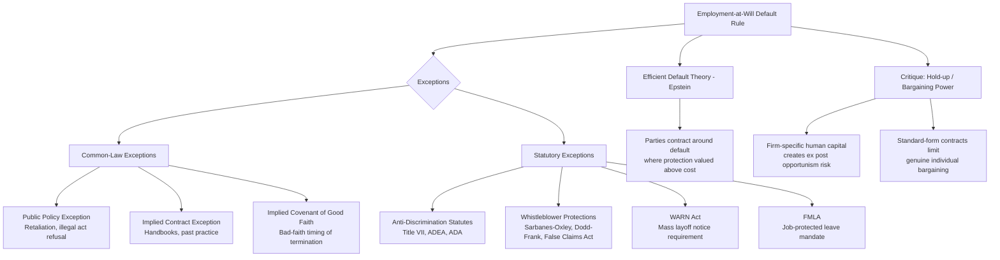

## Employment-at-Will and Statutory Exceptions

### Overview

Employment-at-will is the default legal rule governing most U.S. employment relationships: absent a contrary agreement or statutory protection, either the employer or the employee may terminate the relationship at any time, for any reason or no reason, without liability. Law and Economics analysis of at-will employment centers on whether this default rule is efficient—whether it maximizes joint surplus for the typical employment relationship—and examines the growing body of statutory and common-law exceptions as either efficient corrections to specific market failures or as welfare-reducing departures from an otherwise efficient default.

### The At-Will Doctrine and Its Economic Rationale

#### Historical Origins and Statement of the Rule

The at-will doctrine traces to Horace Wood's 1877 treatise on master-servant law, which articulated a strong presumption (subsequently adopted across most U.S. jurisdictions) that an employment relationship of indefinite duration is terminable by either party at will, in the absence of an express contrary agreement. This is the default rule against which all subsequent contractual and statutory modifications are measured.

#### Efficient Default Rule Theory

Richard Epstein's influential defense (*In Defense of the Contract at Will*, 1984) frames at-will employment as an efficient default rule under standard contract theory: because employment relationships are heterogeneous and the parties' actual preferences over termination rights are costly to observe and specify in advance, the law should supply the default term that most parties would have chosen had they negotiated explicitly, minimizing the transaction costs of drafting comprehensive employment contracts. Epstein argues at-will status benefits both parties symmetrically (either can exit at low cost), and that termination protections desired by workers can be, and often are, contractually bargained for (severance agreements, notice provisions, union contracts, executive employment agreements with "for cause" termination requirements) where the value of such protection exceeds its cost—meaning mandatory judicial or statutory termination restrictions displace a term that voluntary bargaining would otherwise supply only where efficient.

$$\text{At-will efficient if: } \sum_i \text{Bargained protection}_i^* = \text{At-will default} + \text{Contractual modification}_i$$

The claim is that the default merely sets the starting point from which parties who value termination protection can, and empirically do, contract around it—implying mandatory departures from at-will status are unnecessary and potentially welfare-reducing if they override heterogeneous preferences with a uniform rule.

#### The Counter-Case: Information Asymmetry and Bargaining Power

Critics of the pure efficient-default account (drawing on broader Law and Economics skepticism of freedom-of-contract assumptions in employment relationships) argue that:

- **Unequal bargaining power and standard-form contracting**: most employees do not individually negotiate termination terms; employment terms are typically presented on a take-it-or-leave-it basis, undermining the assumption that the at-will default reflects genuine bilateral bargaining rather than employer-favorable boilerplate.
- **Ex post opportunism given firm-specific human capital**: as developed in the wage determination topic, once a worker has invested in firm-specific human capital (skills valuable primarily to the current employer), the worker becomes vulnerable to ex post opportunistic termination or renegotiation by the employer seeking to capture the quasi-rents from that investment—a classic hold-up problem (Oliver Williamson's transaction cost economics) that at-will status may exacerbate rather than solve, since it provides the employer a low-cost threat point.
- **Externalities from termination decisions**: termination decisions may impose costs on third parties (families, local communities, in cases of large-scale layoffs) not internalized by the bilateral employer-employee bargain, providing a distinct externality-based rationale for regulatory intervention (e.g., mass layoff notification requirements) independent of the bilateral efficiency question.

### Common-Law Erosion of At-Will Employment

#### Public Policy Exception

Nearly all U.S. states recognize a public policy exception, barring termination that violates a clear mandate of public policy—most commonly applied to retaliatory discharge for refusing to commit an illegal act, exercising a statutory right (filing a workers' compensation claim), performing a public duty (jury service), or whistleblowing on employer illegality. The economic rationale is that at-will termination threats can otherwise be used to coerce employees into complicity with illegal conduct or to suppress legally protected conduct that generates positive externalities (e.g., whistleblowing reveals otherwise-hidden employer misconduct, benefiting third parties and the legal system generally, an externality that a purely private, at-will-governed relationship would under-produce absent protection).

#### Implied Contract Exception

Some jurisdictions recognize an implied-in-fact contract exception, where employer representations (in handbooks, oral assurances, or a pattern of consistent past practice, e.g., only terminating for cause) can create an implied contractual limitation on at-will status, even absent an express written contract term. From a Law and Economics perspective, this exception can be understood as enforcing reliance-based expectations: if an employer's conduct or representations induce reasonable employee reliance (accepting a lower wage in exchange for perceived job security, for example), enforcing the implied term protects the bargain the parties' conduct suggests they actually reached, consistent with standard contract law's protection of reasonable reliance interests.

#### Implied Covenant of Good Faith and Fair Dealing

A minority of jurisdictions (most prominently, in a limited form, California) recognize an implied covenant of good faith and fair dealing in employment relationships, restricting terminations motivated by a bad-faith attempt to deprive an employee of previously earned benefits (e.g., firing a salesperson immediately before a large commission would vest). This exception is more narrowly tailored than a general "just cause" requirement, targeting specifically opportunistic timing designed to capture value the employee has already substantially earned—directly addressing the hold-up problem identified above in a targeted rather than categorical manner.

### Statutory Exceptions to At-Will Employment

#### Anti-Discrimination Statutes

Title VII of the Civil Rights Act of 1964 (race, color, religion, sex, national origin), the Age Discrimination in Employment Act (ADEA, age 40+), the Americans with Disabilities Act (ADA), and analogous state statutes prohibit termination (and other adverse employment action) motivated by protected-class status. These statutes function as a categorical carve-out from at-will discretion: an employer's freedom to terminate "for any reason or no reason" does not extend to termination for a statutorily prohibited reason, regardless of whether the underlying employment relationship is otherwise at-will. The economic justification connects to the statistical and taste-based discrimination theories discussed in the wage determination topic: anti-discrimination law targets both inefficient taste-based discrimination (theoretically self-correcting under competition, but empirically persistent) and self-fulfilling statistical discrimination (not self-correcting under competition, and potentially reinforcing harmful stereotypes over time even where individually "rational" from the discriminating employer's perspective).

#### Whistleblower Protection Statutes

Beyond the common-law public policy exception, numerous federal statutes provide explicit whistleblower protection with private rights of action, including the Sarbanes-Oxley Act (§ 806, protecting employees of public companies who report securities fraud), Dodd-Frank's whistleblower bounty and anti-retaliation provisions (relevant to the securities regulation chapter's earlier discussion of information production), and the False Claims Act's qui tam anti-retaliation provisions. These statutes extend and formalize the public-policy-exception logic, often adding statutory bounty incentives (a percentage of recovered fraud proceeds under Dodd-Frank and the False Claims Act) explicitly designed to overcome the collective-action and personal-risk disincentives that would otherwise cause whistleblowing to be systematically under-provided relative to its social value.

#### The Worker Adjustment and Retraining Notification (WARN) Act

The WARN Act (1988) requires covered employers (100+ employees) to provide 60 days' advance notice of plant closings or mass layoffs affecting a specified threshold of employees. This statute directly targets the externality rationale discussed above: mass layoffs impose adjustment costs on affected communities and workers that a purely bilateral employer-employee at-will relationship does not internalize, and advance notice allows affected workers, local governments, and retraining programs time to respond, reducing the social cost of the labor market adjustment.

#### Family and Medical Leave Act (FMLA)

The FMLA (1993) guarantees eligible employees up to 12 weeks of unpaid, job-protected leave for specified family and medical reasons, functioning as a mandatory (non-waivable) modification of at-will status during the covered leave period. The Law and Economics debate over FMLA-type mandates parallels broader mandated-benefit analysis (Lawrence Summers' classic mandated benefits framework): if the mandated benefit is valued by workers at least as much as its cost, competitive labor markets should already supply it voluntarily through wage adjustment (workers accepting lower wages in exchange for job-protected leave); the case for mandating it therefore rests on market failure arguments (asymmetric information about which employers offer such benefits, adverse selection in job matching by employees who value leave protection, or externalities to children/family members not captured in the bilateral employer-employee wage bargain) rather than a straightforward market failure absent such considerations.

$$w_{\text{mandate}} = w_{\text{no mandate}} - \Delta w$$

where the mandated-benefit framework predicts $\Delta w$ (the wage reduction absorbing the cost of the mandated benefit) approximately equals the mandate's cost to the employer, if workers value the benefit at its cost and labor markets adjust efficiently—implying the mandate is close to costless in employment terms but is not free, merely restructuring compensation from cash wages toward the mandated benefit.

### The WARN Act, Wrongful Termination, and Damages Design

#### Efficient Breach Analogy

Some Law and Economics scholars analyze wrongful termination liability through the lens of the "efficient breach" doctrine from contract law: if termination remains permissible upon payment of expectation damages (rather than being categorically barred), an employer will terminate only when the value of doing so exceeds the cost to the employee (as measured by damages), theoretically preserving efficient terminations while deterring inefficient (surplus-destroying) ones. This framework is most directly applicable to breach of an express or implied contractual just-cause provision, and less directly to purely statutory discrimination or retaliation claims, which are typically analyzed as violations of a legal duty rather than breach of a negotiated contractual term.

#### Punitive and Enhanced Damages in Statutory Claims

Unlike ordinary contract damages (compensatory only), many statutory employment protections (Title VII, with capped punitive damages under the Civil Rights Act of 1991; the ADEA's liquidated damages for willful violations) authorize damages beyond simple compensatory measures. The Law and Economics justification for such enhanced damages parallels the broader deterrence theory of punitive damages generally: because not all instances of prohibited discriminatory or retaliatory conduct are detected and successfully litigated, compensatory-only damages calibrated to detected cases alone would under-deter the full extent of prohibited conduct (the classic Becker (1968) economic model of crime and punishment, in which optimal sanctions scale inversely with detection probability to maintain expected-cost deterrence).

$$\text{Optimal sanction} = \frac{\text{Harm}}{\text{Probability of detection}}$$

### Comparative Note: At-Will Employment Internationally

The U.S. at-will default is comparatively unusual among developed economies; most European and many other OECD jurisdictions impose a "just cause" or similar substantive termination-restriction default, often coupled with mandatory notice periods and severance pay formulas tied to tenure. [Unverified] Comparative empirical research on whether stronger termination protection regimes produce systematically higher structural unemployment (a standard prediction of search-and-matching models extended to include firing costs, since higher firing costs reduce both firing *and* hiring, with an ambiguous net effect on unemployment depending on relative magnitudes) versus other labor market outcomes remains an actively contested empirical literature, and cross-country comparisons are complicated by confounding institutional differences (unemployment insurance generosity, active labor market policy, collective bargaining coverage) that are difficult to fully disentangle from termination-protection regimes alone.

### Diagram: At-Will Doctrine and Its Exceptions

### Worked Example: Mandated Benefit Analysis Applied to FMLA

**Scenario**: A worker values 12 weeks of job-protected family leave at $3,000 (in expected utility terms, accounting for the probability of needing to use it). The employer's cost of providing this guarantee (temporary replacement staffing, administrative compliance, lost productivity during transition) is $2,500.

**Efficient market prediction absent market failure**: Because the worker's valuation ($3,000) exceeds the employer's cost ($2,500), a competitive labor market should already supply this benefit voluntarily: the worker would accept a wage reduction of between $2,500 and $3,000 in exchange for the leave guarantee, and the employer would find this profitable to offer, capturing a portion of the $500 surplus. Under this analysis, mandating FMLA leave should be approximately neutral in employment/wage terms (wages simply adjust downward by roughly the mandate's cost) for workers and employers who would have reached this bargain anyway.

**Market failure justification for mandating anyway**: If job applicants cannot easily observe at the hiring stage which employers informally offer generous unpaid leave flexibility (information asymmetry) or if adverse selection causes only employers attracting high-leave-need workers to offer the benefit voluntarily (unraveling the voluntary market for the benefit, similar to Akerlof's lemons problem), a uniform mandate can correct the market failure by guaranteeing the benefit's availability without requiring individual workers to search for or negotiate it—at the cost of imposing the mandate's wage-reducing effect even on the subset of workers who would not have valued the benefit at its cost.

### Key Points

- At-will employment is the U.S. default rule; Epstein's efficient-default theory argues it minimizes contracting costs and permits parties to contract around it where termination protection is genuinely valued above its cost.
- Critics highlight unequal bargaining power, standard-form contracting, and ex post opportunism against firm-specific human capital investments as reasons the default may not reflect efficient bilateral bargaining in practice.
- Common-law exceptions (public policy, implied contract, implied covenant of good faith) developed incrementally to address specific opportunism and externality concerns without adopting a categorical just-cause requirement.
- Statutory exceptions (anti-discrimination law, whistleblower protections, WARN Act, FMLA) each target distinct market failures: discriminatory taste/statistical bias, under-provision of socially valuable whistleblowing, layoff externalities, and information asymmetry/adverse selection in benefit provision.
- The mandated-benefits framework (Summers) predicts that efficient mandates approximate a wage-reducing cost-shift rather than an employment-reducing regulation, with the case for mandating (rather than allowing voluntary market provision) resting on specific market failure arguments.
- Enhanced statutory damages (punitive, liquidated) for detected discrimination or retaliation reflect optimal deterrence theory calibrated to imperfect detection probability, distinct from purely compensatory contract damages.

### Related Topics

- Economic theory of labor markets and wage determination (chapter continuity: firm-specific human capital and hold-up problems)
- Employment discrimination law: disparate treatment, disparate impact, and statistical discrimination theory
- Efficient breach doctrine in general contract law theory
- Mandated employee benefits theory (Summers) and health insurance mandate analysis
- Whistleblower bounty programs and qui tam litigation incentive design
- Collective bargaining as a private-ordering alternative to statutory termination protection
- Comparative labor law: just-cause termination regimes and structural unemployment effects
- Non-compete agreements and post-employment restrictive covenants (contracting around at-will default in the reverse direction)