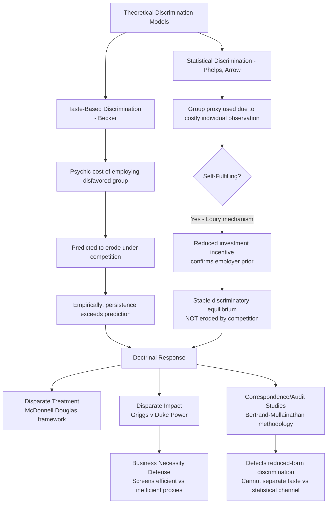

## Economic Analysis of Employment Discrimination Law

### Overview

Employment discrimination law prohibits adverse employment decisions based on protected characteristics, but the economic justification for such prohibitions—and the doctrinal structures courts have developed to enforce them—rest on contested theoretical foundations. This topic synthesizes the taste-based and statistical discrimination models introduced in the labor market theory topic, examines the two principal doctrinal frameworks (disparate treatment and disparate impact), and analyzes the economic critiques and defenses of anti-discrimination law's efficiency effects.

### Theoretical Models of Discrimination Revisited

#### Taste-Based Discrimination and Competitive Erosion

Gary Becker's taste-based discrimination model treats employer prejudice as a psychic cost that functions like a price markup on disfavored workers' labor. The model's most economically important prediction is that competitive product markets should erode taste-based discrimination over time: non-discriminating firms can hire equally productive disfavored workers at a wage discount (since discriminating competitors depress demand for those workers), gaining a cost advantage that should drive discriminating firms out of competitive markets or force them to abandon discriminatory practices to survive.

$$\pi_{\text{non-discriminating}} = \pi_{\text{discriminating}} + (w_{\text{disfavored}}^{\text{market}} - w_{\text{disfavored}}^{\text{actual}}) \times L_{\text{disfavored}}$$

This prediction has generated substantial empirical scrutiny, since observed wage and employment gaps by race and gender have proven considerably more persistent over many decades than the competitive-erosion mechanism would predict—motivating both statistical discrimination theory and structural/institutional explanations as competing or complementary accounts.

#### Statistical Discrimination and Self-Fulfilling Equilibria

As introduced previously, Edmund Phelps and Kenneth Arrow's statistical discrimination models explain persistent discrimination without requiring irrational prejudice: where individual productivity is costly to observe, employers rationally use group-level proxies correlated (in the employer's belief, which need not be accurate) with expected productivity. A particularly important theoretical extension is the **self-fulfilling prophecy equilibrium** (developed formally by Glenn Loury and others): if employers statistically discriminate against a group by investing less in that group's training or by offering fewer opportunities to demonstrate productivity, group members rationally respond by reducing their own investment in skills the employer is unlikely to reward, which then validates the employer's initial (possibly arbitrary) belief—producing a stable discriminatory equilibrium that is not self-correcting through competition, since the discrimination is "rational" given the (self-generated) skill distribution it produces.

$$\text{Employer prior } p_0 \to \text{Reduced investment incentive for group} \to \text{Lower realized skill} \to \text{Prior confirmed}$$

This multiple-equilibria structure is central to the Law and Economics case for anti-discrimination law extending beyond simple taste-based discrimination: because statistical discrimination equilibria can be stable and self-reinforcing rather than competed away, legal intervention (breaking the self-fulfilling cycle by mandating equal treatment regardless of statistical group proxies) can shift the economy from an inefficient discriminatory equilibrium to a more efficient non-discriminatory one, a possibility that pure market-based erosion arguments do not address.

[Inference] Whether real-world labor markets are best characterized as being in a Loury-type discriminatory equilibrium, a pure Becker taste-based equilibrium undergoing gradual erosion, or some combination, remains difficult to establish empirically since the observationally distinct predictions of these models are hard to separately identify from typical labor market data.

### Doctrinal Frameworks

#### Disparate Treatment

Disparate treatment doctrine, under Title VII and its progeny, requires proof of discriminatory intent—that the employer treated an individual less favorably because of a protected characteristic. The *McDonnell Douglas* burden-shifting framework (***McDonnell Douglas Corp. v. Green***, 1973) structures proof: the plaintiff establishes a prima facie case (qualification, adverse action, circumstances suggesting discrimination), the employer articulates a legitimate non-discriminatory reason, and the plaintiff must then show that reason is pretextual. Economically, disparate treatment doctrine directly targets Becker-style taste-based discrimination (and any instance of statistical discrimination that a court would also classify as intentional, since using a protected-class proxy is itself treating individuals differently "because of" that characteristic).

#### Disparate Impact

Disparate impact doctrine, established in ***Griggs v. Duke Power Co.*** (1971) and later codified in the Civil Rights Act of 1991, prohibits facially neutral employment practices that have a disproportionate adverse effect on a protected group, unless the employer can demonstrate the practice is "job related for the position in question and consistent with business necessity" (and, even then, the practice can be challenged if a less discriminatory alternative exists that serves the employer's legitimate needs equally well). Disparate impact doctrine does not require proof of discriminatory intent, making it doctrinally and economically distinct from disparate treatment: it directly targets the effects of practices that might arise from either explicit statistical discrimination or from facially neutral criteria that happen to correlate with protected-class membership for reasons unrelated to genuine job-relevant productivity differences (e.g., height/weight requirements with no job-related justification that disproportionately exclude women, at issue in cases following *Griggs*).

#### The Business Necessity Defense as an Economic Efficiency Screen

The business necessity defense functions economically as a screen distinguishing efficient statistical discrimination (where a facially neutral criterion is genuinely predictive of job performance, and no less discriminatory equally effective alternative exists) from inefficient or unjustified statistical discrimination (where the criterion either lacks genuine predictive validity or where a less discriminatory alternative would serve the employer's legitimate interest equally well at similar cost). This structure allows disparate impact doctrine to permit employer use of genuinely job-relevant criteria (even if they have a disparate statistical effect) while prohibiting use of criteria that are either not truly predictive or are more discriminatory than necessary to achieve a legitimate business purpose.

### The Efficiency Debate

#### The Standard Efficiency Justification

The dominant Law and Economics justification for prohibiting discrimination (blending both taste-based and statistical discrimination concerns) holds that anti-discrimination law:

- Corrects the self-fulfilling statistical discrimination equilibrium problem (the Loury mechanism above), which is not addressed by competitive market forces alone.
- Reduces search and screening costs across the labor market as a whole by requiring employers to develop and rely on more individualized, job-relevant assessment tools rather than crude group proxies, potentially improving the overall accuracy of labor market matching.
- Addresses a collective action problem in information production: no single employer has an incentive to invest in developing better individualized assessment tools if competitors can free-ride on any resulting improvement in the applicant pool's self-selection, or if the employer bears the full cost of improved screening while broader societal benefits (reduced discrimination-driven underinvestment in human capital) accrue diffusely.

#### The Posner-Epstein Skeptical Tradition

Richard Posner and Richard Epstein have offered influential efficiency-based skepticism of broad anti-discrimination mandates, arguing:

- Under Becker's competitive-erosion logic, taste-based discrimination should be self-correcting in sufficiently competitive markets, making legal intervention redundant for that category of discrimination (though this argument does not directly address the Loury-type persistent statistical discrimination equilibrium).
- Anti-discrimination litigation and compliance impose substantial administrative and litigation costs (statistical proof requirements in disparate impact cases are technically complex and expensive to litigate), which may exceed the efficiency gains from correcting genuine market failures, particularly where discrimination would have been eroded by competition regardless.
- Broad disparate impact liability may induce defensive employer behavior (avoiding legitimate, job-relevant selection criteria out of fear of disparate impact liability, or over-hiring protected-group members beyond what individual qualification assessment would support) that itself introduces inefficiency, a concern sometimes termed a "chilling effect" on legitimate screening practices.

#### Responses to the Skeptical Tradition

Proponents of a broader economic justification for anti-discrimination law respond that:

- The persistence of measured wage and employment gaps by race and gender across many decades, notwithstanding highly competitive product markets in many affected industries, is difficult to reconcile with a pure competitive-erosion story, lending empirical support to statistical discrimination and self-fulfilling equilibrium models that are not self-correcting.
- The litigation and compliance costs of anti-discrimination enforcement, while real, must be compared against the substantial economic costs of underutilized human capital in a discriminatory equilibrium (workers whose productive potential is systematically underinvested in and underutilized), which some economic historians (Claudia Goldin's work on the historical evolution of gender labor markets, and William Darity Jr. and Patrick Mason's survey of discrimination economics) argue are large in aggregate.
- Behavioral and implicit bias research (though methodologically distinct from the classical Becker/Phelps/Arrow economic models) provides an additional, non-mutually-exclusive channel through which discrimination can persist even among employers who would sincerely disclaim discriminatory "tastes," complicating the pure rational-actor framing of the classical models.

### Statistical Evidence and Audit Studies

#### Correspondence and Audit Study Methodology

A distinctive empirical methodology in this literature—correspondence studies (sending fictitious, matched resumes differing only in a signal of protected-class status, such as a racially distinctive name, to real job postings) and in-person audit studies (using trained testers matched on qualifications but differing in protected characteristics)—has been used extensively to test for discrimination in hiring, most prominently Marianne Bertrand and Sendhil Mullainathan's widely cited study using racially distinctive names on otherwise identical resumes (finding significantly lower callback rates for resumes with African-American-sounding names).

$$\text{Callback rate differential} = P(\text{callback} \mid \text{signal}_A) - P(\text{callback} \mid \text{signal}_B)$$

controlling for identical resume content, isolating the discriminatory signal's causal effect on employer response, since the fictitious resumes are randomly assigned the varying signal and are otherwise identical.

[Inference] While correspondence studies provide strong evidence of discrimination at the initial callback/interview stage under controlled conditions, they are generally not designed to distinguish between taste-based and statistical discrimination mechanisms (since both would predict the same reduced-form callback disparity), and they measure a specific stage of the hiring process rather than the full employment relationship (wage-setting, promotion, retention).

### Comparable Worth and Compensation Discrimination

A related but analytically distinct doctrine, comparable worth (or "pay equity"), goes beyond prohibiting unequal pay for the *same* job (already covered by the Equal Pay Act of 1963) and asks whether historically female-dominated occupations are systematically undervalued relative to historically male-dominated occupations of "comparable" skill, effort, and responsibility, even where the jobs are facially different. This doctrine has generated substantial Law and Economics controversy because it requires an administrable, non-market-based methodology for comparing the intrinsic "worth" of dissimilar jobs—a task standard competitive labor market theory treats as precisely what market wage-setting (rather than administrative job evaluation) is designed to solve, and critics (again in the Posner-Epstein tradition) argue that comparable worth mandates risk substituting administrative judgment for market-clearing wage information, with attendant risk of labor misallocation. Comparable worth has seen limited adoption in U.S. federal law relative to some public-sector state and local implementations.

### Diagram: Discrimination Models and Doctrinal Targeting

### Worked Example: Business Necessity Defense as an Efficiency Screen

**Scenario**: An employer requires a physical strength test for a warehouse position, which disproportionately screens out female applicants (a facially neutral practice with disparate impact).

**Analysis under disparate impact doctrine**: The employer must show the strength test is job-related and consistent with business necessity—i.e., that it genuinely predicts successful job performance for tasks the position actually requires. Suppose the test requires lifting 100 pounds, but the job's actual physical demands never exceed 50 pounds. In this case, the test's predictive validity is not established (it is not genuinely job-related to the position's actual requirements), so the business necessity defense fails, and the practice may be found unlawful.

**Efficiency interpretation**: This structure operationalizes the earlier statistical discrimination framework: if the strength test proxy is not actually predictive of the productivity trait employers care about (successful task completion at the position's actual demands), continued use of the proxy is not merely disparate in impact but also allocatively inefficient (rejecting qualified candidates based on a non-predictive screen). The business necessity defense thus functions as a legal mechanism forcing employers to internalize the cost of using inaccurate or overbroad proxies, pushing the market toward more individually accurate (and, incidentally, less discriminatory) selection criteria—directly addressing the statistical discrimination inefficiency the Phelps-Arrow-Loury theoretical framework identifies. If, alternatively, the job genuinely required 100-pound lifting capacity as an unavoidable core function, the business necessity defense would succeed notwithstanding the disparate impact, since in that case the criterion reflects genuine (not merely convenient or lazy) job-related predictive validity.

### Key Points

- Taste-based discrimination (Becker) predicts competitive erosion over time; the persistence of real-world wage and employment gaps beyond this prediction motivates statistical discrimination theory as a complementary or alternative explanation.
- Statistical discrimination can generate stable, self-fulfilling discriminatory equilibria (Loury mechanism) that are not corrected by market competition, providing an efficiency-based (not merely distributive) justification for legal intervention distinct from the taste-based case.
- Disparate treatment doctrine targets intentional discrimination (*McDonnell Douglas* framework); disparate impact doctrine (*Griggs*) targets facially neutral practices with disproportionate effects, subject to a business necessity defense that functions as an economic efficiency screen for genuinely predictive selection criteria.
- The Posner-Epstein skeptical tradition argues taste-based discrimination is self-correcting and that disparate impact litigation imposes substantial costs and defensive-behavior distortions; proponents respond that persistent statistical discrimination equilibria and aggregate human capital underutilization justify continued intervention.
- Correspondence and audit studies (Bertrand-Mullainathan) provide strong causal evidence of discrimination at the hiring-callback stage but generally cannot distinguish taste-based from statistical discrimination mechanisms.
- Comparable worth doctrine raises distinct concerns about substituting administrative job evaluation for market wage-setting, a tension at the core of ongoing debate over its proper scope.

### Related Topics

- Economic theory of labor markets and wage determination (chapter continuity: taste-based and statistical discrimination foundations)
- Employment-at-will and statutory exceptions (anti-discrimination as a categorical carve-out from at-will discretion)
- Implicit bias research and its relationship to classical rational-actor discrimination models
- Affirmative action policy and its economic justification as a remedy for self-fulfilling statistical discrimination equilibria
- Algorithmic hiring tools and disparate impact liability in automated employment decision-making
- Equal Pay Act litigation and comparable worth/pay equity policy debates
- Title VII procedural mechanics: class certification in employment discrimination litigation
- Behavioral economics of implicit bias and its integration with classical discrimination theory