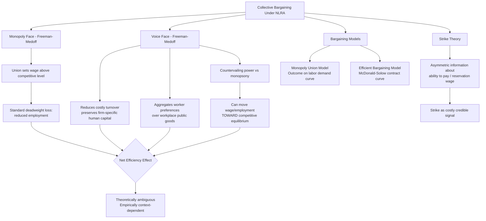

## Collective Bargaining and Union Economics

### Overview

Collective bargaining law governs the legal framework through which employees organize collectively to negotiate wages, benefits, and working conditions, fundamentally altering the bilateral bargaining structure analyzed in standard labor market theory. This topic extends the wage determination framework's bargaining models (monopoly union, efficient bargaining, bilateral monopoly) into the legal architecture of the National Labor Relations Act (NLRA), examines the economic theory of why unions form and what functions they serve beyond simple monopoly wage-setting, and surveys the ongoing debate over union effects on efficiency, wage distribution, and firm productivity.

### The Legal Framework: The National Labor Relations Act

#### Statutory Structure and Purpose

The National Labor Relations Act (1935), as amended by the Taft-Hartley Act (1947) and the Landrum-Griffin Act (1959), establishes the legal right of private-sector employees to organize, bargain collectively, and engage in concerted activity (§ 7), while prohibiting specified unfair labor practices by both employers (§ 8(a)) and unions (§ 8(b)). The National Labor Relations Board (NLRB) administers certification elections (determining whether a bargaining unit's employees select union representation) and adjudicates unfair labor practice charges.

#### The Duty to Bargain in Good Faith

Section 8(d) imposes a mutual obligation on certified unions and employers to bargain in good faith over mandatory subjects of bargaining (wages, hours, and other terms and conditions of employment), though the Act notably does not compel either party to reach agreement or make any particular concession—a structural feature with direct economic significance, since it means the legal duty to bargain addresses only the *process* of negotiation (preventing bad-faith refusal to engage), not the *substantive outcome*, leaving wage and term determination to the bargaining leverage of the respective parties as modeled in bargaining theory.

#### Exclusive Representation and the Free-Rider Problem

Once certified, a union serves as the exclusive bargaining representative for the entire bargaining unit, including employees who did not vote for or join the union, and owes a duty of fair representation to all unit members regardless of union membership. This structure creates a classic free-rider problem: non-member employees receive the benefit of union-negotiated wages and terms without paying union dues, which right-to-work laws (permitted under NLRA § 14(b), currently enacted in a majority of U.S. states) formalize by prohibiting mandatory union membership or dues payment as a condition of employment even in unionized workplaces. The economic effect of right-to-work laws on union density, bargaining power, and wages has itself generated a substantial empirical literature, generally finding right-to-work laws associated with reduced union density and some reduction in union bargaining leverage, though (paralleling the minimum wage debate) causal identification is complicated by the non-random selection of states adopting such laws.

### Why Do Unions Form? Economic Theories of Union Function

#### The Monopoly Face: Wage-Setting Power

As developed in the wage determination topic, the simplest economic model treats unions as a labor-supply monopolist, raising wages above the competitive level at the cost of reduced employment (the standard "monopoly face" of unionism, in Richard Freeman and James Medoff's influential terminology from *What Do Unions Do?*, 1984).

#### The Voice Face: Reducing Costly Turnover and Correcting Information Failures

Freeman and Medoff's complementary "voice face" of unionism argues collective bargaining serves an efficiency-enhancing function distinct from pure wage monopoly: unions provide a collective mechanism for workers to communicate grievances and preferences to management (a "voice" alternative to individual "exit," in Albert O. Hirschman's classic exit-voice-loyalty framework), which can:

- Reduce costly turnover by providing a mechanism to resolve workplace grievances without requiring workers to quit (exit) as their only recourse, preserving valuable firm-specific human capital investments (connecting to the hold-up problem discussed in the at-will employment topic) that individual exit would otherwise dissipate.
- Aggregate and communicate worker preferences over public-good-like workplace amenities (safety conditions, scheduling policies) that benefit the entire workforce collectively but that no individual worker has sufficient incentive to unilaterally negotiate for, given the free-rider problem inherent in workplace-wide amenities.
- Provide a countervailing power mechanism against employer monopsony (as developed in the wage determination topic's bilateral monopoly analysis), potentially moving wage and employment outcomes closer to the competitive equilibrium rather than further from it, contrary to the pure monopoly-face prediction.

$$\text{Net welfare effect} = \underbrace{\text{Monopoly wage distortion}}_{\text{efficiency loss}} + \underbrace{\text{Turnover reduction, voice benefits}}_{\text{efficiency gain}} + \underbrace{\text{Monopsony countervailing power}}_{\text{efficiency gain, if applicable}}$$

The Freeman-Medoff framework's central empirical claim—that unions are associated with measurably higher productivity in some contexts, partially offsetting the standard monopoly wage-distortion cost—has generated substantial subsequent empirical scrutiny and remains a contested area, with results sensitive to industry, time period, and the specific productivity measure and identification strategy employed.

### Bargaining Models Applied to Union Wage Setting

#### The Monopoly Union Model Revisited

Under the monopoly union model (introduced in the wage determination topic), the union unilaterally selects a wage along the firm's labor demand curve, with the firm subsequently choosing employment given that wage—predicting standard monopoly-style deadweight loss (higher wage, lower employment than the competitive baseline) and placing the resulting wage-employment combination directly on the labor demand curve.

#### Efficient Bargaining and the Contract Curve

The McDonald-Solow efficient bargaining model treats wage and employment as jointly negotiated, potentially yielding outcomes off the labor demand curve (on a contract curve of Pareto-efficient wage-employment combinations for the given union and firm preferences), since a wage-only outcome constrained to the demand curve is generally not the outcome that jointly maximizes total union-firm surplus for a wide range of relative bargaining weights. Empirical tests distinguishing the monopoly union model from efficient bargaining models (examining whether observed union contract outcomes fall on or off the labor demand curve) have produced mixed results, with some studies (particularly in specific industries with detailed contract data, such as certain manufacturing sectors) finding evidence more consistent with efficient bargaining than the simpler monopoly union prediction.

#### Strike Activity as Costly Signaling Under Asymmetric Information

The economic theory of strikes (following work by Orley Ashenfelter and George Johnson, and later asymmetric-information bargaining models building on Kenneth Arrow and others) treats strikes as economically puzzling under full information: if both parties know the eventual bargaining outcome, a costly strike destroys surplus that could instead be split without the deadweight loss of lost production. Modern theory resolves this puzzle by modeling strikes as arising under asymmetric information about the firm's true ability to pay (or the union's true reservation wage), where a strike functions as a costly signal that credibly reveals private information (a firm claiming inability to pay a higher wage may need to actually endure a costly strike to credibly demonstrate this claim to a skeptical union, since a firm that could afford the higher wage would find it cheaper to simply pay it rather than endure a strike)—directly analogous to costly-signaling models used elsewhere in economics (e.g., Spence's job-market signaling model).

### Union Density Trends and Structural Change

#### The Decline of Private-Sector Union Density

U.S. private-sector union density has declined substantially from its mid-20th-century peak (roughly one-third of private-sector workers in the 1950s) to low single digits today, while public-sector union density has remained comparatively stable and considerably higher. Explanations offered in the Law and Economics literature include: increased product market competition (particularly international trade competition, which increases the elasticity of labor demand and correspondingly reduces the wage premium a union can extract without triggering severe employment losses, per the standard monopoly-model logic that higher demand elasticity increases the deadweight cost of a given wage markup), structural shifts from unionized manufacturing toward less-unionized service sectors, legal changes (state right-to-work law proliferation), and employer opposition strategies enabled by NLRA enforcement remedies widely viewed (across a range of political perspectives) as insufficiently deterrent relative to potential employer gains from resisting organization.

#### Public-Sector Unionism and Distinct Economic Considerations

Public-sector collective bargaining raises analytically distinct issues from private-sector bargaining, since the "employer" (government) does not face product market competition or a profit-maximization constraint in the same manner as a private firm, and public-sector union wage demands are ultimately constrained by the political process (taxpayer resistance, budget constraints) rather than by market-based product demand elasticity. ***Janus v. AFSCME*** (2018) held that mandatory "agency fees" charged to non-member public-sector employees (to fund collective bargaining representation costs, distinct from broader political activities) violate the First Amendment, extending right-to-work-type reasoning to the public sector on constitutional rather than statutory grounds and directly addressing the free-rider problem discussed above by prohibiting the compelled-fee solution to it in the public-sector context.

### The Efficiency Debate: Aggregate Effects of Unionization

#### Standard Deadweight Loss Analysis

The baseline efficiency critique treats union wage premiums as generating standard monopoly deadweight loss: employment in unionized sectors falls below the competitive level, and workers displaced from higher-wage unionized jobs must seek employment in the non-union sector, potentially depressing non-union wages (a "spillover effect") and generating a broader misallocation of labor across sectors relative to the competitive benchmark.

#### Countervailing Efficiency Considerations

As developed above, the "voice face" of unionism, countervailing power against employer monopsony, and reduced costly turnover all provide theoretically grounded efficiency-enhancing channels that can partially or, in specific circumstances, fully offset the standard monopoly deadweight loss critique. The net empirical balance of these offsetting effects—whether unionization is, on net, efficiency-enhancing or efficiency-reducing for the economy as a whole—remains a genuinely open and actively debated empirical question in labor economics, with the answer likely varying substantially by industry structure (the degree of underlying employer monopsony power, product market competitiveness, and the specific mix of turnover costs and firm-specific human capital investment characteristic of the sector).

[Inference] Given the theoretical ambiguity and the mixed, context-dependent empirical evidence on both the productivity and monopsony-offsetting channels, a confident aggregate welfare conclusion about unionization's net efficiency effect across the whole economy is not well-supported by the current state of the literature, and the most defensible position is that the sign and magnitude of net effects vary meaningfully by labor market structure.

### Diagram: Union Economic Functions and Efficiency Channels

### Worked Example: Countervailing Power Under Bilateral Monopoly

**Scenario**: Building on the wage determination topic's monopsony example, suppose the same monopsonistic employer (labor supply $w = 10 + 0.05L$, $MRPL = 30 - 0.05L$, unconstrained monopsony equilibrium at $L=133.3$, $w=\$16.67$) now faces a unionized workforce with meaningful bargaining power, rather than a statutory minimum wage.

**Bilateral monopoly analysis**: Under bilateral monopoly, the wage outcome is theoretically indeterminate within a bargaining range bounded by the monopsonist's maximum acceptable wage (where hiring remains profitable) and the union's minimum acceptable wage (its members' reservation value), with the precise outcome determined by relative bargaining power rather than a unique equilibrium condition. If the union's bargaining power is sufficient to push the wage toward the competitive level ($20, from the earlier worked example) rather than beyond it, this bargaining process functions analogously to the minimum wage's countervailing effect: it can raise both the wage and employment relative to the unconstrained monopsony outcome, precisely mirroring the earlier minimum-wage worked example's mechanism but achieved through private bilateral bargaining leverage rather than statutory mandate.

**Contrast with the monopoly union model in a competitive (non-monopsony) baseline**: If instead the underlying labor market were competitive rather than monopsonistic, the same union bargaining power would, under the monopoly union model, push the wage *above* the competitive level ($20), generating the standard deadweight loss prediction (reduced employment below the competitive $L=200$ baseline)—illustrating that the welfare effect of union bargaining power depends critically on the counterfactual market structure it is displacing, exactly paralleling the minimum wage analysis's dependence on whether the underlying market is monopsonistic or competitive.

### Key Points

- The NLRA establishes a duty to bargain in good faith over mandatory subjects without compelling any particular substantive outcome, leaving wage determination to the parties' relative bargaining leverage.
- Exclusive representation combined with non-member free-riding motivates union security clauses and the countervailing right-to-work laws that prohibit mandatory dues as a condition of employment.
- Freeman and Medoff's "monopoly face" and "voice face" framework captures the theoretical tension between standard monopoly wage-distortion costs and efficiency-enhancing functions (reduced turnover, workplace-preference aggregation, monopsony countervailing power).
- Bargaining outcomes can be modeled as either monopoly-union (wage-only, outcome on the labor demand curve) or efficient bargaining (joint wage-employment negotiation, potentially off the demand curve on a contract curve), with mixed empirical support for each.
- Strikes are theoretically puzzling under full information but are explained under asymmetric information as costly, credible signals revealing private information about ability to pay or reservation wages.
- The net efficiency effect of unionization is genuinely theoretically ambiguous and empirically context-dependent, turning critically on whether the underlying labor market being displaced is competitive (favoring the standard deadweight-loss critique) or monopsonistic (favoring the countervailing-power efficiency defense).

### Related Topics

- Economic theory of labor markets and wage determination (chapter continuity: monopsony, bilateral monopoly, and bargaining models)
- Minimum wage laws and employment effects (parallel countervailing-power mechanism under monopsony)
- Employment-at-will and statutory exceptions (union contracts as a private-ordering alternative providing just-cause protection)
- Right-to-work law empirical literature and union density determinants
- Public-sector labor law and *Janus v. AFSCME* agency fee doctrine
- Hirschman's exit-voice-loyalty framework applied beyond labor markets
- International trade exposure and its effect on labor demand elasticity and union bargaining power
- Comparative labor relations systems: sectoral bargaining and works councils in European labor law