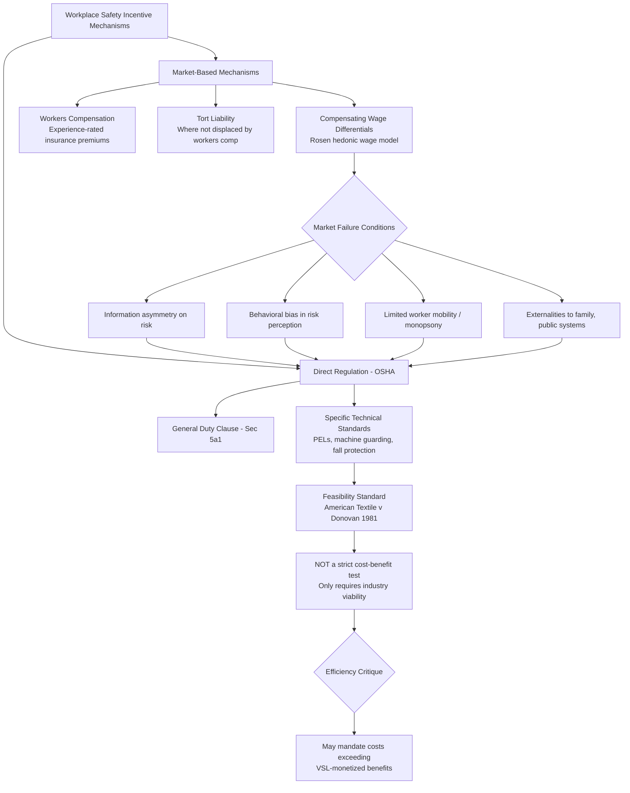

## Workplace Safety Regulation and OSHA Economics

### Overview

Workplace safety regulation presents a paradigmatic case study in the Law and Economics tension between market-based (tort liability, compensating wage differentials) and direct regulatory (command-and-control standard-setting) approaches to correcting workplace risk externalities and information failures. This topic examines the compensating wage differential theory introduced in the labor market theory topic in greater depth, analyzes the statutory and institutional design of the Occupational Safety and Health Act (OSHA), and surveys the economic critique and defense of direct safety regulation as a supplement to (or substitute for) market-based mechanisms.

### The Baseline Market Mechanism: Compensating Wage Differentials

#### Theoretical Foundation

As introduced in the labor market theory topic, Rosen's compensating differentials framework holds that in a competitive labor market with full information, workers who accept jobs with higher fatality or injury risk must be compensated with a wage premium reflecting their valuation of the incremental risk, and firms internalize the cost of risk through this wage premium, creating an implicit market-based incentive to invest in safety up to the point where the marginal cost of risk reduction equals workers' marginal willingness to accept compensation for the residual risk.

$$w(risk) = w_0 + \phi \cdot risk$$

where $\phi$ (the compensating differential per unit of risk) implicitly reveals the **value of a statistical life (VSL)** when scaled appropriately—a concept central to cost-benefit analysis of safety regulation. If wage-risk tradeoffs in labor market data reveal that workers require, for example, an additional $700 in annual compensation to accept an increase in annual fatality risk of 1-in-10,000, this implies a VSL of approximately $7 million ($700 / 0.0001$), a figure directly used by regulatory agencies (OSHA, EPA, DOT) in cost-benefit analysis of proposed safety regulations.

#### Why the Market Mechanism May Fail

The compensating differential mechanism requires several conditions that may not hold in practice, providing the core economic rationale for direct safety regulation:

- **Information asymmetry about risk**: workers may not accurately perceive job-specific fatality or injury risk, particularly for risks with low probability but severe consequences (e.g., long-latency occupational disease risks such as asbestos exposure), where the causal link between exposure and eventual harm is not readily observable or salient to workers at the time of employment.
- **Behavioral biases in risk perception**: as discussed in the consumer financial protection topic's treatment of present bias and optimism bias, workers may systematically underestimate low-probability, high-severity risks (a documented pattern in risk perception research more broadly, sometimes attributed to availability heuristics that make vivid, easily imagined risks more salient than statistically larger but less vivid ones).
- **Limited worker mobility and bargaining power**: in labor markets with meaningful monopsony power or high switching costs (as developed in the wage determination topic), workers may lack the outside options necessary to extract full compensation for risk even if they accurately perceive it, since the compensating differential mechanism presupposes competitive labor market conditions.
- **Externalities beyond the worker**: workplace injuries and fatalities impose costs on family members, dependents, and publicly funded disability and healthcare systems that are not fully internalized even by an accurately functioning compensating differential mechanism, since the wage bargain reflects only the worker's private valuation of risk to themselves.

[Inference] The relative empirical importance of these distinct market failure channels (information asymmetry versus behavioral bias versus bargaining power versus externality) is difficult to disentangle in observational wage-risk data, and most empirical VSL estimation studies do not attempt to decompose which specific failure, if any, is driving observed wage-risk premiums versus reflecting a well-functioning compensating differential mechanism.

### The Occupational Safety and Health Act Framework

#### Statutory Structure

The Occupational Safety and Health Act (1970) created OSHA within the Department of Labor, empowered to promulgate mandatory workplace safety standards, backed by inspection and civil penalty enforcement authority. Section 5(a)(1), the "general duty clause," requires employers to furnish a workplace "free from recognized hazards" even absent a specific promulgated standard, functioning as a catch-all complementing OSHA's specific numerical and technical standards (permissible exposure limits for chemical substances, machine guarding requirements, fall protection standards, and similarly detailed technical mandates).

#### The "Feasibility" Standard and Cost-Benefit Analysis Constraints

A distinctive and economically significant feature of OSHA's statutory design, established in ***American Textile Manufacturers Institute v. Donovan*** ("the Cotton Dust case," 1981), is that OSHA standards must be economically and technologically "feasible" but are not required to satisfy a formal cost-benefit test (i.e., OSHA need not show that a standard's monetized benefits exceed its costs, only that compliance is feasible for the regulated industry without threatening its long-term economic viability). This is a significant departure from the cost-benefit analysis framework generally required for major federal regulations under Executive Order 12866 (applicable to OSHA rules as with other agencies, though the underlying statute's feasibility standard as interpreted in *Cotton Dust* constrains how stringent a benefit-cost showing OSHA can be compelled to make in defending a specific standard against industry challenge).

$$\text{OSHA standard valid if: Cost} \leq \text{Feasibility threshold (industry viability)}$$

rather than the stricter:

$$\text{OSHA standard valid if: Benefit} \geq \text{Cost}$$

This distinction has been a persistent subject of Law and Economics criticism (from scholars in the Posner-Epstein efficiency tradition), who argue that a feasibility-only standard can permit OSHA to mandate safety expenditures whose costs substantially exceed their risk-reduction benefits (as monetized via VSL-based cost-benefit methodology), so long as the regulated industry can technically absorb the cost without existential threat—a materially weaker constraint than requiring net social benefit.

#### Empirical Debate Over OSHA's Effect on Workplace Fatalities

A substantial empirical literature has examined whether OSHA regulation and enforcement activity (inspections, citations, penalties) causally reduce workplace injury and fatality rates. Early influential work (including studies by W. Kip Viscusi, a leading VSL and safety-regulation economist) found relatively modest measured effects of OSHA inspections on injury rates, a finding cited by regulatory skeptics as evidence that direct command-and-control regulation may be a less effective mechanism than market-based incentives (workers' compensation experience-rating, tort liability, and compensating wage differentials) for driving safety improvements. More recent work using improved identification strategies (including randomized OSHA inspection targeting studies) has found more robust evidence of inspection effects on subsequent injury rates in specific contexts, though the overall magnitude and generalizability of OSHA's causal effect on the substantial long-run decline in U.S. workplace fatality rates (which predates and continues alongside OSHA's existence) remains genuinely contested, since much of the long-run decline reflects structural shifts away from historically dangerous industries (mining, manufacturing) toward services, a shift not directly attributable to OSHA regulation itself.

[Inference] Disentangling OSHA's specific causal contribution to long-run fatality rate declines from broader structural economic change, improved medical treatment of workplace injuries, and voluntary employer safety investment (potentially itself partly motivated by anticipated regulatory or liability exposure) remains a methodologically challenging empirical problem, and reasonable analysts across the political spectrum have reached different conclusions from the same broad trends.

### Interaction with Workers' Compensation Systems

#### Workers' Compensation as an Alternative Market-Based Mechanism

Workers' compensation systems (state-administered, no-fault insurance schemes providing scheduled benefits for workplace injuries, in exchange for employees' waiver of common-law tort claims against employers, dating to early-20th-century "grand bargain" legislation) function as a complementary market-based safety incentive mechanism through experience rating: employers with worse injury records face higher workers' compensation insurance premiums, internalizing at least a portion of the cost of workplace injuries even absent OSHA regulation, and providing a continuous financial (rather than discrete standard-compliance) incentive for safety investment.

#### The Interaction and Potential Redundancy Question

Because workers' compensation experience rating already provides employers a financial incentive to invest in safety (Ronald Coase's Nobel-cited insight that liability rules alone can, under appropriate conditions, induce efficient care levels without requiring direct regulatory mandates), a persistent Law and Economics question is whether OSHA regulation is a necessary complement to workers' compensation, or whether it is partially redundant with (or, in some analyses, actually undermines) the incentive properties of experience-rated workers' compensation insurance. The standard response (paralleling the general case for direct regulation as a complement to tort/insurance-based liability systems, developed further in the broader Law and Economics literature on the choice between regulation and liability, notably Steven Shavell's work) is that:

- Workers' compensation experience rating provides incomplete incentives where injury severity is imperfectly observed, where firms face bankruptcy or judgment-proofing risk that limits the deterrent effect of expected liability, or where injury causation is difficult to attribute to a specific employer practice (making experience rating a noisy rather than precise signal of underlying safety investment).
- Direct standard-setting can be more administratively efficient than case-by-case liability determination for well-understood, easily verifiable hazards (specific machine guarding requirements, for example), where the cost of establishing a uniform ex ante standard is lower than the cost of ex post case-by-case negligence or experience-rating-based incentive calibration.

### Value of a Statistical Life: Estimation Methodology and Regulatory Use

#### Estimation Approaches

Beyond the hedonic wage-risk method described above, VSL estimates are also derived from stated-preference (contingent valuation) surveys asking respondents to value hypothetical risk reductions directly, and from revealed-preference studies of other risk-related market decisions (automobile safety equipment purchases, smoke detector adoption). U.S. federal agencies (including OSHA, EPA, and the Department of Transportation) use VSL estimates, periodically updated, in required regulatory cost-benefit analyses, with estimates in recent years generally clustering in a broad range around $10-13 million per statistical life across agencies, though methodologies and specific figures vary somewhat by agency and have been periodically revised.

[Unverified] The specific current VSL figures used by individual federal agencies are periodically updated for inflation and methodological revision, and the most current figure for any specific agency at any given time should be verified against that agency's most recent published guidance rather than assumed static.

#### The Income Elasticity and Distributional Critique

A significant methodological complication is that VSL estimates derived from wage-risk tradeoffs reflect the risk valuations of the specific (typically lower-income, blue-collar) workers who accept risky jobs in the sampled labor markets, raising a distributional question about whether it is appropriate to apply a uniform (or income-elasticity-adjusted) VSL figure across regulatory contexts affecting different income populations, and raising equity concerns about whether cost-benefit analysis using VSL methodology can be said to fully capture the interests of populations whose revealed risk preferences (often reflecting constrained economic circumstances rather than a fully voluntary, unconstrained risk-return tradeoff) generated the underlying estimate.

### Diagram: Market and Regulatory Mechanisms for Workplace Safety

### Worked Example: VSL-Based Cost-Benefit Analysis of a Proposed Standard

**Scenario**: OSHA proposes a new machine guarding standard for a specific industrial process, estimated to prevent 10 fatalities per year nationally, at an estimated industry-wide compliance cost of $150 million per year.

**Cost-benefit calculation using VSL**: Using a VSL estimate of $12 million per statistical life, the annual monetized benefit is:

$$\text{Benefit} = 10 \times \$12{,}000{,}000 = \$120{,}000{,}000$$

Comparing to the $150 million annual cost, this standard would *fail* a strict cost-benefit test ($120 million in benefits versus $150 million in costs), since costs exceed monetized benefits by $30 million annually.

**Application of the feasibility standard**: Under the *Cotton Dust* feasibility framework, this cost-benefit shortfall does not by itself invalidate the standard; OSHA need only demonstrate the $150 million cost is economically and technologically feasible for the regulated industry to absorb (e.g., it does not threaten the industry's long-term competitive viability), a materially less demanding showing than the strict cost-benefit test would require. [Inference] Critics in the Posner-Epstein tradition would characterize this specific hypothetical as illustrating the core inefficiency concern with the feasibility standard—permitting a net-cost-exceeding regulation to stand—while defenders might argue that non-fatality benefits (reduced non-fatal injuries, reduced pain and suffering not fully captured by the fatality-only VSL calculation used in this simplified example) could close or reverse the apparent cost-benefit gap if more comprehensively monetized.

### Key Points

- Compensating wage differential theory predicts that competitive labor markets with full information should generate market-based safety incentives without requiring direct regulation, but information asymmetry, behavioral risk-perception biases, limited worker mobility, and unincorporated externalities all provide potential justifications for regulatory intervention.
- OSHA's "feasibility" standard (*American Textile Manufacturers Institute v. Donovan*) requires only that a safety standard be economically and technologically feasible for the regulated industry, not that its benefits exceed its costs—a materially weaker constraint than formal cost-benefit analysis, and a persistent target of efficiency-based criticism.
- Empirical evidence on OSHA's causal effect on workplace fatality reduction is genuinely mixed and complicated by the difficulty of separating OSHA's contribution from structural economic shifts away from historically dangerous industries.
- Workers' compensation experience rating provides an alternative, liability/insurance-based market mechanism for internalizing safety costs, raising the question of whether direct OSHA regulation is a necessary complement or a partially redundant overlay.
- Value of a Statistical Life (VSL) estimates, derived from hedonic wage-risk studies and stated-preference surveys, are the standard monetized input for regulatory cost-benefit analysis, but raise unresolved distributional and income-elasticity concerns given their derivation from the risk preferences of specific (often lower-income) worker populations.

### Related Topics

- Economic theory of labor markets and wage determination (chapter continuity: compensating wage differentials and monopsony)
- Workers' compensation system design and experience rating incentive theory
- Cost-benefit analysis methodology in administrative law and regulatory review (Executive Order 12866)
- Tort law and the choice between liability rules and direct regulation (Shavell's regulation-versus-liability framework)
- Value of a Statistical Life estimation methodology across federal regulatory agencies
- Behavioral risk perception and availability heuristic research applied to safety regulation design
- Long-latency occupational disease litigation (asbestos, silica) and information asymmetry at time of exposure
- Environmental regulation cost-benefit analysis and comparative VSL application across agencies (EPA, DOT, OSHA)