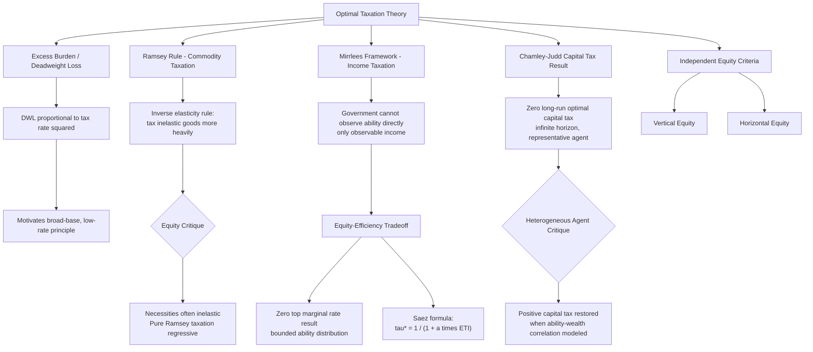

## Principles of Optimal Taxation

### Overview

Optimal taxation theory provides the analytical framework for evaluating tax systems against explicit efficiency and equity criteria, addressing the fundamental Law and Economics question of how to raise required government revenue while minimizing the economic distortion (deadweight loss) imposed on taxpayer behavior and while achieving desired distributional outcomes. This topic surveys the foundational excess burden concept, the Ramsey rule for optimal commodity taxation, Mirrlees's optimal income tax framework, and the broader equity-efficiency tradeoff that structures nearly all subsequent applied tax policy debate.

### The Excess Burden of Taxation

#### Defining Deadweight Loss from Taxation

Any tax on a good, activity, or factor of production that is not a lump-sum tax (a fixed amount unrelated to any decision the taxpayer makes) distorts marginal incentives, inducing taxpayers to alter behavior (reduce consumption of a taxed good, reduce labor supply in response to income taxation, alter the timing or form of transactions) in ways that reduce total economic surplus beyond the revenue transferred to government. This excess burden (deadweight loss) is the standard efficiency cost metric in optimal tax analysis, distinct from the pure transfer of resources from taxpayer to government (which, absent behavioral distortion, would not itself constitute an efficiency loss).

$$DWL = \frac{1}{2} \cdot \varepsilon \cdot t^2 \cdot \frac{p \cdot Q}{1}$$

approximately, for a small tax $t$ (as a proportion of price) on a good with own-price elasticity of demand $\varepsilon$, price $p$, and pre-tax quantity $Q$—illustrating the standard result that deadweight loss grows approximately with the *square* of the tax rate, a foundational insight driving much of optimal tax theory's emphasis on broad, low-rate taxation over narrow, high-rate taxation of a smaller base.

$$DWL \propto t^2$$

This quadratic relationship implies that doubling a tax rate roughly quadruples the associated deadweight loss (holding the elasticity and base constant), which is the central mathematical intuition behind the broad-base/low-rate principle that recurs throughout applied tax policy design.

#### Marginal Excess Burden and the Cost of Public Funds

Because deadweight loss grows more than proportionally with the tax rate, the *marginal* excess burden of raising an additional dollar of tax revenue (relevant for evaluating the cost of financing incremental government spending) generally exceeds the *average* excess burden across all revenue raised, an important distinction for public finance cost-benefit analysis of government expenditure programs, since evaluating a marginal government spending program properly requires using the marginal cost of the tax revenue that finances it (sometimes termed the "marginal cost of public funds," commonly estimated in a range moderately above $1 per dollar of revenue raised, reflecting the deadweight loss overhead).

### The Ramsey Rule: Optimal Commodity Taxation

#### Frank Ramsey's Inverse Elasticity Rule

Frank Ramsey's foundational 1927 analysis addresses the problem of raising a fixed amount of government revenue through commodity taxes on multiple goods while minimizing aggregate deadweight loss. The Ramsey rule's central result—the **inverse elasticity rule**—holds that, under restrictive assumptions (independent goods, no cross-price effects, and setting aside distributional concerns), optimal tax rates on different goods should be set inversely proportional to each good's own-price elasticity of demand:

$$\frac{t_i}{1+t_i} = \frac{k}{\varepsilon_i}$$

where $t_i$ is the tax rate on good $i$, $\varepsilon_i$ is its price elasticity of demand, and $k$ is a constant reflecting the required revenue target (the same across all goods). The intuition is that taxing relatively price-inelastic goods (necessities with few substitutes) more heavily generates less behavioral distortion (less quantity reduction) per dollar of revenue raised than taxing elastic goods, since the deadweight loss triangle from a given tax rate scales with the elasticity of demand—a good with zero elasticity would generate zero deadweight loss from any tax rate, approaching the efficiency of a lump-sum tax.

#### The Equity Critique of Pure Ramsey Taxation

The Ramsey rule's efficiency-only conclusion—tax necessities (typically inelastically demanded, such as food and basic goods) more heavily than luxuries—directly conflicts with standard distributional/vertical-equity intuitions, since necessities typically constitute a larger budget share for lower-income households, meaning pure Ramsey-optimal commodity taxation would be regressive. This tension is the central motivating puzzle that subsequent optimal tax theory (incorporating explicit social welfare weighting across income levels, as in the Mirrlees framework below) was developed to address, and it explains why real-world tax systems generally do not follow a pure inverse-elasticity commodity tax structure, instead relying more heavily on progressive income taxation (and often explicitly exempting or reduced-rate-taxing necessities like groceries under sales/VAT systems) to address distributional concerns that pure efficiency-based commodity tax design would not otherwise satisfy.

### The Mirrlees Framework: Optimal Income Taxation

#### The Core Trade-off: Equity Versus Incentive Effects

James Mirrlees's seminal 1971 analysis (awarded the Nobel Prize in 1996, shared with William Vickrey) models optimal income taxation as a problem of asymmetric information: the government wishes to redistribute income from high-ability (high-earning-potential) to low-ability individuals, but cannot directly observe individual ability—only observable income, which reflects both ability and the individual's endogenous labor supply choice, itself responsive to the tax schedule. This creates a fundamental **equity-efficiency trade-off**: taxing high incomes more heavily to fund redistribution to low-income individuals is desirable on distributional grounds (assuming a social welfare function with diminishing marginal utility of income, or an explicit preference for reducing inequality), but higher marginal tax rates on labor income reduce the incentive to supply labor (or to invest in the human capital that generates high-ability high-earning outcomes), generating efficiency costs that constrain how aggressively redistribution can be pursued.

$$\max_{T(\cdot)} \int W(u(y - T(y))) \, dF(y) \quad \text{subject to} \quad \int T(y) \, dF(y) \geq R$$

where $T(y)$ is the tax schedule as a function of income $y$, $W(\cdot)$ is a social welfare weighting function, $u(\cdot)$ is individual utility, and $R$ is the required revenue constraint—the government chooses the tax schedule $T(\cdot)$ to maximize social welfare subject to the revenue constraint and the incentive-compatibility constraint that individuals will adjust their labor supply/income in response to the schedule.

#### Key Mirrlees Results

Several notable and initially counterintuitive theoretical results emerge from the Mirrlees framework and its subsequent refinements (particularly by Emmanuel Saez and others in the modern "New Dynamic Public Finance" and applied optimal tax literature):

- **The top marginal tax rate result**: under standard assumptions (a bounded ability distribution with a highest-ability type), the optimal marginal tax rate on the very top earner is zero, since taxing the top earner's marginal income at all only distorts that individual's labor supply without generating any revenue-extraction benefit from taxing anyone above them (there is no one above the top). [Inference] This specific zero-top-rate result is highly sensitive to the assumption of a bounded, known ability distribution and is generally not interpreted as a practical policy prescription for real-world top tax rates, which depend on the shape of the actual (unbounded, Pareto-tailed) empirical income distribution rather than the simplified bounded-support theoretical case.
- **The optimal tax formula incorporating the elasticity of taxable income**: Saez's influential reformulation of the optimal top tax rate expresses the revenue-maximizing top marginal rate as a function of the elasticity of taxable income (ETI) with respect to the net-of-tax rate and the shape parameter of the Pareto income distribution:

$$\tau^* = \frac{1}{1 + a \cdot e}$$

where $\tau^*$ is the revenue-maximizing top marginal tax rate, $a$ is the Pareto distribution shape parameter (a measure of top-income inequality/thickness of the upper tail), and $e$ is the elasticity of taxable income with respect to the net-of-tax rate $(1-\tau)$. This formula directly operationalizes the equity-efficiency tradeoff: a higher elasticity of taxable income (more behavioral responsiveness to tax rates) implies a lower revenue-maximizing top rate, while a thinner-tailed (more concentrated) top income distribution (higher $a$) also implies a lower optimal rate.

#### The Elasticity of Taxable Income (ETI) Literature

Because the Saez formula's key empirical input is the elasticity of taxable income, a substantial applied public finance literature has estimated ETI using variation in tax rates across time and jurisdictions (Martin Feldstein's foundational contributions, and extensive subsequent work by Saez, Joel Slemrod, and others). ETI captures not only the classical labor supply response (hours worked) but also broader margins of behavioral adjustment: tax avoidance and evasion, income shifting (between labor and capital income, or across time periods to exploit rate changes), and changes in the form of compensation—meaning ETI estimates are sensitive to the broader tax enforcement and avoidance-opportunity environment, not solely to underlying labor supply preferences.

[Inference] ETI estimates vary substantially across studies depending on time period, country, income group studied (top-income ETI estimates tend to be higher and more avoidance-driven than broader population estimates), and the specific tax reform episode used for identification, meaning there is no single universally agreed-upon ETI parameter to plug into the Saez formula for policy purposes.

### Capital Income Taxation: The Zero Capital Tax Result and Its Critiques

#### The Chamley-Judd Result

A separate but related optimal tax literature (Christophe Chamley, 1986; Kenneth Judd, 1985) examines optimal taxation in dynamic (multi-period) settings and derives a striking result: in the long run, the optimal tax rate on capital income should be zero, since taxing capital income distorts the intertemporal consumption-savings decision in a way that compounds over time (a tax on capital income is, in present-value terms, equivalent to a rising tax on future consumption relative to present consumption), generating growing distortion the further into the future the analysis extends, eventually implying zero capital taxation is optimal in a steady-state long-run analysis.

#### Critiques and Qualifications

The Chamley-Judd result has been subject to substantial subsequent critique and qualification (notably by Emmanuel Saez, Aaron Straub, and Ivan Werning, and by Piketty and Saez in their broader capital taxation work), on grounds including: the result depends heavily on assumptions of infinite planning horizons and a representative (or a small number of) agent(s) with identical, time-invariant preferences, which do not hold in realistic heterogeneous-agent economies where capital income differentially accrues to higher-ability, higher-savings-rate individuals; incorporating heterogeneity in ability and in the (often significant) correlation between wealth/capital income and unobserved ability can restore a positive optimal capital tax as a supplementary tool for addressing the same equity-efficiency tradeoff that motivates labor income taxation, since capital income can serve as an additional signal of ability not fully captured by labor income taxation alone.

[Inference] The practical policy relevance of the Chamley-Judd zero-capital-tax result versus its heterogeneous-agent critiques remains an actively unresolved theoretical debate, and real-world capital taxation policy design draws on a considerably broader set of considerations (including international tax competition, the taxation of risk-bearing and the appropriate treatment of risk premia, and administrative/enforcement considerations) beyond this specific theoretical literature.

### Horizontal and Vertical Equity as Independent Design Criteria

Beyond the efficiency-focused Ramsey and Mirrlees frameworks, tax policy design is conventionally also evaluated against equity criteria that are not purely derivable from a social welfare function optimization:

- **Vertical equity**: the principle that individuals with greater ability to pay (income or wealth) should bear a proportionally or progressively greater tax burden—directly operationalized in the Mirrlees framework's social welfare weighting, but also invoked independently as a normative benchmark in tax policy debate.
- **Horizontal equity**: the principle that similarly situated taxpayers (equal income, equal circumstances) should bear equal tax burdens—a criterion not directly derived from the optimal tax models above (which focus on the aggregate income-tax schedule rather than treatment of otherwise-identical individuals with different consumption patterns or family structures), but frequently invoked as an independent normative constraint on tax system design, particularly in debates over targeted deductions, credits, and preferential treatment of specific income types or activities that can create horizontal inequities among taxpayers with identical total income but different income composition or life circumstances.

### Diagram: Optimal Taxation Framework Overview

### Worked Example: Applying the Ramsey Rule and Saez Formula

**Ramsey rule application**: Suppose a government must raise revenue via excise taxes on two goods: gasoline (price elasticity of demand $\varepsilon = -0.3$, relatively inelastic) and restaurant meals ($\varepsilon = -1.2$, relatively elastic). Applying the inverse elasticity rule, the optimal tax rate ratio should satisfy:

$$\frac{t_{gas}/(1+t_{gas})}{t_{meals}/(1+t_{meals})} = \frac{\varepsilon_{meals}}{\varepsilon_{gas}} = \frac{1.2}{0.3} = 4$$

implying the (ad valorem-equivalent) tax rate on gasoline should be approximately four times that on restaurant meals on pure efficiency grounds—illustrating why, absent explicit distributional adjustment, Ramsey-optimal commodity taxation would favor heavier taxation of necessities like gasoline (mirroring the food/necessities regressivity critique noted above), a result real-world tax policy generally does not follow due to overriding equity considerations.

**Saez formula application**: Suppose empirical estimates suggest an elasticity of taxable income $e = 0.4$ for top earners, and the estimated Pareto parameter for the top of the income distribution is $a = 1.5$. The revenue-maximizing top marginal tax rate is:

$$\tau^* = \frac{1}{1 + (1.5)(0.4)} = \frac{1}{1.6} = 0.625$$

implying a revenue-maximizing top marginal rate of approximately 62.5%. [Inference] This is the *revenue-maximizing* rate (the peak of the "Laffer curve" for this income group under these parameters), not necessarily the *socially optimal* rate under a specific social welfare function, since a government with strong redistributive preferences (heavily weighting the welfare of lower-income households relative to top earners) might rationally choose a rate below the revenue-maximizing rate if it places positive (even if heavily discounted) weight on top earners' own welfare, while a government solely focused on maximizing revenue for redistribution would set the rate at or near this calculated maximum.

### Key Points

- Deadweight loss from taxation grows approximately with the square of the tax rate, motivating the broad-base, low-rate principle that recurs throughout applied tax policy design.
- The Ramsey inverse elasticity rule prescribes taxing inelastically demanded goods more heavily on pure efficiency grounds, but this directly conflicts with vertical equity concerns since necessities (often inelastic) constitute a larger budget share for lower-income households.
- The Mirrlees optimal income tax framework models redistribution as constrained by an equity-efficiency tradeoff arising from the government's inability to directly observe individual ability, only endogenously chosen income.
- The Saez formula expresses the revenue-maximizing top marginal tax rate as a function of the elasticity of taxable income and the Pareto shape parameter of the top-income distribution, directly operationalizing the equity-efficiency tradeoff for applied top-rate policy analysis.
- The Chamley-Judd zero-capital-tax result depends heavily on representative-agent, infinite-horizon assumptions, and heterogeneous-agent extensions (incorporating ability-wealth correlation) generally restore a positive optimal capital tax rate.
- Horizontal and vertical equity function as independent normative criteria for tax system design, not fully derivable from the pure efficiency-focused optimal tax models, and frequently invoked in debates over targeted tax preferences and deductions.

### Related Topics

- Elasticity of taxable income estimation methodology and empirical applications
- Tax incidence theory: statutory versus economic incidence of commodity and payroll taxes
- Capital gains taxation and the realization-based versus accrual-based taxation debate
- Value-added tax (VAT) design and cross-country comparative consumption tax policy
- Corporate income tax incidence and the debate over shifting to labor versus capital
- Behavioral responses to taxation: tax avoidance, evasion, and income-shifting margins
- Social welfare function specification and interpersonal utility comparison in public economics
- Wealth taxation proposals and their relationship to the Chamley-Judd capital tax literature