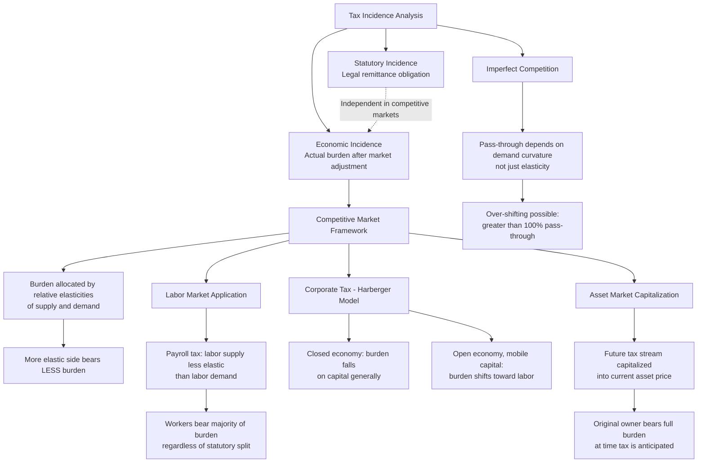

## Tax Incidence and the Shifting of Tax Burdens

### Overview

Tax incidence theory analyzes who actually bears the economic burden of a tax, as distinct from who is legally obligated to remit it to the government—a distinction with profound implications for tax policy design, since the statutory assignment of tax liability frequently diverges substantially from the economic (or "effective") incidence once markets adjust prices and quantities in response to the tax. This topic develops the standard partial-equilibrium incidence framework introduced implicitly in the optimal taxation topic's Ramsey rule discussion, extends it to labor and capital markets, and surveys general equilibrium and dynamic incidence considerations relevant to corporate tax policy debates.

### Statutory Versus Economic Incidence

#### The Core Distinction

Statutory incidence identifies the party legally required to remit a tax to the taxing authority (e.g., the employer for the employer-side payroll tax, the retailer for a sales tax). Economic incidence identifies who ultimately bears the tax's cost after accounting for price and behavioral adjustments in the relevant market—and a foundational result of tax incidence theory is that economic incidence is entirely independent of statutory incidence in a competitive market: it does not matter, in terms of final economic burden, whether a tax is statutorily imposed on buyers or sellers, since market prices will adjust to allocate the burden according to the relative elasticities of supply and demand regardless of the legal remittance point.

$$\text{Economic incidence} \neq f(\text{Statutory incidence})$$

This "invariance of incidence to statutory assignment" result is among the most robust and empirically confirmed findings in applied public economics, directly relevant to debates over whether payroll taxes should be nominally split between employer and employee (as under current U.S. Social Security and Medicare tax law) or assigned entirely to one party, since the split has, in competitive labor market theory, no effect on the actual economic division of the burden.

### The Elasticity-Based Incidence Framework

#### General Formula

The standard partial-equilibrium result allocates the economic burden of a tax between buyers and sellers in inverse proportion to their relative elasticities:

$$\frac{\text{Burden on buyers}}{\text{Burden on sellers}} = \frac{\varepsilon_s}{\varepsilon_d}$$

expressed alternatively as the buyer's share of the tax burden:

$$\text{Buyer's share} = \frac{\varepsilon_s}{\varepsilon_s + |\varepsilon_d|}$$

where $\varepsilon_s$ is the price elasticity of supply and $\varepsilon_d$ is the price elasticity of demand (in absolute value). The core intuition: the side of the market that is *more elastic* (more able to adjust quantity in response to price, i.e., more able to exit the market or substitute away) bears a *smaller* share of the tax burden, since that side can more effectively "escape" the tax by reducing quantity transacted, shifting more of the burden onto the less elastic (less able to adjust) side of the market.

#### Extreme Cases

Two limiting cases illustrate the framework's logic clearly:

- **Perfectly inelastic demand** ($\varepsilon_d = 0$): buyers bear the entire tax burden regardless of statutory incidence, since they cannot adjust quantity demanded in response to the price increase (a classic example is a tax on a good with no substitutes and highly inelastic demand, such as insulin for diabetics in the short run).
- **Perfectly elastic supply** ($\varepsilon_s = \infty$): buyers similarly bear the entire burden, since suppliers can costlessly exit the market (relocate production, shift to alternative uses of capital) rather than accept any price reduction, forcing the full tax onto the price paid by buyers.

\text{Perfectly inelastic demand} \implies \text{Buyers bear 100% of burden}

### Labor Market Tax Incidence: The Payroll Tax Case

#### Applying the Framework to Labor Supply and Demand

Payroll taxes (Social Security, Medicare, and analogous social insurance contributions) are statutorily split between employers and employees in many jurisdictions, but the economic incidence depends on the relative elasticities of labor supply and labor demand, not the statutory split. Empirical labor economics research (a large literature following early contributions and subsequent refinements) generally finds labor supply is considerably less elastic than labor demand in most contexts (particularly for prime-age workers with limited extensive-margin labor force participation responsiveness), implying that most of the economic burden of payroll taxation falls on workers (in the form of lower wages) regardless of the statutory employer/employee split—a widely cited example of the divergence between statutory and economic incidence with direct relevance to public understanding of "who pays" payroll taxes.

$$w_{\text{net}} = w_{\text{gross}} - (1 - \text{Worker's incidence share}) \times \text{Tax}$$

#### Monopsony Complications

As developed in the labor market theory topic, where employer monopsony power is present, the standard competitive incidence framework requires modification: the presence of a wedge between the wage and marginal cost of labor under monopsony can alter the incidence calculation in ways that depart from the simple elasticity ratio formula, since the monopsonist's optimal response to a tax on labor is governed by the interaction between the tax and its existing wage-setting power rather than simple price-taking behavior on either side of the market.

### Corporate Tax Incidence: A Persistent Empirical and Theoretical Controversy

#### The Statutory Fiction

The corporate income tax is statutorily imposed on corporations, but corporations are legal entities, not final economic actors—someone must ultimately bear the tax's real economic burden: shareholders (through reduced after-tax returns on capital), workers (through reduced wages, if capital taxation reduces investment and thereby reduces the capital-to-labor ratio and consequently labor productivity and wages), or consumers (through higher prices, if the corporation can pass the tax forward). Determining this division is one of the most persistently contested questions in applied public finance.

#### The Harberger General Equilibrium Model

Arnold Harberger's foundational 1962 two-sector general equilibrium model examines corporate tax incidence in a setting with both a corporate and non-corporate sector, mobile capital across sectors, and fixed total capital and labor supply in the economy. Harberger's classic result finds that, under his baseline assumptions (closed economy, capital mobile across sectors but the aggregate capital stock fixed), the corporate tax burden falls primarily on capital generally (both corporate and non-corporate capital, since capital flees the taxed corporate sector until after-tax returns equalize across sectors, spreading the burden across all capital in the economy) rather than being fully capitalized into the value of shares in corporate firms specifically or shifted forward to corporate-sector consumers or workers.

#### Open-Economy Extensions and the Modern Consensus Shift

Subsequent extensions of the Harberger framework to an open economy with internationally mobile capital (a considerably more realistic assumption for the contemporary globalized economy than Harberger's original closed-economy setting) produce a materially different result: if capital is highly mobile internationally (able to relocate to lower-tax jurisdictions in response to domestic corporate taxation) while labor is comparatively immobile, standard general equilibrium tax incidence theory predicts that a substantial share of the corporate tax burden shifts from capital onto domestic labor, since mobile capital can escape the tax by relocating abroad while immobile labor cannot escape the resulting reduction in the domestic capital stock and associated productivity/wage effects.

$$\text{Capital mobility} \uparrow \implies \text{Labor's share of corporate tax incidence} \uparrow$$

This open-economy theoretical shift has generated substantial subsequent empirical work (including studies by Kevin Hassett, Aparna Mathur, and others finding evidence of significant labor-borne corporate tax incidence in cross-country panel data, though these studies have themselves been subject to methodological critique regarding identification and robustness) and has become a live and consequential debate in tax policy analysis, since the assumed division of corporate tax incidence between capital and labor directly affects standard distributional tables (such as those produced by the Congressional Budget Office, Joint Committee on Taxation, and Treasury Department) used to evaluate the progressivity of corporate tax changes.

[Inference] The precise empirical division of corporate tax incidence between capital and labor remains genuinely unsettled in the applied public finance literature, with estimates varying substantially across studies, time periods, and countries examined, and U.S. government distributional analysis agencies (CBO, JCT, Treasury) have themselves adopted differing assumed incidence splits (and have revised their assumptions over time) reflecting this underlying empirical uncertainty rather than a settled consensus figure.

### Capitalization: Incidence in Asset Markets

#### The Concept of Tax Capitalization

Where a tax applies to the flow of returns from a durable asset (property taxes on real estate, for example), the tax's burden can become "capitalized" into the asset's purchase price at the time of a subsequent sale: a buyer purchasing an asset subject to a known, anticipated future tax stream will rationally discount the price paid to reflect the present value of that tax burden, meaning the *original owner at the time the tax is imposed or anticipated* bears the full economic burden (through a one-time reduction in the asset's sale value), while subsequent purchasers who bought at the already-discounted price bear no additional incremental burden from the anticipated tax (since they already paid a price reflecting it).

$$P_{\text{asset, post-tax}} = P_{\text{asset, pre-tax}} - PV(\text{future tax stream})$$

This capitalization phenomenon has significant implications for the equity analysis of property tax changes and for the "who really pays" question in local public finance (property tax incidence, in Peter Mieszkowski and George Zodrow's influential "new view" of the property tax as, similarly to the Harberger corporate tax model, ultimately a tax on capital generally, mediated through capital mobility across jurisdictions, versus the traditional "benefit view" treating local property taxes as a price for local public services).

### Tax Incidence and Behavioral/Dynamic Considerations

#### Incidence Over Time: Announcement and Anticipation Effects

Where a tax change is announced in advance of its effective implementation date, forward-looking economic actors may adjust behavior (accelerating transactions before the tax takes effect, or delaying them if a future tax reduction is anticipated) in ways that shift a portion of the tax's economic effect into periods before its formal legal effective date—a phenomenon documented extensively in the context of announced capital gains tax rate changes and asset sale timing (Poterba and others), and directly relevant to the elasticity of taxable income literature discussed in the optimal taxation topic, since timing-shifting behavior is one of the specific behavioral margins captured within a broadly measured ETI.

#### Tax Incidence Under Imperfect Competition

The standard competitive incidence framework requires modification under imperfect competition (monopoly, oligopoly): a monopolist's optimal response to a per-unit tax depends on the curvature of the demand curve (not solely its elasticity at the pre-tax equilibrium point), and in some demand curve specifications (notably constant-elasticity demand), a monopolist facing a per-unit tax may pass forward *more* than 100% of the tax to consumers (over-shifting), a theoretical possibility that does not arise under the standard competitive model, where full pass-through (100%) is the maximum possible outcome under perfectly inelastic demand.

[Inference] Empirical evidence of over-shifting in specific imperfectly competitive markets exists in some studies (certain cigarette and alcohol excise tax pass-through studies have found pass-through rates exceeding 100% in specific market contexts), though the generality of over-shifting across differently structured markets depends on the specific demand curvature and competitive conditions present, which vary by market and are not universal.

### Diagram: Tax Incidence Determinants Across Market Structures

### Worked Example: Elasticity-Based Incidence Calculation

**Scenario**: A government imposes a $1 per-unit excise tax on a good with price elasticity of demand $\varepsilon_d = -0.5$ and price elasticity of supply $\varepsilon_s = 2.0$.

**Step 1 — Calculate the buyer's incidence share**:

$$\text{Buyer's share} = \frac{\varepsilon_s}{\varepsilon_s + |\varepsilon_d|} = \frac{2.0}{2.0 + 0.5} = \frac{2.0}{2.5} = 0.80$$

**Step 2 — Calculate the seller's incidence share**:

$$\text{Seller's share} = 1 - 0.80 = 0.20$$

**Step 3 — Interpret**: Buyers bear 80 cents of the $1 tax (through a higher price paid), while sellers bear 20 cents (through a lower net-of-tax price received), regardless of whether the tax is statutorily imposed on buyers or sellers at the point of transaction. This result follows directly from demand being considerably less elastic (in absolute value) than supply in this example: buyers, being less able to adjust their consumption in response to the price change, absorb the larger share of the burden—precisely the mechanism underlying the labor market payroll tax example above, where relatively inelastic labor supply causes workers (the "sellers" of labor) to bear most of the burden even when supply, rather than demand, is the less elastic side.

**Correction and clarification**: Note that in the labor market case, workers are the *suppliers* of labor (the less elastic side in that market, given inelastic labor supply), so it is *labor supply's* relative inelasticity (relative to labor demand) that causes *workers* to bear the majority burden—consistent with the general principle that the less elastic side of any market (regardless of whether that side is conventionally the "buyer" or "seller" in the transaction) bears the larger share of any tax imposed on that market.

### Key Points

- Economic incidence (who actually bears a tax's burden) is independent of statutory incidence (who is legally required to remit it) in competitive markets—a robust and foundational result of tax incidence theory.
- The elasticity-based incidence framework allocates tax burden inversely to relative elasticities: the more elastic side of a market (better able to adjust quantity) bears a smaller share of the burden.
- Payroll tax incidence falls predominantly on workers in most empirical labor market contexts, since labor supply is typically less elastic than labor demand, regardless of the statutory employer/employee split.
- Harberger's general equilibrium model finds corporate tax incidence falls on capital generally in a closed economy, but open-economy extensions with internationally mobile capital predict a substantial share shifts onto domestic labor—a live and empirically unsettled debate with direct relevance to corporate tax distributional analysis.
- Tax capitalization causes the burden of an anticipated tax on a durable asset's income stream to fall on the asset owner at the time the tax is imposed or anticipated, not on subsequent purchasers who buy at an already-discounted price.
- Imperfect competition can produce incidence outcomes (including over-shifting exceeding 100% pass-through) not possible under the standard competitive framework, since pass-through under monopoly depends on demand curvature rather than elasticity alone.

### Related Topics

- Principles of optimal taxation (chapter continuity: Ramsey rule elasticity logic and deadweight loss foundations)
- Corporate tax reform debates and distributional table methodology (CBO, JCT, Treasury incidence assumptions)
- Property tax incidence: the "benefit view" versus the "new view" (Mieszkowski-Zodrow) debate
- International tax competition and capital mobility's effect on domestic tax base and incidence
- Excise tax pass-through empirical studies: cigarettes, alcohol, and sugar-sweetened beverages
- Payroll tax policy and Social Security financing reform debates
- Elasticity of taxable income and behavioral responses to announced tax changes
- General equilibrium tax modeling and computable general equilibrium (CGE) policy analysis tools