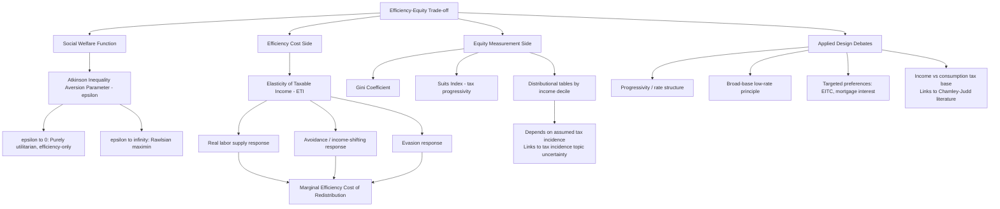

## Efficiency-Equity Trade-offs in Tax Design

### Overview

The efficiency-equity trade-off is the organizing normative tension underlying nearly all applied tax policy design, synthesizing the deadweight loss and Mirrlees redistribution concepts introduced in the optimal taxation topic into a broader framework for evaluating concrete tax design choices. This topic examines the theoretical structure of the trade-off, the social welfare function apparatus used to formalize it, the empirical measurement challenges in quantifying both sides of the trade-off, and applied design debates (progressivity, the tax base choice, and targeted preferences) that operationalize the underlying tension.

### Formalizing the Trade-off: The Social Welfare Function Approach

#### The Basic Structure

As introduced in the optimal taxation topic's Mirrlees framework, the standard formal approach to the efficiency-equity trade-off specifies a social welfare function (SWF) that aggregates individual utilities (or, in applied practice, individual incomes weighted by a specified schedule of social marginal utility weights) into a single social objective, then asks what tax and transfer policy maximizes that objective subject to a government revenue requirement and the incentive-compatibility constraints imposed by individuals' endogenous behavioral responses to taxation.

$$SW = \int_0^\infty W(y_i) \, dF(y_i)$$

where $W(\cdot)$ is a social welfare weighting function, conventionally assumed concave (reflecting diminishing marginal utility of income, and hence a social preference for redistribution from higher to lower income individuals, all else equal) and $F(y_i)$ is the income distribution.

#### The Atkinson Inequality Aversion Parameter

Anthony Atkinson's influential formalization (1970) parameterizes the degree of social inequality aversion built into the SWF using a single parameter $\varepsilon$ (the inequality aversion parameter), embedded in a constant relative inequality aversion social welfare function:

$$W(y) = \frac{y^{1-\varepsilon}}{1-\varepsilon} \quad (\varepsilon \neq 1)$$

As $\varepsilon \to 0$, the SWF approaches a purely utilitarian (efficiency-only, sum-of-incomes) objective with no independent concern for distribution; as $\varepsilon \to \infty$, the SWF approaches a Rawlsian maximin objective, placing essentially all social weight on the welfare of the lowest-income individual regardless of the aggregate efficiency cost. This parameterization makes explicit that the "correct" degree of redistributive ambition embedded in optimal tax policy is fundamentally a normative parameter choice, not something derivable from positive economic analysis alone—efficiency analysis can characterize the trade-off's shape (how much aggregate income must be sacrificed to achieve a given reduction in inequality) but cannot determine how much of that trade-off a society should be willing to accept, which depends on the value of $\varepsilon$ a policymaker or society adopts.

[Inference] Because $\varepsilon$ is a normative rather than empirically estimable parameter in the strict sense, applied optimal tax analysis using the Atkinson/Mirrlees apparatus typically reports results across a range of assumed inequality aversion values rather than asserting a single "correct" value, and different governments, political philosophies, and individual economists reasonably adopt different implicit or explicit values of this parameter.

### The Efficiency Cost Side: Measuring the Trade-off's "Price"

#### Marginal Cost of Redistribution and the Elasticity of Taxable Income

As developed in the optimal taxation topic, the Saez formula operationalizes the efficiency cost of higher marginal tax rates through the elasticity of taxable income (ETI): a higher ETI implies redistribution through progressive income taxation is more costly in efficiency terms (larger behavioral response, larger deadweight loss per dollar redistributed), directly linking the abstract efficiency-equity trade-off to an empirically estimable parameter. The "marginal efficiency cost of redistribution" concept—how much aggregate income is sacrificed per dollar successfully transferred from higher to lower income groups via the tax-transfer system—synthesizes the ETI-based deadweight loss framework directly into distributional policy evaluation.

$$\text{MECR} = \frac{\text{Deadweight loss from marginal rate increase}}{\text{Net revenue redistributed}}$$

#### The Behavioral Response Composition Problem

A significant complication in measuring the efficiency side of the trade-off is that the ETI (and hence the measured efficiency cost of a given tax change) reflects a composite of multiple distinct behavioral margins with different welfare implications:

- **Real labor supply responses** (hours worked, labor force participation, effort) represent genuine reductions in productive economic activity and correspond to the classical deadweight loss concept.
- **Tax avoidance and income-shifting responses** (reclassifying income between categories taxed at different rates, timing shifts, aggressive but legal tax planning) may represent primarily a transfer of resources to tax preparers/planners and a revenue loss to government, without necessarily a corresponding reduction in genuine economic activity—meaning a portion of measured ETI may reflect a redistribution-from-government-to-avoidance-industry effect rather than a pure efficiency (deadweight) loss in the classical sense, though the resources consumed in avoidance activity (accountant and lawyer time, restructuring costs) are themselves a genuine real resource cost.
- **Tax evasion** (illegal non-reporting) represents a distinct category again, with its own detection-probability-dependent welfare analysis (following the Becker economic-crime framework introduced in the employment-at-will topic's punitive damages discussion).

[Inference] Because these distinct behavioral margins have different welfare implications (with avoidance/evasion arguably warranting a different weighting than genuine real-activity responses in a normatively rigorous efficiency cost calculation), the practical translation of an aggregate estimated ETI into a precise efficiency cost figure for policy purposes involves judgment calls about how to weight or decompose the underlying behavioral margins, an issue actively discussed in the Saez-Slemrod-Feldstein tradition of applied optimal tax research but not fully resolved by a single agreed methodology.

### Applied Design Debates Operationalizing the Trade-off

#### Progressivity: Rate Structure Design

The choice of how steeply marginal tax rates should rise with income (progressivity) is the most direct applied manifestation of the efficiency-equity trade-off: steeper progressivity better achieves vertical equity/redistributive goals (per a concave social welfare function) but, per the Saez formula and the broader Mirrlees framework, imposes greater efficiency costs at the margin, particularly on higher earners whose income-generating behavior (labor supply, entrepreneurial risk-taking, tax planning) tends to be more elastic than that of lower and middle-income taxpayers (an empirical claim itself subject to ongoing ETI-literature debate, as discussed in the optimal taxation topic).

#### The Broad-Base, Low-Rate Principle Revisited

As introduced in the optimal taxation topic's deadweight loss discussion, the quadratic relationship between tax rates and deadweight loss ($DWL \propto t^2$) provides a purely efficiency-based argument for broadening the tax base (eliminating exemptions, deductions, and preferential rates) while lowering statutory rates to raise the same total revenue—since a broader base spreads the same revenue requirement across more taxed activity at a lower marginal rate, reducing aggregate deadweight loss relative to a narrower base taxed at a higher rate. This principle is in some tension with using targeted tax preferences (discussed below) as a redistributive or behavior-incentivizing tool, illustrating that the efficiency-equity trade-off is not confined to the top-line progressivity question alone but pervades granular tax base design choices as well.

#### Targeted Tax Preferences: Efficiency Cost Versus Distributional and Externality-Correction Benefits

Targeted deductions, credits, and exclusions (the mortgage interest deduction, the Earned Income Tax Credit discussed in the labor economics chapter's minimum wage topic, retirement savings tax preferences, charitable contribution deductions) each represent a departure from the pure broad-base principle, justified (with varying degrees of economic support) on distinct grounds:

- **Distributional/redistributive justification**: the EITC is explicitly designed to redistribute toward low-income working households while, unlike a simple wage subsidy analyzed in isolation, its phase-in structure is intended to increase (rather than reduce) labor force participation incentives at the low end of the income distribution, illustrating that some targeted provisions can advance both equity and efficiency simultaneously in certain ranges, complicating a simple story of pure trade-off.
- **Externality-correction justification**: preferences for retirement savings, health insurance, or specific investments may be justified (independent of any distributional goal) as correcting a separate externality or behavioral market failure (as discussed in the consumer financial protection topic's treatment of present bias and under-saving), rather than as a pure efficiency-equity trade-off instrument.
- **Horizontal equity critique**: as introduced in the optimal taxation topic, targeted preferences can create horizontal inequities among taxpayers with identical total income but different consumption patterns, income composition, or life circumstances (a homeowner benefiting from the mortgage interest deduction relative to an otherwise-identical renter, for example)—a distinct normative cost from the pure efficiency-equity trade-off, since horizontal equity is not directly reducible to either the aggregate efficiency or aggregate vertical-equity dimension of the standard SWF framework.

#### Consumption Versus Income Taxation

A long-standing applied tax design debate concerns whether the tax base should be income (taxing both labor earnings and the return to saved capital) or consumption (effectively exempting the normal return to saving, taxing only what is actually consumed). The efficiency case for consumption taxation draws directly on the Chamley-Judd capital taxation literature discussed in the optimal taxation topic (since a pure income tax double-taxes saved income relative to consumed income, distorting the intertemporal consumption-saving margin in the manner the zero-capital-tax result addresses), while the equity concern is that a pure consumption tax, absent additional progressive rate structure or exemptions, may under-tax the wealthy (who save a larger share of income) relative to an equivalent-revenue progressive income tax—directly recapitulating, in a different applied context, the same efficiency-versus-equity tension embedded in the abstract Chamley-Judd/heterogeneous-agent debate.

### Empirical Measurement of the Equity Side: Distributional Analysis Tools

#### Standard Distributional Metrics

Applied tax policy evaluation typically quantifies the equity side of the trade-off using standard inequality and progressivity metrics: the Gini coefficient (summarizing overall income/after-tax-income inequality in a single index), the Suits index (a Gini-analog specifically measuring the progressivity of a tax system by comparing cumulative tax burden against cumulative income), and effective tax rate distributional tables by income decile or percentile (produced by CBO, JCT, Treasury, and the Tax Policy Center), which directly translate the abstract SWF/redistribution concept into concrete, policy-relevant summary statistics.

$$\text{Suits Index} = \frac{K - L}{K}$$

where $K$ is the area under the line of perfect proportionality and $L$ is the area under the actual tax concentration curve (analogous to a Lorenz curve but for cumulative tax burden against cumulative income rather than cumulative income against population share)—a positive Suits index indicates a progressive tax system, a negative index indicates regressivity, and zero indicates strict proportionality.

#### The Incidence Assumption Dependency

As developed in the tax incidence topic, any distributional table's conclusions about a given tax's equity properties depend critically on the assumed economic incidence (who actually bears the tax), not merely its statutory structure—meaning the empirical measurement of the "equity" side of the efficiency-equity trade-off for taxes like the corporate income tax is itself subject to the same underlying incidence uncertainty discussed in that topic (the open-economy capital mobility debate over labor- versus capital-borne corporate tax incidence), directly linking the two topics' respective uncertainties: an unsettled incidence assumption propagates into an unsettled equity assessment for the same tax instrument.

### Diagram: The Efficiency-Equity Trade-off Structure

### Worked Example: Quantifying the Trade-off with the Atkinson Framework

**Scenario**: A government considers raising the top marginal tax rate to fund a transfer program to low-income households. Suppose analysis using the Saez ETI-based framework estimates this policy would reduce aggregate (pre-transfer) national income by $10 billion (the efficiency cost) while successfully transferring a net $40 billion to the bottom income quintile (after subtracting the $10 billion efficiency loss from the gross revenue raised).

**Applying different inequality aversion assumptions**:

Under a low inequality aversion parameter ($\varepsilon$ close to 0, near-utilitarian), the social welfare calculation weights the $10 billion aggregate income loss relatively heavily against the redistributive gain, since a purely utilitarian SWF cares primarily about aggregate income rather than its distribution—such a policymaker might judge the policy's efficiency cost too high relative to its (in this framework, unweighted) redistributive benefit.

Under a high inequality aversion parameter ($\varepsilon$ large, approaching Rawlsian), the same $10 billion efficiency cost is judged relatively unimportant compared to the substantial welfare gain from a large transfer to the lowest-income households (whose marginal utility of additional income is assumed very high under strong inequality aversion)—such a policymaker would very likely judge the policy socially beneficial despite its efficiency cost.

**Key takeaway**: [Inference] Because both the $10 billion efficiency cost estimate (itself dependent on the ETI parameter's contested empirical estimation, per the composition problem discussed above) and the appropriate inequality aversion parameter $\varepsilon$ (an inherently normative choice) are subject to substantial uncertainty or normative disagreement, this stylized calculation illustrates why reasonable analysts and policymakers, even when agreeing on the same underlying positive economic facts (the $10 billion efficiency cost estimate), can reach opposite normative conclusions about whether a given redistributive tax policy is socially desirable, since the disagreement often resides in the weighting parameter rather than in the positive economic analysis itself.

### Key Points

- The Atkinson inequality aversion parameter formalizes the efficiency-equity trade-off as depending on an inherently normative choice (how much society values redistribution relative to aggregate income), not something derivable from positive economic analysis alone.
- The elasticity of taxable income, central to the Saez optimal tax formula introduced in the optimal taxation topic, operationalizes the efficiency cost side of the trade-off, but its composite nature (real labor supply, avoidance, evasion) complicates precise translation into a normatively rigorous deadweight loss measure.
- The broad-base, low-rate principle provides a purely efficiency-based design heuristic, in tension with using targeted tax preferences to advance distributional or externality-correction goals.
- Some targeted provisions (notably the EITC) can advance both equity and efficiency simultaneously in specific income ranges, complicating a simple monotonic trade-off narrative.
- Empirical measurement of the equity side (distributional tables, Suits index) depends critically on the assumed economic incidence of each tax, directly linking unresolved incidence questions (particularly for the corporate tax) to unresolved equity assessments.
- The consumption-versus-income tax base debate directly recapitulates the Chamley-Judd efficiency case for exempting capital income against equity concerns about under-taxing higher-saving, typically wealthier households.

### Related Topics

- Principles of optimal taxation (chapter continuity: Mirrlees framework, Saez formula, and Chamley-Judd capital taxation)
- Tax incidence and the shifting of tax burdens (chapter continuity: incidence assumptions underlying distributional analysis)
- Earned Income Tax Credit design and labor supply effects (chapter continuity: minimum wage topic's EITC discussion)
- Wealth tax proposals and their relationship to consumption versus income tax base debates
- Behavioral public finance: present bias and retirement savings tax preference design
- Comparative international tax progressivity and cross-country Suits index analysis
- Elasticity of taxable income estimation methodology and the avoidance/evasion decomposition problem
- Rawlsian versus utilitarian social welfare frameworks in normative public economics