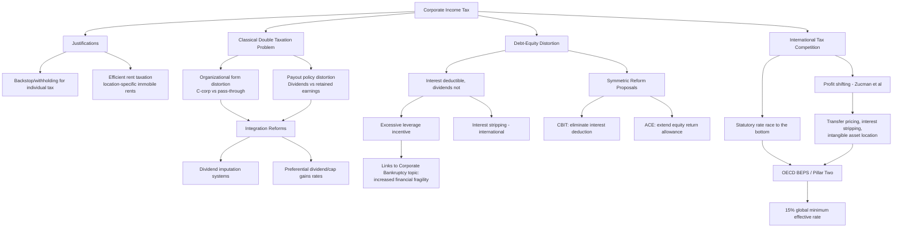

## Economic Analysis of Corporate Taxation

### Overview

Corporate taxation raises distinctive theoretical and empirical questions beyond the general incidence and optimal-tax frameworks developed in the preceding topics, because the corporate entity is a legal fiction interposed between the tax and the ultimate economic actors (shareholders, workers, consumers) who bear its real burden, and because the corporate form itself creates specific distortions (the classical double-taxation problem, debt-equity distortion, and international profit-shifting incentives) not present in a pure individual income tax. This topic synthesizes the Harberger incidence analysis from the tax incidence topic with corporate-tax-specific efficiency concerns, examining the economic rationale for taxing corporations at all, the debt bias problem, and the international tax competition and profit-shifting literature.

### Why Tax Corporations at All? Theoretical Justifications

#### The Backstop/Withholding Rationale

One prominent justification treats the corporate income tax primarily as a withholding mechanism protecting the integrity of the individual income tax: absent a corporate-level tax, individuals could indefinitely defer personal income tax liability on corporate profits simply by retaining earnings within the corporate form rather than distributing them as taxable dividends, using the corporation as a tax-deferred (or, if held until death and stepped up in basis, tax-avoided entirely) savings vehicle. Under this view, the corporate tax is not conceptually a tax on a separate "corporate" entity but rather a mechanism ensuring that corporate-source income does not escape the individual income tax base indefinitely through retention.

#### The Rent-Extraction/Location-Specific Rents Rationale

A distinct efficiency-based justification, emphasized in more recent optimal tax literature (including work by Alan Auerbach and Michael Devereux), argues the corporate tax can be justified as a relatively efficient way to tax economic rents—above-normal returns to location-specific factors (natural resources, agglomeration economies, market power) that are, by construction, immobile and hence taxable without inducing the investment-reducing distortion that taxing the normal (marginal, mobile) return to capital would create. Under this rationale, an ideal corporate tax design would exempt the normal return to investment (allowing full and immediate expensing of capital costs, functionally converting the tax into a rent tax) while taxing only above-normal returns, minimizing the investment-distorting efficiency cost highlighted by the Chamley-Judd capital taxation literature discussed in the optimal taxation topic.

$$\text{Rent} = \text{Total return} - \text{Normal (opportunity cost) return}$$

#### Corporate Tax as a Backstop Against Individual Tax Avoidance via Business Entity Choice

A related practical rationale holds that some corporate-level tax is necessary to prevent wholesale conversion of what would otherwise be individually taxed labor or business income into corporate form purely to access a lower corporate rate relative to top individual rates—an incentive that becomes more acute the larger the gap between top individual and corporate statutory rates, and which has generated extensive anti-abuse doctrine (entity classification rules, passive-activity limitations, reasonable-compensation requirements for closely held corporations) aimed at preventing purely tax-motivated entity-form arbitrage.

### The Classical System and the Double Taxation Problem

#### Statement of the Problem

Under a "classical" corporate tax system (the traditional U.S. approach prior to various integration-oriented reforms), corporate profits are taxed once at the corporate level and again at the shareholder level when distributed as dividends (or, for capital gains, when realized upon sale of appreciated stock reflecting retained corporate earnings)—producing a combined effective tax rate on corporate-source income exceeding either the standalone corporate or individual rate, and creating a differential tax burden on corporate-source income relative to income earned through unincorporated business forms (partnerships, S-corporations, sole proprietorships) that are taxed only once, at the individual owner level ("pass-through" taxation).

$$\tau_{\text{combined}} = \tau_{\text{corporate}} + (1 - \tau_{\text{corporate}}) \times \tau_{\text{dividend/capital gains}}$$

#### Efficiency Consequences: The Organizational Form and Financing Distortions

This double taxation creates two significant, well-documented distortions:

- **Organizational form distortion**: the tax differential creates an incentive to organize business activity in pass-through form (partnerships, LLCs, S-corporations) rather than as a traditional C-corporation, distorting the choice of legal organizational structure away from what would otherwise be the most efficient form for the underlying business (considerations of limited liability, capital-raising needs, governance structure) and toward the form minimizing tax liability.
- **Payout policy distortion**: because retained earnings that generate capital gains (taxed upon realization, often at a preferential capital gains rate, and only upon the shareholder's voluntary decision to sell) are frequently taxed less heavily in present-value terms than currently distributed dividends (taxed immediately upon distribution), the classical system creates an incentive for corporations to retain earnings and rely on share buybacks or capital appreciation rather than dividend distributions, a distortion extensively documented in corporate finance ("dividend puzzle") literature examining why corporations pay dividends at all given this apparent tax disadvantage (with behavioral, signaling, and clientele-based explanations offered as complements to the pure tax-minimization prediction).

#### Integration Approaches

Various "integration" reforms attempt to reduce or eliminate the double-taxation wedge: dividend imputation systems (crediting shareholders for corporate tax already paid on distributed profits, used historically in Australia and several other countries), reduced (preferential) tax rates on qualified dividends and long-run capital gains relative to ordinary income rates (the partial-integration approach adopted in current U.S. law since 2003), and full corporate-level integration proposals (allowing corporations to deduct dividends paid, analogous to the deduction currently allowed for interest paid, discussed further below in the context of the debt-equity distortion).

### The Debt-Equity Distortion

#### The Interest Deductibility Asymmetry

A separate and economically significant distortion arises because interest paid on corporate debt is deductible against corporate taxable income, while dividends and other returns to equity capital are not deductible (creating the double-taxation wedge discussed above for equity-financed returns specifically). This asymmetric treatment creates a systematic tax incentive favoring debt over equity financing at the margin, since debt financing avoids the corporate-level tax entirely on the portion of returns paid out as deductible interest, while equity financing bears the full classical double-taxation burden.

$$\text{After-tax cost of debt} = r_d (1 - \tau_{\text{corporate}})$$

$$\text{After-tax cost of equity} = r_e \text{ (no corporate-level deduction)}$$

#### Efficiency Consequences of Debt Bias

The debt-equity distortion has several well-documented efficiency consequences extensively analyzed in the corporate finance and public finance literature:

- **Excessive leverage and increased financial fragility**: the tax-favored treatment of debt provides firms an incentive to maintain higher debt-to-equity ratios than would be optimal on pure (non-tax) risk-management and capital-structure grounds (per the Modigliani-Miller theorem's baseline prediction of capital structure irrelevance absent taxes and other frictions, with taxation being precisely one of the key frictions Modigliani and Miller's own subsequent extensions identified as generating a systematic leverage preference), potentially increasing aggregate financial system fragility and bankruptcy risk—a concern with direct relevance to the corporate bankruptcy and reorganization topic discussed earlier, since higher tax-induced leverage increases the frequency and severity of the financial distress and reorganization proceedings analyzed there.
- **Reduced corporate tax revenue through interest stripping**: multinational corporations can exploit the interest deductibility asymmetry through intercompany debt arrangements (a subsidiary in a high-tax jurisdiction borrows from an affiliate in a low-tax jurisdiction, generating a deductible interest expense in the high-tax jurisdiction and taxable interest income in the low-tax jurisdiction), a specific and well-documented profit-shifting mechanism addressed by earnings-stripping limitation rules (such as Section 163(j) of the U.S. Internal Revenue Code, substantially tightened by the 2017 Tax Cuts and Jobs Act) and analogous rules in other jurisdictions following the OECD's Base Erosion and Profit Shifting (BEPS) project recommendations.

#### Comprehensive Business Income Tax and Allowance for Corporate Equity Proposals

Two prominent, symmetric reform proposals address the debt-equity distortion from opposite directions: a Comprehensive Business Income Tax (CBIT) would eliminate the interest deduction entirely, taxing debt and equity returns symmetrically at the corporate level (functionally extending the double-taxation treatment currently applied only to equity to debt as well); an Allowance for Corporate Equity (ACE) system, conversely, would extend a notional deduction for the normal return to equity capital (analogous to the interest deduction currently available only for debt), symmetrically eliminating the distortion from the opposite direction by making equity-financed normal returns similarly tax-exempt at the margin, directly implementing the rent-taxation logic discussed above (taxing only above-normal returns to both debt and equity capital, since the normal return to both forms of capital would be exempted).

### International Corporate Tax Competition and Profit Shifting

#### Tax Competition Theory

The mobility of corporate capital and, increasingly, of the location of reported taxable profits (as distinct from the location of genuine underlying economic activity) across national jurisdictions generates a tax competition dynamic in which individual countries have an incentive to reduce corporate tax rates to attract investment and reported profit, potentially generating a "race to the bottom" in statutory corporate tax rates—a dynamic empirically documented in the substantial decline in average OECD statutory corporate tax rates over recent decades (from rates commonly in the 40-50% range in the 1980s to a considerably lower contemporary average, with the U.S. rate itself reduced from 35% to 21% under the 2017 Tax Cuts and Jobs Act, partly motivated by this competitive dynamic).

#### Profit Shifting Mechanisms Distinct from Real Investment Relocation

A distinct and increasingly emphasized phenomenon (highlighted in influential empirical work by Thomas Tørsløv, Ludvig Wier, and Gabriel Zucman, and by Kimberly Clausing) is profit shifting: multinational corporations reporting a disproportionate share of global profits in low-tax jurisdictions relative to the genuine underlying economic activity (employment, sales, tangible investment) occurring there, achieved through mechanisms including the debt-shifting/interest-stripping technique discussed above, transfer pricing manipulation (setting intercompany prices for goods, services, and especially hard-to-value intangible assets like intellectual property to shift reported profit toward low-tax affiliates), and strategic location of intangible asset ownership (patents, trademarks, and other intellectual property with location-flexible legal ownership, generating a royalty stream that can be directed to a low-tax jurisdiction regardless of where the underlying research and development actually occurred).

$$\text{Reported profit share}_{\text{low-tax jurisdiction}} \gg \text{Real economic activity share}_{\text{low-tax jurisdiction}}$$

#### The OECD BEPS Project and Global Minimum Tax

In response to the documented scale of profit shifting (Zucman and coauthors' estimates suggesting a substantial share of global multinational profit, on the order of a significant double-digit percentage, is shifted to low-tax jurisdictions), the OECD-led Base Erosion and Profit Shifting (BEPS) project and subsequent "Pillar Two" global minimum tax framework (agreed by a large coalition of countries beginning in 2021, with phased implementation across participating jurisdictions in subsequent years) establishes a coordinated minimum effective corporate tax rate (15%) intended to reduce the incentive for both statutory rate competition and profit-shifting arrangements, by ensuring that profit shifted to a jurisdiction taxing below the minimum rate becomes subject to a top-up tax collected by another participating jurisdiction (the parent company's home jurisdiction, under the Income Inclusion Rule, or another jurisdiction under the backstop Undertaxed Profits Rule).

[Inference] The ultimate effectiveness of the Pillar Two global minimum tax framework in substantially reducing profit shifting depends on the scope of continuing participation and consistent implementation across major jurisdictions (including notably the United States' own distinct international tax rules, such as GILTI, and their degree of alignment or divergence from the OECD framework), and empirical assessment of its actual effect on measured profit-shifting behavior is still developing as implementation has proceeded only recently and unevenly across participating countries.

### Diagram: Corporate Tax Distortions and Reform Approaches

### Worked Example: Debt Bias and the After-Tax Cost of Capital

**Scenario**: A corporation faces a 21% corporate tax rate and is evaluating financing a $100 million investment either through debt (interest rate 6%) or equity (required return 8%, reflecting equity's higher risk premium).

**After-tax cost of debt financing**:

$$\text{After-tax cost} = 6\% \times (1 - 0.21) = 6\% \times 0.79 = 4.74\%$$

**After-tax cost of equity financing** (no corporate-level deduction available):

$$\text{After-tax cost} = 8\%$$

**Analysis**: Despite equity's pre-tax required return (8%) being higher than debt's pre-tax cost (6%) for reasons unrelated to taxation (equity holders bear residual risk and demand a corresponding risk premium, consistent with basic capital structure theory), the tax system's asymmetric treatment amplifies this gap substantially in after-tax terms (4.74% versus 8%, a gap of 3.26 percentage points, compared to the pre-tax gap of only 2 percentage points)—illustrating how the interest deductibility asymmetry creates an incentive to finance investment with debt beyond what pure risk-based capital structure considerations alone would suggest, precisely the debt bias distortion discussed above. Under a CBIT-style reform eliminating interest deductibility, the after-tax cost of debt would rise to the full 6% pre-tax cost, eliminating the tax-driven component of the gap and leaving only the risk-based (Modigliani-Miller-consistent, non-tax) differential between debt and equity costs.

### Key Points

- The corporate tax can be justified as a backstop protecting individual income tax integrity against indefinite retention-based deferral, or as an efficient mechanism for taxing immobile, location-specific economic rents while exempting the normal (mobile) return to investment.
- The classical system's double taxation of corporate-source income (once at the corporate level, again at the shareholder level) distorts both organizational form choice (favoring pass-through entities) and corporate payout policy (favoring retention and capital gains over dividends).
- The debt-equity distortion, arising from interest deductibility without a corresponding equity deduction, creates a systematic tax incentive favoring debt financing, with consequences for aggregate financial fragility and for international interest-stripping profit-shifting arrangements.
- CBIT (eliminating interest deductibility) and ACE (extending equity return deductibility) represent symmetric reform approaches to eliminating the debt-equity distortion from opposite directions.
- International tax competition and profit shifting (documented extensively by Zucman, Tørsløv, and Wier) involve both genuine statutory rate competition and profit relocation disconnected from underlying real economic activity, addressed by the OECD's BEPS project and the subsequent Pillar Two global minimum tax framework.
- The corporate tax's ultimate economic incidence (as developed in the tax incidence topic's Harberger analysis) remains empirically contested, directly affecting how the efficiency and revenue consequences analyzed here translate into distributional conclusions.

### Related Topics

- Tax incidence and the shifting of tax burdens (chapter continuity: Harberger model and open-economy capital mobility)
- Principles of optimal taxation (chapter continuity: Chamley-Judd capital taxation and rent-taxation logic)
- Corporate bankruptcy and the reorganization process (debt bias and its relationship to financial distress frequency)
- Modigliani-Miller capital structure theorem and its tax-based extensions
- OECD Base Erosion and Profit Shifting (BEPS) project and Pillar Two implementation
- Transfer pricing regulation and arm's-length pricing standards for intangible assets
- Dividend puzzle literature in corporate finance and payout policy theory
- Comparative corporate tax systems: dividend imputation versus classical versus integrated approaches