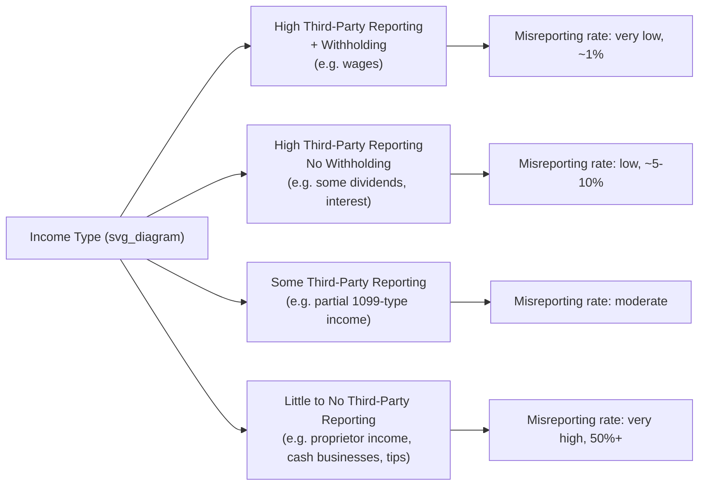
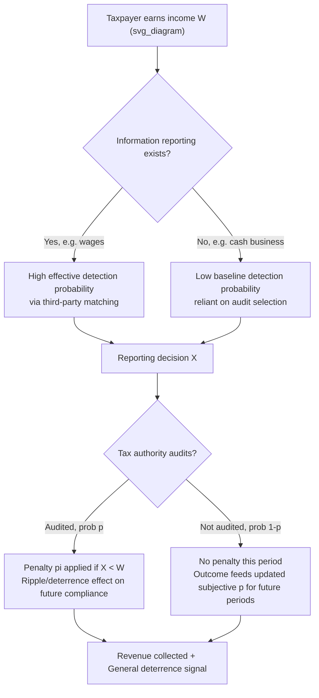

## Tax Avoidance, Evasion, and Enforcement Economics

### Conceptual Foundations

**Tax avoidance** is the legal reduction of tax liability through actions the tax code explicitly or implicitly permits: choosing between debt and equity financing, timing income recognition, exploiting statutory deductions, or shifting the legal form of a transaction without changing its economic substance. **Tax evasion** is the illegal concealment or misrepresentation of taxable activity: underreporting income, overstating deductions, or failing to file altogether. The economic literature treats both as instances of a taxpayer optimization problem subject to different constraint sets — avoidance operates within the legal boundary of the tax code, evasion operates outside it and introduces detection risk.

A third category, increasingly central to the literature, is **aggressive avoidance** or **tax sheltering** — transactions that are formally legal but designed to exploit ambiguity, technical loopholes, or enforcement gaps, often lacking economic substance beyond tax reduction. This occupies a gray zone governed by doctrines like substance-over-form, business purpose, and general anti-avoidance rules (GAARs).

**Key Points**

- Avoidance is a response to relative prices (marginal tax rates on different income forms or timing choices)
- Evasion is a response to price *and* a gamble on detection probability and penalty severity
- The boundary between avoidance and evasion is not fixed by economics but by legal doctrine, and enforcement resources determine where that boundary is practically drawn

---

### The Allingham-Sandmo Model of Evasion

The canonical economic model of tax evasion, developed by Allingham and Sandmo (1972), treats the taxpayer as an expected-utility maximizer choosing how much income to report under uncertainty.

A taxpayer has true income $W$ and reports income $X \leq W$. Reported income is taxed at rate $t$. Unreported income $W - X$ is detected with probability $p$, and if detected, is taxed at $t$ plus a penalty rate $\pi$ on the evaded tax (or on unreported income, depending on model specification).

Expected utility is:

$$EU = (1-p) \cdot U(W - tX) + p \cdot U(W - tX - \pi(W-X))$$

The taxpayer chooses $X$ to maximize $EU$. The first-order condition (for an interior solution) yields the standard portfolio-choice result: evasion is treated analogously to an investment in a risky asset, where "detection" is the bad state of the world.

**Key comparative statics:**

| Parameter increase | Effect on evasion |
| --- | --- |
| Audit probability $p$ | Decreases evasion (unambiguous) |
| Penalty rate $\pi$ | Decreases evasion (unambiguous) |
| Tax rate $t$ | Ambiguous sign — depends on risk aversion (substitution effect raises evasion; income effect under decreasing absolute risk aversion can lower it) |
| Risk aversion | Decreases evasion |

The ambiguous effect of the tax rate is a famous and counterintuitive result: standard theory does *not* predict that higher tax rates unambiguously increase evasion, because a higher rate also lowers after-tax income in both the detected and undetected states, and under decreasing absolute risk aversion (DARA), a poorer taxpayer becomes *more* risk averse and evades less. This ambiguity is a central point of tension between theory and the common political intuition that "high taxes cause evasion."

**[Inference]** Empirically, most studies find a positive relationship between tax rates and evasion, suggesting the substitution effect dominates in practice, though results are sensitive to context and identification strategy.

---

### The Puzzle of "Too Much Honesty"

A persistent critique of the Allingham-Sandmo framework is that, calibrated to realistic audit probabilities (often 1–3%) and penalty rates, the model predicts far more evasion than is empirically observed. Most taxpayers, especially wage earners subject to third-party reporting, report income far more honestly than a pure expected-utility-of-detection calculation would predict.

This gap motivated extensions incorporating:

- **Non-expected-utility preferences**: prospect theory (Kahneman-Tversky), where taxpayers overweight small probabilities (like audit risk) relative to objective probability, and where losses (from being caught) loom larger than equivalent gains
- **Tax morale**: intrinsic motivation to comply, driven by perceived fairness of the tax system, trust in government, social norms, and reciprocity (the taxpayer complies partly because they believe others do, and because they value public goods financed by taxes)
- **Social/psychological costs**: stigma, guilt, and reputational costs of being caught, which are not purely pecuniary and can be large relative to formal penalties
- **Third-party information reporting**: wages reported via W-2/employer withholding (or equivalent in other jurisdictions) create a paper trail independent of taxpayer honesty, making "detection probability" effectively much higher than random audit rates suggest for reported-income categories

**[Inference]** The consensus in modern public finance is that third-party information reporting, not deterrence via audit-and-penalty alone, explains the bulk of compliance among wage earners — a finding with direct implications for enforcement design (see below).

---

### The Tax Gap and Compliance by Income Source

The **tax gap** is the difference between taxes legally owed and taxes actually and timely paid. It is typically decomposed into:

1. **Nonfiling gap** — liability from taxpayers who fail to file
2. **Underreporting gap** — the largest component in most jurisdictions, further split by income type
3. **Underpayment gap** — reported but unpaid liabilities

**Underreporting varies dramatically by information-reporting regime:**

This gradient — compliance falling sharply as third-party verification falls — is one of the most robust empirical regularities in tax compliance research (Kleven et al. 2011, using randomized Danish audits, is a leading identification-clean study). It implies that evasion opportunity, not just marginal incentive, is a first-order determinant of the tax gap, and that self-employment and cash-intensive sectors are structurally the highest-evasion segments regardless of tax rate levels.

---

### Enforcement Economics: Audits, Detection, and Deterrence

**The economics of audit selection.** Tax administration faces a resource-allocation problem: audits are costly, and detection probability is endogenous to the tax authority's enforcement budget and targeting technology. Optimal enforcement theory (building on Becker's 1968 economics-of-crime framework, later applied to tax by Sandmo, Kaplow, and others) asks how to allocate a fixed enforcement budget across $p$ (audit probability) and $\pi$ (penalty severity) to maximize compliance at minimum social cost.

A key theoretical result (from the crime-and-punishment literature, applicable to tax): because penalties are largely a **transfer** (from evader to state) while audits consume **real resources**, a risk-neutral-taxpayer model favors very high penalties combined with very low audit probability — since raising $\pi$ is costless at the margin while raising $p$ consumes administrative resources. In practice this prescription is tempered by:

- Risk aversion and liquidity constraints (extreme penalties are politically and practically unenforceable, and can bankrupt otherwise-compliant taxpayers making honest reporting errors)
- Errors in enforcement (wrongly penalizing compliant taxpayers)
- The general deterrence value of *visible* audit activity, which has spillover effects beyond the audited taxpayer

**Audit spillovers ("ripple effects").** A major finding from field experiments (e.g., Kleven et al. 2011; DeBacker et al. using U.S. IRS data) is that being audited today, or knowing that audits occur, raises future reported income not just for the audited individual but for others who become aware of the audit (via information networks, professional preparers, or firm-level reporting behavior). This general-deterrence effect can dominate the direct specific-deterrence effect of any single audit, meaning enforcement resources have effects far beyond their direct revenue yield ("bang for the buck" of visible enforcement > direct audit recovery).

**Preparer and third-party effects.** Enforcement economics increasingly focuses on intermediaries — paid tax preparers, accountants, banks, and payroll processors — as points of leverage. Because a single preparer's misreporting technology can be replicated across thousands of returns, targeting or certifying preparers has larger marginal deterrence value per enforcement dollar than targeting individual filers.

**Real-time and algorithmic detection.** Modern tax administration increasingly uses machine-learning risk-scoring models to target audits (analogous in structure to fraud-detection models in banking), shifting the marginal cost of detection down and effectively raising perceived $p$ even without proportional increases in headcount. **[Unverified]** The precise gains in detection efficiency from specific algorithmic approaches vary by jurisdiction and are often not publicly disclosed in detail, since revealing scoring criteria would allow taxpayers to game them.

---

### The Economics of Avoidance: Elasticity of Taxable Income

Where evasion economics centers on detection risk, avoidance economics centers on the **Elasticity of Taxable Income (ETI)** — the responsiveness of reported taxable income to the net-of-tax rate $(1-t)$.

$$ETI = \frac{\partial \ln(\text{Taxable Income})}{\partial \ln(1-t)}$$

The ETI is a "sufficient statistic" in modern optimal-tax theory (Feldstein 1995, 1999; Saez, Slemrod, and Giertz 2012 survey) because it captures the *combined* behavioral response to taxation — real labor supply changes, avoidance (income shifting between tax bases, timing, form conversion), and evasion — without needing to separately model each channel. For welfare and revenue analysis, the ETI is often more useful than isolating avoidance from evasion, because from the government's fiscal perspective both reduce the tax base in response to rates.

However, ETI decomposition matters for **welfare analysis** specifically: pure income-shifting/avoidance (e.g., reclassifying labor income as capital income) has a fiscal externality on other tax bases and does not represent a real efficiency loss to society at large — it's a transfer between tax categories or jurisdictions — whereas real reductions in labor supply or evasion-driven underground activity represent genuine deadweight loss and, in evasion's case, an unrecovered public resource loss (Slemrod's "avoidance is not efficiency loss, it's revenue loss" distinction, sometimes contested).

**[Inference]** Empirical ETI estimates vary widely (roughly 0.1 to 0.4 for broad income measures in developed-country studies, higher for top-income earners with more avoidance margins available), and are highly sensitive to which forms of avoidance are legally available in the studied tax system and time period — a jurisdiction with many loopholes will show a mechanically higher ETI than one with a clean base, even if underlying labor-supply behavior is identical.

---

### Channels of Avoidance

**Income shifting across bases.** Reclassifying labor income as capital income (relevant where capital gains/dividends are taxed at lower rates than wages), or shifting income between spouses, family members, or related entities subject to different marginal rates.

**Income shifting across time.** Deferring income recognition or accelerating deductions in response to anticipated rate changes — famously observed around major U.S. tax reforms (1986, 2001, 2003, 2017), where realizations of capital gains and executive compensation spike just before rate increases take effect.

**Income shifting across jurisdictions.** International profit shifting by multinationals via transfer pricing, intercompany debt (interest deductibility differentials), royalty and licensing arrangements routed through low-tax IP holding entities, and strategic location of intangible assets. This is a distinct but closely related literature (see Hines and Rice 1994; Dharmapala 2014 survey; formulary apportionment vs. arm's-length pricing debates).

**Legal form conversion.** Organizational choice (C-corp vs. pass-through), debt-versus-equity financing (the classic "debt tax shield" from interest deductibility), and characterization of payments (wages vs. dividends vs. management fees) in closely-held businesses.

**Statutory tax expenditures.** Use of explicitly legislated deductions, credits, and exclusions (retirement account contributions, depreciation schedules, like-kind exchanges) — these are avoidance in the literal sense (legal reduction of liability) but are usually intended by policy design, distinguishing "intended avoidance" from "unintended loophole exploitation."

---

### Tax Sheltering and the Substance-Over-Form Boundary

Between clear-cut legal avoidance and clear-cut illegal evasion lies aggressive tax sheltering, where transactions are engineered to satisfy the literal text of statutes while producing outcomes the legislature did not contemplate or intend.

**Doctrinal tools used to police this boundary** (illustrative, primarily U.S.-context but analogous doctrines exist across common-law and civil-law systems):

- **Economic substance doctrine**: a transaction must have a meaningful economic effect (beyond tax reduction) and a legitimate business purpose to receive its claimed tax treatment
- **Business purpose test**: requires a non-tax motive for the transaction structure
- **Step-transaction doctrine**: collapses artificially separated steps of an integrated transaction into their substantive whole for tax purposes
- **General Anti-Avoidance Rules (GAARs)**: statutory or judicial doctrines (common in the UK, Canada, Australia, and increasingly codified in the U.S. post-2010) empowering tax authorities to disregard the form of a transaction that lacks substance and was primarily tax-motivated

**Economic framing.** From an economic standpoint, the substance-over-form boundary functions as an *endogenous, administratively-costly enforcement margin*: the tax authority cannot write a complete contract (tax code) covering every possible transaction structure, so it retains a residual, costly-to-invoke doctrine to police unanticipated exploitation — analogous to a "penalty default" or standards-versus-rules tradeoff in contract theory (Kaplow 1992; Weisbach 2002 on line-drawing in tax law).

**Key Points**

- Rules (bright-line statutory thresholds) are cheap to apply and predictable but easy to game at the margin
- Standards (substance-over-form, business purpose) are costly to apply (litigation, uncertainty) but harder to circumvent mechanically
- Real tax systems mix both, and the mix itself is a policy-design choice with efficiency implications

---

### The Shadow Economy and Cash-Intensive Sectors

A macro-level companion to individual evasion models is the literature on the **informal/shadow economy** — the aggregate share of economic activity conducted outside official tax and regulatory reporting (Schneider and Enste 2000 survey; Medina and Schneider IMF estimates). Estimation methods include:

- **Currency demand approach**: excess cash holdings relative to a model of "legitimate" transaction demand, attributed to cash-based unreported transactions
- **MIMIC (Multiple Indicators Multiple Causes) models**: latent-variable structural models linking the unobserved shadow economy to observable causes (tax burden, regulation, unemployment) and indicators (currency ratio, labor force participation, GDP growth anomalies)
- **Discrepancy methods**: gaps between income-side and expenditure-side national accounts, or between reported income and reported consumption

**[Inference]** Shadow-economy size estimates are contested and method-sensitive; MIMIC models in particular have been criticized (Breusch 2005) for weak identification and sensitivity to specification choices, so cross-country comparisons should be treated cautiously.

Cash-intensive industries (construction subcontracting, personal services, restaurants) exhibit structurally elevated evasion not primarily because operators are more tax-averse, but because the *technology of the transaction* (cash payment, no automatic third-party record) removes the information-reporting deterrent that disciplines wage and dividend income.

---

### Worked Example: Allingham-Sandmo Numerical Illustration

Consider a taxpayer with true income $W = 100{,}000$, facing tax rate $t = 0.30$, audit probability $p = 0.10$, and a penalty of $\pi = 0.50$ applied to the evaded tax amount if caught (i.e., total penalty payment on discovery equals $1.5 \times$ the evaded tax).

If the taxpayer reports $X$, then:

- If not audited (prob. 0.9): after-tax income $= W - tX = 100{,}000 - 0.30X$
- If audited (prob. 0.1): after-tax income $= W - tX - 1.5t(W-X) = 100{,}000 - 0.30X - 0.45(100{,}000 - X)$

At full evasion ($X=0$): audited outcome $= 100{,}000 - 45{,}000 = 55{,}000$; unaudited outcome $= 100{,}000$

At full compliance ($X=100{,}000$): outcome in both states $= 70{,}000$ (certain)

**Expected value** of full evasion: $0.9(100{,}000) + 0.1(55{,}000) = 95{,}500$, versus a certain $70{,}000$ from full compliance — a large expected-value gain to evasion despite the penalty. A risk-neutral taxpayer evades fully under these parameters; only sufficient risk aversion (curvature in $U(\cdot)$) or a subjectively-overweighted audit probability (as in prospect theory) can rationalize partial or full compliance — illustrating concretely why the "too much honesty" puzzle arises: realistic $(p, \pi)$ combinations calibrated from actual tax-authority statistics generally *do not* rationalize observed compliance under expected-utility risk aversion alone, motivating the tax-morale and information-reporting explanations discussed above.

---

### Enforcement Policy Design: Practical Instruments

**Key Points**

- **Withholding at source**: converts a self-reporting problem into a third-party reporting problem; empirically the single most powerful compliance tool for wage income
- **Information reporting (third-party matching)**: forms analogous to 1099/W-2 systems create a cross-checkable paper trail; extending this to previously unreported categories (e.g., gig-economy platform payments, cryptocurrency exchanges) is a major current policy frontier
- **Presumptive taxation**: for hard-to-verify income (e.g., small cash businesses), taxing based on observable proxies (square footage, electricity usage, sector-average margins) rather than self-reported profit, trading precision for enforceability
- **VAT self-enforcement via invoice trails**: value-added tax's credit-invoice mechanism creates a built-in third-party verification incentive (buyers want documented input credits), which is a structural reason VAT systems often show higher compliance than income-based sales taxes for the same statutory base — though VAT introduces its own fraud vector (carousel/missing-trader fraud)
- **Amnesties and voluntary disclosure programs**: short-run revenue and information gains, but theoretically can *reduce* long-run compliance if taxpayers anticipate repeated amnesties (a dynamic-inconsistency/reputation problem for the tax authority)
- **Behavioral "nudges"**: normative messaging (e.g., "most people in your area pay their taxes on time") shown in RCTs (Hallsworth et al. 2017, UK) to modestly increase timely payment at near-zero marginal cost, illustrating tax-morale channels operating alongside deterrence

---

### International Dimension: Profit Shifting and Base Erosion

Multinational tax avoidance operates through a distinct economic mechanism: exploiting differences in statutory rates and base definitions *across* sovereign tax systems rather than within one. Key mechanisms:

- **Transfer pricing manipulation**: mispricing intercompany transactions (goods, services, royalties) to shift reported profit from high-tax to low-tax jurisdictions, nominally constrained by the **arm's-length principle** (pricing intercompany transactions as if between unrelated parties) but difficult to enforce for unique intangibles lacking comparable market transactions
- **Debt shifting**: concentrating deductible interest expense in high-tax-rate subsidiaries via intercompany loans, since interest is generally deductible while equity returns are not
- **IP/intangible location**: locating patents, trademarks, and other intangibles (which are mobile and hard to value) in low-tax entities, then charging royalties to operating subsidiaries in high-tax countries
- **Hybrid mismatch arrangements**: exploiting differing entity or instrument classification rules across countries so a payment is deductible in one jurisdiction and untaxed in the other

The **OECD BEPS (Base Erosion and Profit Shifting) project** and the 2021 **global minimum tax (Pillar Two, ~15% floor)** represent a coordinated policy response, reflecting recognition that unilateral national enforcement is structurally limited against a mobile tax base — an application of the general principle that tax competition among jurisdictions can erode the effective global tax base even when no individual country's domestic enforcement is lax.

**[Unverified]** The realized revenue effects and actual compliance rate under Pillar Two remain empirically contested and jurisdiction-dependent, since implementation and enforcement mechanisms are still being phased in across signatory countries as of recent reporting.

---

### Deadweight Loss, Revenue Loss, and Welfare Accounting

A precise welfare accounting distinguishes:

$$\underbrace{\text{Revenue Loss from Behavioral Response}}_{\text{ETI-driven base shrinkage}} = \underbrace{\text{Real Efficiency Loss}}_{\text{labor supply, effort, evasion}} + \underbrace{\text{Transfer/Shifting}}_{\text{avoidance across bases/time/jurisdictions}}$$

Only the first component is a genuine deadweight loss to society; the second is fiscally costly to the government issuing the tax but does not, by itself, destroy resources (subject to debate — see below). This distinction underlies Slemrod and Yitzhaki's (2002) argument that the *marginal cost of funds* from raising a given tax rate depends heavily on how much of the ETI response is "real" versus "shifting," and that optimal enforcement/base-broadening policy should prioritize closing shifting margins (since doing so raises revenue at near-zero efficiency cost) over pursuing costly reductions in real behavioral responses.

**[Inference]** This clean separation is itself contested: some argue that resources spent designing and defending shelter transactions (lawyers, accountants, structuring costs) constitute a real resource cost of avoidance even though the shifting itself is a pure transfer, meaning "harmless shifting" may still carry non-trivial social cost through the compliance/planning industry it sustains.

---

### Simplified Enforcement Flow Diagram

---

### Related Topics

- Optimal taxation theory and the elasticity of taxable income as a sufficient statistic
- Corporate tax avoidance: debt-equity tax shields and the Modigliani-Miller irrelevance debate
- Transfer pricing methodologies and the arm's-length standard in practice
- OECD BEPS Pillar One and Pillar Two: allocation of taxing rights and the global minimum tax
- Behavioral public finance: prospect theory, tax morale, and nudges in compliance
- VAT design and carousel/missing-trader fraud
- Presumptive and minimum taxation regimes for hard-to-tax sectors
- Cryptocurrency and gig-economy income: emerging information-reporting frontiers
- Law and economics of penalty design (Becker's economic theory of crime applied to tax)
- Randomized audit studies and the identification of true noncompliance (Kleven et al. methodology)