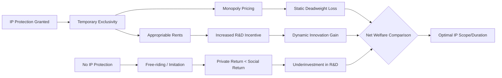
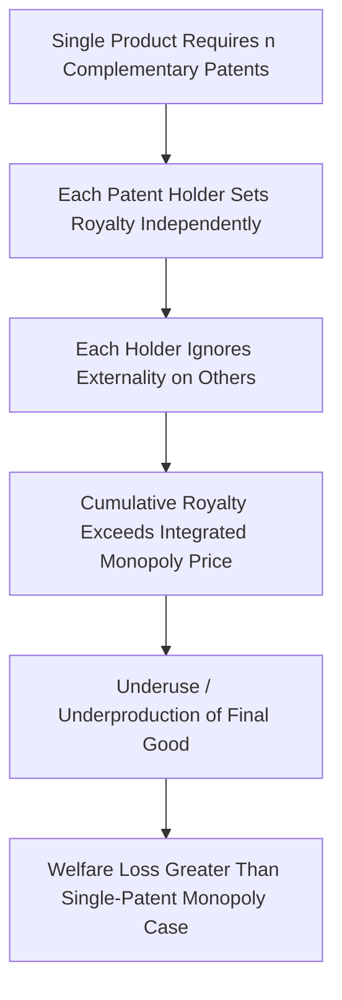

## Economic Rationale for Intellectual Property Protection


### Overview

Intellectual property (IP) protection—patents, copyrights, trademarks, and trade secrets—exists as a legal response to specific economic problems that arise when knowledge and information goods are treated as ordinary property. The dominant economic justification centers on the **public goods problem**: information and ideas, once created, are non-rivalrous and often non-excludable, creating a divergence between private and social incentives to produce them. This section surveys the core economic theories, the market-failure diagnosis, the cost-benefit tradeoffs built into IP design, and major critiques of the standard rationale.

### The Public Goods Problem

**Key Points**

- A pure public good exhibits two properties: **non-rivalry** (one person's use does not diminish another's ability to use it) and **non-excludability** (it is difficult or costly to prevent others from using it once produced).
- Information and inventions are typically non-rivalrous: a formula, a piece of code, or a novel's plot can be used simultaneously by unlimited people without depletion.
- Excludability is not inherent to information but is a legal choice — IP law manufactures excludability where technology alone would not provide it.

$$MC_{additional\_user} \approx 0$$

Because the marginal cost of an additional user consuming an idea is close to zero, but the cost of *creating* the idea in the first place ($F$, a fixed cost) can be substantial, competitive markets pricing at marginal cost would fail to recover fixed costs of creation.

**Example**

A pharmaceutical firm may spend $1–2 billion on R&D and clinical trials to develop a new drug molecule. Once discovered, the marginal cost of manufacturing an additional pill might be a few cents. In a competitive market without protection, generic producers could immediately replicate the molecule and price near marginal cost, leaving the innovator unable to recoup the fixed R&D investment.

### Appropriability and the Underinvestment Problem

The central economic argument for IP protection is the **appropriability problem**: absent legal protection, creators cannot fully capture (appropriate) the social value they generate, because competitors can free-ride on the created information via imitation.

This generates a **positive externality** — the inventor bears 100% of the cost of invention but captures only a fraction of the social surplus, because imitators and consumers absorb the rest as spillovers. When private returns to innovation ($R_{private}$) fall below social returns ($R_{social}$), profit-maximizing firms underinvest in R&D relative to the socially optimal level.

$$R_{private} < R_{social} \Rightarrow \text{Innovation}_{actual} < \text{Innovation}_{optimal}$$



```
**Key Points**

- This is formally a **positive externality / free-rider problem**, structurally similar to underprovision of other public goods (e.g., basic research, national defense).
- IP protection is a policy instrument that raises $R_{private}$ closer to $R_{social}$ by granting temporary exclusivity, allowing the creator to charge above marginal cost and recoup fixed costs.
- The classic articulation of this argument traces to Arrow (1962), who showed that under perfect competition, incentives to invest in information production are systematically inadequate because information, once disclosed, cannot be "un-disclosed," and its value to a buyer is hard to assess without revealing the information itself (the **information paradox** or **Arrow's disclosure paradox**).

### Arrow's Information Paradox

Kenneth Arrow's 1962 analysis identified a fundamental problem in markets for information: a potential buyer cannot judge the value of information without learning it, but once they have learned it, they no longer need to pay for it. This undermines the functioning of a pure market for disclosure and licensing absent legal enforcement.

**Key Points**

- Without IP rights, the inventor faces a dilemma: keep the invention secret (foregoing licensing revenue and social diffusion) or disclose it (risking uncompensated appropriation).
- Patent systems partially resolve this paradox by allowing disclosure of the invention's details in exchange for a temporary legal monopoly, enabling both diffusion of knowledge (via published patent specifications) and compensation for the inventor.
- This dual function — incentive **and** disclosure — is a recurring theme in patent law and economics, sometimes called the "patent bargain" or "quid pro quo."

### The Incentive Theory of IP (The Standard Utilitarian Model)

The dominant U.S. and increasingly global doctrinal foundation is **utilitarian/incentive theory**, reflected in the U.S. Constitution's IP Clause (Art. I, §8, cl. 8), which frames IP as a means "to promote the Progress of Science and useful Arts," not as a natural right.

**Key Points**

- IP protection is a **second-best solution**: society tolerates a temporary deadweight loss from monopoly pricing in exchange for a dynamic gain from increased innovation.
- The optimal IP design problem is a **tradeoff between static inefficiency and dynamic efficiency**:
  - **Static costs**: monopoly pricing above marginal cost causes allocative inefficiency and restricts access (deadweight loss triangle).
  - **Dynamic benefits**: the prospect of appropriable rents induces R&D investment that would not otherwise occur.

$$
W_{total} = \underbrace{-DWL_{monopoly}}_{\text{static loss}} + \underbrace{\Delta \text{Innovation} \times V_{social}}_{\text{dynamic gain}}
$$

- Optimal IP policy conceptually seeks to maximize $W_{total}$, calibrating scope, duration, and strength of rights so that the dynamic gain from induced innovation exceeds the static deadweight loss from restricted access.

### Diagrammatic Illustration: Static Loss vs. Dynamic Gain


```

### Alternative and Competing Economic Theories

**Key Points**

Beyond the standard incentive/public-goods model, several other economic rationales have been advanced, each with different implications for optimal IP design:

1. **Prospect Theory (Kitch, 1977)** — Patents should be granted early and broadly, akin to mining claims, to give a single party clear rights to coordinate and efficiently develop an invention's full potential, avoiding wasteful duplicative R&D races and negative externalities of a "commons" in inventive activity (analogous to the tragedy of the commons).
2. **Rent Dissipation / Patent Race Theory** — Without clear property rights, multiple firms racing to invent the same thing dissipate social resources in duplicative effort; a first-to-invent/first-to-file system with strong rights reduces wasteful parallel expenditure — though it can also *encourage* wasteful races for priority.
3. **Signaling Theory** — Patents serve as credible signals of firm quality/innovativeness to investors, especially for startups (particularly relevant in venture capital contexts where patents proxy for underlying technical capability).
4. **Trade Secret Alternative Theory** — Where patent disclosure costs are high relative to benefits, trade secret law offers an alternative appropriation mechanism without disclosure, but at the cost of foregone knowledge diffusion and potential wasteful expenditure on secrecy-maintaining measures (reverse-engineering arms races).
5. **Natural Rights / Labor-Desert Theory (Lockean)** — A non-utilitarian, non-efficiency-based rationale holding that creators have a moral entitlement to the fruits of their labor; less central to mainstream law-and-economics analysis but influential in continental European (droit d'auteur) copyright traditions and some U.S. judicial rhetoric.

### Optimal Scope, Duration, and Breadth — The Design Tradeoffs

**Key Points**

Because IP is a second-best policy tool, its parameters must be calibrated rather than maximized:

- **Duration**: Longer terms increase innovation incentives but extend the period of static deadweight loss and delay entry into the public domain. Nordhaus's (1969) seminal patent-life model formalized this tradeoff, showing an interior optimum trading off incremental innovation induced against the accumulating deadweight loss of monopoly over time.
- **Breadth/Scope**: Broader claims increase appropriability (capturing more spillovers) but risk blocking follow-on innovation and increasing litigation/transaction costs (the "patent thicket" problem).
- **Height of Inventive Step / Novelty Threshold**: A higher bar for patentability reduces the number of low-value patents granted (reducing thicket and troll problems) but may also exclude cumulative, incremental innovations that have genuine social value.
- **Breadth vs. Length Substitutability**: Some models (e.g., Gilbert & Shapiro, 1990; Klemperer, 1990) show that for a fixed level of innovator reward, policymakers can trade off *narrow-and-long* protection against *broad-and-short* protection, with the optimal mix depending on the shape of demand and the deadweight loss function.

### Sequential and Cumulative Innovation Problems

**Key Points**

Standard incentive theory assumes innovation is a single discrete event, but most real-world innovation is **cumulative** — each invention builds on prior ones.

- **Royalty stacking / patent thickets**: When many complementary patents cover components of a single product, cumulative royalty demands from multiple patent holders can exceed what a single integrated monopolist would charge — this is the **Cournot complements problem** (also called the "tragedy of the anticommons," Heller & Eisenberg, 1998).
- **Blocking patents**: A foundational patent can block follow-on innovators from commercializing improvements without licensing, creating hold-up risk and potentially chilling downstream R&D.
- **Patent pools and cross-licensing** are private-order (contractual) solutions that internalize these externalities by aggregating complementary rights.

$$P_{stacked} = \sum_{i=1}^{n} P_i > P_{integrated\_monopolist}$$

### The Tragedy of the Anticommons (Diagram)





```
### Copyright-Specific Economic Rationale

While the general public-goods logic applies across IP types, copyright has distinct features:

**Key Points**

- Copyright protects **expression**, not underlying ideas or facts (the idea-expression dichotomy), which economically limits the scope of the created exclusivity to reduce blocking of follow-on creative and factual work.
- **Fair use / fair dealing** doctrines function as a judicially administered mechanism to correct for high transaction costs that would otherwise prevent welfare-enhancing uses (e.g., criticism, parody, scholarship) — consistent with a **market failure rationale for limiting exclusivity** rather than expanding it (Gordon, 1982).
- Because reproduction costs for creative works (books, music, software, film) have fallen dramatically with digital technology, the classic appropriability rationale is arguably strengthened (near-zero-cost copying intensifies free-rider risk) even as enforcement costs and monitoring costs rise.

### Trademark Economic Rationale — A Distinct Logic

**Key Points**

Trademark law's economic rationale differs fundamentally from patent/copyright: it is **not** primarily about incentivizing the creation of an information good, but about:

1. **Reducing consumer search costs** — Trademarks function as low-cost information shorthand, allowing consumers to identify source and consistent quality without re-inspecting every purchase (Landes & Posner, 1987).
2. **Protecting investment in reputation/goodwill** — Firms invest in quality and consistency; trademark protection prevents free-riding on that reputational capital via consumer confusion.
3. **Correcting information asymmetry** — Especially relevant for experience and credence goods, where quality cannot be verified pre-purchase; trademarks proxy for unobservable quality.

Because trademark protection can, in principle, last indefinitely (unlike patents/copyrights), its economic justification does not rest on a fixed-cost-recovery/incentive logic but on ongoing efficiency gains in matching consumers to sellers.

### Trade Secret Economic Rationale

**Key Points**

- Trade secrecy is a **substitute appropriation mechanism** to patenting, chosen by firms when the costs of disclosure (patent publication) exceed the benefits of exclusivity (e.g., where reverse engineering is difficult, as with the formula for a soft drink).
- Trade secret law's economic function is largely about reducing **wasteful private expenditure** on both secrecy (fences, NDAs) and misappropriation (industrial espionage) that would otherwise arise absent a legal remedy — a "second-best" solution to a costly self-help arms race (Friedman, Landes & Posner, 1991).

### Critiques of the Standard Incentive Rationale

**Key Points**

- **Empirical weak link**: Numerous studies find only a modest and industry-specific correlation between patent strength and actual R&D investment; the incentive effect appears strongest in a few sectors (pharmaceuticals, chemicals) and weak or negligible in others (software, where patents are often viewed as more useful for defensive purposes) [Inference — this is a synthesis of a large and contested empirical literature; individual study findings vary by industry, period, and methodology].
- **Alternative incentive mechanisms exist** absent IP: first-mover advantage, trade secrecy, brand loyalty, complementary asset control (Teece, 1986), network effects, and reputational capital can independently sustain innovation incentives in many industries — implying that IP protection may be **redundant** in some contexts (Boldrin & Levine, 2008, offer an extensive "against intellectual monopoly" critique).
- **Rent-seeking and lobbying distortion**: IP terms have historically been extended and strengthened partly through political economy dynamics (e.g., repeated U.S. copyright term extensions coinciding with expiration of high-value works), raising questions about whether observed IP strength reflects optimal welfare calibration or interest-group capture (public choice critique).
- **Patent trolls / non-practicing entities (NPEs)**: Entities that acquire and assert patents without producing goods can extract settlement value disproportionate to underlying innovation contribution, imposing a tax on productive firms rather than rewarding invention — a pure rent-transfer with associated litigation deadweight loss.
- **Developing country asymmetry**: TRIPS-mandated global minimum IP standards may impose static costs (higher prices for patented medicines, technology) on developing countries with limited innovative capacity to generate offsetting dynamic gains, a distributional critique distinct from the efficiency-based Nordhaus tradeoff.

### Formal Model Summary Table

| Concept | Mechanism | Welfare Implication |
|---|---|---|
| Non-rivalry/non-excludability | Information is a public good | Underprovision absent intervention |
| Appropriability gap | $R_{private} < R_{social}$ | Underinvestment in R&D |
| Arrow's information paradox | Disclosure destroys bargaining value | Undermines voluntary licensing markets |
| IP grant | Legal exclusivity | Raises $R_{private}$, static DWL |
| Nordhaus tradeoff | Duration vs. innovation | Interior optimum patent life |
| Anticommons/thicket | Complementary patents stacked | Overpricing, underuse |
| Prospect theory | Early broad rights | Coordination, reduced duplication |
| Trademark rationale | Search cost reduction | Distinct from incentive logic |

### Diagram: Deadweight Loss from Patent Monopoly (svg_diagram)

<svg xmlns="http://www.w3.org/2000/svg" viewBox="0 0 600 420">
  <text x="300" y="25" font-size="16" font-weight="bold" text-anchor="middle" fill="#1a1a1a">Static Deadweight Loss from Patent Monopoly (svg_diagram)</text>
  <line x1="70" y1="360" x2="560" y2="360" stroke="#333" stroke-width="2" />
  <line x1="70" y1="360" x2="70" y2="40" stroke="#333" stroke-width="2" />
  <text x="300" y="395" font-size="13" text-anchor="middle" fill="#333">Quantity</text>
  <text x="30" y="200" font-size="13" text-anchor="middle" fill="#333" transform="rotate(-90 30 200)">Price</text>
  <line x1="70" y1="80" x2="500" y2="340" stroke="#2563eb" stroke-width="2" />
  <text x="510" y="345" font-size="12" fill="#2563eb">Demand</text>
  <line x1="70" y1="300" x2="560" y2="300" stroke="#16a34a" stroke-width="2" />
  <text x="510" y="295" font-size="12" fill="#16a34a">MC (Competitive Price)</text>
  <line x1="250" y1="40" x2="250" y2="185" stroke="#dc2626" stroke-width="1.5" stroke-dasharray="4" />
  <line x1="70" y1="185" x2="250" y2="185" stroke="#dc2626" stroke-width="1.5" stroke-dasharray="4" />
  <text x="55" y="180" font-size="11" fill="#dc2626">Pm</text>
  <line x1="380" y1="40" x2="380" y2="300" stroke="#16a34a" stroke-width="1" stroke-dasharray="4" />
  <text x="376" y="315" font-size="11" fill="#16a34a">Qc</text>
  <line x1="250" y1="315" x2="250" y2="300" stroke="#dc2626" stroke-width="1" stroke-dasharray="4" />
  <text x="246" y="330" font-size="11" fill="#dc2626">Qm</text>
  <polygon points="250,185 380,300 250,300" fill="#f59e0b" opacity="0.5" />
  <text x="270" y="270" font-size="12" fill="#92400e" font-weight="bold">DWL</text>
  <rect x="70" y="185" width="180" height="115" fill="#93c5fd" opacity="0.35" />
  <text x="100" y="250" font-size="12" fill="#1e3a8a" font-weight="bold">Monopoly Rent</text>
</svg>

### Related Applications: Real-World Policy Examples

**Example**

- **Pharmaceutical patents**: 20-year term from filing (TRIPS standard) justified by extremely high fixed R&D and clinical trial costs relative to low marginal manufacturing cost — a textbook fixed-cost recovery case, though generating substantial static access costs in health-constrained markets.
- **Software patents controversy**: Critics argue software innovation cycles (often <2 years) are far shorter than the 20-year patent term, creating a poor fit between protection duration and the pace of the underlying industry — potentially imposing static costs long after dynamic incentive value has been realized [Inference — reflects a commonly cited industry-mismatch argument, not a universally agreed empirical conclusion].
- **Compulsory licensing** (e.g., under TRIPS Article 31, used for HIV/AIDS antiretrovirals in various countries) represents a policy tool to rebalance the static/dynamic tradeoff during public health emergencies by permitting government-authorized use without the patent holder's consent, in exchange for reasonable compensation.

### Related Topics

- Patent breadth and the Nordhaus optimal patent life model (formal derivation)
- Cournot complements problem and royalty stacking
- The idea-expression dichotomy and the economics of fair use (Gordon's market failure theory)
- Landes & Posner's economic analysis of trademark law
- Patent races, duplicative R&D, and rent dissipation models
- TRIPS Agreement and international IP harmonization
- Compulsory licensing and access-to-medicines economics
- Boldrin & Levine's "Against Intellectual Monopoly" critique
- Patent trolls / non-practicing entities and litigation economics
- Open source and Creative Commons as alternative appropriation/coordination mechanisms
- Network effects and standard-essential patents (SEPs) / FRAND licensing economics


```