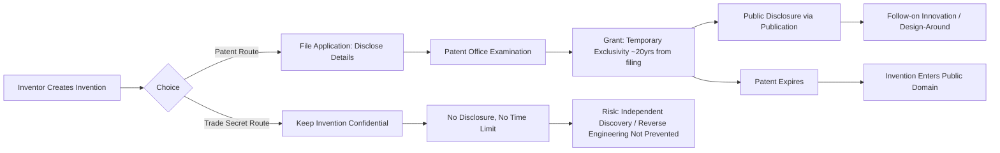
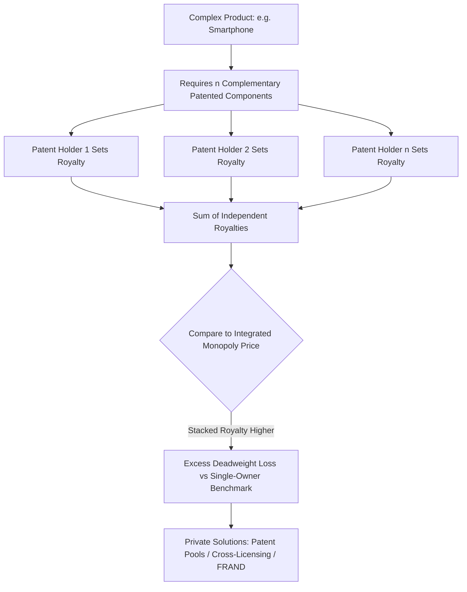

## Patent Law and Incentives to Innovate


### Overview

Patent law grants inventors a time-limited exclusive right to exclude others from making, using, selling, or importing a claimed invention, in exchange for public disclosure. The economic function of this institution is to solve the appropriability problem inherent in inventive activity: because inventions are largely non-rivalrous and costly to keep secret once commercialized, the patent system manufactures legal excludability to allow innovators to capture returns on R&D investment. This section covers the theoretical foundations, the patentability doctrines through an economic lens, the optimal design tradeoffs, empirical evidence on patents' effect on innovation, and major structural critiques.

### The Basic Economic Problem Patents Address

**Key Points**

- Inventive output has public-good characteristics: non-rivalrous (use by one party doesn't preclude use by another) and, absent legal or technical barriers, largely non-excludable.
- Without exclusivity, a first-mover inventor who spends resources on R&D risks immediate imitation by rivals who bear none of the sunk R&D cost, allowing imitators to price closer to marginal cost and erode the innovator's ability to recoup fixed costs.
- This yields a **wedge between private and social returns to innovation**, producing systematic underinvestment in R&D relative to the socially optimal level (Arrow, 1962).

$$\pi_{private} = R_{captured} - C_{R\&D}, \quad \text{where } R_{captured} < R_{social}$$

**Example**

A biotech startup spends $50 million developing a novel diagnostic assay. Absent patent protection, a competitor could reverse-engineer the assay for a fraction of that cost and undercut the originator's price, leaving the startup unable to recover its investment — deterring the initial R&D decision in the first place.

### The Patent Bargain: Disclosure for Exclusivity

**Key Points**

- Patent law is often described as a **quid pro quo**: the inventor discloses the technical details of the invention (enabling others to understand, build upon, and eventually freely use it after expiration) in exchange for a temporary right to exclude.
- This resolves **Arrow's information paradox** — the problem that information cannot be priced or licensed efficiently in a market because a buyer cannot assess its value without learning it, at which point it is no longer scarce to that buyer.
- The disclosure function also reduces socially wasteful duplicative R&D: competitors can observe the patented approach and redirect research toward non-infringing alternatives or complementary improvements rather than re-inventing the same solution.





```
### Patentability Doctrines Through an Economic Lens

Patent law imposes several substantive requirements, each of which can be understood as a mechanism to filter for inventions where the social benefit of granting exclusivity plausibly exceeds the associated static cost.

**Key Points**

1. **Novelty** (35 U.S.C. §102 in the U.S.) — An invention must not already exist in the prior art. Economically, this ensures patents are not granted for information the public already possesses, which would impose deadweight loss without any corresponding incentive benefit (there is no need to "incentivize" the creation of something already created).
2. **Non-obviousness / Inventive Step** (35 U.S.C. §103) — The invention must not be an obvious extension of existing knowledge to a person having ordinary skill in the art (PHOSITA). Economically, this filters out inventions that would likely have been developed anyway through ordinary market processes absent patent incentive, avoiding "windfall" patents that impose cost without inducing genuinely new innovation.
3. **Utility** — The invention must have specific, substantial, and credible practical use, screening out speculative or non-functional claims.
4. **Enablement / Written Description** (35 U.S.C. §112) — The patent must disclose the invention in enough detail that a PHOSITA could reproduce it without undue experimentation. This is the doctrinal mechanism that enforces the disclosure half of the patent bargain — a patent that fails to enable is granting exclusivity without providing the offsetting social benefit of usable knowledge transfer.
5. **Patentable Subject Matter** (35 U.S.C. §101) — Abstract ideas, laws of nature, and natural phenomena are excluded, reflecting the concern that granting exclusivity over foundational building blocks (rather than specific applications) would impose excessive costs on follow-on innovation (the "building blocks" concern articulated in cases like *Mayo v. Prometheus* and *Alice v. CLS Bank*).

### The Nordhaus Model — Optimal Patent Life

William Nordhaus's 1969 formalization remains the canonical model for analyzing optimal patent duration, treating patent life as a policy lever balancing dynamic gains against static losses.

**Key Points**

- Assumes a firm chooses R&D investment level based on expected profit during the patent term; longer patent life increases expected profit and thus induces more R&D/cost-reducing innovation.
- Simultaneously, longer patent life extends the period during which the patented product is priced above marginal cost, prolonging static deadweight loss.
- The model derives an **interior optimum**: patent life should be extended only up to the point where the marginal social benefit from additional induced innovation equals the marginal social cost from extended monopoly deadweight loss.

$$
\frac{\partial W}{\partial T} = \frac{\partial (\text{Innovation Value})}{\partial T} - \frac{\partial (DWL)}{\partial T} = 0 \quad \text{at optimal } T^*
$$

- A key empirical implication: if the responsiveness of R&D investment to additional patent life is small (i.e., firms would have invented anyway, or the marginal innovation induced by extra years of protection is minor), the optimal patent term is shorter than a regime that only weighs induced innovation without netting out deadweight loss.

### Patent Breadth and Length as Substitutable Policy Levers

**Key Points**

- Gilbert & Shapiro (1990) and Klemperer (1990) extended Nordhaus's framework by treating **breadth** (how broadly claims are construed, i.e., how much of the product/process space they cover) and **length** (duration) as two separate dials that can be substituted for one another while holding the innovator's total reward constant.
- Gilbert & Shapiro's model, assuming the deadweight loss from a given profit flow is minimized by narrow-but-long patents, argues for **infinitely narrow, appropriately long** patents to deliver a target reward at minimum static cost — though this result is sensitive to specific assumptions about the shape of the demand curve and cost function.
- Klemperer's competing model shows the opposite can hold under different demand assumptions (e.g., where consumers have heterogeneous preferences and no close substitutes exist for a narrow patent), for which **broad-and-short** protection can minimize the deadweight loss for a given reward level.
- The general lesson: there is no universally dominant breadth/length combination; the efficient design is *conditional* on the industry-specific demand structure, cost of imitation, and the shape of follow-on innovation opportunities.

### Sequential Innovation and the Anticommons Problem

Much real-world innovation is cumulative rather than a single discrete event, which complicates the simple incentive story.

**Key Points**

- **Blocking patents**: A foundational or "pioneer" patent can block a follow-on innovator from commercializing an improvement without a license, creating a hold-up risk that can chill downstream investment (Scotchmer, 1991, "Standing on the Shoulders of Giants").
- **Royalty stacking**: When a single product requires licenses from many complementary patent holders (common in electronics, telecommunications, semiconductors), each patentee sets royalties without internalizing the effect on the others' combined price, producing an aggregate royalty burden that can exceed what a single integrated monopolist would charge — the **Cournot complements problem**.
- **Tragedy of the anticommons** (Heller & Eisenberg, 1998): originally applied to biomedical research, this describes how fragmentation of complementary IP rights across many owners can lead to *underuse* of a resource relative to a scenario with either no rights or unified ownership, because transaction costs and hold-out behavior prevent efficient bundling.
- **Private-order solutions**: Patent pools, cross-licensing agreements, and standard-setting organizations with FRAND (fair, reasonable, and non-discriminatory) licensing commitments are contractual mechanisms that internalize these externalities without requiring changes to patent law itself.


```

### Prospect Theory — An Alternative Justification

**Key Points**

- Edmund Kitch's 1977 **prospect theory** of patents offers a distinct rationale from the incentive-to-invent story: patents should be granted early (upon discovery of a promising research "prospect") and construed broadly, functioning like a mining claim.
- The argument is that concentrating rights in a single party avoids a **duplicative-race externality**: multiple firms independently racing to develop the same prospect waste resources in parallel R&D effort that a single coordinated developer would not.
- A single rights-holder can also efficiently coordinate follow-on development (via licensing) rather than leaving development to an uncoordinated, potentially over-invested race among many firms.
- Critics note this rationale can conflict with the disclosure/incentive rationale: broad early rights may pre-empt legitimate independent invention and stifle exactly the kind of competitive, decentralized innovation that generates the most social value in fast-moving fields.

### Patent Races and Rent Dissipation

**Key Points**

- When multiple firms compete for the same patentable prize (a "patent race"), game-theoretic models show competition can lead to **excessive** aggregate R&D spending relative to the social optimum, because each firm's private return depends on winning, not on the social value created — a rent-seeking dynamic (Loury, 1979; Dasgupta & Stiglitz, 1980).
- The winner-take-all structure of patent rights (first-to-file in most jurisdictions, formerly first-to-invent in the pre-AIA U.S. system) incentivizes firms to accelerate R&D timing even where the marginal social benefit of a slightly earlier invention date is negligible.
- This creates a tension: patents solve one externality (free-riding on completed inventions) while potentially creating another (wasteful racing behavior before completion).

### Empirical Evidence on Patents and Innovation

**Key Points**

- Empirical findings on the patents-innovation link are **highly heterogeneous across industries**. Pharmaceuticals and fine chemicals show the strongest evidence that patent protection is necessary for firms to recoup R&D investment, given high imitation ease (a molecule's composition is often disclosed by the product itself) relative to enormous fixed development costs (Cohen, Nelson & Walsh's "Yale Survey" and "Carnegie Mellon Survey," and Mansfield's classic 1986 study finding many pharmaceutical and chemical inventions would not have been developed absent patent protection) [Inference — specific coefficients and industry rankings vary across studies and time periods; the general industry-heterogeneity finding is well-replicated].
- In software and many complex-product industries, firms frequently report that patents are less important for appropriating returns than lead-time advantages, complementary manufacturing/marketing assets, and trade secrecy — with patents sometimes valued more for defensive/blocking purposes or for signaling to investors than for directly enabling appropriation.
- Studies of patent value distributions consistently find extreme skewness: a small fraction of patents account for the large majority of aggregate patent value, while many patents are rarely litigated, licensed, or cited, suggesting the "representative patent" generates limited incentive effect on the margin [Inference — a widely replicated stylized fact, though exact magnitudes differ by dataset and jurisdiction].
- Historical natural experiments (e.g., countries or industries that lacked patent protection for certain product categories for extended periods, such as pharmaceuticals in several countries prior to TRIPS) have been used to estimate the causal effect of patent introduction on R&D and entry, generally finding measurable but industry-specific effects rather than a uniform "patents cause innovation" result.

### Patent Trolls / Non-Practicing Entities (NPEs)

**Key Points**

- NPEs acquire patents (often from failed companies or via secondary markets) without practicing the underlying invention, then assert them primarily through litigation or licensing threats against operating companies.
- Economically, NPE activity can be understood as a **rent-transfer mechanism** rather than an innovation-inducing one when the asserted patents contribute little marginal incentive to the original inventive act; litigation costs and settlement payments function as a tax on productive firms.
- Defenders argue NPEs can improve liquidity in patent markets, allowing small inventors without commercialization capacity to monetize legitimate IP rather than being disintermediated by larger incumbents — an efficiency-enhancing market-making function [Inference — this remains a genuinely contested empirical and normative question in the literature, without clear consensus on net welfare effect].
- Policy responses (heightened pleading standards, fee-shifting provisions, inter partes review at the USPTO) reflect attempts to filter low-quality assertions while preserving legitimate patent enforcement.

### Patent Thickets and Cumulative Technology Industries

**Key Points**

- In technology sectors characterized by many overlapping, incrementally patentable components (semiconductors, telecommunications standards, software), the sheer density of patents can create a "thicket" that raises transaction costs for new entrants who must identify, negotiate, and license numerous rights before commercializing a product (Shapiro, 2001).
- This can produce a chilling effect on entry and follow-on innovation that runs counter to the basic incentive rationale, motivating institutional responses such as standard-essential patent (SEP) regimes with FRAND commitments, patent pools, and open-source/defensive patent aggregation strategies (e.g., defensive patent pledges).

### Comparative Note: Patents vs. Alternative Appropriation Mechanisms

| Mechanism | Disclosure Required | Duration | Best Suited For |
| --- | --- | --- | --- |
| Patent | Yes (full technical disclosure) | ~20 years from filing | Easily-reverse-engineered, high fixed-cost inventions |
| Trade Secret | No | Indefinite (while secret) | Hard-to-reverse-engineer processes, formulas |
| First-mover advantage | N/A | Market-determined | Fast-moving markets, network effects, brand |
| Prizes/Grants | Often yes (as condition of funding) | N/A (upfront payment) | Basic research, public health priorities |
| Regulatory exclusivity (e.g., data exclusivity) | Partial | Statute-specific | Pharmaceuticals, agricultural chemicals |

### Diagram: Nordhaus Optimal Patent Life Tradeoff (svg_diagram)

<svg xmlns="http://www.w3.org/2000/svg" viewBox="0 0 600 400">
<text x="300" y="25" font-size="16" font-weight="bold" text-anchor="middle" fill="#1a1a1a">Optimal Patent Duration: Marginal Benefit vs Marginal Cost (svg_diagram)</text>
<line x1="70" y1="340" x2="560" y2="340" stroke="#333" stroke-width="2" />
<line x1="70" y1="340" x2="70" y2="50" stroke="#333" stroke-width="2" />
<text x="315" y="375" font-size="13" text-anchor="middle" fill="#333">Patent Term Length (T)</text>
<text x="30" y="200" font-size="13" text-anchor="middle" fill="#333" transform="rotate(-90 30 200)">Marginal $</text>
<path d="M 90 100 Q 250 200 500 320" stroke="#dc2626" stroke-width="2.5" fill="none" />
<text x="500" y="335" font-size="12" fill="#dc2626">Marginal Static Cost (DWL)</text>
<path d="M 90 320 Q 250 150 500 110" stroke="#16a34a" stroke-width="2.5" fill="none" />
<text x="440" y="100" font-size="12" fill="#16a34a">Marginal Dynamic Benefit</text>
<line x1="300" y1="50" x2="300" y2="340" stroke="#6b21a8" stroke-width="1.5" stroke-dasharray="5" />
<text x="235" y="65" font-size="12" fill="#6b21a8" font-weight="bold">T* (Optimal Term)</text>
<circle cx="300" cy="180" r="5" fill="#1a1a1a" />
</svg>

### Related Topics

- Nordhaus (1969) formal derivation of optimal patent life
- Gilbert & Shapiro vs. Klemperer breadth-length substitutability models
- Scotchmer's sequential innovation and licensing models
- Heller & Eisenberg's tragedy of the anticommons in biomedical patenting
- Standard-essential patents (SEPs) and FRAND litigation
- Patent examination quality and the USPTO grant-rate literature
- America Invents Act (AIA): first-to-file transition and inter partes review
- Compulsory licensing and TRIPS flexibilities for public health
- Economic analysis of patent litigation and settlement (reverse payment / "pay-for-delay" settlements)
- Trade secret law as a substitute appropriation mechanism