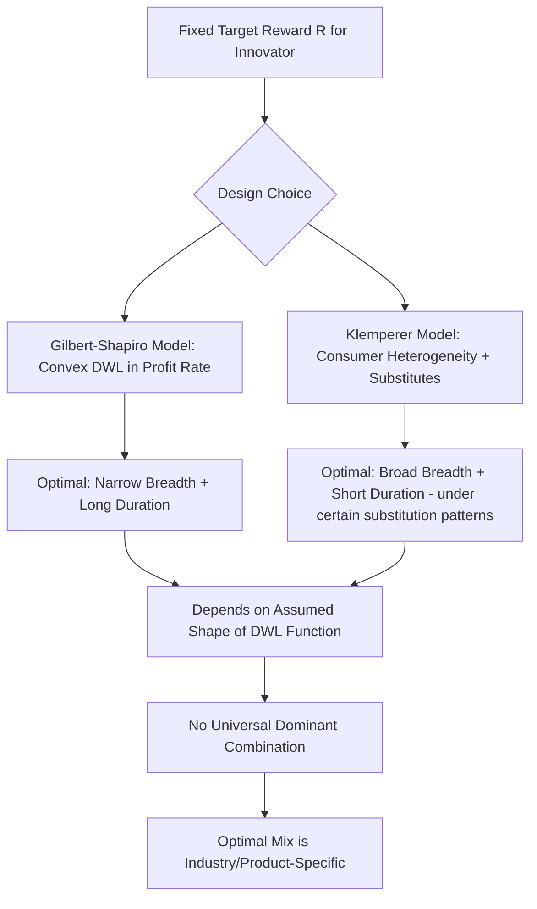

## Optimal Patent Scope, Length, and Breadth


### Overview

Once the case for granting patents is accepted, the harder economic design question is *how much* protection to grant. Three interrelated but analytically distinct parameters govern the strength of a patent right: **length** (statutory duration), **breadth** (the range of technologies/products the claims cover, including the scope of the doctrine of equivalents), and **scope** (sometimes used interchangeably with breadth, but also encompassing the height of the inventive-step requirement and the range of follow-on innovation blocked). This section develops the formal models used to characterize the optimal combination of these parameters, treating patent design as a constrained welfare-maximization problem.

### The General Optimization Framework

**Key Points**

- Patent policy is modeled as a **second-best design problem**: the policymaker cannot achieve first-best (marginal-cost pricing *and* full incentive to invent) simultaneously, and must choose parameters that maximize total welfare net of the unavoidable tradeoff.
- The canonical objective function treats patent design as choosing $(T, B)$ — term length $T$ and breadth $B$ — to maximize:

$$W(T, B) = \int_0^{T} \left[ CS(B) - DWL(B) \right] dt + \Pi(T, B) \cdot \mathbb{1}[\text{induces invention}]$$

where $CS$ is consumer surplus under the patent's competitive constraint, $DWL$ is the deadweight loss from restricted output/higher pricing, and $\Pi$ is the innovator's captured profit, which must be sufficient to justify the R&D investment decision.

- The policymaker's goal is typically framed as: **deliver a target level of innovator reward at minimum aggregate deadweight loss** — i.e., minimize the static cost of achieving whatever incentive is judged necessary to induce the invention.

### Length: The Nordhaus Model Revisited

**Key Points**

- Nordhaus (1969) isolates *length* as the sole policy lever, holding breadth fixed, and models the tradeoff as one between:
  - **Marginal benefit of extended duration**: additional years of exclusivity increase expected profit, inducing more (or more cost-reducing) R&D investment.
  - **Marginal cost of extended duration**: additional years extend the interval of monopoly deadweight loss on already-invented technology.
- The optimal term $T^*$ satisfies the first-order condition where these marginal effects are equal:

$$\frac{dW}{dT}\Big|_{T=T^*} = \underbrace{\frac{d(\text{Innovation Value})}{dT}}_{\text{marginal benefit}} - \underbrace{\frac{d(DWL)}{dT}}_{\text{marginal cost}} = 0$$

- A key comparative-static result: the more **responsive** R&D investment is to marginal changes in patent life (i.e., the more elastic the innovation-inducement function), the **longer** the socially optimal term. Conversely, if most inventions would occur regardless of protection length (low R&D elasticity with respect to $T$), a short term is optimal because extra years mostly generate deadweight loss without meaningfully more innovation.
- Empirically, this elasticity is thought to vary substantially: pharmaceuticals (long lead times, high fixed costs, easily imitated once revealed) plausibly have higher elasticity than fields with strong lead-time or trade-secret alternatives.

### Breadth: Defining the Concept

**Key Points**

Breadth is used in the literature in (at least) two related but distinct senses, and precision matters for applying the models correctly:

1. **Lateral breadth**: How many substitute or related products/processes fall within the claim's scope (i.e., how much of the *product space* around the core invention is covered, including the doctrine of equivalents' reach against near-identical designs).
2. **Height/vertical breadth** (sometimes called "novelty requirement" or leading-edge breadth): How far forward the claim extends over *future improvements* — i.e., whether follow-on innovators can design around the patent or must obtain a license (related to blocking-patent and sequential-innovation concerns).

Different economic models emphasize one or the other sense, which is a common source of confusion when comparing results across papers.

### Gilbert & Shapiro (1990): Breadth as Profit Flow Rate

**Key Points**

- Gilbert & Shapiro model breadth as determining the **rate of profit flow** the patentee earns per unit time (broader patents restrict substitutes more, allowing higher per-period profit).
- Under their key assumption — that the **deadweight loss associated with a given profit flow rate is convex and increasing** in the flow rate — the efficient way to deliver a fixed total reward $R$ to the patentee (the minimum needed to induce the invention) is to make the patent **infinitely long and infinitesimally narrow**, i.e., a low profit-flow rate sustained over a very long period, rather than a high profit-flow rate over a short period.

$$R = \int_0^{T} \pi(B) \, dt$$

If $DWL(\pi)$ is convex in $\pi$ (the per-period profit rate), then for a fixed $R$, welfare is maximized by minimizing $\pi$ and maximizing $T$ — i.e., **narrow-and-long** dominates **broad-and-short**.

- This result depends critically on the convexity assumption about how deadweight loss scales with profit-flow intensity, which is not universal across market structures.

### Klemperer (1990): The Competing Result

**Key Points**

- Klemperer challenges the generality of the Gilbert-Shapiro conclusion by modeling consumer heterogeneity and the availability of imperfect substitutes explicitly.
- In Klemperer's framework, when patent breadth determines whether close substitutes are excluded from the market (rather than simply the profit-flow rate on a fixed set of substitutes), the welfare-minimizing way to deliver a given reward can instead be **broad-and-short** patents: a short but comprehensive monopoly can, in some substitute-availability configurations, generate less cumulative deadweight loss than a long but narrow one that leaves consumers migrating to costly imperfect substitutes for decades.
- The key driver of the divergence between Gilbert-Shapiro and Klemperer is the **assumed shape of consumer demand and substitution patterns** — whether restricting a narrow band of substitutes for a long time is more or less costly than restricting a wide band of substitutes for a short time.
- **Takeaway for policy**: there is no universally dominant breadth-length combination independent of the empirical demand and substitution structure of the specific technology/product market; the "correct" mix is industry- and product-specific, undermining any simple uniform statutory rule.





```
### Scope and Cumulative/Sequential Innovation

**Key Points**

- Scotchmer (1991) extends the analysis to environments where inventions build on one another ("standing on the shoulders of giants"), showing that patent scope decisions must account not just for the static/dynamic tradeoff on a single invention, but for the **incentive effects on follow-on inventors**.
- If scope is too broad (covering many future improvements), follow-on innovators face hold-up risk and must negotiate licenses, potentially discouraging valuable second-generation R&D — the **blocking patent problem**.
- If scope is too narrow, the original inventor cannot capture the value their foundational work creates for the follow-on innovation it enables, reproducing the original appropriability problem one level removed — the follow-on innovator captures spillovers from the pioneer's work.
- Scotchmer's core policy prescription: efficient sequential innovation regimes often require **ex ante licensing/bargaining mechanisms** (rather than pure property-rule blocking) so that both the pioneer and follow-on innovator can share the surplus from cumulative innovation — motivating "reach-through" royalties, research exemptions, and compulsory cross-licensing in some contexts.
- The height of the **non-obviousness standard** operates as an implicit scope-setting tool: a higher bar for patentability of follow-on improvements effectively narrows the *number* of blocking rights that can be asserted against a given pioneer technology, reducing anticommons risk at the cost of possibly under-rewarding genuine incremental innovation.

### The Doctrine of Equivalents as a De Facto Breadth Lever

**Key Points**

- Courts' application of the **doctrine of equivalents** (allowing infringement findings even when an accused product does not literally match every claim element, if differences are "insubstantial") functions as a judicially administered breadth adjustment separate from the literal claim language.
- Economically, a broader application of the doctrine increases effective patent breadth (harder to design around) but also increases **uncertainty costs** for competitors trying to determine ex ante whether a new product infringes, potentially chilling legitimate independent development — a tradeoff between appropriability and legal-certainty/transaction-cost concerns (Lemley & Chien, and related patent-scope-uncertainty literature).

### Patent Thickets, Anticommons, and Optimal Scope in Complex-Product Industries

**Key Points**

- In industries where products embody hundreds or thousands of patentable components (semiconductors, telecommunications, smartphones), **narrow-but-numerous** patents can replicate many of the anticommons/royalty-stacking problems associated with excessive aggregate breadth, even if no single patent is individually broad (Shapiro, 2001; Heller & Eisenberg, 1998).
- This suggests that "optimal breadth" analysis conducted patent-by-patent can understate the aggregate deadweight loss when many complementary patents interact — the **Cournot complements problem**, where independently-set royalties by multiple rights holders sum to more than an integrated monopolist would charge.

$$
\sum_{i=1}^{n} r_i > r_{integrated}
$$

- Optimal scope/breadth policy in cumulative-technology industries may therefore need to be evaluated at the level of the **patent portfolio or technology standard**, not merely the individual patent claim — motivating institutional responses like FRAND-encumbered standard-essential patents and patent pools rather than purely doctrinal (claim construction) fixes.

### Comparative Summary of Design Levers

| Lever | Increases With | Static Cost Effect | Dynamic Benefit Effect |
|---|---|---|---|
| Length ($T$) | Longer statutory term | Extends duration of DWL | Increases total captured reward, if R&D elastic to $T$ |
| Lateral Breadth | Broader claim construction, wider doctrine of equivalents | Excludes more substitutes, raises per-period DWL | Increases appropriability against imitators/near-substitutes |
| Height/Vertical Scope | Broad claims over future improvements | Blocks/taxes follow-on innovation (anticommons risk) | Rewards pioneer for enabling follow-on value |
| Non-obviousness Bar | Higher inventive-step threshold | Reduces number of low-value patents (less thicket) | May exclude valuable incremental improvements |

### Empirical and Institutional Considerations

**Key Points**

- Because the theoretically "optimal" breadth-length mix is highly sensitive to unobservable parameters (elasticity of R&D to protection strength, shape of substitution patterns, extent of cumulative innovation in the field), most patent systems adopt a **uniform statutory term** (e.g., 20 years from filing under TRIPS) rather than technology-specific terms, trading off theoretical precision for administrability and predictability [Inference — this is a widely noted institutional-design observation rather than a directly tested causal claim].
- Where technology-specific calibration does occur, it is typically achieved through *adjacent* legal mechanisms rather than varying the patent term itself: regulatory data exclusivity periods for pharmaceuticals, patent term extensions for regulatory delay (e.g., Hatch-Waxman in the U.S.), or sui generis regimes (e.g., plant variety protection, semiconductor mask work protection) with durations tailored to the specific industry's R&D-to-imitation cost ratio.
- The non-obviousness standard and claim construction doctrines (rather than statutory term length) function as the primary practical levers courts and patent offices use to implicitly adjust effective breadth on a case-by-case or technology-by-technology basis, since these are administered flexibly by examiners and judges rather than fixed by statute.

### Diagram: Breadth-Length Tradeoff Space (svg_diagram)

<svg xmlns="http://www.w3.org/2000/svg" viewBox="0 0 600 420">
  <text x="300" y="25" font-size="16" font-weight="bold" text-anchor="middle" fill="#1a1a1a">Breadth-Length Isoreward Curves (svg_diagram)</text>
  <line x1="80" y1="360" x2="540" y2="360" stroke="#333" stroke-width="2" />
  <line x1="80" y1="360" x2="80" y2="50" stroke="#333" stroke-width="2" />
  <text x="310" y="395" font-size="13" text-anchor="middle" fill="#333">Patent Length (T)</text>
  <text x="35" y="205" font-size="13" text-anchor="middle" fill="#333" transform="rotate(-90 35 205)">Patent Breadth (B)</text>
  <path d="M 100 340 Q 200 150 500 90" stroke="#2563eb" stroke-width="2" fill="none" />
  <text x="420" y="80" font-size="11" fill="#2563eb">Isoreward Curve (Fixed R)</text>
  <circle cx="130" cy="310" r="6" fill="#16a34a" />
  <text x="140" y="315" font-size="11" fill="#16a34a">Narrow &amp; Long (Gilbert-Shapiro optimum, convex DWL case)</text>
  <circle cx="470" cy="105" r="6" fill="#dc2626" />
  <text x="330" y="130" font-size="11" fill="#dc2626">Broad &amp; Short (Klemperer optimum, substitute-rich case)</text>
  <path d="M 130 340 Q 230 200 480 130" stroke="#9333ea" stroke-width="1.5" stroke-dasharray="5" fill="none" />
  <text x="220" y="260" font-size="11" fill="#9333ea">Actual optimum depends on demand/substitution shape</text>
</svg>

### Related Topics

- Nordhaus (1969) formal patent-life derivation and elasticity of R&D investment
- Gilbert & Shapiro (1990) vs. Klemperer (1990) breadth-length models in full formal detail
- Scotchmer's sequential innovation, licensing, and ex ante bargaining mechanisms
- Doctrine of equivalents and claim construction as breadth-adjustment tools
- Non-obviousness standard (PHOSITA) as an implicit scope-setting device
- Tragedy of the anticommons and royalty stacking in complex-product industries
- Standard-essential patents (SEPs) and FRAND licensing commitments
- Patent term extension mechanisms (Hatch-Waxman, supplementary protection certificates)
- Sui generis IP regimes (plant variety protection, semiconductor mask works)
- Patent pools as private-order solutions to breadth/scope fragmentation


```