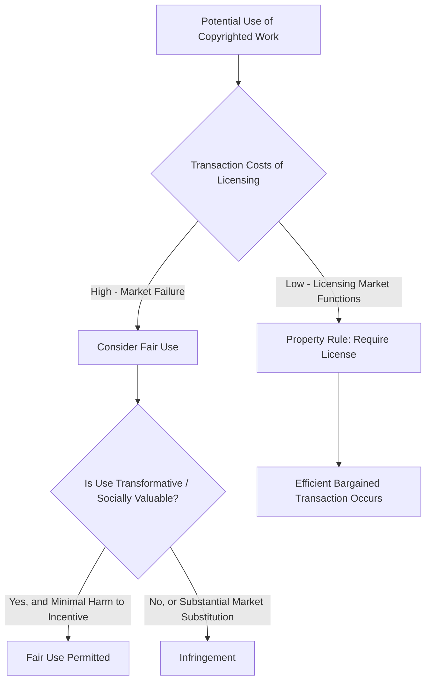

## Copyright Law and Incentives for Creative Production


### Overview

Copyright law grants authors of original expressive works (literary, musical, dramatic, artistic, audiovisual, and certain software works) exclusive rights to reproduce, distribute, perform, display, and create derivative works from their creations for a defined term. The economic rationale largely parallels patent theory's appropriability logic but differs in critical structural respects: copyright protects **expression rather than ideas**, arises automatically upon fixation (no examination requirement), typically carries a much longer term, and is subject to distinct limiting doctrines (fair use, idea-expression dichotomy, first-sale doctrine) that reflect a different balance of costs and benefits than patent law.

### The Basic Incentive Problem for Creative Works

**Key Points**

- Creative works share the public-goods structure of inventions: once created, a novel, song, film, or piece of software has near-zero marginal cost of reproduction and non-rivalrous consumption — one person reading a book does not diminish another's ability to read a copy of it.
- The **cost structure asymmetry** is often especially pronounced for creative works relative to inventions: enormous fixed costs of original creation (a blockbuster film's production budget, a novel's years of authorial labor) versus near-zero marginal cost of digital reproduction and distribution, which has intensified with digital technology.
- Absent legal protection, competitive replication would drive price toward marginal cost (near zero for digital goods), preventing recovery of fixed creative investment and inducing predictable underproduction of new expressive works relative to the social optimum.

$$P = MC \approx 0 \Rightarrow \text{Revenue} \not\geq F_{creation} \Rightarrow \text{Underinvestment in Creative Output}$$

**Example**

A film studio invests $200 million producing a feature film. Once released, the marginal cost of an additional digital copy or stream is negligible. Without copyright protection, unauthorized reproduction and distribution would undercut the studio's ability to price above marginal cost during the window needed to recover the production budget, weakening the incentive to finance future large-scale productions.

### Copyright's Distinctive Doctrinal Structure

**Key Points**

Several structural features distinguish copyright's economic design from patent law's, each reflecting a different set of cost-benefit judgments:

1. **Automatic protection, no examination**: Copyright arises upon fixation in a tangible medium without a substantive novelty/non-obviousness review (unlike patents). This drastically lowers the *administrative cost* of obtaining protection but also means copyright is granted to works with widely varying levels of genuine creative investment or social value, without any filtering mechanism analogous to patent examination.
2. **Idea-expression dichotomy**: Copyright protects only the particular expression of an idea, not the underlying idea, fact, procedure, or system (17 U.S.C. §102(b) in the U.S.). Economically, this preserves competitors' and follow-on creators' ability to use the same underlying facts, themes, or functional concepts, limiting the scope of exclusivity to reduce blocking effects on future creative and factual work.
3. **Originality (not novelty)**: The standard for protection is independent creation plus a modicum of creativity (*Feist Publications v. Rural Telephone*, 1991), a substantially lower bar than patent's novelty/non-obviousness requirements — reflecting that copyright is not meant to reward a scarce, singular technical breakthrough but rather to protect any of the innumerable ways an idea might be independently expressed.
4. **Longer duration**: Life of the author plus 70 years (or 95/120 years for works made for hire, under current U.S. law), vastly longer than patent's ~20-year term — a puzzle for pure incentive theory, since it is difficult to argue that creators are meaningfully motivated by returns accruing many decades after death (discussed further below).

### Fair Use as a Market-Failure Correction Mechanism

**Key Points**

- Wendy Gordon's influential 1982 analysis frames **fair use** not as a general "reasonableness" exception but as a judicially administered response to situations of **market failure** — where transaction costs would prevent an efficient, welfare-enhancing licensing transaction from occurring even though both parties would benefit from it.
- Three conditions are commonly cited as supporting a fair use finding under this framework:
  1. Market failure (the copyright owner cannot or will not license the specific use through a functioning market, e.g., because the transaction costs of identifying and negotiating with the owner exceed the value of the transaction, as in some parody, criticism, or scholarship contexts).
  2. Transfer of the use would be socially desirable (the use generates positive net social value).
  3. Granting the fair use exception would not substantially reduce the copyright owner's incentive to create the work in the first place.
- Modern U.S. fair use analysis under 17 U.S.C. §107 applies four statutory factors (purpose/character of use, nature of the copyrighted work, amount used, and market effect), with the "transformative use" inquiry (whether the new use adds new expression, meaning, or message) increasingly central to determining whether the market-failure/incentive-preservation logic applies (*Campbell v. Acuff-Rose Music*, 1994; *Andy Warhol Foundation v. Goldsmith*, 2023).
- Economically, fair use functions analogously to a **liability rule** (use permitted, subject to case-by-case ex post judicial assessment of harm) rather than a pure **property rule** (use requires ex ante licensing consent) in situations where transaction costs make property-rule enforcement inefficient (Calabresi & Melamed's property rule/liability rule framework, applied to IP by Merges and others).





```
### The Idea-Expression Dichotomy and Follow-On Creativity

**Key Points**

- By excluding ideas, facts, procedures, and systems from protection, copyright avoids the **anticommons/blocking problem** that would arise if authors could monopolize entire genres, themes, or factual domains (e.g., no author can copyright the "idea" of star-crossed lovers, only their particular expressive treatment of it).
- This doctrine directly serves a cumulative-creativity rationale analogous to patent law's sequential-innovation concerns: since most creative work builds on existing genres, tropes, historical facts, and cultural material, preserving a robust public domain of unprotectable ideas is necessary to avoid excessively taxing follow-on creative production.
- The **merger doctrine** (where an idea and its expression are so intertwined that there are only one or a few ways to express it) denies protection entirely in such cases, preventing a single expression from functionally monopolizing the underlying idea.
- The **scènes à faire doctrine** similarly denies protection to stock elements, themes, or character types that are standard or expected within a genre, preserving a shared creative commons for genre conventions.

### Derivative Works and the Scope of Exclusivity

**Key Points**

- Copyright grants the original author exclusive rights not only over exact copies but over **derivative works** (translations, adaptations, sequels, film versions of a novel, etc.), extending the scope of exclusivity well beyond literal reproduction.
- This broader scope raises analogous concerns to patent breadth: it allows the original author to capture value created by follow-on creative elaboration (consistent with rewarding the pioneer for enabling that follow-on value), but also risks blocking transformative follow-on works whose social value might exceed the original author's foregone licensing revenue — the same static/dynamic tension seen in patent scope debates, addressed partly through the fair use "transformative use" safety valve.

### Why Is Copyright Term So Long? The Duration Puzzle

**Key Points**

- Standard incentive theory struggles to justify copyright's very long term (life plus 70 years) on the basis of the creator's own decision to produce the work, since:
  - The present value of income received many decades in the future, heavily discounted, contributes negligibly to an author's initial decision whether to create a work.
  - Empirical and theoretical work (e.g., Landes & Posner's 2003 economic analysis of copyright law) suggests optimal-incentive term-length calculations would generally imply much shorter terms than currently in force if the sole objective were maximizing creation incentives net of static access costs.
- Landes & Posner (2003) instead offer several alternative economic rationales for long-lived copyright, distinct from the pure creation-incentive story:
  1. **Maintenance/investment incentive**: Longer terms incentivize copyright holders to invest in maintaining, restoring, cataloging, and actively exploiting works over long periods (analogous to the "prospect theory" argument in patent law — a long-lived exclusive right encourages efficient stewardship of the asset), rather than letting works fall into disuse or degrade once they enter a shorter-term public domain.
  2. **Avoiding a public-domain "overgrazing" problem**: If works enter the public domain too quickly, multiple competing publishers/adapters might independently produce low-quality or excessive derivative versions, potentially degrading the value of a cultural work through overexploitation (an analogy to the tragedy of the commons) — though this argument is contested, since public-domain status is also associated with wider beneficial diffusion, adaptation, and preservation.
  3. **Political economy / interest-group dynamics**: Repeated term extensions (e.g., the U.S. Sonny Bono Copyright Term Extension Act of 1998, which added 20 years and coincided with the impending expiration of high-value early Disney works) are frequently cited in the law-and-economics literature as evidence that at least some term extensions reflect rent-seeking by concentrated, well-organized copyright-holding interests rather than a fresh optimal-incentive calculation [Inference — this is a widely cited critique in the academic literature (e.g., associated with economist Landes, Posner, and various amicus filings in *Eldred v. Ashcroft*), but the *causal* claim about legislative motive is a contested normative/political interpretation rather than a directly measurable fact].

### The First-Sale Doctrine and Downstream Market Efficiency

**Key Points**

- The first-sale doctrine (17 U.S.C. §109) extinguishes the copyright holder's distribution right over a particular physical copy once it is first sold, permitting the buyer to resell, lend, or dispose of that copy without further permission.
- Economically, this preserves the functioning of efficient secondary markets (used bookstores, libraries, video rental) without requiring the copyright holder's ongoing consent for each downstream transaction, reflecting a judgment that the cost of monitoring and extracting rents from every subsequent transfer would exceed the value gained, while intact secondary markets provide independent social benefits (access, price discrimination reduction, preservation).
- The doctrine's application to digital goods is contested and generally does not extend cleanly to digital "copies" (which are technically reproductions rather than transfers of a single physical item), a live area of ongoing legal and economic debate as physical/digital distinctions blur (e.g., *Capitol Records v. ReDigi*).

### Registration, Formalities, and the Cost of Automatic Protection

**Key Points**

- Historically, U.S. copyright required formalities (registration, notice, renewal) to obtain or maintain protection; the Berne Convention's influence (post-1989 U.S. accession) shifted the system toward automatic protection upon fixation, eliminating formalities as a condition of the underlying right (registration remains required only as a prerequisite to filing an infringement suit and for statutory damages/attorney's fees).
- Economically, automatic protection lowers transaction costs for authors (especially informal or amateur creators who would never register) but creates an **orphan works problem**: a vast body of copyrighted material exists whose owners cannot be identified or located, making licensing for legitimate reuse (archival, scholarly, adaptive) practically impossible even where the owner would likely consent if found — a pure transaction-cost-driven market failure with no fair-use-style doctrinal safety valve of comparable breadth in most jurisdictions.

### Copyright and the Economics of Digital Distribution

**Key Points**

- Digital technology has intensified copyright's core appropriability problem by driving the marginal cost of reproduction and distribution toward zero and enabling near-perfect-fidelity copying, increasing the theoretical case for protection even as enforcement and monitoring costs have risen substantially.
- Empirical work on digital piracy's effect on legitimate sales is mixed and highly context-dependent: some studies find piracy displaces sales roughly one-for-one in certain content categories, while others find evidence of a "sampling" or discovery effect that can increase demand for legitimate consumption in others, and effects vary by content type, platform, and time period [Inference — this reflects a genuinely unsettled and actively researched empirical literature rather than a single established finding].
- Business-model innovation (subscription streaming, freemium models, bundling) has, in many content industries, been argued to reduce the practical importance of strict legal enforcement relative to convenience-based competition with piracy, though this is an evolving and industry-specific empirical question rather than a settled substitute for copyright protection itself.

### Comparative Table: Patent vs. Copyright Design Choices

| Feature | Patent | Copyright |
|---|---|---|
| Standard | Novelty + non-obviousness | Originality (low bar) |
| Examination | Substantive PTO review | None (automatic upon fixation) |
| Protects | Functional inventions | Expression, not ideas |
| Term | ~20 years from filing | Life + 70 years (or 95/120 for corporate works) |
| Core limiting doctrine | Non-obviousness, enablement | Idea-expression dichotomy, fair use |
| Registration | Mandatory application | Optional (but required to sue/get statutory damages in US) |

### Diagram: Copyright's Limiting Doctrines as Cost-Benefit Filters (svg_diagram)

<svg xmlns="http://www.w3.org/2000/svg" viewBox="0 0 620 380">
  <text x="310" y="25" font-size="16" font-weight="bold" text-anchor="middle" fill="#1a1a1a">Copyright's Balancing Doctrines (svg_diagram)</text>
  <rect x="60" y="60" width="220" height="80" rx="8" fill="#dbeafe" stroke="#2563eb" stroke-width="1.5" />
  <text x="170" y="90" font-size="13" text-anchor="middle" fill="#1e3a8a" font-weight="bold">Broad Exclusivity</text>
  <text x="170" y="110" font-size="11" text-anchor="middle" fill="#1e3a8a">Rewards creators,</text>
  <text x="170" y="125" font-size="11" text-anchor="middle" fill="#1e3a8a">funds fixed costs</text>
  <rect x="340" y="60" width="220" height="80" rx="8" fill="#fee2e2" stroke="#dc2626" stroke-width="1.5" />
  <text x="450" y="90" font-size="13" text-anchor="middle" fill="#7f1d1d" font-weight="bold">Static &amp; Blocking Costs</text>
  <text x="450" y="110" font-size="11" text-anchor="middle" fill="#7f1d1d">Restricts access,</text>
  <text x="450" y="125" font-size="11" text-anchor="middle" fill="#7f1d1d">blocks follow-on works</text>
  <line x1="280" y1="100" x2="340" y2="100" stroke="#6b7280" stroke-width="2" stroke-dasharray="4" />
  <text x="310" y="185" font-size="13" text-anchor="middle" fill="#333" font-weight="bold">Balancing Doctrines</text>
  <rect x="60" y="210" width="150" height="60" rx="6" fill="#dcfce7" stroke="#16a34a" />
  <text x="135" y="235" font-size="11" text-anchor="middle" fill="#14532d">Idea-Expression</text>
  <text x="135" y="250" font-size="11" text-anchor="middle" fill="#14532d">Dichotomy</text>
  <rect x="235" y="210" width="150" height="60" rx="6" fill="#dcfce7" stroke="#16a34a" />
  <text x="310" y="235" font-size="11" text-anchor="middle" fill="#14532d">Fair Use</text>
  <text x="310" y="250" font-size="11" text-anchor="middle" fill="#14532d">(market failure fix)</text>
  <rect x="410" y="210" width="150" height="60" rx="6" fill="#dcfce7" stroke="#16a34a" />
  <text x="485" y="235" font-size="11" text-anchor="middle" fill="#14532d">First-Sale</text>
  <text x="485" y="250" font-size="11" text-anchor="middle" fill="#14532d">Doctrine</text>
  <line x1="135" y1="210" x2="200" y2="140" stroke="#9ca3af" stroke-width="1" />
  <line x1="310" y1="210" x2="310" y2="140" stroke="#9ca3af" stroke-width="1" />
  <line x1="485" y1="210" x2="380" y2="140" stroke="#9ca3af" stroke-width="1" />
</svg>

### Related Topics

- Landes & Posner's *The Economic Structure of Intellectual Property Law* (2003), copyright chapters
- Wendy Gordon's market-failure theory of fair use (1982)
- Idea-expression dichotomy, merger doctrine, and scènes à faire
- Optimal copyright term debates and *Eldred v. Ashcroft* (2003)
- Orphan works problem and registration/formalities economics
- Digital piracy empirical literature and platform-based business model responses
- Derivative works doctrine and transformative use analysis post-*Warhol v. Goldsmith*
- Software copyright and the idea-expression boundary in functional code
- Comparative droit d'auteur vs. Anglo-American utilitarian copyright traditions
- Creative Commons and open licensing as private-order alternatives to default exclusivity


```