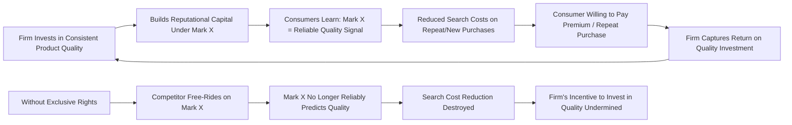

## Trademark Law and Consumer Search Costs


### Overview

Trademark law protects words, symbols, logos, and other source-identifying marks used in commerce, granting the mark owner the right to prevent uses likely to confuse consumers about the origin of goods or services. Unlike patent and copyright law, whose economic rationale centers on incentivizing the *creation* of new information goods, trademark law's foundational economic justification — developed most systematically by Landes & Posner (1987) — is rooted in **reducing consumer search costs** and protecting investment in reputational capital. This section develops the search-cost model, its implications for trademark doctrine, and the boundary conditions and critiques of the theory.

### The Search-Cost Model: Foundational Logic

**Key Points**

- Landes & Posner's (1987) canonical model treats a trademark as a **low-cost carrier of information** about a product's source and, by extension, its consistent quality attributes, allowing consumers to make purchasing decisions without re-investigating product characteristics on every purchase occasion.
- Without reliable source identifiers, consumers face a **repeated search problem**: each purchase would require costly independent verification of quality (inspection, trial-and-error, research), since verbally or visually identical but differently-sourced goods could vary unpredictably in quality.
- Trademarks solve this by creating a durable, low-cost associative link between a mark and a bundle of expected product attributes, built up through the firm's repeated performance and investment in reputation over time.

$$SC_{no\_mark} \gg SC_{with\_mark}$$

where $SC$ denotes the consumer's expected search cost per purchase; trademarks compress a repeated, costly verification problem into a near-costless recognition heuristic.

**Example**

A consumer purchasing laundry detergent for the first time in a foreign supermarket, with no familiar brands present, faces genuine uncertainty about quality, requiring either trial purchases, careful ingredient reading, or reliance on price as an imperfect quality signal. If a globally recognized brand (e.g., one the consumer has used for years at home) is present, that mark alone conveys expected quality without further investigation, dramatically reducing the consumer's search cost.

### The Dual Function: Consumer Protection and Producer Incentive

**Key Points**

Landes & Posner identify two economically complementary functions that trademark protection serves simultaneously:

1. **Consumer-side function**: Reduces search costs by making brand-based inference about quality reliable — this requires that a mark be reserved exclusively to one source, since if multiple unrelated sellers could use the same mark, the informational value of the mark to consumers would collapse (the mark would no longer reliably predict quality).
2. **Producer-side function**: Protects the firm's incentive to **invest in consistent quality**, because that investment is only profitable if the firm can capture the resulting reputational value through exclusive association with its mark. Absent exclusivity, a firm that built a reputation for quality would face free-riding: competitors could attach the same mark to lower-quality goods, degrading the mark's informational content and destroying the originating firm's return on its quality investment.





```
### Why Trademark's Economic Logic Differs from Patent/Copyright

**Key Points**

- Trademark protection is **not primarily justified by a fixed-cost recovery/appropriability logic** analogous to patents and copyrights — a trademark itself (a word, symbol, or logo) is typically not costly to "create" in the way an invention or creative work is; the economic value lies almost entirely in the *accumulated reputational association*, not the mark's intrinsic informational content.
- Because the social value of trademark protection derives from an ongoing signaling/search-cost-reduction function rather than a one-time creation-incentive problem, trademark rights can in principle be **perpetual** (renewable indefinitely, subject to continued use) without generating the same static deadweight-loss-versus-duration tradeoff that justifies time-limiting patents and copyrights — there is no analogous "entering the public domain" logic, since the informational function trademark serves does not diminish with continued exclusive use (indeed, it strengthens with continued exclusive, consistent use).
- This distinguishes trademark's economic theory sharply: whereas patent/copyright duration limits protect against extending static monopoly costs beyond the point needed to induce creation, trademark protection's ongoing exclusivity is what *sustains* rather than *taxes* its social benefit (accurate source signaling), so long as the mark continues to be used in a way that preserves accurate consumer association.

### Doctrinal Requirements Through the Search-Cost Lens

**Key Points**

1. **Distinctiveness spectrum** (generic → descriptive → suggestive → arbitrary/fanciful) — Marks are categorized by their inherent capacity to identify source rather than describe the product itself. Generic terms (e.g., "computer" for computers) receive no protection because allowing exclusivity over a term needed to describe the product category itself would impose search costs on **competitors and consumers alike** (competitors could not describe their own products; consumers would lose a useful descriptive vocabulary) — the classic *genericide* problem (e.g., "aspirin," "escalator," "thermos" lost trademark status through generic use).
2. **Secondary meaning** — Descriptive marks can acquire protection only once consumers have learned to associate the term with a specific source (rather than its literal descriptive meaning) through extended use and advertising — reflecting that protection should track the actual accumulated search-cost-reducing informational value, not merely the mark's selection.
3. **Likelihood of confusion standard** — Infringement liability turns on whether an accused use is likely to confuse consumers about source, directly operationalizing the search-cost theory: infringement doctrine intervenes exactly where a competing use would degrade the mark's reliability as a low-cost quality/source signal.
4. **Genericide** — A mark can lose protection if it becomes the generic term for a product category in the minds of consumers, reflecting the same logic in reverse: once a term's association with a *specific source* has dissolved into association with the *product category generally*, continued exclusivity would no longer serve (and would actively undermine) the search-cost function, instead imposing costs on competitors who need the term to describe their own goods.

### Trademark Dilution: An Extension Beyond Pure Search-Cost Theory

**Key Points**

- **Dilution doctrine** (protecting famous marks against blurring or tarnishment even absent any likelihood of consumer confusion, e.g., use of "Tiffany" for an unrelated product category with no confusion risk) sits somewhat awkwardly within the pure search-cost framework, since dilution liability does not require any showing that consumers are actually confused about source.
- Economic justifications for dilution protection typically shift toward a distinct theory: **protecting the mark owner's accumulated goodwill/investment as an asset in itself**, on the theory that even non-confusing uses can gradually erode a famous mark's unique associative power (blurring) or associate it with unsavory contexts (tarnishment), degrading its long-run informational and reputational value even without immediate consumer confusion [Inference — dilution's economic justification remains more contested in the law-and-economics literature than the confusion-based core of trademark law, with some scholars viewing it as primarily a property-rights/goodwill-protection rationale rather than a pure search-cost-reduction one].
- Critics (e.g., some strands of the Chicago School tradition, including aspects of Landes & Posner's own broader work) have questioned whether dilution protection is efficiently calibrated, since it can restrict legitimate expressive, comparative, and parodic uses without the offsetting consumer-protection benefit that anchors the confusion-based core of trademark law.

### Search Costs, Advertising, and the Persuasion vs. Information Debate

**Key Points**

- A long-standing debate in the trademark and advertising economics literature concerns whether brand advertising primarily conveys **genuine information** about product quality (informational view, consistent with the search-cost model) or primarily **persuades** consumers through non-informational association-building (persuasive view), with different welfare implications for how much legal protection brand investment should receive.
- The **signaling theory of advertising** (Nelson, 1974; Milgrom & Roberts, 1986) offers a synthesis: even advertising with no direct informational content about product attributes can be economically rational and welfare-enhancing, because a firm's willingness to spend large, visible, and largely sunk amounts on advertising credibly signals confidence in its own product quality (only a firm expecting strong repeat business/word-of-mouth would find such sunk advertising expenditure profitable) — the *expenditure itself*, not its content, functions as the quality signal, reducing consumer search costs indirectly.
- This synthesis supports the trademark-as-search-cost-reducer theory even in industries where advertising content appears purely associative/persuasive rather than factually informative, since the underlying economic function (credible quality signaling, reducing the consumer's need to investigate independently) still operates.

### Trademark Licensing and Quality Control

**Key Points**

- Trademark law imposes a **quality control requirement** on licensing arrangements (the "naked licensing" doctrine): a trademark owner who licenses use of the mark without maintaining reasonable quality control risks abandonment of the mark, because unsupervised licensing risks exactly the informational degradation that the search-cost theory identifies as trademark law's central concern.
- This doctrine can be understood as a legal safeguard ensuring that licensing arrangements (which allow the mark owner to expand distribution/production without direct manufacturing control, e.g., franchising) do not undermine the accuracy of the source/quality signal that justifies exclusivity in the first place.

### Comparative and Related Doctrines: Trade Dress and Certification Marks

**Key Points**

- **Trade dress** (protection for a product's overall visual appearance, packaging, or configuration, when distinctive and non-functional) extends the same search-cost logic to non-word/logo source identifiers (e.g., a distinctive restaurant décor or product shape), subject to a **functionality doctrine** that denies protection to features that are functional rather than purely source-identifying — because granting exclusivity over a functional feature would improperly extend trademark-style protection to what should be governed (if at all) by the more demanding patent system, creating an end-run around patent law's stricter novelty/non-obviousness/duration requirements.
- **Certification marks** (e.g., "UL Listed," "USDA Organic") serve an analogous but distinct search-cost-reduction function: rather than identifying a single commercial source, they signal that an independent certifying body has verified that goods meet specified standards, addressing search costs in a different but related informational structure (verifying a claimed *attribute* rather than a specific commercial *origin*).

### Empirical and Practical Considerations

**Key Points**

- Empirical work on trademark value (e.g., brand equity studies in marketing and finance literature) generally supports the proposition that established, well-recognized brands command price premiums and consumer loyalty consistent with the search-cost/quality-signal theory, though isolating the causal contribution of search-cost reduction versus pure persuasive/status-signaling effects in specific brand premiums remains empirically difficult [Inference — this reflects a broadly supportive but methodologically contested empirical literature rather than a single precise, universally accepted quantification].
- Trademark's low cost of acquisition (relative to patents) and potentially indefinite duration mean that trademark portfolios can become extremely valuable long-lived corporate assets, motivating substantial private investment in brand-building, monitoring, and enforcement — with brand value sometimes constituting a large share of a company's total market capitalization in consumer-facing industries.

### Comparative Table: Trademark vs. Patent/Copyright Economic Logic

| Feature | Trademark | Patent/Copyright |
|---|---|---|
| Core economic problem | Consumer search costs, quality signaling | Appropriability of creation/invention costs |
| What's protected | Source-identifying association | The invention or expression itself |
| Optimal duration | Indefinite (while in use) | Time-limited (static/dynamic tradeoff) |
| Static cost of protection | Minimal (doesn't restrict use of underlying goods/ideas) | Restricts access to invention/expression during term |
| Key limiting doctrine | Genericide, functionality, fair use (descriptive/nominative) | Novelty/non-obviousness; idea-expression, fair use |

### Diagram: Trademark Value as Cumulative Reputational Asset (svg_diagram)

<svg xmlns="http://www.w3.org/2000/svg" viewBox="0 0 600 380">
  <text x="300" y="25" font-size="16" font-weight="bold" text-anchor="middle" fill="#1a1a1a">Trademark Value Accumulation Over Time (svg_diagram)</text>
  <line x1="70" y1="330" x2="550" y2="330" stroke="#333" stroke-width="2" />
  <line x1="70" y1="330" x2="70" y2="50" stroke="#333" stroke-width="2" />
  <text x="310" y="365" font-size="13" text-anchor="middle" fill="#333">Time / Continued Consistent Use</text>
  <text x="30" y="200" font-size="13" text-anchor="middle" fill="#333" transform="rotate(-90 30 200)">Accumulated Goodwill Value</text>
  <path d="M 90 310 Q 200 250 300 170 Q 400 100 520 70" stroke="#2563eb" stroke-width="3" fill="none" />
  <text x="380" y="90" font-size="12" fill="#2563eb">Value rises with consistent quality + use</text>
  <line x1="300" y1="170" x2="300" y2="330" stroke="#dc2626" stroke-width="1.5" stroke-dasharray="5" />
  <text x="310" y="345" font-size="11" fill="#dc2626">Genericide risk if distinctiveness lost</text>
  <path d="M 300 170 Q 340 220 300 260 Q 260 290 260 330" stroke="#dc2626" stroke-width="2" stroke-dasharray="3" fill="none" />
  <text x="80" y="70" font-size="11" fill="#16a34a" font-weight="bold">No fixed term — value can persist indefinitely with proper use</text>
</svg>

### Related Topics

- Landes & Posner's *Trademark Law: An Economic Perspective* (1987) in full formal detail
- Genericide case studies (aspirin, escalator, thermos, and contested modern cases)
- Trademark dilution doctrine and the Federal Trademark Dilution Act
- Nelson (1974) and Milgrom & Roberts (1986) signaling theory of advertising
- Trade dress, functionality doctrine, and the patent/trademark boundary
- Naked licensing and quality control requirements in franchise economics
- Certification marks and third-party quality verification signaling
- Comparative advertising and nominative fair use doctrines
- Brand equity measurement in marketing and finance literature
- Domain names, cybersquatting, and the Anticybersquatting Consumer Protection Act (ACPA)


```