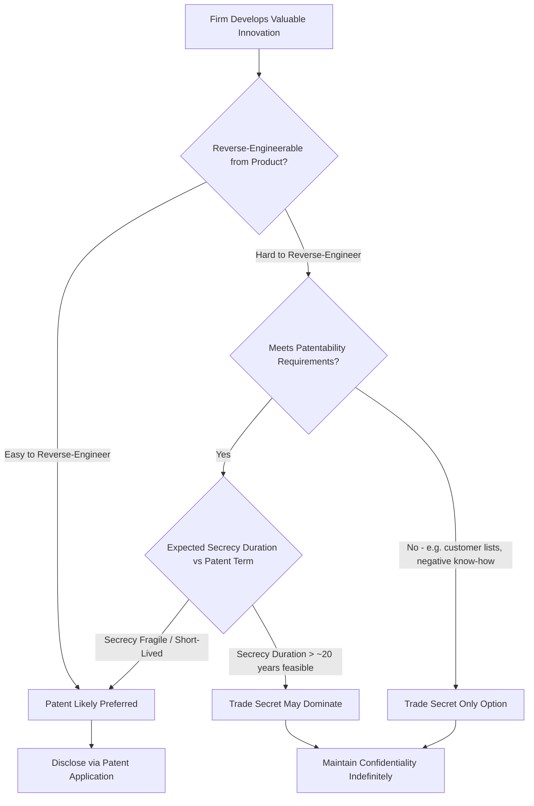

## Trade Secret Law and Economic Analysis


### Overview

Trade secret law protects confidential business information — formulas, processes, customer lists, manufacturing techniques, algorithms — that derives economic value from not being generally known, provided the holder takes reasonable measures to maintain its secrecy. Unlike patent law, trade secret protection requires no disclosure, no examination, and carries no fixed term, lasting indefinitely so long as secrecy is maintained. The economic analysis of trade secrecy, most systematically developed by Friedman, Landes & Posner (1991), frames it as an alternative appropriation mechanism to patenting and as a legal response to a distinct externality: the socially wasteful arms race between secrecy-maintenance and misappropriation efforts that would otherwise occur absent legal intervention.

### The Basic Choice: Patent vs. Trade Secret

**Key Points**

- A firm with a valuable innovation faces a fundamental appropriation choice: seek patent protection (disclose fully, obtain time-limited statutory exclusivity) or rely on trade secrecy (disclose nothing, rely on factual secrecy and legal remedies against misappropriation, with no fixed expiration).
- The choice depends on several factors central to law-and-economics analysis:
  1. **Ease of independent discovery/reverse engineering**: If a competitor could readily reverse-engineer the innovation from the product itself (e.g., a mechanical device that reveals its own design upon inspection), trade secrecy offers weak protection and patenting is preferable. If reverse engineering is difficult or costly (e.g., a chemical formula, a manufacturing process not evident from the end product), trade secrecy can be viable and may be preferred to avoid the disclosure cost of patenting.
  2. **Value of the disclosure bargain**: Patent law's 20-year term is a known, finite tradeoff; if a firm believes it can maintain effective secrecy for longer than the patent term would provide (as with the formula for a globally famous soft drink, allegedly kept secret for over a century), trade secrecy can dominate patenting on pure duration grounds.
  3. **Patentability**: Some valuable information (customer lists, certain business methods, negative know-how — i.e., knowledge of what does *not* work) may not meet patent's novelty/non-obviousness/subject-matter requirements at all, leaving trade secrecy as the only available legal protection.
  4. **Speed to market and disclosure risk**: Patent prosecution can take years and requires public disclosure upon publication (typically 18 months after filing); firms in fast-moving fields may prefer secrecy to avoid tipping off competitors during the examination pendency period.





```
### The Core Economic Rationale: Avoiding a Wasteful Arms Race

**Key Points**

- Friedman, Landes & Posner (1991) frame trade secret law's central economic function as preventing a **socially wasteful expenditure spiral** on both sides of the secrecy relationship:
  - **Secrecy-holder's defensive costs**: Absent legal protection against misappropriation, a firm holding valuable confidential information would need to invest heavily in physical security, restrictive contracts, compartmentalized access, and monitoring — private self-help measures that consume real resources purely to prevent uncompensated taking, with no offsetting social benefit beyond replicating what a legal remedy could provide more cheaply.
  - **Rival's acquisition costs**: Absent a legal prohibition, competitors would have an incentive to invest resources in industrial espionage, employee poaching specifically to extract confidential know-how, or costly reverse-engineering efforts purely to appropriate value already created by another firm, rather than engaging in independent, socially productive innovation.
- Trade secret law substitutes a **legal remedy** (injunctions and damages against misappropriation obtained through improper means) for this costly private arms race, allowing firms to economize on both defensive and offensive private expenditures while still preserving the underlying appropriability that sustains investment incentives.

$$
C_{total} = C_{defense} + C_{misappropriation\_attempts}
$$

Trade secret law aims to reduce $C_{total}$ by substituting cheaper legal deterrence and remedies for costly private self-help and espionage-style rent-seeking on both sides.

### What Counts as "Improper Means"

**Key Points**

- Trade secret law's liability rule is calibrated around the **means of acquisition**, not the mere fact of acquiring or using similar information — this is a critical economic design feature distinguishing it from a patent-style absolute exclusivity right.
- **Independent discovery** and **reverse engineering of a lawfully obtained product** are explicitly *not* misappropriation under trade secret law (Uniform Trade Secrets Act; Defend Trade Secrets Act in the U.S.) — a firm that independently invents the same process, or figures out a competitor's formula through legitimate analysis of a purchased product, incurs no liability.
- **Improper means** — theft, bribery, misrepresentation, breach of a duty of confidentiality (e.g., by a departing employee bound by an NDA), or espionage — are what triggers liability.
- This design reflects an economic judgment: trade secret law protects only against **wasteful, non-productive appropriation** (theft, breach of trust) while explicitly preserving competitors' incentive to engage in **productive, independent** discovery or legitimate reverse engineering — activities that themselves generate genuine social value (new knowledge, competitive pressure) rather than merely transferring rents.

$$
\text{Liability} = f(\text{Means of Acquisition}), \quad \text{NOT} = f(\text{Fact of Possessing Similar Information})
$$

### Comparison with Patent's Absolute Exclusivity

**Key Points**

- This "improper means" limitation is the central structural difference from patent law, where even wholly independent, good-faith re-invention of a patented technology by someone unaware of the original patent still constitutes infringement.
- Economically, this difference is justified by the different disclosure trade-offs: patent law extracts full public disclosure in exchange for its stronger (means-independent) exclusivity, while trade secret law offers no disclosure benefit to the public and therefore only justifies a narrower, conduct-based (means-dependent) protection — granting trade-secret holders patent-level absolute exclusivity would remove any incentive to patent (forgoing the disclosure benefit entirely) while providing a broader right than the lack of disclosure would justify.

| Feature | Patent | Trade Secret |
|---|---|---|
| Disclosure required | Yes, full public disclosure | No |
| Protects against independent invention | Yes (absolute exclusivity) | No (independent discovery is a complete defense) |
| Protects against reverse engineering | Yes | No (lawful reverse engineering is not misappropriation) |
| Duration | ~20 years from filing | Indefinite, contingent on maintained secrecy |
| Examination/registration | Required (PTO review) | None |
| Basis of liability | Mere practice of claimed invention | Acquisition/use via improper means |

### The "Reasonable Measures" Requirement

**Key Points**

- To qualify for trade secret protection, the holder must demonstrate it took **reasonable measures** to maintain secrecy (e.g., NDAs, restricted access, password protection, physical security, employee confidentiality agreements) — information that is freely shared or inadequately protected does not qualify, regardless of its underlying economic value.
- Economically, this requirement can be understood as an efficiency-inducing filter: it forces the secret-holder to internalize at least some minimal cost of protecting the information, screening out claims over information the holder itself did not value highly enough to protect, and creating a baseline private-cost/legal-benefit tradeoff that discourages firms from relying entirely on litigation as a substitute for any private precaution.
- This creates a genuine cost-sharing arrangement: the legal system provides a remedy against improper-means misappropriation, but only supplements (rather than fully substitutes for) private security investment, since some minimal reasonable precaution remains a precondition for the legal right to attach at all.

### Employee Mobility and the Trade Secret / Human Capital Tension

**Key Points**

- A significant tension in trade secret law concerns **departing employees**: an employee who leaves a firm inevitably carries general skills, knowledge, and experience gained on the job — some of which may overlap with the former employer's confidential information — to a new employer or their own venture.
- Overly broad trade secret enforcement (or contractual non-compete agreements used to buttress trade secret protection) risks excessively restricting **labor mobility** and the general diffusion of tacit knowledge through the economy, which is itself an important channel of innovation spillover and economic dynamism (a phenomenon extensively studied in the context of Silicon Valley's historical employee-mobility-friendly legal environment, particularly California's strong statutory prohibition on non-compete agreements).
- The **inevitable disclosure doctrine** (recognized in some but not all U.S. jurisdictions) allows courts to enjoin a former employee from working for a competitor where the new role would make it functionally impossible not to rely on the former employer's trade secrets, even absent proof of actual misappropriation — a doctrine that generates significant law-and-economics controversy because it can function similarly to a judicially-imposed non-compete, with potential chilling effects on employee mobility and follow-on entrepreneurship that arguably runs counter to the innovation-diffusion benefits of a mobile skilled labor market [Inference — the empirical claim that employee mobility drives regional innovation clustering is influentially associated with research on Silicon Valley vs. Route 128 (Saxenian, 1994) and subsequent economics-of-innovation literature, though the precise causal weight of non-compete/trade-secret enforcement differences versus other regional factors remains debated].

### Trade Secret Misappropriation Remedies and Their Economic Function

**Key Points**

- Remedies for trade secret misappropriation (injunctive relief preventing use/disclosure, damages measured by the plaintiff's losses or the defendant's unjust gains, and in egregious cases exemplary damages and attorney's fees under statutes like the U.S. Defend Trade Secrets Act) are designed to restore the *ex ante* incentive to invest in developing and protecting the secret, by ensuring that improper appropriation does not become profitable relative to legitimate independent development.
- **Head start injunctions**: Courts sometimes limit an injunction's duration to the time it would have taken the defendant to independently develop or reverse-engineer the information — reflecting the economic principle that trade secret protection should restore the position the wronged party would have occupied absent misappropriation, not grant a windfall exceeding what legitimate competitive dynamics would have produced.

### Trade Secrets in the Digital and Data Economy

**Key Points**

- Modern trade secret law increasingly protects data-driven business assets: algorithms, machine learning models and training methodologies, proprietary datasets, and software source code, which often combine features of both patentable subject matter and classic trade-secret-appropriate information (e.g., where an algorithm's precise implementation is difficult to reverse-engineer from its outputs alone).
- The rise of data as a competitive asset has intensified interest in **trade secret protection for datasets and data pipelines**, though courts continue to grapple with whether aggregated or processed data meets the "not generally known" and "independent economic value" thresholds, and how the reasonable-measures requirement applies to cloud-based and distributed data architectures.
- Cybersecurity and data breach risks have elevated the practical stakes of the "reasonable measures" requirement, as firms must now demonstrate adequate digital security practices (encryption, access controls, monitoring) alongside traditional physical and contractual safeguards to sustain a trade secret claim.

### Empirical Considerations

**Key Points**

- Empirical surveys of firm innovation strategy (notably the Yale Survey and Carnegie Mellon Survey of R&D-performing firms) consistently find that firms across many industries rank secrecy and lead-time advantages as **more important** than patents for appropriating returns from process innovations in particular, while patents are relatively more important for product innovations that are more easily reverse-engineered once commercialized [Inference — this is a well-replicated finding across multiple survey waves and countries, though the precise ranking varies by industry, era, and survey methodology].
- This empirical pattern is consistent with the theoretical prediction that firms rationally select between patent and trade secret protection based on the reverse-engineering difficulty of the specific innovation type, supporting the substitutability framework central to the law-and-economics analysis of the two regimes.

### Diagram: Trade Secret vs. Patent Decision Tree (svg_diagram)

<svg xmlns="http://www.w3.org/2000/svg" viewBox="0 0 600 400">
  <text x="300" y="25" font-size="16" font-weight="bold" text-anchor="middle" fill="#1a1a1a">Appropriation Mechanism Choice (svg_diagram)</text>
  <rect x="220" y="50" width="160" height="50" rx="6" fill="#e0e7ff" stroke="#4338ca" />
  <text x="300" y="80" font-size="12" text-anchor="middle" fill="#312e81">Valuable Innovation</text>
  <line x1="300" y1="100" x2="300" y2="130" stroke="#333" stroke-width="1.5" />
  <rect x="150" y="130" width="300" height="50" rx="6" fill="#fef3c7" stroke="#d97706" />
  <text x="300" y="160" font-size="12" text-anchor="middle" fill="#78350f">Reverse-Engineerable? Patentable Subject Matter?</text>
  <line x1="220" y1="180" x2="120" y2="220" stroke="#333" stroke-width="1.5" />
  <line x1="380" y1="180" x2="480" y2="220" stroke="#333" stroke-width="1.5" />
  <rect x="40" y="220" width="160" height="60" rx="6" fill="#dbeafe" stroke="#2563eb" />
  <text x="120" y="245" font-size="11" text-anchor="middle" fill="#1e3a8a" font-weight="bold">PATENT</text>
  <text x="120" y="262" font-size="10" text-anchor="middle" fill="#1e3a8a">Disclose, gain 20yr</text>
  <text x="120" y="274" font-size="10" text-anchor="middle" fill="#1e3a8a">absolute exclusivity</text>
  <rect x="400" y="220" width="160" height="60" rx="6" fill="#dcfce7" stroke="#16a34a" />
  <text x="480" y="245" font-size="11" text-anchor="middle" fill="#14532d" font-weight="bold">TRADE SECRET</text>
  <text x="480" y="262" font-size="10" text-anchor="middle" fill="#14532d">No disclosure, indefinite</text>
  <text x="480" y="274" font-size="10" text-anchor="middle" fill="#14532d">but means-limited protection</text>
  <text x="300" y="330" font-size="11" text-anchor="middle" fill="#6b7280">Trade secret does NOT protect against:</text>
  <text x="300" y="350" font-size="11" text-anchor="middle" fill="#6b7280">independent discovery or lawful reverse engineering</text>
</svg>

### Related Topics

- Friedman, Landes & Posner (1991) formal analysis of trade secret law
- Uniform Trade Secrets Act (UTSA) and Defend Trade Secrets Act (DTSA)
- Inevitable disclosure doctrine and its circuit split in U.S. courts
- Non-compete agreements, California Business and Professions Code §16600, and labor mobility economics
- Saxenian's Silicon Valley vs. Route 128 regional innovation comparison
- Yale Survey and Carnegie Mellon Survey on appropriability mechanisms
- Trade secret protection for algorithms, ML models, and training data
- Reverse engineering doctrine and its interaction with software licensing/DRM (DMCA anti-circumvention tension)
- Economic espionage and the Economic Espionage Act (criminal trade secret law)
- Comparative international trade secret regimes (EU Trade Secrets Directive)


```