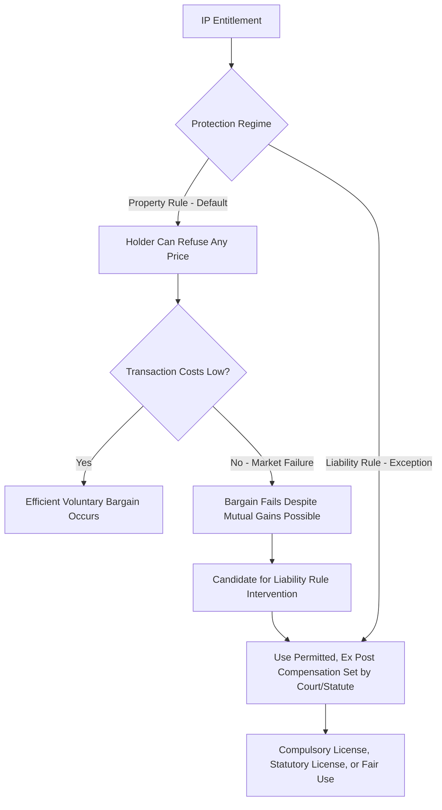

## Compulsory Licensing and IP Exceptions


### Overview

Compulsory licensing permits a government or court to authorize a third party to use a patented invention or copyrighted work without the rights holder's consent, typically in exchange for statutorily or judicially determined compensation rather than a negotiated license fee. Alongside related IP exceptions (research exemptions, march-in rights, statutory licenses, government-use provisions), compulsory licensing represents a deliberate policy shift from a **property rule** (the rights holder controls whether and on what terms to license) to a **liability rule** (use is permitted, subject to ex post compensation), applied in circumstances where the standard IP bargain is judged to generate excessive static costs relative to its dynamic benefits. This section develops the property rule/liability rule framework, surveys the major legal mechanisms, and examines the economic tradeoffs and empirical evidence.

### The Property Rule / Liability Rule Framework

**Key Points**

- Calabresi & Melamed's (1972) foundational framework, later applied extensively to IP by scholars including Merges, distinguishes two ways law can protect an entitlement:
  - **Property rule**: The entitlement holder has the right to refuse a transaction at any price; a taking without consent is enjoined (or subject to punitive-level damages), forcing would-be users into voluntary ex ante bargaining.
  - **Liability rule**: A third party may take the entitlement without the holder's consent, subject to paying an objectively determined (court- or statute-set) compensation ex post.
- Standard patent and copyright law operate primarily as **property rules**: the rights holder can categorically refuse to license, and unauthorized use is enjoined.
- **Property rules are efficient when transaction costs of voluntary bargaining are low** — bilateral negotiation between rights holder and would-be licensee will typically produce a mutually beneficial, welfare-maximizing outcome without government intervention. **Liability rules become more attractive when transaction costs are high enough to block bargains that would otherwise be efficient** — e.g., when there are many dispersed rights holders, urgent time pressure, or a rights holder with market power and non-economic (e.g., strategic or political) reasons to refuse a welfare-enhancing license.
- Compulsory licensing is the paradigmatic liability-rule intervention in IP law: it substitutes government-determined compensation for the property rule's requirement of rights-holder consent, in defined circumstances where transaction costs, market power, or externalities are judged to make pure property-rule bargaining unreliable.





```
### Patent Compulsory Licensing: TRIPS Article 31

**Key Points**

- The WTO's TRIPS Agreement (Article 31) permits member states to authorize use of a patented invention without the rights holder's consent under specified conditions, most notably:
  - Prior attempts to obtain a voluntary license on reasonable commercial terms must generally have failed (waivable in cases of national emergency, extreme urgency, or public non-commercial use).
  - The scope and duration of use must be limited to the purpose for which it was authorized.
  - The rights holder must receive "adequate remuneration" considering the economic value of the authorization.
  - Use must be predominantly for the domestic market of the authorizing country (a restriction later modified by the 2003 Doha Declaration/2017 TRIPS amendment specifically to facilitate export of compulsory-licensed generic pharmaceuticals to countries lacking manufacturing capacity).
- The 2001 **Doha Declaration on TRIPS and Public Health** explicitly affirmed that TRIPS "does not and should not prevent members from taking measures to protect public health," clarifying that governments retain broad discretion to determine what constitutes a "national emergency" justifying compulsory licensing (most prominently invoked in the context of HIV/AIDS antiretroviral access in the early 2000s).

### Economic Rationale for Patent Compulsory Licensing

**Key Points**

- The core economic case for compulsory licensing in specific circumstances (notably pharmaceuticals in public health emergencies) rests on a claim that the **standard patent bargain's static/dynamic tradeoff becomes badly imbalanced** in certain contexts:
  - The static cost (monopoly pricing restricting access) can be extremely high when the good in question is a life-saving medicine and the affected population has very low ability to pay — implying a large humanitarian/welfare cost from restricted access.
  - The dynamic benefit (incentive to invest in inventing the specific drug) is largely **unaffected at the margin** by compulsory licensing decisions made by low-income countries with small markets, because pharmaceutical firms' original R&D investment decisions are driven overwhelmingly by anticipated returns in large, high-income markets (US, EU, Japan) rather than by the marginal revenue obtainable from smaller, lower-income markets — implying the incentive cost of compulsory licensing in such contexts is comparatively small relative to the access benefit [Inference — this "differential market impact" argument is influential in trade and health-economics policy literature and was central to Doha Declaration advocacy, but the precise elasticity of global pharmaceutical R&D investment to compulsory-licensing risk in smaller markets remains empirically contested, particularly regarding potential long-run "signal" effects on firms' expectations about future intellectual property enforcement more broadly].
- Critics counter that even seemingly small individual-market compulsory licensing actions could, in aggregate or through precedent effects, alter firms' global expectations about the reliability of patent protection, potentially generating a **more diffuse and harder-to-measure dynamic cost** than the static, easily observable access benefit — an argument for caution even where any single instance appears low-cost.

### March-In Rights and Government-Funded Research

**Key Points**

- The U.S. Bayh-Dole Act (1980), which allows universities and small businesses to retain patent rights over inventions developed with federal research funding, includes a **march-in rights** provision (35 U.S.C. §203) permitting the funding federal agency to require licensing to third parties if the patent holder has not taken effective steps to achieve practical application of the invention, or if health/safety needs are not reasonably satisfied.
- March-in rights function as a **liability-rule backstop** on an otherwise property-rule-based patent system, specifically justified by the fact that the underlying research was substantially funded by public money — reflecting an argument that the appropriability rationale for strong exclusive rights is weaker when the fixed costs of the underlying invention were already substantially subsidized by taxpayers, reducing the case for allowing the patent holder unfettered property-rule control.
- March-in rights have been invoked only rarely in practice (as of recent U.S. policy history), with petitions largely unsuccessful, reflecting both a high evidentiary bar and policy reluctance to disturb patent-holder expectations, generating ongoing debate about whether the provision functions as an effective check or largely symbolic.

### Statutory (Compulsory) Licensing in Copyright

**Key Points**

- Unlike patent compulsory licensing (typically ad hoc, case-by-case, and emergency-triggered), copyright law in several jurisdictions includes **standing statutory licenses** that apply automatically to defined categories of use, with compensation set by regulatory rate-setting bodies rather than individual negotiation:
  - **Mechanical licenses** for cover recordings of previously published musical compositions (originally 17 U.S.C. §115 in the U.S., substantially reformed by the Music Modernization Act of 2018), allowing any artist to record a cover version upon payment of a statutorily set royalty, without needing the original songwriter's individual consent.
  - **Cable/satellite retransmission licenses**, allowing retransmission of broadcast signals upon payment of statutory fees rather than case-by-case negotiation with every underlying rights holder.
- The economic rationale for these **standing** statutory licenses differs somewhat from the emergency/market-failure rationale for patent compulsory licensing: it primarily addresses a **high-transaction-cost aggregation problem** — a cover artist or retransmission service would otherwise need to identify and separately negotiate with potentially many dispersed rights holders (songwriters, publishers, underlying broadcasters) for a use whose per-transaction value is often too low to justify the negotiation cost, risking that an efficient, welfare-enhancing use never occurs simply due to prohibitive transaction costs — a liability rule resolves this by eliminating the need for individualized ex ante bargaining altogether.

### Research and Experimental Use Exemptions

**Key Points**

- Many patent systems recognize a narrow **experimental use exemption** allowing limited use of a patented invention for genuine scientific research or experimentation without infringement liability (in the U.S., this exemption is construed very narrowly following *Madey v. Duke University*, 2002, which held that even university research conducted with an eye toward institutional legitimacy and grant funding could fall outside the exemption if it advances the institution's business objectives).
- The economic rationale mirrors the patent disclosure bargain's own logic: society benefits from allowing researchers to build on and understand patented technology (verifying claims, testing for follow-on innovation opportunities) even during the patent term, since this cumulative-knowledge-generation activity has low displacement effect on the original patentee's commercial market (pure research typically does not substitute for the patentee's own commercial sales) while generating positive spillovers for future innovation — an application of the same market-failure/low-marginal-cost-to-rights-holder logic that underlies copyright fair use for scholarship.
- The narrowness of the U.S. experimental use exemption (as construed post-*Madey*) has been criticized in the law-and-economics literature as potentially chilling valuable university and non-profit research use of patented technology, particularly in biomedical research where patented research tools (e.g., patented genetic sequences, cell lines, lab techniques) are pervasive inputs to further scientific work — the so-called **"patent thicket in research tools"** problem (Heller & Eisenberg, 1998).

### Government Use and Eminent-Domain-Style Provisions

**Key Points**

- Many jurisdictions, including the U.S. (28 U.S.C. §1498), provide that the government may use a patented invention without a full injunction being available against it, limiting the patentee's remedy to "reasonable and entire compensation" — functioning as an implicit, permanent liability-rule carve-out for government use, conceptually analogous to eminent domain for real property.
- This provision reflects a judgment that government functions (particularly national defense and public health procurement) should not be subject to the holdup risk that a property-rule injunction could create against essential government operations, while still preserving the patentee's right to fair compensation — again a targeted transaction-cost/holdup-risk justification for the liability-rule departure rather than a general critique of patent exclusivity.

### Access-to-Medicines Case Studies

**Example**

- **South Africa (1997–2001)**: The Medicines and Related Substances Control Amendment Act, enabling parallel importation and generic substitution of HIV/AIDS medicines, triggered a major international dispute when 39 pharmaceutical companies sued to block the law, ultimately withdrawing the suit in 2001 amid international pressure — a pivotal event that helped catalyze the 2001 Doha Declaration.
- **Thailand (2006–2008)**: Issued compulsory licenses for several patented HIV and cardiovascular drugs, substantially reducing treatment costs for its national health program, generating significant diplomatic friction with the U.S. and the originator pharmaceutical companies, illustrating the tension between compulsory licensing's domestic public-health benefits and international trade/investment-climate concerns.
- **COVID-19 vaccine IP waiver debate (2020–2022)**: A proposal at the WTO (led by India and South Africa) to broadly waive TRIPS obligations for COVID-19 vaccines, treatments, and diagnostics generated an extended debate weighing rapid, broad access against concerns about manufacturing capacity bottlenecks (critics argued that patent waivers alone would not solve production constraints, since manufacturing capability, technology transfer, and raw material supply chains were often the more binding constraints than the legal IP barrier itself) [Inference — the relative weight of IP-waiver versus manufacturing-capacity/technology-transfer constraints in explaining vaccine access gaps during COVID-19 remains a genuinely disputed empirical and policy question among health economists and trade policy scholars].

### Comparative Table: Types of IP Liability-Rule Exceptions

| Mechanism | IP Type | Trigger | Compensation Basis |
|---|---|---|---|
| TRIPS Art. 31 compulsory license | Patent | National emergency, failed voluntary negotiation, public health | "Adequate remuneration" set by authorizing state |
| Bayh-Dole march-in rights | Patent (federally funded) | Non-commercialization, unmet health/safety needs | Reasonable royalty |
| §1498 government use | Patent | Government use of any kind | "Reasonable and entire compensation" |
| Mechanical license (music) | Copyright | Cover recording of published composition | Statutory rate set by rate-setting body |
| Fair use | Copyright | Market failure / transformative use | None (no compensation; free use) |
| Experimental use exemption | Patent | Genuine non-commercial scientific research | None (narrow, largely uncompensated) |

### Diagram: Static-Dynamic Tradeoff Justifying Liability-Rule Intervention (svg_diagram)

<svg xmlns="http://www.w3.org/2000/svg" viewBox="0 0 620 380">
  <text x="310" y="25" font-size="16" font-weight="bold" text-anchor="middle" fill="#1a1a1a">When Does Liability Rule Dominate Property Rule? (svg_diagram)</text>
  <line x1="80" y1="330" x2="560" y2="330" stroke="#333" stroke-width="2" />
  <line x1="80" y1="330" x2="80" y2="50" stroke="#333" stroke-width="2" />
  <text x="320" y="365" font-size="13" text-anchor="middle" fill="#333">Transaction Cost of Voluntary Bargain</text>
  <text x="35" y="200" font-size="13" text-anchor="middle" fill="#333" transform="rotate(-90 35 200)">Static Access Cost of Refusal</text>
  <rect x="90" y="60" width="200" height="150" fill="#dbeafe" opacity="0.6" />
  <text x="190" y="140" font-size="12" text-anchor="middle" fill="#1e3a8a" font-weight="bold">Property Rule Efficient</text>
  <text x="190" y="158" font-size="10" text-anchor="middle" fill="#1e3a8a">(low transaction cost,</text>
  <text x="190" y="172" font-size="10" text-anchor="middle" fill="#1e3a8a">bargain will occur)</text>
  <rect x="340" y="60" width="200" height="240" fill="#fee2e2" opacity="0.6" />
  <text x="440" y="170" font-size="12" text-anchor="middle" fill="#7f1d1d" font-weight="bold">Liability Rule Candidate</text>
  <text x="440" y="188" font-size="10" text-anchor="middle" fill="#7f1d1d">(high transaction cost or</text>
  <text x="440" y="202" font-size="10" text-anchor="middle" fill="#7f1d1d">high access cost of refusal:</text>
  <text x="440" y="216" font-size="10" text-anchor="middle" fill="#7f1d1d">public health emergency,</text>
  <text x="440" y="230" font-size="10" text-anchor="middle" fill="#7f1d1d">dispersed rights holders)</text>
</svg>

### Related Topics

- Calabresi & Melamed (1972) property rule / liability rule framework in full
- TRIPS Agreement Article 31 and the 2001 Doha Declaration on Public Health
- Bayh-Dole Act and march-in rights case history
- Music Modernization Act (2018) and mechanical licensing reform
- *Madey v. Duke University* and the narrow U.S. experimental use exemption
- Heller & Eisenberg's anticommons problem in biomedical research tools
- COVID-19 TRIPS waiver debate and vaccine manufacturing capacity constraints
- Eminent domain analogy and 28 U.S.C. §1498 government-use provision
- Comparative compulsory licensing regimes (Canada, India, Brazil pharmaceutical policy)
- Standard-essential patents and FRAND as a private-order liability-rule analog


```