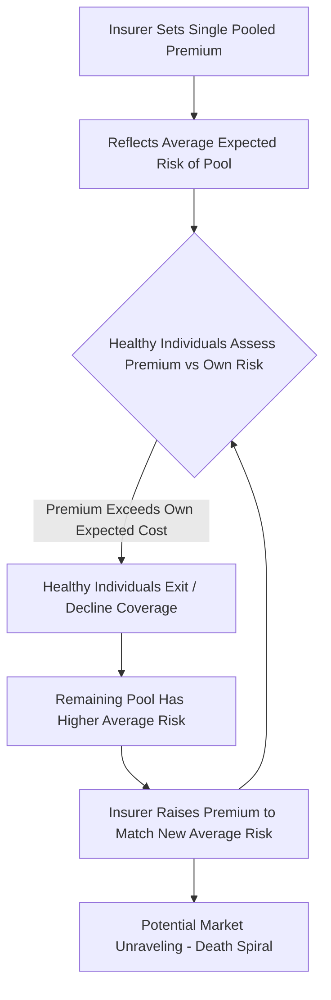

## Economic Characteristics of Health Care Markets


### Overview

Health care markets systematically depart from the textbook conditions required for competitive markets to produce efficient outcomes. Uncertainty, information asymmetry, externalities, and the special ethical status of health as a good combine to produce a distinctive set of market failures that have shaped health law and regulatory policy across virtually all developed economies. This section surveys the foundational economic features of health care markets, beginning with Arrow's seminal 1963 analysis, and works through the major sources of market failure and their doctrinal and regulatory responses.

### Arrow's Foundational Analysis: Uncertainty as the Central Feature

**Key Points**

- Kenneth Arrow's 1963 paper "Uncertainty and the Welfare Economics of Medical Care" remains the foundational text in health economics, identifying **uncertainty** — both about when illness will strike and about the effectiveness of treatment once it does — as the central feature distinguishing health care from ordinary consumer goods markets.
- Arrow argued that this pervasive uncertainty, combined with the difficulty of writing complete contracts around treatment outcomes, explains the emergence of numerous non-market institutions in health care (medical licensing, the physician-patient trust relationship, non-profit hospital forms, insurance) that would be unnecessary or would take different forms in markets for ordinary goods.
- Two distinct types of uncertainty operate simultaneously: **uncertainty about illness incidence** (creating the demand for insurance) and **uncertainty about treatment efficacy** (creating information problems between physician and patient that ordinary consumer markets do not typically face to the same degree).

### Information Asymmetry Between Physician and Patient

**Key Points**

- Health care exhibits severe and largely irreducible information asymmetry: physicians possess vastly superior medical knowledge relative to patients, who typically cannot independently verify whether a recommended diagnosis, test, or treatment is medically necessary, appropriately chosen, or competently performed.
- This asymmetry is compounded by the fact that health care is often simultaneously a **credence good** — a good whose quality cannot be reliably assessed even *after* consumption, since patients frequently cannot determine whether a good or poor health outcome resulted from appropriate or inappropriate care, from the underlying severity of their condition, or from chance.
- **Supplier-induced demand**: Because physicians typically act as both diagnostician (determining what care is needed) and provider (supplying that care, often for a fee), the information asymmetry creates a structural opportunity for demand to be induced or influenced by the interests of the supplying physician rather than being independently determined by the informed patient — a departure from the standard market assumption that demand originates from an independently sovereign, adequately informed consumer.

$$Q_{demanded} = f(\text{Patient Need}, \text{Physician Recommendation}), \quad \text{not purely} = f(\text{Patient's Independent Preferences})$$

- Empirical identification of the magnitude of supplier-induced demand remains a genuinely contested area of health economics research, since distinguishing legitimate physician-guided care (physicians reasonably possess superior information the patient lacks and should rely upon) from inefficient induced demand (utilization driven by provider financial interest beyond genuine medical necessity) is empirically difficult [Inference — the existence of some supplier-induced demand is broadly accepted in the literature, but its quantitative magnitude and the specific conditions under which it operates most strongly remain actively debated].

### Adverse Selection in Health Insurance Markets

**Key Points**

- **Adverse selection** (Akerlof, 1970, applied extensively to health insurance) arises because individuals typically possess better private information about their own health status and risk than insurers can feasibly observe or verify.
- If insurers cannot price policies according to individual risk (due to regulation, cost of underwriting, or fundamental unobservability of risk factors), a single "pooled" premium reflecting average expected costs will be unattractive to healthier-than-average individuals (who are overpaying relative to their true risk) and attractive to sicker-than-average individuals (who are underpaying).
- This can trigger an **adverse selection death spiral**: healthier individuals exit the pool as the pooled premium appears overpriced relative to their low risk, raising the average risk (and thus the premium) of the remaining pool, prompting further exit by the next-healthiest cohort, potentially unraveling the insurance market entirely in the theoretical extreme.





```
- Policy responses to adverse selection include **mandated universal enrollment** (individual mandates, forcing healthy individuals into the pool to prevent selection-driven exit), **guaranteed issue combined with community rating** (requiring insurers to accept all applicants at a common price regardless of health status, which requires an enrollment mandate or strong incentive to avoid the death-spiral problem this combination would otherwise create), and **risk adjustment mechanisms** (transferring funds from insurers with healthier-than-average enrollee pools to those with sicker-than-average pools, reducing insurers' incentive to engage in risk selection rather than genuine cost-competitive behavior).

### Moral Hazard in Health Insurance

**Key Points**

- **Moral hazard** in health insurance operates on (at least) two distinct margins, a distinction central to health economics analysis (Pauly, 1968; Nyman, 1999 offers a partially competing reinterpretation):
  1. **Ex ante moral hazard**: Insured individuals may take less care to prevent illness or injury (reduced preventive behavior) because insurance shields them from the full financial consequence of poor health outcomes.
  2. **Ex post moral hazard**: Once insured, individuals consume more health care at the point of use than they would if paying the full marginal cost, because insurance reduces the out-of-pocket price they face to near zero at the margin — this is generally considered the more economically significant and extensively studied margin.
- The RAND Health Insurance Experiment (1971–1982), one of the largest controlled social science experiments ever conducted, provided influential empirical evidence that higher cost-sharing (deductibles, coinsurance) reduces health care utilization, with the reduction spanning both plausibly low-value and, more troublingly, some plausibly high-value care — suggesting that patients often cannot efficiently distinguish which utilization reductions are appropriate given the same information asymmetry problems that pervade health care demand generally [Inference — the RAND experiment's specific quantitative demand elasticity estimates are widely cited empirical findings, though their applicability to different populations, time periods, and health system contexts is subject to ongoing methodological discussion in the literature].
- Nyman's (1999) reinterpretation argues that some of the increased utilization typically labeled as "welfare-reducing moral hazard" may instead reflect insurance's **income transfer effect** — insurance provides an income transfer to the sick state of the world (a genuinely valuable function of insurance), and some of the increased consumption financed by that transfer represents welfare-improving access to care the individual could not otherwise afford, rather than pure inefficiency — a view that has generated substantial ongoing debate about how much of observed utilization response to insurance actually represents efficiency loss versus a legitimate income effect.

### The Optimal Insurance Tradeoff

**Key Points**

- Health insurance design faces a fundamental tradeoff: greater coverage (lower cost-sharing) provides better **risk protection** (smoothing consumption against the financial shock of illness, the primary value proposition of insurance) but induces greater **moral hazard** (excess utilization at the margin where insurance reduces perceived price below true social marginal cost).
- The economically optimal insurance contract balances these two effects rather than maximizing either coverage or cost-containment alone — full insurance (zero cost-sharing) would maximize risk protection but also maximize moral hazard-driven overutilization; no insurance would eliminate moral hazard but leave individuals fully exposed to catastrophic financial risk from illness.
- This tradeoff underlies the near-universal design feature of deductibles, coinsurance, and copayments in health insurance contracts, structured to preserve substantial protection against catastrophic financial loss while imposing some marginal price sensitivity to discourage low-value utilization at the margin.

### Externalities in Health Care

**Key Points**

- **Positive externalities** are pervasive in specific categories of health care, most classically **infectious disease treatment and vaccination**: an individual's decision to be vaccinated or to treat a communicable illness confers direct health benefits on others (reduced transmission risk) that the individual does not fully internalize in their private consumption decision, leading to underconsumption relative to the social optimum absent subsidy or mandate.
- **Herd immunity** functions as a public good in the technical economic sense once vaccination coverage crosses a population threshold, since individuals who remain unvaccinated can free-ride on the reduced transmission risk generated by others' vaccination, reinforcing the standard public-goods underprovision logic.
- Public health interventions (vaccination subsidies/mandates, communicable disease surveillance and reporting requirements, quarantine authority) are frequently justified in economic terms as internalizing these externalities, distinguishing them analytically from interventions justified purely on paternalism or equity grounds.

### Health Care as a "Merit Good" and Equity Considerations

**Key Points**

- Health care is frequently classified (in both economic and political discourse) as a **merit good** — a good society judges individuals should consume regardless of ability to pay or, in some formulations, regardless of their own preferences, reflecting values distinct from pure consumer sovereignty and willingness-to-pay-based efficiency analysis.
- This classification underlies widespread public financing, subsidization, and mandated coverage of health care across virtually all developed economies, and is frequently invoked to justify departures from a pure market-efficiency framework in health policy — though economists differ on whether "merit good" reasoning reflects a genuine, analytically distinct market failure (e.g., systematic underestimation by individuals of their own future health care needs) or is better understood as primarily an equity/distributive judgment layered on top of, rather than a correction to, standard efficiency analysis [Inference — this is a normative/methodological distinction on which health economists and philosophers of economics hold differing views, rather than a settled empirical matter].

### Barriers to Entry: Licensing and Certificate-of-Need Regulation

**Key Points**

- **Medical licensing** addresses the severe physician-patient information asymmetry by establishing a credentialing floor that reduces patients' search/verification costs (analogous to the trademark search-cost function, but government-administered rather than market-based), though licensing also functions as a **barrier to entry** that can restrict supply and support above-competitive physician incomes — a tension extensively analyzed in the occupational licensing literature (Kleiner and others), where the consumer-protection benefit must be weighed against the market-power/reduced-competition cost.
- **Certificate-of-Need (CON) laws**, requiring state regulatory approval before hospitals can add capacity (new facilities, major equipment, expanded bed capacity) in many U.S. states, were originally justified on a **supply-induced-demand/cost-control rationale** (limiting excess capacity to prevent providers from generating demand to fill it, given the information-asymmetry-driven supplier-induced-demand concern discussed above) but are widely criticized in more recent health economics literature as functioning primarily as an anticompetitive barrier to entry that protects incumbent hospitals from competition, with limited evidence that they achieve their original cost-containment goals [Inference — the empirical literature on CON laws' net effect on costs, quality, and access is decidedly more critical in recent decades than the laws' original 1970s-era policy rationale, though this remains an actively studied and somewhat jurisdiction-specific empirical question].

### Third-Party Payment and the Weakened Price Mechanism

**Key Points**

- The prevalence of third-party payment (insurance, whether private or public) in health care means that the party consuming care (the patient) is often not the party directly bearing its marginal cost at the point of service, and the party paying (the insurer) is not the party making the consumption decision — a structural separation between decision-maker and cost-bearer that weakens the standard price mechanism's role in allocating resources efficiently.
- This third-party payment structure interacts directly with the moral hazard and supplier-induced demand problems discussed above, compounding the difficulty of relying on unregulated market price signals to achieve efficient resource allocation in health care to a degree not typically present in ordinary consumer goods markets.

### Comparative Summary Table

| Market Failure | Source | Primary Institutional/Legal Response |
|---|---|---|
| Uncertainty (Arrow) | Illness incidence + treatment efficacy uncertainty | Insurance, medical licensing, non-profit hospital form |
| Information asymmetry | Physician-patient knowledge gap; credence good | Medical licensing, malpractice liability, informed consent doctrine |
| Supplier-induced demand | Physician as both diagnostician and provider | Second-opinion requirements, utilization review, payment reform (bundled/capitated payment) |
| Adverse selection | Private information about own health risk | Mandates, guaranteed issue + community rating, risk adjustment |
| Moral hazard (ex post) | Reduced marginal price at point of use | Deductibles, coinsurance, copayments, utilization management |
| Positive externalities (infectious disease) | Transmission risk to others | Vaccination subsidies/mandates, public health surveillance |
| Entry barriers | Licensing, CON laws | Balances consumer protection vs. competitive/access costs |

### Diagram: The Interlocking Market Failures in Health Care (svg_diagram)

<svg xmlns="http://www.w3.org/2000/svg" viewBox="0 0 640 420">
  <text x="320" y="25" font-size="16" font-weight="bold" text-anchor="middle" fill="#1a1a1a">Interlocking Health Care Market Failures (svg_diagram)</text>
  <circle cx="320" cy="210" r="70" fill="#fef3c7" stroke="#d97706" stroke-width="2" />
  <text x="320" y="205" font-size="12" text-anchor="middle" fill="#78350f" font-weight="bold">Uncertainty</text>
  <text x="320" y="220" font-size="11" text-anchor="middle" fill="#78350f">(Arrow 1963)</text>
  <circle cx="150" cy="110" r="65" fill="#dbeafe" stroke="#2563eb" stroke-width="2" opacity="0.85" />
  <text x="150" y="105" font-size="11" text-anchor="middle" fill="#1e3a8a" font-weight="bold">Information</text>
  <text x="150" y="120" font-size="11" text-anchor="middle" fill="#1e3a8a">Asymmetry</text>
  <circle cx="490" cy="110" r="65" fill="#dcfce7" stroke="#16a34a" stroke-width="2" opacity="0.85" />
  <text x="490" y="105" font-size="11" text-anchor="middle" fill="#14532d" font-weight="bold">Adverse</text>
  <text x="490" y="120" font-size="11" text-anchor="middle" fill="#14532d">Selection</text>
  <circle cx="150" cy="320" r="65" fill="#fce7f3" stroke="#db2777" stroke-width="2" opacity="0.85" />
  <text x="150" y="315" font-size="11" text-anchor="middle" fill="#831843" font-weight="bold">Moral</text>
  <text x="150" y="330" font-size="11" text-anchor="middle" fill="#831843">Hazard</text>
  <circle cx="490" cy="320" r="65" fill="#ede9fe" stroke="#7c3aed" stroke-width="2" opacity="0.85" />
  <text x="490" y="315" font-size="11" text-anchor="middle" fill="#4c1d95" font-weight="bold">Externalities</text>
  <text x="490" y="330" font-size="11" text-anchor="middle" fill="#4c1d95">(infectious disease)</text>
</svg>

### Related Topics

- Arrow (1963) "Uncertainty and the Welfare Economics of Medical Care" full theoretical apparatus
- RAND Health Insurance Experiment and modern replications (Oregon Health Insurance Experiment)
- Nyman's income-transfer reinterpretation of moral hazard
- Akerlof's "Market for Lemons" and adverse selection theory
- Rothschild-Stiglitz separating equilibrium model in insurance markets
- Certificate-of-Need law empirical literature and state-by-state variation
- Medical malpractice liability as an information/incentive-correcting mechanism
- Physician payment models: fee-for-service vs. capitation vs. bundled payment incentive effects
- Community rating, guaranteed issue, and individual mandate design in the ACA
- Occupational licensing economics (Kleiner) applied to health professions


```