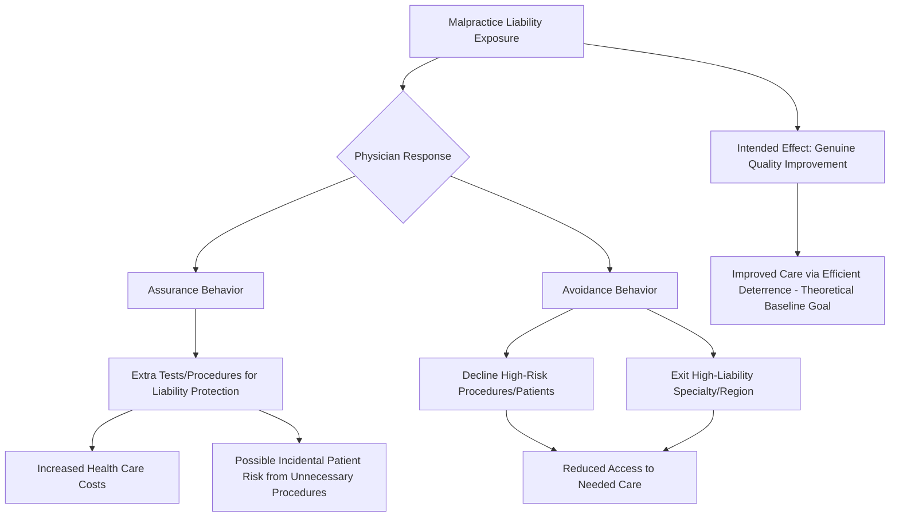

## Medical Malpractice Liability and Defensive Medicine


### Overview

Medical malpractice liability applies general tort law principles (duty, breach, causation, damages) to the physician-patient relationship, with the standard of care typically defined by reference to prevailing professional custom. The economic analysis of malpractice liability examines whether this negligence-based liability system efficiently deters substandard care and compensates injured patients, and centers substantially on its most controversial byproduct: **defensive medicine**, the practice of ordering additional tests, procedures, or referrals — or avoiding certain patients or procedures altogether — primarily to reduce liability exposure rather than to improve expected patient outcomes.

### The Standard Economic Model of Tort Liability Applied to Medicine

**Key Points**

- Standard law-and-economics tort theory (Learned Hand's *United States v. Carroll Towing* formula, formalized by Posner) holds that a negligence-based liability rule is efficient when it induces the injurer to take the cost-justified level of precaution — the level at which the marginal cost of additional precaution equals the marginal reduction in expected accident costs.

$$\text{Negligent if: } B < P \times L$$

where $B$ is the burden (cost) of additional precaution, $P$ is the probability that the harm occurs absent that precaution, and $L$ is the magnitude of the loss if it occurs. Applied to medicine, if the cost of an additional test or precaution is less than the expected reduction in harm it produces, failing to take that precaution should, in principle, constitute negligence.

- The theoretical efficiency case for malpractice liability is that it induces physicians to internalize the expected costs of substandard care (which they would otherwise not fully bear, since patients cannot easily monitor quality directly — the same information asymmetry problem central to health care markets generally), aligning private incentives with socially optimal care levels.
- In practice, however, medical malpractice liability is widely regarded in the law-and-economics literature as a **poor real-world approximation of this efficient-deterrence model**, for reasons rooted in the peculiar difficulty of applying the Hand Formula's variables to clinical medicine.

### Why the Efficient-Deterrence Model Breaks Down in Medicine

**Key Points**

1. **Difficulty establishing the counterfactual and causation**: Unlike many accident contexts, the "but-for" cause of a bad medical outcome is often genuinely ambiguous — poor outcomes can result from the underlying disease process itself, from inherent medical uncertainty even under best-practice care, or from actual negligence, and juries (lacking medical training) may struggle to reliably distinguish these possibilities, especially when relying on competing expert testimony.
2. **Hindsight bias**: Jurors evaluating a bad outcome ex post are systematically prone to overestimate how foreseeable and preventable the harm appeared ex ante, a well-documented cognitive bias in the psychology and law-and-economics literature that can distort liability determinations toward finding negligence even where the physician's ex ante decision was reasonable given the information available at the time [Inference — hindsight bias is a well-replicated finding in the psychology literature generally; its specific quantitative distorting effect on medical malpractice jury verdicts is harder to isolate empirically, though it is widely cited as a plausible mechanism in the law-and-economics literature on malpractice].
3. **Customary standard of care as the negligence benchmark**: Unlike the general Hand Formula (an independent cost-benefit calculation), medical malpractice liability typically defines the standard of care by reference to prevailing **professional custom** (what a reasonably competent physician in the same specialty would have done) rather than an independent judicial cost-benefit assessment — a deferential standard that can perpetuate cost-ineffective customary practices industry-wide if the profession's own custom has not itself converged on the efficient precaution level.
4. **Imperfect information and noisy signal**: Even a genuinely negligent act may not result in observable harm (a "close call" that happens to turn out fine), while genuinely non-negligent care can produce a bad outcome due to underlying disease severity — meaning the liability system's incentive signal to physicians is noisy, reducing its precision as a deterrence mechanism relative to the stylized Hand Formula model.

### Defensive Medicine: Positive and Negative Forms

**Key Points**

Defensive medicine is typically decomposed into two distinct behavioral responses, with different welfare implications:

1. **Assurance behavior (positive defensive medicine)**: Ordering additional tests, procedures, imaging, or specialist referrals beyond what is expected to be clinically beneficial, primarily to create a documented record protecting against future liability exposure or to reduce the (already low) probability of missing a rare diagnosis. This increases health care costs and can expose patients to the risks of additional unnecessary procedures (radiation exposure from excess imaging, complications from unnecessary invasive tests) without a corresponding expected health benefit.
2. **Avoidance behavior (negative defensive medicine)**: Physicians declining to perform certain high-risk procedures, avoiding certain high-risk patient populations (e.g., some obstetricians reportedly reducing high-risk obstetric practice, some surgeons avoiding complex cases), or exiting high-liability specialties or geographic areas entirely (documented liability-driven physician relocation and specialty-choice effects, sometimes termed "liability crises" in specific states/specialties, notably obstetrics and neurosurgery) — this form directly reduces access to needed care, a more clearly welfare-reducing effect than assurance behavior's excess-cost-without-excess-risk-reduction profile.





```
### Empirical Evidence on the Magnitude of Defensive Medicine

**Key Points**

- Empirical estimates of defensive medicine's cost impact vary substantially depending on methodology, ranging from studies finding modest effects to those attributing a meaningful share of excess U.S. health care spending to defensively motivated utilization, though there is no single, universally accepted point estimate in the literature [Inference — this reflects genuine and long-standing methodological disagreement in the health economics literature about how to isolate "defensively motivated" utilization from clinically appropriate care that happens to also provide liability protection, since the same test can serve both functions simultaneously, making decomposition inherently difficult].
- A frequently cited natural-experiment approach exploits variation in state-level tort reform (discussed below) to estimate the causal effect of liability exposure on utilization and spending, with several influential studies (e.g., Kessler & McClellan, 1996, examining Medicare heart disease patients) finding that malpractice reforms reducing liability pressure were associated with reduced hospital expenditures with **no measurable adverse effect on patient mortality or major complication rates** in the conditions studied — a finding widely interpreted as evidence that at least some pre-reform utilization represented low-value defensive medicine rather than clinically beneficial care [Inference — the Kessler-McClellan finding is influential and frequently cited, but its generalizability beyond the specific conditions (acute myocardial infarction, ischemic heart disease) and time period studied, and to other clinical contexts, is a subject of ongoing empirical inquiry rather than a fully settled, universal result].
- Some later and alternative studies find smaller, more mixed, or context-dependent effects, and the literature has not converged on a single confident aggregate estimate of what fraction of national health expenditure is attributable to defensive medicine specifically.

### Tort Reform Mechanisms and Their Economic Rationale

**Key Points**

Numerous U.S. states have enacted malpractice tort reforms, each targeting a different margin of the liability system's incentive structure:

1. **Damage caps** (most commonly on non-economic damages, e.g., pain and suffering) — Intended to reduce the volatility and unpredictability of large jury awards, which liability-and-economics analysis suggests can distort physician behavior more through *fear of tail-risk outlier verdicts* than through the expected-value calculation the efficient-deterrence model assumes, since risk-averse physicians (and their malpractice insurers) may respond more to worst-case variance than to actuarially expected liability cost.
2. **Collateral source rule reform** — Allowing evidence of the plaintiff's other compensation sources (health insurance, disability payments) to be considered in damage awards, reducing the risk of duplicative compensation and thereby lowering total liability exposure and associated defensive-medicine incentives.
3. **Statute of limitations/repose reforms** — Shortening the window during which a malpractice claim can be filed, reducing long-tail liability uncertainty that can be particularly difficult for insurers to price accurately.
4. **Certificate of merit requirements** — Requiring plaintiffs to obtain expert affidavit support before filing suit, intended to screen out low-merit claims before they impose litigation costs and settlement pressure on physicians regardless of the underlying claim's substantive validity.
5. **Safe harbor / clinical practice guideline defenses** — Some reforms create a rebuttable presumption of non-negligence for physicians who followed established clinical practice guidelines, intended to reduce the customary-standard ambiguity problem discussed above by anchoring the negligence determination to a more explicit, ex ante-knowable benchmark.

### The Insurance-Availability/Affordability Crisis Framing

**Key Points**

- Periodic "malpractice crises" (notably in the mid-1970s, mid-1980s, and early 2000s in the U.S.) have been characterized by sharp increases in malpractice insurance premiums, sometimes leading physicians in high-risk specialties (obstetrics, neurosurgery) to reduce practice scope, relocate to states with more favorable liability environments, or exit practice altogether.
- Economists have debated whether these episodes primarily reflect a **liability-driven cost shock** (genuine increases in litigation frequency/severity driving insurer costs) or an **insurance-market cycle phenomenon** (premium spikes driven by insurers' own investment-return cycles and reserve-adjustment behavior, only loosely connected to underlying claims experience) — with the insurance-cycle explanation receiving substantial support in some empirical analyses of the timing and magnitude of premium spikes relative to underlying claims data [Inference — this remains a genuinely debated empirical question in the insurance economics and health law literature, with reasonable arguments and evidence supporting both the liability-driven and insurance-cycle explanations, likely reflecting some combination of both mechanisms operating simultaneously to varying degrees across different crisis episodes].

### Alternative Liability and Compensation Regimes

**Key Points**

Given the perceived inefficiencies of the fault-based malpractice system, several alternative institutional designs have been proposed or implemented in limited contexts:

1. **No-fault compensation systems** (implemented for specific injury categories, e.g., the U.S. National Vaccine Injury Compensation Program, and more broadly in some countries' health systems such as New Zealand's Accident Compensation Corporation) — Compensate patients for adverse outcomes meeting defined criteria without requiring proof of negligence, trading the precise incentive-alignment goal of fault-based liability for lower administrative/litigation costs and more predictable, faster compensation.
2. **Enterprise liability** — Shifting liability from individual physicians to the hospital or health system as an institutional entity, on the theory that institutions are better positioned to implement systemic quality improvement and to spread risk, potentially reducing the individual physician's direct defensive-medicine incentive while preserving institution-level deterrence.
3. **Health courts / specialized administrative tribunals** — Proposed (though not widely adopted in the U.S.) specialized adjudicative bodies with medically trained fact-finders, intended to reduce the jury-competence and hindsight-bias problems associated with lay juries evaluating complex clinical decision-making.
4. **Apology and disclosure laws** — Statutes protecting physician apologies/expressions of sympathy from being used as evidence of liability, intended to facilitate early disclosure and resolution of adverse events, potentially reducing both litigation costs and defensive nondisclosure behavior that can itself compromise patient safety learning.

### Comparative Table: Malpractice Reform Mechanisms and Targeted Margin

| Reform | Targets | Economic Mechanism |
|---|---|---|
| Damage caps | Award unpredictability/tail risk | Reduces risk-averse over-response to variance |
| Certificate of merit | Frivolous claim filing | Screens low-merit claims before litigation cost imposed |
| Safe harbor guidelines | Customary standard ambiguity | Anchors negligence determination to explicit ex ante benchmark |
| No-fault compensation | Causation/fault-finding difficulty | Removes fault requirement; faster, lower-cost compensation |
| Enterprise liability | Individual physician defensive incentive | Shifts incentive to institutional quality systems |

### Diagram: Efficient vs. Actual Precaution Level Under Malpractice Liability (svg_diagram)

<svg xmlns="http://www.w3.org/2000/svg" viewBox="0 0 600 400">
  <text x="300" y="25" font-size="16" font-weight="bold" text-anchor="middle" fill="#1a1a1a">Precaution Level: Efficient vs Defensive (svg_diagram)</text>
  <line x1="70" y1="340" x2="550" y2="340" stroke="#333" stroke-width="2" />
  <line x1="70" y1="340" x2="70" y2="50" stroke="#333" stroke-width="2" />
  <text x="310" y="375" font-size="13" text-anchor="middle" fill="#333">Level of Precaution (Tests, Procedures)</text>
  <text x="30" y="200" font-size="13" text-anchor="middle" fill="#333" transform="rotate(-90 30 200)">Cost / Benefit</text>
  <path d="M 90 320 Q 250 60 500 60" stroke="#dc2626" stroke-width="2.5" fill="none" />
  <text x="480" y="50" font-size="11" fill="#dc2626">Marginal Cost of Precaution</text>
  <path d="M 90 90 Q 250 250 500 320" stroke="#16a34a" stroke-width="2.5" fill="none" />
  <text x="480" y="335" font-size="11" fill="#16a34a">Marginal Benefit (Harm Reduction)</text>
  <line x1="270" y1="50" x2="270" y2="340" stroke="#2563eb" stroke-width="1.5" stroke-dasharray="4" />
  <text x="195" y="65" font-size="11" fill="#2563eb" font-weight="bold">Efficient Level (MB=MC)</text>
  <line x1="400" y1="50" x2="400" y2="340" stroke="#9333ea" stroke-width="1.5" stroke-dasharray="4" />
  <text x="410" y="65" font-size="11" fill="#9333ea" font-weight="bold">Actual Defensive Level</text>
  <path d="M 270 190 L 400 190" stroke="#f59e0b" stroke-width="3" />
  <text x="290" y="180" font-size="10" fill="#92400e">Excess defensive gap</text>
</svg>

### Related Topics

- Learned Hand Formula and general negligence-based tort deterrence theory
- Kessler & McClellan (1996) natural-experiment estimates of defensive medicine costs
- Hindsight bias in legal decision-making (Kahneman/Tversky-derived psychology literature applied to law)
- National Vaccine Injury Compensation Program as a no-fault model
- New Zealand Accident Compensation Corporation comparative no-fault system
- Insurance underwriting cycle theory applied to malpractice premium crises
- Enterprise liability proposals (Abraham & Weiler)
- Apology and disclosure statutes and their effect on litigation rates
- Certificate of merit and other pre-filing claim-screening mechanisms
- Comparative international medical liability regimes (Scandinavian no-fault models)


```