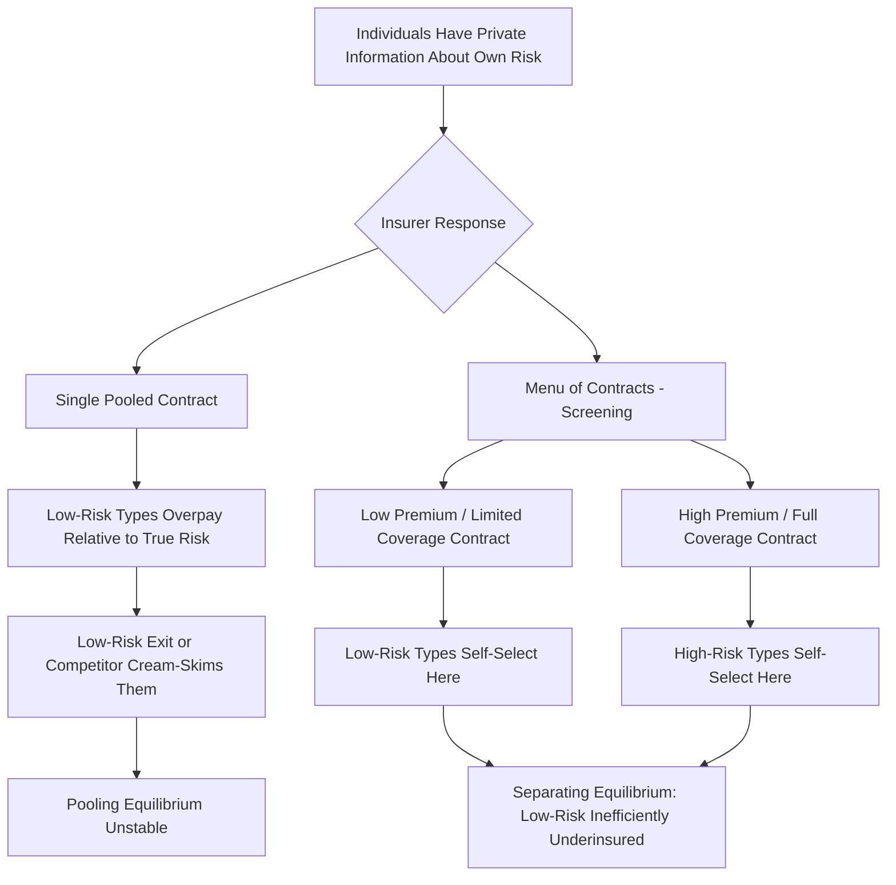

## Health Insurance Markets and Adverse Selection


### Overview

Adverse selection arises in health insurance because individuals typically possess better private information about their own health status and expected future costs than insurers can feasibly observe or verify. This asymmetric information problem, first formalized by Akerlof (1970) and extended to insurance markets by Rothschild & Stiglitz (1976), is one of the most extensively studied market failures in health economics and has driven much of the regulatory architecture of modern health insurance systems, including community rating, guaranteed issue, individual mandates, and risk adjustment. This section develops the theoretical models, traces their policy implications, and surveys empirical evidence.

### The Akerlof "Lemons" Framework Applied to Insurance

**Key Points**

- Akerlof's (1970) original "market for lemons" model describes how asymmetric information about quality (in his example, used cars) can cause a market to unravel: if sellers know more about quality than buyers, and buyers can only offer a price reflecting the *average* quality they expect, high-quality sellers exit (unwilling to accept a price based on the average), lowering the average quality of goods remaining in the market, which further reduces the price buyers are willing to pay — potentially collapsing the market entirely in the theoretical extreme.
- Applied to insurance, the informational asymmetry runs in the opposite direction from Akerlof's original setup: it is the **buyer** (the insured individual) who has superior private information about their own risk (health status, family history, lifestyle factors, subjective sense of their own health), while the **seller** (the insurer) is the less-informed party trying to price a product without full information about the specific risk it is insuring.
- If insurers must charge a single **pooled premium** based on average expected costs across a group (because regulation prohibits risk-based pricing, or because individual risk is too costly or legally impermissible to assess with precision), individuals who know themselves to be lower-risk than the pool average will find the pooled premium unattractive relative to their true expected costs, while higher-risk individuals will find it a good deal.

$$P_{pooled} = E[\text{Cost}] = \sum_i w_i \cdot C_i$$

If low-risk individuals ($C_i < P_{pooled}$) exit, the remaining pool's average cost rises, requiring $P_{pooled}$ to increase, which can trigger further exit by the next-lowest-risk cohort — the classic **adverse selection death spiral**.

### The Rothschild-Stiglitz Model: Separating vs. Pooling Equilibria

**Key Points**

- Rothschild & Stiglitz (1976) formalized the strategic response of insurers to adverse selection through a game-theoretic model in which insurers offer a **menu of contracts** (differing in premium and coverage level) designed to induce different risk types to self-select into different plans, rather than offering a single pooled contract.
- In their canonical result, a **separating equilibrium** can arise in which low-risk individuals select a contract with lower premiums but incomplete coverage (higher deductibles/coinsurance), while high-risk individuals select a contract with full coverage at a higher premium — the incomplete coverage offered to low-risk types is not because insurers want to *underinsure* them, but functions as a **screening device**: high-risk individuals, who expect to use more care, would find a low-coverage/low-premium contract unattractive relative to a high-coverage/high-premium one, while low-risk individuals (who expect to use little care regardless) are willing to accept the coverage limitation in exchange for a lower premium, allowing insurers to sort risk types without directly observing risk.
- A key and influential result of the model is that a **pooling equilibrium** (a single contract serving both risk types) can be **unstable**: a competitor could profitably offer a slightly different contract that "cream-skims" the low-risk types away from the pooling contract, leaving it unsustainable — implying that under the model's assumptions, competitive insurance markets with adverse selection may fail to sustain a stable pooling equilibrium at all, and even the separating equilibrium may fail to exist under certain parameter configurations (a further instability result extended by subsequent literature).
- The Rothschild-Stiglitz framework predicts a **welfare cost of asymmetric information distinct from the pooling-versus-separating question**: even the best achievable separating equilibrium under asymmetric information is Pareto-inferior to the equilibrium that would obtain if insurers could directly observe risk type, since low-risk individuals are forced to accept inefficiently incomplete coverage purely as a costly screening mechanism.





```
### Policy Responses to Adverse Selection

**Key Points**

Regulatory interventions in health insurance markets are frequently designed explicitly to address the adverse selection problem, though different tools target different aspects of it:

1. **Individual mandate**: Requiring (or strongly incentivizing) universal enrollment prevents low-risk individuals from selectively opting out of the pool, directly addressing the exit-driven death-spiral mechanism by removing the individual's ability to act on their private risk information through a non-participation decision.
2. **Guaranteed issue**: Requiring insurers to accept all applicants regardless of health status prevents insurers from excluding high-risk individuals altogether (addressing a distinct concern — that insurers, if permitted, might respond to adverse selection risk by risk-underwriting aggressively and excluding the highest-risk applicants, which raises its own equity and access concerns even if it might address market-stability concerns from the insurer's perspective).
3. **Community rating**: Requiring insurers to charge the same (or a narrowly banded) premium to all enrollees regardless of individual health status, directly preventing risk-based price discrimination. Community rating combined with guaranteed issue **without** an accompanying mandate is widely predicted by the theory (and has been empirically observed in some markets, e.g., certain U.S. states' individual markets prior to the ACA's mandate) to be particularly susceptible to adverse-selection-driven market instability, since it removes insurers' ability to price for risk while simultaneously making it costless for low-risk individuals to defer enrollment until they become sick.
4. **Risk adjustment (risk equalization)**: Rather than restricting how insurers price or accept applicants, risk adjustment transfers funds *between* insurers based on the realized risk profile of their enrolled population — insurers with healthier-than-average enrollees pay into a fund that compensates insurers with sicker-than-average enrollees, reducing insurers' incentive to compete via risk selection (attracting healthy enrollees, discouraging sick ones) rather than via genuine cost-efficiency or care-quality competition. This is a key design feature of many managed-competition health insurance marketplaces (e.g., the ACA marketplaces, the Netherlands' and Germany's social health insurance systems).
5. **Reinsurance and risk corridors**: Additional risk-mitigation mechanisms that limit insurers' exposure to unexpectedly high-cost enrollee pools (reinsurance) or share gains/losses relative to projected costs across insurers in a market (risk corridors), reducing the incentive for insurers to price defensively against adverse selection uncertainty in ways that could itself contribute to market instability.

### Empirical Evidence on Adverse Selection in Health Insurance

**Key Points**

- Empirical testing for adverse selection typically examines whether individuals who select more generous coverage subsequently exhibit higher realized health care utilization/costs than those who select less generous coverage, controlling for observable risk factors — a **positive correlation test** consistent with (though not definitively proving) private information-driven selection (Chiappori & Salanié, 2000, methodology).
- Empirical findings on the magnitude and even the direction of selection effects in real-world health insurance markets are considerably more mixed than the canonical theoretical models might suggest: some studies find evidence consistent with adverse selection in specific markets (e.g., Medigap supplemental insurance markets), while others find evidence of **advantageous selection** in certain contexts — where individuals who are more risk-averse (and thus purchase more comprehensive coverage) also tend to engage in more health-protective behaviors, potentially generating a *negative* correlation between coverage generosity and risk that runs counter to the simple adverse selection prediction [Inference — this heterogeneity of empirical findings across markets and studies is a well-established feature of the empirical insurance economics literature (associated notably with work by Cutler, Finkelstein, and others), reflecting that real-world selection dynamics depend on the specific correlation structure between risk type, risk preferences, and information in each particular market, rather than adverse selection being a universal empirical regularity present with uniform strength across all insurance contexts].
- The ACA individual mandate's effectiveness in mitigating adverse selection, and the market effects of its 2019 federal penalty reduction to \$0, have themselves been the subject of extensive empirical study, with evidence generally suggesting the mandate penalty had a real but more modest effect on enrollment and market composition than some pre-implementation projections anticipated, with state-level individual mandates (e.g., Massachusetts, later New Jersey and California) and other stabilization mechanisms (reinsurance programs) also playing a measurable role in market stability outcomes [Inference — the precise magnitude of mandate-driven enrollment and risk-pool effects remains an active area of health economics research with results that vary by study design, time period, and market examined].

### Selection on Moral Hazard vs. Selection on Risk

**Key Points**

- A further complication in modern selection literature (Einav, Finkelstein & Cullen, 2010 and related work) distinguishes **selection on risk level** (the classic adverse selection story — some individuals are simply sicker than others) from **selection on moral hazard responsiveness** — individuals may differ not only in their baseline risk but in how much their utilization *responds* to the generosity of coverage (some individuals' consumption is highly price-elastic, others' much less so), and these two dimensions of heterogeneity can generate distinct and sometimes offsetting selection patterns that a simple single-dimensional risk-type model does not capture.
- This refinement matters for policy design because a plan design optimized to address pure risk-based adverse selection (e.g., a screening deductible structure per Rothschild-Stiglitz) may interact differently with a population where selection operates substantially along the moral-hazard-responsiveness dimension instead, complicating simple prescriptive policy conclusions drawn directly from the canonical single-dimensional models.

### The Interaction Between Adverse Selection and Employer-Sponsored Insurance

**Key Points**

- Employer-sponsored group health insurance, historically the dominant form of coverage in the U.S., mitigates adverse selection substantially by pooling risk across an employment-based group whose composition is determined largely by employment decisions (which correlate only weakly with private health-risk information) rather than by individuals actively self-selecting into insurance based on anticipated health care needs — a form of **implicit risk pooling through an unrelated selection mechanism** that sidesteps much of the direct adverse-selection problem present in fully voluntary individual markets.
- This feature is frequently cited as a key economic (rather than purely historical/tax-driven) rationale for the persistence and relative actuarial stability of employer-based group coverage relative to individual insurance markets, even though the U.S. system's reliance on employer-sponsored insurance is also substantially attributable to the tax exclusion for employer-provided health benefits (a distinct policy-driven rather than pure-market-efficiency explanation) [Inference — both the risk-pooling-stability explanation and the tax-subsidy explanation are well-established in the health economics literature as contributing factors to employer-sponsored insurance's dominance; their relative causal weight is a matter of ongoing scholarly discussion rather than a single settled apportionment].

### Comparative Table: Adverse Selection Policy Tools

| Tool | Mechanism | Primary Risk Addressed |
|---|---|---|
| Individual mandate | Compels universal participation | Low-risk opt-out / death spiral |
| Guaranteed issue | Prohibits denial based on health status | High-risk exclusion by insurers |
| Community rating | Prohibits risk-based premium variation | Direct risk-based price discrimination |
| Risk adjustment | Inter-insurer transfer based on enrollee risk profile | Insurer incentive to risk-select rather than compete on efficiency |
| Reinsurance/risk corridors | Limits insurer exposure to extreme-cost pools | Insurer pricing uncertainty/defensive pricing |

### Diagram: Rothschild-Stiglitz Separating Equilibrium (svg_diagram)

<svg xmlns="http://www.w3.org/2000/svg" viewBox="0 0 600 420">
  <text x="300" y="25" font-size="16" font-weight="bold" text-anchor="middle" fill="#1a1a1a">Rothschild-Stiglitz Separating Equilibrium (svg_diagram)</text>
  <line x1="80" y1="360" x2="540" y2="360" stroke="#333" stroke-width="2" />
  <line x1="80" y1="360" x2="80" y2="50" stroke="#333" stroke-width="2" />
  <text x="310" y="395" font-size="13" text-anchor="middle" fill="#333">Coverage Level</text>
  <text x="35" y="205" font-size="13" text-anchor="middle" fill="#333" transform="rotate(-90 35 205)">Premium</text>
  <circle cx="180" cy="290" r="7" fill="#2563eb" />
  <text x="190" y="285" font-size="12" fill="#1e3a8a" font-weight="bold">Low-Risk Contract</text>
  <text x="190" y="300" font-size="10" fill="#1e3a8a">(low premium, partial coverage)</text>
  <circle cx="440" cy="110" r="7" fill="#dc2626" />
  <text x="330" y="105" font-size="12" fill="#7f1d1d" font-weight="bold">High-Risk Contract</text>
  <text x="330" y="120" font-size="10" fill="#7f1d1d">(high premium, full coverage)</text>
  <path d="M 80 340 Q 260 260 440 110" stroke="#9ca3af" stroke-width="1.5" stroke-dasharray="4" fill="none" />
  <text x="200" y="200" font-size="11" fill="#6b7280">Incentive-compatibility constraint:</text>
  <text x="200" y="215" font-size="11" fill="#6b7280">high-risk types must weakly prefer own contract</text>
</svg>

### Related Topics

- Akerlof (1970) "The Market for Lemons" and asymmetric information theory
- Rothschild & Stiglitz (1976) full formal separating/pooling equilibrium derivation
- Chiappori & Salanié (2000) positive correlation test methodology
- Einav, Finkelstein & Cullen (2010) multidimensional selection (risk vs. moral hazard)
- Advantageous selection empirical findings (Cutler, Finkelstein)
- ACA individual mandate empirical literature and 2019 penalty elimination effects
- Medigap supplemental insurance market selection studies
- Employer-sponsored insurance tax exclusion and risk-pooling rationale
- Risk adjustment formula design in the ACA marketplaces and Medicare Advantage
- Comparative international social health insurance risk-equalization systems (Netherlands, Germany)


```