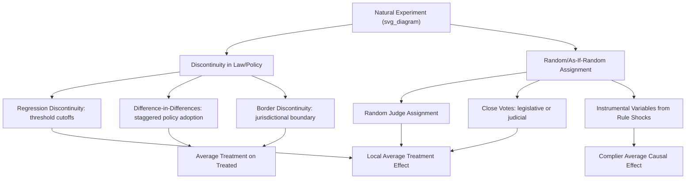
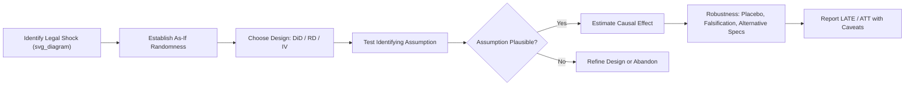

## Natural Experiments in Legal Research

### Definition and Conceptual Foundation

A natural experiment is a research design that exploits naturally occurring variation in legal rules, policies, or enforcement — variation that was not created by the researcher but that mimics random or as-if-random assignment. In empirical legal studies, natural experiments are prized because true randomized controlled trials (RCTs) of laws are rare: legislatures do not typically assign statutes randomly across jurisdictions for research convenience. Natural experiments substitute for this by identifying settings where legal treatment (a statute, court ruling, regulatory change, enforcement shift) was assigned by forces plausibly unrelated to the outcome of interest.

The core identifying assumption is **as-if randomness**: conditional on observed and unobserved confounders, exposure to the legal treatment is uncorrelated with the potential outcomes. This is weaker than true randomization but stronger than simple observational comparison.

**Key Points**

- Natural experiments sit between pure observational studies (weak causal identification) and RCTs (strong identification, high cost/infeasibility in law).
- They rely on institutional knowledge of *why* variation in legal treatment arose.
- Credibility depends on the plausibility of the "as-if random" claim, not statistical technique alone.

### Why Natural Experiments Matter in Law and Economics

Legal rules are rarely exogenous — legislatures respond to social conditions, courts respond to litigant behavior, and regulators respond to political pressure. This creates **endogeneity**: the legal treatment $T$ and outcome $Y$ may both be driven by a common cause $Z$, or $Y$ may cause $T$ (reverse causality). Naively regressing $Y$ on $T$ conflates correlation with causation.

$$Y = \beta_0 + \beta_1 T + \varepsilon$$

If $\text{Cov}(T, \varepsilon) \neq 0$, then $\hat{\beta}_1$ is biased and inconsistent. Natural experiments are one strategy (alongside instrumental variables, regression discontinuity, and difference-in-differences, which often *implement* natural experiments) for recovering a consistent estimate of the causal effect of law.

### Major Design Families

#### 1. Difference-in-Differences (DiD)

Exploits a policy change affecting one jurisdiction (treatment) but not another comparable jurisdiction (control), observed before and after the change.

$$Y_{it} = \alpha_i + \gamma_t + \delta (Treat_i \times Post_t) + \varepsilon_{it}$$

Here $\delta$ is the causal parameter of interest, $\alpha_i$ are unit fixed effects, $\gamma_t$ are time fixed effects. The identifying assumption is **parallel trends**: absent treatment, treated and control units would have evolved similarly.

**Example**

A classic law-and-economics application: estimating the effect of state-level tort reform (e.g., damage caps) on malpractice insurance premiums, comparing reforming states to non-reforming states before and after adoption.

#### 2. Regression Discontinuity (RD)

Exploits a sharp legal threshold — an age cutoff, an income cutoff, a sentencing guideline boundary, a docket-number cutoff for judge assignment — where treatment status changes discontinuously at a cutoff $c$ of a running variable $X$.

$$\tau_{RD} = \lim_{x \to c^+} E[Y \mid X = x] - \lim_{x \to c^-} E[Y \mid X = x]$$

Units just above and just below the cutoff are assumed comparable in expectation, so the discontinuity in outcomes at $c$ identifies a local average treatment effect.

**Example**

Studies of juvenile-to-adult criminal court transfer at age-of-majority cutoffs, comparing recidivism just below and above the threshold.

#### 3. Instrumental Variables via Legal Rule Changes

A legal rule shift is used as an instrument $Z$ for an endogenous variable $T$ when $Z$ affects $Y$ only through $T$ (exclusion restriction).

$$T = \pi_0 + \pi_1 Z + \nu \quad \text{(first stage)}$$

$$Y = \beta_0 + \beta_1 \hat{T} + \varepsilon \quad \text{(second stage)}$$

**Example**

Randomly assigned judges with differing sentencing severity ("judge leniency" instruments) used to instrument for incarceration length in studies of incarceration's effect on future employment or recidivism.

#### 4. Close Judicial or Legislative Votes

When a bill passes by one vote, or an en banc panel splits narrowly, outcomes near the decision boundary can be treated as as-if random, since the specific vote margin is plausibly unrelated to underlying case merit.

#### 5. Random Assignment of Judges or Administrative Officials

Court systems that randomly assign judges to cases (a feature of docket administration, not litigant choice) generate exogenous variation in "judge stringency," used extensively in law and economics to study incarceration, bail, and asylum decisions.

**Example**

Kling (2006) and related literature use random judge assignment in federal sentencing to study incarceration's causal effect on labor market outcomes.

#### 6. Geographic or Jurisdictional Discontinuities

State or national borders create discontinuities in legal regime while holding other factors (culture, climate, local economy) roughly constant nearby.

**Example**

Comparing county pairs straddling a state border to study minimum wage law effects, controlling for local labor market shocks — an approach associated with Dube, Lester, and Reich (2010) in labor economics, adapted in legal minimum-standards research.

### Diagram: Natural Experiment Design Taxonomy (svg_diagram)

### Threats to Validity

| Threat | Description | Mitigation |
| --- | --- | --- |
| Selection into treatment | Jurisdictions adopting a law may differ systematically from those that don't | Parallel trends checks, placebo tests, synthetic control |
| Anticipation effects | Agents change behavior before formal legal change takes effect | Event-study specifications with leads and lags |
| Concurrent policy changes | Other laws change simultaneously with the treatment of interest | Narrow window analysis, control for confounding statutes |
| Manipulation of running variable | Parties sort around an RD threshold (e.g., structuring a case to avoid a sentencing cutoff) | McCrary density test for manipulation |
| Weak instruments | Legal-rule instrument only weakly predicts the endogenous regressor | Report first-stage F-statistics; Stock-Yogo critical values |
| Spillovers (SUTVA violations) | Control units affected by treatment in neighboring units | Buffer zones, spatial controls |

### Empirical Workflow

### Statistical Inference Considerations

Legal natural experiments frequently involve a small number of treated clusters (e.g., a handful of states passing a reform), which creates challenges for standard error estimation. Conventional cluster-robust standard errors can be biased downward with few clusters.

$$\widehat{Var}(\hat{\delta}) = \left(\sum_g X_g'X_g\right)^{-1}\left(\sum_g X_g'\hat{u}_g\hat{u}_g'X_g\right)\left(\sum_g X_g'X_g\right)^{-1}$$

[Inference] With fewer than approximately 30–40 clusters, researchers commonly report wild cluster bootstrap-t confidence intervals (Cameron, Gelbach, and Miller 2008) rather than relying on asymptotic cluster-robust inference, since finite-sample performance of standard clustering degrades as cluster count falls, though the exact threshold is debated across specifications.

### Landmark Applications in Law and Economics

- **Donohue and Levitt (2001)** — used the timing of state-level abortion legalization (including pre-*Roe* legalizing states) as a natural experiment to study effects on later crime rates. [Unverified: the causal interpretation remains contested in follow-up literature, including reanalyses disputing the original coding and statistical assumptions.]
- **Card and Krueger (1994)** — New Jersey/Pennsylvania minimum wage border-discontinuity design, foundational to the border-pair method later applied to legal minimum standards.
- **Angrist (1990)** — Vietnam draft lottery as an instrument, a template for using randomized legal/administrative assignment mechanisms to study downstream economic outcomes.
- **Kling (2006)** — random assignment of federal judges as an instrument for sentence length in studying labor market effects of incarceration.

### Distinguishing Natural Experiments from Related Designs

| Design | Source of Variation | Researcher Control | Typical Legal Application |
| --- | --- | --- | --- |
| RCT | Researcher-assigned randomization | Full | Rare in law (e.g., legal aid RCTs, nudge trials) |
| Natural Experiment | Naturally occurring as-if-random variation | None | Policy discontinuities, random judge assignment |
| Quasi-Experiment | Non-random but structured variation | Partial (design choice) | Matching, synthetic control |
| Pure Observational | Ordinary variation in observational data | None | Cross-sectional regression of law on outcomes |

### Practical Considerations for Legal Researchers

**Key Points**

- Institutional knowledge is the binding constraint: a credible natural experiment requires deep understanding of *how* the legal variation was generated (docket assignment algorithms, legislative procedure, administrative rule-making history).
- Pre-registration and pre-trend analysis strengthen credibility, especially for DiD designs subject to reviewer scrutiny post-Goodman-Bacon (2021) critiques of staggered adoption designs.
- Modern DiD practice increasingly uses heterogeneity-robust estimators (Callaway and Sant'Anna 2021; Sun and Abraham 2021) to avoid negative-weighting problems in two-way fixed effects models with staggered treatment timing.

$$\hat{\delta}^{TWFE} \neq ATT \quad \text{when treatment timing is staggered and effects are heterogeneous}$$

[Inference] This negative-weighting problem is now well documented in the econometrics literature, though its practical magnitude in any specific legal dataset depends on the degree of treatment effect heterogeneity across cohorts, which is often not directly testable.

### Related Topics

- Difference-in-differences with staggered adoption (Callaway-Sant'Anna, Sun-Abraham estimators)
- Regression discontinuity design: sharp vs. fuzzy RD
- Instrumental variables and the LATE framework
- Synthetic control methods for comparative case studies
- Random judge assignment as an identification strategy
- Event-study designs and pre-trend testing
- Cluster-robust inference and the wild bootstrap
- Selection bias and endogeneity in law-and-economics regressions
- Border-discontinuity designs in state law comparisons
- Empirical methods for evaluating tort reform and criminal justice policy