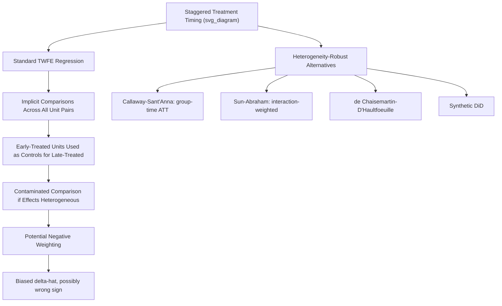
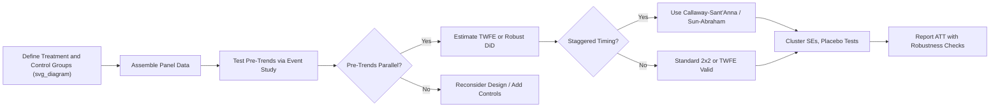

## Difference-in-Differences Estimation

### Definition and Conceptual Foundation

Difference-in-differences (DiD) is a quasi-experimental identification strategy that estimates a causal treatment effect by comparing the change in outcomes over time between a treated group and a control group. It is one of the most widely used tools in empirical law and economics because legal treatments — statutes, court rulings, regulatory changes — frequently apply to some jurisdictions or populations but not others, and take effect at an identifiable point in time.

The basic two-period, two-group estimator is:

$$\hat{\delta}_{DiD} = \left(\bar{Y}_{treat,post} - \bar{Y}_{treat,pre}\right) - \left(\bar{Y}_{control,post} - \bar{Y}_{control,pre}\right)$$

This "difference of differences" nets out (1) fixed differences between treated and control groups and (2) common time trends affecting both groups, isolating the treatment effect.

**Key Points**

- DiD requires panel or repeated cross-sectional data spanning at least one pre-treatment and one post-treatment period.
- The design controls for time-invariant unobserved heterogeneity across units and common shocks across time.
- It does not require true randomization, only the **parallel trends assumption**.

### The Regression Framework

The canonical two-way fixed effects (TWFE) specification:

$$Y_{it} = \alpha_i + \gamma_t + \delta \left(Treat_i \times Post_t\right) + X_{it}'\beta + \varepsilon_{it}$$

- $\alpha_i$: unit fixed effects (absorb time-invariant unit characteristics)
- $\gamma_t$: time fixed effects (absorb common shocks)
- $\delta$: the DiD coefficient of interest, the average treatment effect on the treated (ATT)
- $X_{it}$: optional time-varying controls

**Example**

Estimating the effect of state adoption of "ban-the-box" employment laws (restricting criminal history inquiries on job applications) on ex-offender employment rates, using states without such laws as controls, before/after the law's effective date.

### The Parallel Trends Assumption

The core identifying assumption: in the absence of treatment, treated and control groups would have followed the same trend in outcomes.

$$E[Y_{i,post}(0) - Y_{i,pre}(0) \mid Treat_i = 1] = E[Y_{i,post}(0) - Y_{i,pre}(0) \mid Treat_i = 0]$$

This is fundamentally untestable in the post-period (since $Y_{i,post}(0)$ is counterfactual for treated units), but researchers assess its plausibility using **pre-trend tests**: checking whether treated and control groups exhibited similar trajectories in multiple pre-treatment periods.

**Key Points**

- Parallel trends is about trends, not levels — treated and control groups can have different baseline outcome levels.
- Visual pre-trend plots and formal event-study coefficients on pre-period leads are standard diagnostic tools.
- A significant pre-trend does not definitively invalidate the design but substantially weakens the causal claim.

### Event-Study Specification

To test pre-trends and trace out dynamic treatment effects, researchers estimate a fully dynamic specification with period-specific treatment indicators:

$$Y_{it} = \alpha_i + \gamma_t + \sum_{k \neq -1} \delta_k \cdot \mathbb{1}[t - T_i^* = k] + \varepsilon_{it}$$

where $T_i^*$ is the treatment adoption date for unit $i$, and $k = -1$ (the period immediately before treatment) is the omitted reference category. Coefficients $\delta_k$ for $k < 0$ should be statistically indistinguishable from zero if parallel trends holds; coefficients for $k \geq 0$ trace the dynamic treatment effect path.

### Diagram: Canonical Two-Group DiD Logic (svg_diagram)

<svg xmlns="http://www.w3.org/2000/svg" viewBox="0 0 700 420">
<text x="350" y="30" text-anchor="middle" font-size="16" font-weight="bold" fill="#1a1a1a">Difference-in-Differences Logic (svg_diagram)</text>
<line x1="80" y1="370" x2="650" y2="370" stroke="#333" stroke-width="2" />
<line x1="80" y1="370" x2="80" y2="60" stroke="#333" stroke-width="2" />
<text x="360" y="400" text-anchor="middle" font-size="13" fill="#333">Time</text>
<text x="30" y="220" text-anchor="middle" font-size="13" fill="#333" transform="rotate(-90 30 220)">Outcome Y</text>
<line x1="350" y1="60" x2="350" y2="370" stroke="#999" stroke-width="1" stroke-dasharray="4,4" />
<text x="350" y="50" text-anchor="middle" font-size="12" fill="#666">Treatment Date</text>
<line x1="120" y1="300" x2="350" y2="230" stroke="#2166ac" stroke-width="2.5" />
<line x1="350" y1="230" x2="620" y2="130" stroke="#2166ac" stroke-width="2.5" />
<text x="625" y="128" font-size="12" fill="#2166ac" font-weight="bold">Treated (Actual)</text>
<line x1="350" y1="230" x2="620" y2="180" stroke="#2166ac" stroke-width="2" stroke-dasharray="6,3" />
<text x="625" y="183" font-size="11" fill="#2166ac">Treated (Counterfactual)</text>
<line x1="120" y1="320" x2="350" y2="270" stroke="#b2182b" stroke-width="2.5" />
<line x1="350" y1="270" x2="620" y2="200" stroke="#b2182b" stroke-width="2.5" />
<text x="625" y="200" font-size="12" fill="#b2182b" font-weight="bold">Control</text>
<line x1="600" y1="130" x2="600" y2="180" stroke="#333" stroke-width="1.5" />
<text x="608" y="158" font-size="12" fill="#1a1a1a" font-weight="bold">δ (ATT)</text>
<circle cx="120" cy="300" r="4" fill="#2166ac" />
<circle cx="350" cy="230" r="4" fill="#2166ac" />
<circle cx="620" cy="130" r="4" fill="#2166ac" />
<circle cx="120" cy="320" r="4" fill="#b2182b" />
<circle cx="350" cy="270" r="4" fill="#b2182b" />
<circle cx="620" cy="200" r="4" fill="#b2182b" />
</svg>

### Staggered Adoption and the TWFE Critique

A major methodological development since roughly 2018 concerns settings with **staggered treatment timing** — different units adopt the legal treatment at different dates (common in state-law diffusion studies). Goodman-Bacon (2021) showed that the standard TWFE estimator in staggered designs is a weighted average of all possible $2\times2$ DiD comparisons, including problematic comparisons where **already-treated units serve as controls for later-treated units**.

$$\hat{\delta}^{TWFE} = \sum_k w_k \hat{\delta}_k^{2\times2}$$

If treatment effects are heterogeneous across units or over time, some weights $w_k$ can be negative, causing $\hat{\delta}^{TWFE}$ to potentially differ in sign from the true average treatment effect.

**Modern estimators addressing this:**

- **Callaway and Sant'Anna (2021)**: estimates group-time average treatment effects $ATT(g,t)$ using not-yet-treated or never-treated units as clean controls, then aggregates.
- **Sun and Abraham (2021)**: interaction-weighted estimator correcting event-study coefficients for contamination from other periods' effects.
- **de Chaisemartin and D'Haultfœuille (2020)**: estimator robust to heterogeneous and dynamic effects using switching-cohort comparisons.
- **Synthetic Difference-in-Differences (Arkhangelsky et al. 2021)**: combines synthetic control weighting with DiD.

[Inference] Given the prominence of this critique in recent applied econometrics, most peer-reviewed law-and-economics journals now expect staggered-adoption DiD papers to report at least one heterogeneity-robust estimator alongside or instead of standard TWFE, though the exact reviewing norms vary by journal and have continued evolving since these estimators' publication.

### Diagram: Staggered Adoption Problem (svg_diagram)

### Standard Error and Inference Issues

DiD applications in law typically cluster at the level of treatment assignment (e.g., state), since serial correlation within units over time violates the independence assumption of ordinary standard errors (Bertrand, Duflo, and Mullainathan 2004).

$$\widehat{Var}_{cluster}(\hat{\delta}) = \left(\sum_{g=1}^{G} X_g'X_g\right)^{-1}\left(\sum_{g=1}^{G} X_g'\hat{u}_g\hat{u}_g'X_g\right)\left(\sum_{g=1}^{G} X_g'X_g\right)^{-1}$$

With a small number of treated clusters (common in state-law studies — sometimes only a handful of adopting states), the **wild cluster bootstrap** (Cameron, Gelbach, and Miller 2008) is the standard robustness check, and randomization inference (placebo-based permutation tests) is often reported as a complementary approach.

### Robustness and Falsification Checks

**Key Points**

- **Placebo tests**: apply the DiD estimator to fake treatment dates or fake treated groups; a significant "effect" undermines confidence in the true estimate.
- **Leads-and-lags event study**: formalizes the pre-trend visual check.
- **Triple-difference (DDD)**: adds a third dimension of variation (e.g., a demographic group expected to be unaffected) to further control for confounding time trends.
- **Alternative control group specifications**: re-estimate using only "never-treated" units, or only "not-yet-treated" units, to assess sensitivity.

$$Y_{ijt} = \alpha_{ij} + \gamma_{jt} + \lambda_{it} + \delta \left(Treat_i \times Group_j \times Post_t\right) + \varepsilon_{ijt}$$

(Triple-difference specification, where $j$ indexes a sub-population expected to be differentially exposed to the legal treatment.)

### Applications in Law and Economics

- **Minimum wage and employment law**: Card and Krueger (1994) — New Jersey fast-food employment after a minimum wage increase, compared to Pennsylvania.
- **Tort reform**: effect of state damage caps on medical malpractice claim filings and insurance premiums, using non-reforming states as controls.
- **Criminal justice reform**: effect of state-level bail reform or sentencing guideline changes on pretrial detention rates and recidivism.
- **Corporate law**: effect of state antitakeover statute adoption on firm valuation and merger activity, using staggered adoption across states in the 1980s.
- **Civil rights law**: effect of state-level anti-discrimination statute enactment on labor market outcomes for protected groups, predating federal law.

### Common Pitfalls in Legal DiD Applications

| Pitfall | Consequence | Remedy |
| --- | --- | --- |
| Treating TWFE coefficient as ATT under staggered timing | Biased or sign-reversed estimate | Use Callaway-Sant'Anna or Sun-Abraham |
| Ignoring anticipation effects | Pre-period "control" observations contaminated by behavioral response before formal enactment | Include leads in event study; exclude anticipation window |
| Comparing treated units only to already-treated units | "Forbidden comparisons" per Goodman-Bacon | Restrict control pool to never-treated/not-yet-treated |
| Failing to cluster standard errors at treatment level | Understated standard errors, overstated significance | Cluster at state/jurisdiction level; consider wild bootstrap |
| Extrapolating short-run estimates to long-run effects | Overgeneralization beyond estimation window | Report dynamic event-study path explicitly |

### Practical Implementation Workflow

### Related Topics

- Staggered adoption estimators (Callaway-Sant'Anna, Sun-Abraham, de Chaisemartin-D'Haultfœuille)
- Synthetic control and synthetic DiD methods
- Event-study design and dynamic treatment effect estimation
- Parallel trends testing and pre-trend diagnostics
- Triple-difference (DDD) designs
- Cluster-robust inference and the wild bootstrap
- Regression discontinuity as a complementary identification strategy
- Natural experiments in legal research
- Panel data fixed-effects models in law and economics
- Applications to minimum wage law, tort reform, and criminal justice policy evaluation