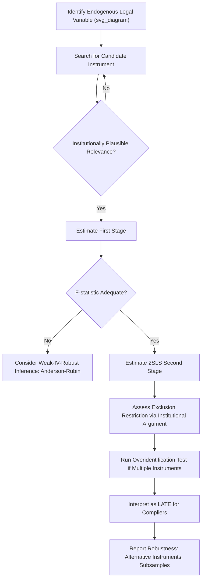

## Instrumental Variables and Endogeneity in Legal Studies

### The Endogeneity Problem in Legal Research

Endogeneity arises whenever the explanatory variable of interest is correlated with the error term in a regression, violating the exogeneity assumption required for ordinary least squares (OLS) to consistently estimate a causal effect.

$$Y_i = \beta_0 + \beta_1 X_i + \varepsilon_i, \quad \text{Cov}(X_i, \varepsilon_i) \neq 0 \implies \hat{\beta}_1^{OLS} \text{ is biased and inconsistent}$$

In law and economics, endogeneity arises through several distinct channels:

**Key Points**

- **Reverse causality**: outcomes influence the legal variable rather than (or in addition to) the reverse — e.g., high-crime areas may drive more aggressive policing, not only the other way around.
- **Omitted variable bias**: an unobserved factor (e.g., local political culture) drives both the legal treatment (e.g., statute adoption) and the outcome (e.g., economic growth).
- **Selection bias**: parties self-select into legal treatment — litigants who settle differ systematically from those who go to trial.
- **Measurement error**: mismeasured legal variables (e.g., imprecisely coded "law strength" indices) bias coefficients toward zero (attenuation bias) under classical measurement error assumptions.

### The Instrumental Variables Solution

An instrumental variable $Z$ is a variable that satisfies two conditions relative to the endogenous regressor $X$ and outcome $Y$:

1. **Relevance**: $\text{Cov}(Z, X) \neq 0$ — the instrument must meaningfully predict the endogenous variable.
2. **Exclusion restriction**: $\text{Cov}(Z, \varepsilon) = 0$ — the instrument affects $Y$ *only* through its effect on $X$, not through any other channel.

**Two-Stage Least Squares (2SLS)**

$$\text{First stage: } X_i = \pi_0 + \pi_1 Z_i + \nu_i$$

$$\text{Second stage: } Y_i = \beta_0 + \beta_1 \hat{X}_i + \varepsilon_i$$

The fitted values $\hat{X}_i$ from the first stage, which by construction are uncorrelated with $\varepsilon_i$ (given the exclusion restriction), replace the endogenous $X_i$ in the second stage.

**Key Points**

- Relevance is testable (first-stage F-statistic, partial R²); exclusion is fundamentally untestable and must be argued on institutional grounds.
- A weak instrument (low first-stage predictive power) causes 2SLS estimates to be biased toward OLS and inflates standard errors — conventionally flagged when the first-stage F-statistic falls below approximately 10 (Stock and Yogo 2005), though this threshold has itself been challenged in later work (Lee et al. 2022) as insufficiently conservative for many applications, [Inference] meaning current best practice increasingly favors identification-robust confidence intervals over reliance on any single F-statistic cutoff.

### Diagram: IV Causal Pathway (svg_diagram)

<svg xmlns="http://www.w3.org/2000/svg" viewBox="0 0 700 320">
<text x="350" y="30" text-anchor="middle" font-size="16" font-weight="bold" fill="#1a1a1a">Instrumental Variable Causal Structure (svg_diagram)</text>
<rect x="40" y="130" width="120" height="60" rx="8" fill="#e8f1fa" stroke="#2166ac" stroke-width="2" />
<text x="100" y="165" text-anchor="middle" font-size="14" fill="#1a1a1a">Instrument Z</text>
<rect x="290" y="130" width="120" height="60" rx="8" fill="#fdf0d5" stroke="#b8860b" stroke-width="2" />
<text x="350" y="165" text-anchor="middle" font-size="14" fill="#1a1a1a">Legal Variable X</text>
<rect x="540" y="130" width="120" height="60" rx="8" fill="#fce4e4" stroke="#b2182b" stroke-width="2" />
<text x="600" y="165" text-anchor="middle" font-size="14" fill="#1a1a1a">Outcome Y</text>
<rect x="290" y="240" width="120" height="55" rx="8" fill="#f0f0f0" stroke="#666" stroke-width="1.5" stroke-dasharray="5,3" />
<text x="350" y="270" text-anchor="middle" font-size="13" fill="#333">Unobserved</text>
<text x="350" y="285" text-anchor="middle" font-size="13" fill="#333">Confounder U</text>
<line x1="160" y1="160" x2="290" y2="160" stroke="#2166ac" stroke-width="2.5" marker-end="url(#arrow1)" />
<text x="225" y="150" text-anchor="middle" font-size="11" fill="#2166ac">Relevance</text>
<line x1="410" y1="160" x2="540" y2="160" stroke="#b2182b" stroke-width="2.5" marker-end="url(#arrow1)" />
<text x="475" y="150" text-anchor="middle" font-size="11" fill="#b2182b">Causal Effect</text>
<line x1="350" y1="240" x2="350" y2="190" stroke="#666" stroke-width="2" stroke-dasharray="4,3" marker-end="url(#arrow1)" />
<line x1="410" y1="255" x2="600" y2="190" stroke="#666" stroke-width="2" stroke-dasharray="4,3" marker-end="url(#arrow1)" />
<line x1="100" y1="130" x2="100" y2="80" stroke="#999" stroke-width="1.5" stroke-dasharray="3,3" />
<line x1="100" y1="80" x2="600" y2="80" stroke="#999" stroke-width="1.5" stroke-dasharray="3,3" />
<line x1="600" y1="80" x2="600" y2="130" stroke="#999" stroke-width="1.5" stroke-dasharray="3,3" marker-end="url(#arrow2)" />
<text x="350" y="70" text-anchor="middle" font-size="11" fill="#999">Exclusion Restriction: NO direct path (must be assumed)</text>
</svg>

### Classic Instruments in Legal and Judicial Research

#### 1. Random Judge Assignment

Many court systems randomly assign judges to cases via docket rotation. Judges differ systematically in sentencing severity, bail-setting tendency, or grant rates, generating exogenous variation in legal treatment intensity.

**Example**

Using the random assignment of criminal defendants to judges with varying historical incarceration rates ("judge leniency" or "judge stringency" measures) as an instrument for actual incarceration, to estimate the causal effect of incarceration on subsequent employment and recidivism (Kling 2006; Dobbie, Goldin, and Yang 2018 for bail-judge designs).

$$Z_i = \text{leave-one-out mean incarceration rate of judge assigned to case } i$$

#### 2. Draft Lottery and Administrative Randomization

Angrist's (1990) Vietnam draft lottery instrument — random lottery numbers determined draft eligibility, used to instrument for military service in studying its effect on lifetime earnings. This design template extends to legal contexts wherever an administrative lottery assigns a legal status (e.g., lottery-based school assignment, visa lotteries).

#### 3. Distance-Based Instruments

Distance to a court, legal aid office, or regulatory agency, used as an instrument for likelihood of legal representation or exposure to enforcement, under the assumption that distance affects outcomes only through access to the legal service.

[Speculation] Distance-based instruments face particularly strong exclusion-restriction skepticism in recent literature (post-2015), since geographic proximity often correlates with other unobserved socioeconomic factors that independently affect outcomes — researchers increasingly pair such instruments with falsification tests on observable covariates to bolster credibility.

#### 4. Rule-Based Formula Instruments

Legal or regulatory formulas that mechanically determine treatment (e.g., statutory eligibility thresholds embedded in program formulas, sentencing guideline grids) generate instruments when the formula's cutoffs are plausibly unrelated to unobserved determinants of the outcome — closely related to, and sometimes overlapping with, regression discontinuity designs.

### Testing and Diagnostics

| Test | Purpose | Interpretation |
| --- | --- | --- |
| First-stage F-statistic | Instrument relevance | F > ~10 historically treated as rule-of-thumb adequate (contested); report alongside robust alternatives |
| Overidentification test (Sargan/Hansen J) | Validity of exclusion restriction, when instruments outnumber endogenous regressors | Rejects if some instruments are invalid; requires at least one instrument assumed valid a priori |
| Anderson-Rubin test | Weak-instrument-robust inference | Valid confidence intervals regardless of instrument strength |
| Durbin-Wu-Hausman test | Whether X is actually endogenous | Failure to reject suggests OLS may be consistent and more efficient |

$$F = \frac{(RSS_{restricted} - RSS_{unrestricted})/q}{RSS_{unrestricted}/(n-k)}$$

where $q$ is the number of excluded instruments in the first stage.

### Local Average Treatment Effect (LATE) Interpretation

Under heterogeneous treatment effects, 2SLS with a binary instrument identifies the **Local Average Treatment Effect** — the average causal effect for "compliers," units whose treatment status is actually moved by the instrument (Imbens and Angrist 1994).

$$\text{LATE} = E[Y_i(1) - Y_i(0) \mid \text{complier}]$$

**Key Points**

- LATE is not necessarily the same as the average treatment effect (ATE) for the full population — it is specific to the subpopulation whose behavior responds to the instrument.
- In judge-assignment designs, "compliers" are defendants whose incarceration outcome depends on which judge they happened to draw — not the general defendant population.
- External validity of LATE estimates to policy contexts beyond the complier subpopulation requires additional argument. [Inference] This limitation is frequently flagged in law-and-economics peer review as a key caveat when policy implications are drawn from judge-instrument designs.

### Workflow: Applying IV in a Legal Study

### Applications in Law and Economics

- **Incarceration and labor markets**: judge-leniency instruments estimating the causal effect of incarceration length on post-release employment and earnings.
- **Legal representation effects**: randomized or quasi-randomized assignment of public defenders versus panel attorneys used to instrument for representation quality.
- **Litigation and settlement**: instrumenting for trial versus settlement using randomly assigned judges or panels with differing settlement-encouragement tendencies.
- **Regulatory enforcement**: using randomly assigned regulatory inspectors with varying enforcement stringency to instrument for enforcement intensity in studying compliance costs.
- **School and social program access**: lottery-based admission instruments for studying downstream legal and economic outcomes tied to institutional access.

### Common Pitfalls

| Pitfall | Consequence | Remedy |
| --- | --- | --- |
| Weak instrument | Biased toward OLS, unreliable standard errors | Report F-stat; use Anderson-Rubin confidence sets |
| Violated exclusion restriction | 2SLS estimate inconsistent, potentially worse than OLS | Rigorous institutional argument; falsification tests on pre-treatment covariates |
| Treating LATE as ATE | Overgeneralized policy conclusions | Explicitly characterize the complier population |
| "Judge shopping" or non-random docket assignment | Instrument relevance holds but exogeneity fails | Verify true randomization in court's assignment procedure (institutional audit) |
| Many weak instruments in overidentified models | Bias compounds with instrument count | Limited-information maximum likelihood (LIML) as alternative to 2SLS |

### Related Topics

- Natural experiments in legal research
- Difference-in-differences estimation
- Regression discontinuity design in legal thresholds
- Local Average Treatment Effect (LATE) and complier heterogeneity
- Weak instrument diagnostics and Anderson-Rubin inference
- Judge fixed-effects and leniency instrument construction
- Selection bias in litigation and settlement data
- Two-stage least squares and limited-information maximum likelihood (LIML)
- Randomized controlled trials in legal aid and access-to-justice research
- Measurement error and attenuation bias in legal indices