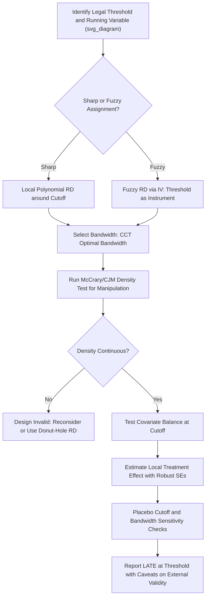

## Regression Discontinuity Designs in Legal Contexts

### Definition and Conceptual Foundation

Regression discontinuity (RD) design exploits a **sharp, rule-based threshold** in a continuous "running variable" that determines legal treatment assignment. Law is unusually rich in such thresholds — age of majority, income eligibility cutoffs, sentencing guideline boundaries, docket-number-based judge assignment, licensing exam pass scores — because legal rules are frequently written as explicit bright-line cutoffs rather than continuous functions.

The core intuition: units just above and just below the cutoff are similar in all respects except treatment status, so comparing outcomes in a narrow neighborhood of the cutoff approximates a local randomized experiment.

$$\tau_{RD} = \lim_{x \to c^+} E[Y \mid X = x] - \lim_{x \to c^-} E[Y \mid X = x]$$

where $X$ is the running variable, $c$ is the threshold, and $\tau_{RD}$ is the estimated local treatment effect at the cutoff.

**Key Points**

- RD identifies a **local average treatment effect (LATE)** — valid specifically for units near the cutoff, not necessarily the full population.
- The running variable must be continuous (or finely granular) and treatment must be a deterministic (sharp RD) or probabilistic (fuzzy RD) function of crossing the threshold.
- RD is often described as the observational design with the strongest claim to internal validity, short of a true RCT.

### Sharp vs. Fuzzy RD

**Sharp RD**: treatment is a deterministic function of the running variable —

$$D_i = \mathbb{1}[X_i \geq c]$$

Every unit above $c$ is treated; every unit below is not.

**Fuzzy RD**: crossing the threshold changes the *probability* of treatment but does not deterministically assign it (e.g., meeting a sentencing guideline threshold increases but does not guarantee a particular sentence, due to judicial discretion). Fuzzy RD is estimated via instrumental variables, using the threshold-crossing indicator as an instrument for actual treatment receipt:

$$\tau_{fuzzy} = \frac{\lim_{x \to c^+} E[Y|X=x] - \lim_{x \to c^-} E[Y|X=x]}{\lim_{x \to c^+} E[D|X=x] - \lim_{x \to c^-} E[D|X=x]}$$

This is structurally a Wald-IV estimator, with the discontinuity in treatment probability as the "first stage."

### Diagram: Sharp vs. Fuzzy RD (svg_diagram)

<svg xmlns="http://www.w3.org/2000/svg" viewBox="0 0 720 380">
<text x="360" y="28" text-anchor="middle" font-size="16" font-weight="bold" fill="#1a1a1a">Sharp vs. Fuzzy RD (svg_diagram)</text>

<text x="180" y="55" text-anchor="middle" font-size="13" font-weight="bold" fill="#333">Sharp RD</text>

<line x1="60" y1="180" x2="300" y2="180" stroke="#333" stroke-width="1.5" />

<line x1="180" y1="70" x2="180" y2="180" stroke="#333" stroke-width="1.5" />

<text x="180" y="195" text-anchor="middle" font-size="11" fill="#666">c</text>

<line x1="60" y1="150" x2="180" y2="150" stroke="`#2166ac`" stroke-width="3" />

<line x1="180" y1="90" x2="300" y2="90" stroke="`#2166ac`" stroke-width="3" />

<line x1="180" y1="150" x2="180" y2="90" stroke="`#2166ac`" stroke-width="1.5" stroke-dasharray="3,3" />

<text x="130" y="200" font-size="10" fill="#333">D=0</text>

<text x="240" y="200" font-size="10" fill="#333">D=1</text>

<text x="540" y="55" text-anchor="middle" font-size="13" font-weight="bold" fill="#333">Fuzzy RD</text>

<line x1="420" y1="180" x2="660" y2="180" stroke="#333" stroke-width="1.5" />

<line x1="540" y1="70" x2="540" y2="180" stroke="#333" stroke-width="1.5" />

<text x="540" y="195" text-anchor="middle" font-size="11" fill="#666">c</text>

<line x1="420" y1="160" x2="540" y2="140" stroke="`#b2182b`" stroke-width="3" />

<line x1="540" y1="110" x2="660" y2="95" stroke="`#b2182b`" stroke-width="3" />

<text x="470" y="205" font-size="10" fill="#333">P(D=1) jumps, not 0→1</text>

<text x="360" y="250" text-anchor="middle" font-size="12" fill="#333">Outcome Y vs. Running Variable X</text>

<line x1="60" y1="330" x2="660" y2="330" stroke="#333" stroke-width="1.5" />

<line x1="360" y1="270" x2="360" y2="330" stroke="#999" stroke-width="1.5" stroke-dasharray="4,3" />

<line x1="60" y1="310" x2="360" y2="290" stroke="`#2166ac`" stroke-width="2.5" />

<line x1="360" y1="290" x2="660" y2="270" stroke="`#2166ac`" stroke-width="2.5" />

<line x1="360" y1="290" x2="360" y2="270" stroke="#333" stroke-width="1.5" />

<text x="380" y="278" font-size="11" fill="`#1a1a1a`" font-weight="bold">τ_RD</text>

</svg>

### Estimation Methods

#### Local Polynomial Regression

Standard practice fits separate polynomials on each side of the cutoff within a bandwidth $h$:

$$Y_i = \alpha + \tau D_i + \beta_1 (X_i - c) + \beta_2 D_i(X_i - c) + \varepsilon_i \quad \text{for } |X_i - c| \leq h$$

[Inference] Local *linear* regression with a triangular kernel is generally preferred over higher-order global polynomials, following Gelman and Imbens (2019), who argue that high-order polynomial RD specifications can produce noisy and misleading estimates near the boundary — though the appropriate polynomial order can still depend on the specific dataset and the density of observations near the cutoff.

#### Bandwidth Selection

Bandwidth choice trades off bias (wider bandwidth, more bias from nonlinearity) against variance (narrower bandwidth, fewer observations). The **Calonico, Cattaneo, and Titiunik (2014)** (CCT) procedure provides a data-driven optimal bandwidth with bias-corrected robust confidence intervals, now the standard implementation (e.g., the `rdrobust` package in R/Stata/Python).

$$h^* = \arg\min_h \left[ \text{Bias}(h)^2 + \text{Variance}(h) \right]$$

### Validity Checks

**Key Points**

- **McCrary density test** (McCrary 2008) / **Cattaneo-Jansson-Ma density test** (2020): tests whether the density of the running variable is continuous at the cutoff. A discontinuity in density suggests manipulation or sorting around the threshold, undermining the as-if-random assumption.
- **Covariate balance tests**: pre-determined covariates (unaffected by treatment) should show no discontinuity at the cutoff.
- **Placebo cutoff tests**: applying the RD estimator at fake cutoffs (away from the true threshold) should yield null effects.
- **Donut-hole RD**: excluding observations immediately adjacent to the cutoff to test sensitivity to potential manipulation right at the boundary.

$$\theta = \lim_{x \to c^+} f(x) - \lim_{x \to c^-} f(x)$$

(McCrary test statistic on the density $f$ of the running variable; $\theta$ significantly different from zero indicates manipulation.)

### Applications in Legal Contexts

#### 1. Age-Based Legal Thresholds

**Example**

Juvenile-to-adult court transfer at age-of-majority boundaries: comparing recidivism outcomes for offenders just below versus just above the age cutoff that triggers adult criminal court jurisdiction (used in several U.S. state-level studies of juvenile justice policy).

#### 2. Sentencing Guideline Thresholds

Federal and state sentencing guidelines often specify offense-severity or criminal-history-score cutoffs that trigger discrete jumps in recommended sentence length. RD compares defendants just above and below such score thresholds.

#### 3. Randomized Docket/Case-Number Assignment

Where case numbers or filing order deterministically route cases to different judges or procedural tracks, RD around the routing threshold isolates the causal effect of the resulting procedural or judicial assignment.

#### 4. Regulatory and Licensing Thresholds

**Example**

Firms just above versus just below a regulatory size threshold (e.g., employee-count triggers for labor law applicability, such as FMLA's 50-employee threshold) used to estimate the causal effect of regulatory compliance burden on firm behavior (hiring, investment, growth).

#### 5. Bar Exam and Licensing Cutoffs

Comparing career outcomes of examinees who barely passed versus barely failed a licensing threshold (bar exam, professional certification) to study the causal return to licensure, controlling for underlying ability (which varies continuously and smoothly through the cutoff).

#### 6. Means-Tested Legal Aid Eligibility

Income or asset thresholds determining eligibility for legal aid, public defender services, or fee waivers, used to study the causal effect of subsidized legal representation on case outcomes.

### Workflow for Implementing Legal RD

### Threats to Validity Specific to Legal RD

| Threat | Legal Example | Diagnostic |
| --- | --- | --- |
| Manipulation of running variable | Prosecutors adjusting charged offense severity to steer defendants across a sentencing threshold | McCrary density test |
| Other policies changing at same cutoff | Age cutoff simultaneously triggers multiple legal changes (voting, drinking, contracting) beyond the one of interest | Isolate treatment-specific mechanism; check for confounding co-located thresholds |
| Non-compliance with rule | Judicial discretion to depart from guideline-recommended sentence | Use fuzzy RD instead of sharp RD |
| Heaping/rounding in running variable | Coarse income reporting bunching near an eligibility threshold | Density test; robustness to bandwidth and functional form |
| Limited external validity | Effect estimated only for units near the cutoff (e.g., borderline offenders) | Explicitly scope policy conclusions to the local population |

### Software Implementation Notes

[Unverified: exact package versions and default options change over time; verify current syntax against package documentation before use.] The `rdrobust`, `rddensity`, and `rdlocrand` packages (available in R, Stata, and Python, developed principally by Calonico, Cattaneo, Titiunik, and coauthors) implement the standard modern RD toolkit: optimal bandwidth selection, bias-corrected robust inference, and density-based manipulation testing.

### Related Topics

- Natural experiments in legal research
- Fuzzy RD and instrumental variables
- Difference-in-differences estimation
- McCrary and Cattaneo-Jansson-Ma manipulation tests
- Bandwidth selection and local polynomial regression
- Sentencing guidelines and judicial discretion studies
- Age-threshold policy evaluation (juvenile justice, licensing)
- Local Average Treatment Effect (LATE) and external validity
- Randomization inference and placebo testing
- Regulatory threshold effects on firm behavior