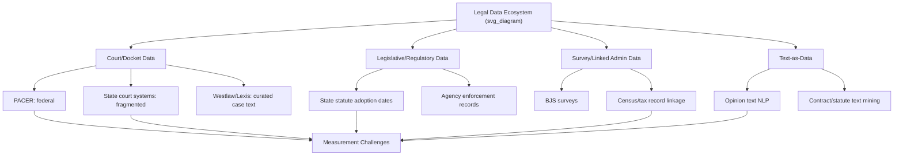

## Data Sources and Measurement Challenges in Legal Research

### Overview

Empirical legal research depends on data infrastructure that is substantially more heterogeneous, less standardized, and more difficult to access than data used in many other social science fields. Legal outcomes (case dispositions, sentencing, settlements, regulatory enforcement) are recorded across thousands of independent courts, agencies, and jurisdictions, each with its own recordkeeping conventions, digitization timeline, and disclosure rules. Understanding data provenance and measurement limitations is a prerequisite for credible causal inference in law and economics — a well-identified natural experiment or DiD design is only as reliable as the underlying data.

**Key Points**

- Legal data is fundamentally **administrative** in origin — generated as a byproduct of case processing, not for research purposes — which shapes its strengths (large scale, real-world validity) and weaknesses (inconsistent coding, missingness tied to case characteristics).
- Jurisdictional fragmentation in common-law systems (50 U.S. states plus federal courts, each with distinct procedural rules) creates significant harmonization challenges for cross-jurisdictional studies.
- Measurement error in legal variables is rarely classical (random) and is often systematically correlated with case characteristics, which can bias rather than merely attenuate estimates.

### Major Categories of Legal Data Sources

#### 1. Court Records and Docket Data

- **State and federal court dockets**: case filings, motions, orders, and dispositions. Federal data is centralized via **PACER** (Public Access to Court Electronic Records); state court data is fragmented across separate state systems with widely varying digitization and public-access policies.
- **Specialized case databases**: Westlaw, Lexis, and Bloomberg Law provide curated case law text but are optimized for legal research/retrieval, not structured econometric analysis — extracting structured variables (case outcome, damages awarded, judge identity) typically requires substantial manual or NLP-based coding.
- **Administrative Office of the U.S. Courts (AOUSC)** datasets: structured, research-ready federal case data including the Federal Judicial Center's integrated criminal and civil case databases.

#### 2. Legislative and Regulatory Data

- **State statute adoption databases**: tracking the exact enactment and effective dates of state legislation, essential for constructing treatment timing variables in DiD and event-study designs.
- **Regulatory agency enforcement records**: EPA, OSHA, SEC, and similar agencies publish inspection, violation, and penalty data, though disclosure completeness and format vary substantially by agency and time period.
- **NCSL (National Conference of State Legislatures)** and similar clearinghouses: track cross-state legal variation systematically, though update lags and coding definitions require verification against primary statutory text.

#### 3. Survey and Administrative Linkage Data

- **Bureau of Justice Statistics (BJS)** datasets: National Crime Victimization Survey, National Prisoner Statistics, and related series providing standardized measures across jurisdictions.
- **Linked administrative data**: matching court records to tax records, employment records (e.g., via state Unemployment Insurance wage records), or Census data to study downstream economic effects of legal treatment — increasingly common in incarceration and labor market studies, typically requiring restricted-access data agreements through entities like the U.S. Census Bureau's Federal Statistical Research Data Centers (FSRDCs).

#### 4. Text-as-Data Sources

- Judicial opinion text, contract text, statutory text, and regulatory filings, increasingly used as raw material for natural language processing methods (topic modeling, sentiment analysis, embedding-based similarity measures) to construct quantitative legal variables.

### Diagram: Legal Data Ecosystem (svg_diagram)

### Core Measurement Challenges

#### 1. Selective Observation and Case Selection

Court data by construction only observes cases that were *filed* and *not settled/dismissed* before reaching the observed stage — a well-documented selection problem in the law and economics literature following Priest and Klein's (1984) selection hypothesis, which argues that cases proceeding to trial are a non-random, systematically selected subset of all disputes (those where litigants have divergent expectations about the likely outcome).

$$P(\text{observed in trial data}) \neq P(\text{observed in full dispute population})$$

**Key Points**

- This selection problem means trial outcome data cannot straightforwardly be used to infer the distribution of merits in the underlying population of disputes.
- Settlement-stage attrition is rarely random with respect to case strength, making naive comparisons across observed case outcomes potentially misleading for causal claims about underlying legal rules.

#### 2. Jurisdictional Heterogeneity in Coding Conventions

Offense classifications, damage award categories, and procedural stage definitions vary across states and over time within the same state (following statutory revisions), complicating panel construction.

**Example**

A study comparing tort damage awards across states must account for the fact that "compensatory damages" may be defined, capped, or itemized differently in each state's reporting system, and pre/post-reform coding changes can mechanically shift measured averages independent of any real change in litigation outcomes.

#### 3. Missing Data and Non-Random Attrition

Case files may be sealed, expunged, or simply never digitized, and non-random criteria commonly determine what gets sealed (e.g., favorable outcomes for defendants, juvenile records, settlements with confidentiality clauses) — producing attrition correlated with the outcome of interest.

$$E[Y \mid \text{observed}] \neq E[Y]$$

when missingness is not at random (MNAR) with respect to $Y$.

#### 4. Measurement Error in Constructed Legal Indices

Many law and economics studies rely on composite indices (e.g., "employment protection strictness," "tort reform intensity," "judicial independence") constructed by researchers or third parties coding statutory text into numerical scales. These indices introduce measurement error that is often **non-classical** — correlated with coder judgment calls that may themselves relate to salient case or state characteristics.

$$X_i^* = X_i + u_i, \quad \text{Cov}(u_i, X_i) \neq 0 \text{ (non-classical case)}$$

Under non-classical measurement error, standard attenuation-bias intuition (bias toward zero) does not necessarily hold — the bias direction becomes ambiguous. [Inference] This is a recurring caveat in the literature critiquing legal-index-based regressions, since the true correlation structure between coding error and the underlying construct is typically unobservable and must be assessed qualitatively.

#### 5. Ecological and Aggregation Bias

Studies using jurisdiction-level aggregates (state crime rates, county litigation rates) risk **ecological inference fallacy** — inferring individual-level relationships from aggregate-level correlations, which can differ in magnitude or even sign from true individual-level effects (Robinson 1950).

#### 6. Reporting Lags and Right-Censoring

Case outcomes, especially in civil litigation, can take years to resolve. Datasets constructed from a fixed cutoff date will right-censor ongoing cases, and cases still pending are not missing at random (complex, high-stakes cases plausibly take longer).

$$T_i^{observed} = \min(T_i^{true}, C_i)$$

where $C_i$ is the censoring time — requiring survival-analysis methods (Cox proportional hazards, Kaplan-Meier estimators) rather than naive cross-sectional regression when resolution timing itself is of interest.

### Diagram: Sources of Bias in Legal Data Pipeline (svg_diagram)

<svg xmlns="http://www.w3.org/2000/svg" viewBox="0 0 700 380">
<text x="350" y="28" text-anchor="middle" font-size="16" font-weight="bold" fill="#1a1a1a">Legal Data Pipeline and Bias Points (svg_diagram)</text>
<rect x="30" y="60" width="140" height="50" rx="6" fill="#e8f1fa" stroke="#2166ac" stroke-width="2" />
<text x="100" y="90" text-anchor="middle" font-size="12">All Disputes</text>
<rect x="220" y="60" width="140" height="50" rx="6" fill="#e8f1fa" stroke="#2166ac" stroke-width="2" />
<text x="290" y="90" text-anchor="middle" font-size="12">Cases Filed</text>
<rect x="410" y="60" width="140" height="50" rx="6" fill="#e8f1fa" stroke="#2166ac" stroke-width="2" />
<text x="480" y="90" text-anchor="middle" font-size="12">Not Settled</text>
<rect x="560" y="60" width="120" height="50" rx="6" fill="#e8f1fa" stroke="#2166ac" stroke-width="2" />
<text x="620" y="90" text-anchor="middle" font-size="12">Reach Trial</text>
<line x1="170" y1="85" x2="220" y2="85" stroke="#333" stroke-width="2" marker-end="url(#a1)" />
<line x1="360" y1="85" x2="410" y2="85" stroke="#333" stroke-width="2" marker-end="url(#a1)" />
<line x1="550" y1="85" x2="560" y2="85" stroke="#333" stroke-width="2" marker-end="url(#a1)" />
<rect x="150" y="150" width="160" height="55" rx="6" fill="#fce4e4" stroke="#b2182b" stroke-width="2" />
<text x="230" y="172" text-anchor="middle" font-size="11" fill="#b2182b">Filing Selection</text>
<text x="230" y="188" text-anchor="middle" font-size="10" fill="#333">(cost, access to counsel)</text>
<rect x="380" y="150" width="180" height="55" rx="6" fill="#fce4e4" stroke="#b2182b" stroke-width="2" />
<text x="470" y="172" text-anchor="middle" font-size="11" fill="#b2182b">Settlement Selection</text>
<text x="470" y="188" text-anchor="middle" font-size="10" fill="#333">(Priest-Klein divergent expectations)</text>
<line x1="230" y1="150" x2="230" y2="115" stroke="#b2182b" stroke-width="1.5" stroke-dasharray="4,3" marker-end="url(#a2)" />
<line x1="470" y1="150" x2="470" y2="115" stroke="#b2182b" stroke-width="1.5" stroke-dasharray="4,3" marker-end="url(#a2)" />
<rect x="130" y="260" width="440" height="60" rx="6" fill="#fdf0d5" stroke="#b8860b" stroke-width="2" />
<text x="350" y="285" text-anchor="middle" font-size="12" fill="#1a1a1a">Observed Trial Sample is NOT representative</text>
<text x="350" y="303" text-anchor="middle" font-size="11" fill="#333">of underlying dispute population — bias in naive inference</text>
<line x1="620" y1="110" x2="350" y2="260" stroke="#999" stroke-width="1.5" stroke-dasharray="3,3" />
</svg>

### Strategies for Addressing Measurement Challenges

| Challenge | Mitigation Strategy |
| --- | --- |
| Settlement selection bias | Model selection explicitly (Heckman-type correction); use pre-filing population data where available; triangulate with survey data |
| Jurisdictional coding heterogeneity | Hand-verify statutory coding against primary sources; use narrow, well-defined legal variables rather than broad composite indices where possible |
| Non-random missingness/sealing | Sensitivity analysis under alternative missingness assumptions (bounds analysis, e.g., Manski bounds); document sealing criteria explicitly |
| Non-classical measurement error in indices | Use multiple independent coders and report inter-coder reliability (Cohen's kappa); triangulate index-based results with narrower, direct measures |
| Right-censoring | Survival analysis (Cox, Kaplan-Meier) rather than cross-sectional OLS on resolution time |
| Ecological inference risk | Prefer case-level or individual-level data over jurisdiction-aggregate data when feasible; explicitly flag aggregation level in reporting |

### Data Quality Documentation Workflow

### Applications and Illustrative Uses in Law and Economics

- **Priest-Klein selection framework**: used to interpret plaintiff win-rate patterns at trial as uninformative about underlying legal rule efficiency, absent correction for selection into litigation.
- **Judge-identity linkage**: matching docket data to judge biographical databases (e.g., Federal Judicial Center biographical directory) to construct judge-level instruments, requiring careful handling of judges who rotate across districts or retire mid-panel.
- **Cross-state minimum-standards panels**: constructing 50-state statutory panels (e.g., tracking non-compete enforceability, at-will employment exceptions) that require primary-source legal verification rather than relying solely on secondary index compilations, given documented coding discrepancies across widely used indices in the literature.
- **Linked incarceration-earnings studies**: matching correctional records to state UI wage records, subject to state-specific data-sharing agreements and geographic coverage limitations (UI records miss informal-sector and out-of-state employment).

### Related Topics

- Natural experiments in legal research
- Selection bias and the Priest-Klein hypothesis
- Survival analysis and censored duration data in litigation timing
- Text-as-data and natural language processing for legal text
- Measurement error and attenuation bias in econometric models
- Administrative data linkage and restricted-access research data centers
- Constructing and validating legal policy indices
- Ecological inference and aggregation bias
- Missing data methods: Heckman correction and Manski bounds
- Judge-level data construction for instrumental variables designs