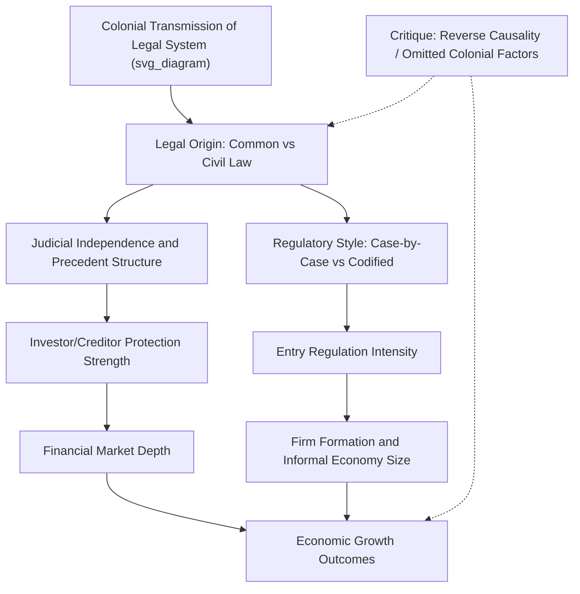

## Common Law Versus Civil Law Efficiency Debates

### Overview and Historical Origins of the Debate

The comparative efficiency of common law and civil law legal systems is one of the longest-running debates in law and economics, tracing back to Posner's (1973) efficiency-of-common-law hypothesis and expanding into a large empirical literature following the "Legal Origins" research program initiated by La Porta, Lopez-de-Silanes, Shleifer, and Vishny (LLSV) in the late 1990s. The debate concerns whether the structural features distinguishing common law (judge-made, precedent-based, adversarial) from civil law (codified, statute-based, inquisitorial) systematically produce different economic outcomes — particularly around financial development, investor protection, and contract enforcement.

**Key Points**

- Common law systems (England, U.S., Australia, most former British colonies) rely on judicial precedent (*stare decisis*) as a primary source of law, developed incrementally through adversarial litigation.
- Civil law systems (France, Germany, most of continental Europe, Latin America, much of Asia and Africa via colonial transmission) rely primarily on comprehensive codes enacted by legislatures, with judges playing a more constrained interpretive role.
- The debate is not merely academic — it has directly influenced World Bank "Doing Business" rankings, rule-of-law indices, and development policy recommendations for decades. [Note: the Doing Business report was discontinued by the World Bank in 2021 following a data-integrity review; successor initiatives have since been developed.]

### The Posner Efficiency-of-Common-Law Hypothesis

Posner's original hypothesis, later formalized by Rubin (1977) and Priest (1977) through evolutionary/selection mechanisms, argues that common law doctrines tend toward efficiency because:

1. **Litigation selection effect**: inefficient rules are more likely to be relitigated (since they impose higher costs on losing parties, giving them stronger incentive to appeal or re-litigate), while efficient rules generate less future litigation and thus "survive" in the body of precedent.
2. **Judicial incentives**: even judges with no explicit efficiency mandate may gravitate toward efficient rules because such rules are more likely to resolve disputes durably.

$$P(\text{relitigation} \mid \text{rule inefficient}) > P(\text{relitigation} \mid \text{rule efficient})$$

This is a selection-based (not intentionalist) mechanism — judges need not be consciously pursuing efficiency for the aggregate body of case law to trend toward efficient outcomes over time, under the Rubin-Priest evolutionary models.

**Key Points**

- The hypothesis has faced substantial empirical and theoretical criticism, including from Hadfield (1992) and others questioning whether the selection mechanism actually operates as described, given that litigated cases are a non-random, selected subset of disputes (echoing the Priest-Klein selection framework).
- [Inference] The efficiency-of-common-law hypothesis is now generally treated in the literature as a stylized theoretical benchmark rather than an empirically settled proposition, since rigorous causal tests of "efficiency convergence" in case law are methodologically difficult to construct.

### The Legal Origins Theory (LLSV Research Program)

La Porta, Lopez-de-Silanes, Shleifer, and Vishny's influential series of papers (1997, 1998, 2008 survey) argue that a country's legal origin — common law versus civil law (further subdivided into French, German, and Scandinavian civil law traditions) — is a durable determinant of contemporary economic institutions, particularly:

- **Investor protection**: common law countries are found to have stronger shareholder and creditor protections on average.
- **Financial market development**: common law origin is associated with deeper equity markets and more dispersed corporate ownership.
- **Regulation intensity**: civil law countries, particularly French-origin systems, are associated with heavier regulation of entry and labor markets (Djankov et al. 2002, "The Regulation of Entry").

$$Y_{i} = \alpha + \beta \cdot \text{CommonLaw}_i + X_i'\gamma + \varepsilon_i$$

where $Y_i$ is an outcome (e.g., an investor-protection index) and $\text{CommonLaw}_i$ is an indicator for common-law legal origin, typically instrumented by colonial transmission history since legal origin was largely determined by historical conquest and colonization rather than contemporaneous economic conditions — the identification strategy underlying much of this literature.

### Diagram: Legal Origins Theory Causal Chain (svg_diagram)

### Core Criticisms of the Legal Origins Framework

**Key Points**

- **Endogeneity of legal origin transmission**: colonizers did not randomly assign legal systems — colonial strategy, extractive versus settler-colonial patterns, and pre-colonial institutions may independently drive both legal origin and economic outcomes (Acemoglu, Johnson, and Robinson's 2001 settler mortality framework offers a related but distinct instrument for institutional quality more broadly).
- **Legal origin as a proxy, not a mechanism**: critics (notably Rodrik, and separately Roe 2006) argue that legal origin may proxy for broader colonial and political-economy factors (e.g., degree of political centralization, level of economic development at time of transmission) rather than exerting an independent causal effect through legal-system architecture itself.
- **Convergence over time**: many legal scholars note that contemporary common law and civil law systems have substantially converged — civil law systems have expanded judicial interpretive authority and precedent-like reliance on prior decisions (particularly in constitutional and administrative law), while common law systems have increasingly codified major areas (e.g., the Uniform Commercial Code in the U.S.) — [Inference] this convergence is widely acknowledged in comparative law scholarship, though the pace and extent of convergence across specific legal domains remains actively debated.
- **Measurement validity of investor-protection indices**: the specific coding of LLSV's anti-director rights index and related measures has been challenged and revised multiple times (Spamann 2010 notably re-coded the original index and found substantially different results), raising concerns about the robustness of downstream empirical findings built on these indices.

### Empirical Findings Summary

| Outcome Dimension | Common Law Association (per Legal Origins literature) | Key Contested Point |
| --- | --- | --- |
| Shareholder protection | Generally stronger | Spamann (2010) recoding weakens/reverses some original findings |
| Creditor rights | Generally stronger, particularly secured creditor priority | Coding subjectivity in cross-country legal indices |
| Entry regulation | Lower (fewer procedures/costs to start a business) | Djankov et al. findings robust across several replications, but causal mechanism debated |
| Judicial formalism/efficiency | Civil law systems, esp. French-origin, associated with more procedural formalism and slower contract enforcement | Djankov et al. (2003) "Courts" paper; later work questions generalizability outside cross-section studied |
| Financial market depth | Common law associated with deeper markets historically | Longitudinal evidence suggests gap has narrowed considerably in recent decades |

### Theoretical Mechanisms Proposed for Efficiency Differences

#### 1. Flexibility and Adaptability

Common law's case-by-case evolution is argued to adapt more readily to novel economic circumstances (new technologies, financial instruments) without requiring legislative action, potentially reducing the lag between economic change and legal accommodation.

#### 2. Precedent and Predictability Trade-off

Civil law codification offers greater ex ante predictability (parties can consult the code directly) but potentially less adaptability; common law offers adaptability but at the cost of ex ante uncertainty until a novel issue is litigated and resolved.

$$\text{Total Legal Cost} = \text{Cost of Uncertainty (ex ante)} + \text{Cost of Rigidity (ex post adaptation)}$$

Common law is theorized to shift the balance toward lower rigidity costs at the expense of higher short-run uncertainty costs; civil law the reverse. [Speculation] No consensus formula exists for weighing these costs empirically, and the relative balance likely varies substantially by legal domain (e.g., commercial law versus family law) and economic sector.

#### 3. Judicial Selection and Independence

Differences in judicial appointment/election mechanisms (often correlated with, but not strictly determined by, legal tradition) may independently affect judicial quality and impartiality, confounding pure "legal origin" effects with judicial institutional design effects.

#### 4. Regulatory Philosophy

Djankov, La Porta, Lopez-de-Silanes, and Shleifer's (2003) "New Comparative Economics" framework frames the common law/civil law distinction as reflecting a broader trade-off between **disorder costs** (private expropriation risk, enabled by lighter-touch common law regulation) and **dictatorship costs** (state expropriation risk, enabled by heavier civil law state intervention) — civil law systems are theorized to accept higher dictatorship-cost exposure to reduce disorder costs, and vice versa for common law.

### Diagram: Disorder vs. Dictatorship Cost Trade-off (svg_diagram)

<svg xmlns="http://www.w3.org/2000/svg" viewBox="0 0 650 320">
<text x="325" y="28" text-anchor="middle" font-size="16" font-weight="bold" fill="#1a1a1a">Disorder vs. Dictatorship Cost Framework (svg_diagram)</text>
<line x1="80" y1="270" x2="580" y2="270" stroke="#333" stroke-width="2" />
<line x1="80" y1="270" x2="80" y2="60" stroke="#333" stroke-width="2" />
<text x="330" y="300" text-anchor="middle" font-size="12" fill="#333">State Intervention Intensity</text>
<text x="45" y="165" text-anchor="middle" font-size="12" fill="#333" transform="rotate(-90 45 165)">Total Social Cost</text>
<path d="M 100 90 Q 250 250 480 90" fill="none" stroke="#2166ac" stroke-width="2.5" />
<text x="130" y="80" font-size="11" fill="#2166ac">Disorder Cost (declining)</text>
<path d="M 100 250 Q 250 90 480 250" fill="none" stroke="#b2182b" stroke-width="2.5" />
<text x="420" y="270" font-size="11" fill="#b2182b">Dictatorship Cost (rising)</text>
<line x1="200" y1="60" x2="200" y2="270" stroke="#999" stroke-width="1.5" stroke-dasharray="4,3" />
<text x="145" y="55" font-size="11" fill="#666">Common Law Zone</text>
<line x1="420" y1="60" x2="420" y2="270" stroke="#999" stroke-width="1.5" stroke-dasharray="4,3" />
<text x="440" y="55" font-size="11" fill="#666">Civil Law Zone</text>
</svg>

### Methodological Critiques of Cross-Country Efficiency Comparisons

**Key Points**

- **Omitted variable bias**: GDP per capita, colonial history broadly construed, geography, and religion are all correlated with legal origin and independently plausible determinants of financial and regulatory outcomes.
- **Small effective sample of "legal origin transmission events"**: since legal origin is largely fixed by historical colonization episodes rather than varying at a fine grain, standard errors in cross-country legal-origin regressions may understate true uncertainty (related to the small-cluster inference problems discussed in DiD contexts).
- **Publication and index-construction sensitivity**: findings have proven sensitive to the specific index construction and country sample used, as demonstrated by replication and recoding exercises (Spamann 2010; Armour et al. 2009 for creditor rights indices).
- **Difficulty isolating "legal origin" from "legal transplant quality"**: countries that voluntarily adopted foreign legal codes (versus those where legal systems were imposed through colonization) may differ systematically in their capacity to effectively implement transplanted rules (Berkowitz, Pistor, and Richard 2003).

### Applications and Extensions

- **Corporate governance research**: cross-country studies of ownership concentration, dividend policy, and minority shareholder protection frequently condition on legal origin as a control or instrument.
- **Development economics**: legal origin has been used (contestedly) as an instrument for financial development in growth regressions, following the broader "law and finance" literature.
- **Contract enforcement studies**: Djankov et al.'s (2003) "Courts" paper measured formalism and enforcement time for a standardized debt-collection case across countries, finding civil law (especially French-origin) systems associated with greater procedural formalism and longer enforcement times.
- **Comparative bankruptcy law**: cross-system comparison of creditor recovery rates and reorganization procedures, linked to legal-origin-based creditor rights indices.

### Related Topics

- La Porta-Lopez-de-Silanes-Shleifer-Vishny (LLSV) legal origins literature
- Posner's efficiency-of-common-law hypothesis and Rubin-Priest evolutionary models
- Investor protection indices and the Spamann recoding critique
- Djankov et al. "Courts" and "Regulation of Entry" empirical studies
- Legal transplants and institutional quality (Berkowitz-Pistor-Richard)
- Acemoglu-Johnson-Robinson settler mortality instrument for institutions
- Comparative corporate governance and ownership concentration
- Colonial history and institutional persistence in development economics
- Cross-country regression methodology and small-cluster inference
- Convergence of common law and civil law systems in contemporary practice