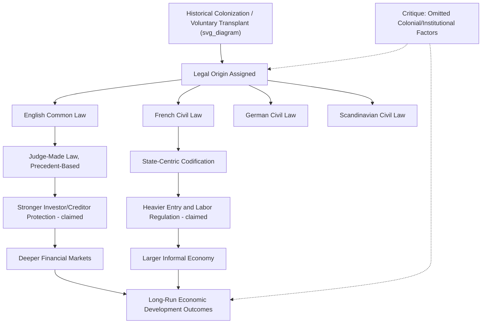

## Legal Origins Theory and Economic Development

### Definition and Theoretical Foundation

Legal origins theory posits that the historical origin of a country's legal system — whether transmitted through common law or one of the civil law traditions (French, German, Scandinavian) — exerts a persistent, independent causal influence on contemporary economic institutions and development outcomes. The theory was developed primarily by Rafael La Porta, Florencio Lopez-de-Silanes, Andrei Shleifer, and Robert Vishny (collectively "LLSV") across a series of papers beginning in 1997–1998, later synthesized in their 2008 *Journal of Economic Literature* survey "The Economic Consequences of Legal Origins."

**Key Points**

- The theory treats legal origin as a largely **exogenous, historically determined** variable — transmitted through conquest, colonization, and voluntary/involuntary legal transplantation — making it attractive as a source of plausibly exogenous variation for identifying institutional effects on development.
- Four principal legal-origin families are typically distinguished: **English common law**, **French civil law**, **German civil law**, and **Scandinavian civil law**, each transmitted historically through distinct colonial and transplantation channels.
- The theory sits within the broader "law and finance" and new institutional economics literatures connecting legal institutions to long-run economic performance (alongside North 1990, Acemoglu-Johnson-Robinson 2001).

### The Transmission Mechanism

Legal origin is treated as quasi-randomly assigned at the country level through historical processes largely independent of a country's economic characteristics at the time of transmission:

$$\text{LegalOrigin}_i = f(\text{ColonialHistory}_i, \text{ConquestPattern}_i, \text{VoluntaryTransplant}_i)$$

**Example**

English common law was transmitted to former British colonies (United States, Canada, Australia, India, much of Anglophone Africa); French civil law (via the Napoleonic Code) to French colonies and to countries voluntarily adopting the French Civil Code as a modernization template (much of Latin America, parts of the Middle East, Francophone Africa); German civil law to countries influenced by the German Civil Code (BGB) either through direct colonial ties or voluntary adoption (Japan, South Korea, parts of Eastern Europe); Scandinavian civil law remained largely confined to the Nordic countries themselves.

### Core Empirical Claims

#### 1. Investor and Creditor Protection

LLSV's earlier papers (1997, 1998) constructed cross-country indices of shareholder rights ("anti-director rights index") and creditor rights, finding common law countries scored systematically higher on both.

$$\text{InvestorProtection}_i = \alpha + \beta_1 \text{CommonLaw}_i + \beta_2 \text{GermanOrigin}_i + \beta_3 \text{FrenchOrigin}_i + X_i'\gamma + \varepsilon_i$$

(Scandinavian origin typically used as the omitted reference category.)

#### 2. Financial Market Development

Countries of common law origin are found to have, on average, deeper equity markets, greater dispersion of corporate ownership (less concentrated in controlling-family or state hands), and more IPO activity relative to GDP.

#### 3. Regulation of Entry

Djankov, La Porta, Lopez-de-Silanes, and Shleifer's (2002) "The Regulation of Entry" study measured the number of procedures, time, and cost required to legally start a business across countries, finding French-civil-law-origin countries associated with substantially heavier entry regulation than common law countries, controlling for GDP per capita.

#### 4. Court Formalism and Contract Enforcement

Djankov et al.'s (2003) "Courts" paper measured procedural formalism and time-to-resolution for a standardized debt-collection case across jurisdictions, finding civil law systems (particularly French-origin) associated with greater procedural complexity and longer enforcement duration.

### Diagram: Legal Origins Transmission and Outcome Pathway (svg_diagram)

### Identification Strategy

Because legal origin is fixed at the country level and predates most contemporary economic variables, LLSV-tradition studies typically treat it as a **natural instrument** for institutional quality or financial development in growth regressions, following the general logic that colonially transmitted legal origin is unlikely to be driven by reverse causality from contemporary outcomes.

$$\text{FinDev}_i = \pi_0 + \pi_1 \text{CommonLaw}_i + \nu_i \quad \text{(first stage)}$$

$$\text{GDPGrowth}_i = \beta_0 + \beta_1 \widehat{\text{FinDev}}_i + \varepsilon_i \quad \text{(second stage)}$$

**Key Points**

- The exclusion restriction required — that legal origin affects growth *only* through financial/institutional channels, not through other colonial legacies — is the most contested assumption in this literature.
- Because colonization patterns correlate with settler mortality, disease environment, pre-colonial population density, and extraction-versus-settlement colonial strategy (Acemoglu-Johnson-Robinson 2001; Engerman-Sokoloff 1997), isolating a pure "legal origin" effect independent of these correlated institutional legacies is difficult.

### Major Critiques and Challenges

#### 1. Endogeneity of Legal Origin Itself

Colonizers did not assign legal systems randomly — the choice of colonial administrative strategy (direct rule, indirect rule, settler colonization, extractive colonization) correlates with both the legal system transmitted and independent determinants of long-run development (indigenous institutional capacity, resource endowments, disease environment).

#### 2. Confounding with Broader Colonial Legacy

[Inference] A substantial portion of the critical literature (including work associated with Dani Rodrik and, separately, Mark Roe) argues that "legal origin" may function as a proxy for broader colonial-era political-economy patterns — degree of centralization, timing of colonization, colonizer identity's own developmental trajectory at the time of transmission — rather than reflecting an independent causal channel operating through legal-system architecture per se, though disentangling these empirically remains an open methodological challenge given the coarse grain at which legal origin varies (essentially fixed at the country level).

#### 3. Index Construction and Replication Concerns

Spamann's (2010) widely cited re-coding of LLSV's anti-director rights index — correcting alleged coding errors and inconsistencies in the original construction — found substantially different, and in some specifications reversed, relationships between legal origin and shareholder protection, raising serious concerns about the robustness of downstream findings built on the original index.

#### 4. Convergence and Time-Variance

Legal origin is a time-invariant historical variable, yet actual legal-system characteristics evolve continuously through statutory reform, judicial doctrine development, and international legal harmonization (e.g., EU harmonization of commercial law across both common law U.K.-influenced and civil law member states, prior to Brexit). A fixed historical classification may poorly capture a country's contemporary legal-institutional reality, particularly for countries decades or centuries removed from the original transmission event.

#### 5. Legal Transplant Effectiveness

Berkowitz, Pistor, and Richard (2003) argue that the *manner* of legal transplantation — whether a country adapted an imported code to local conditions or imposed it wholesale, and whether the population had pre-existing familiarity with the transplanted system's underlying logic — matters more for institutional effectiveness than the origin family itself, shifting emphasis from "which legal family" to "how well was the law adapted and received."

### Table: Summary of Legal Origin Empirical Associations

| Dimension | Common Law | French Civil Law | German Civil Law | Scandinavian Civil Law |
| --- | --- | --- | --- | --- |
| Investor protection (LLSV index) | Highest (original finding) | Lowest | Intermediate | Intermediate-high |
| Entry regulation | Lightest | Heaviest | Intermediate | Light |
| Court formalism | Lowest | Highest | Intermediate | Low |
| Government ownership of banks | Lower | Higher | Intermediate | Lower |
| Labor market regulation | Lighter (Botero et al. 2004) | Heavier | Intermediate-heavy | Heavy (but high social insurance) |

[Unverified: these represent the general direction of original LLSV-tradition findings; magnitude and statistical significance vary across specific studies, samples, and time periods, and several dimensions have been contested or revised in replication literature, notably Spamann (2010) for investor protection.]

### Methodological Lessons for Applied Researchers

**Key Points**

- Legal origins regressions are a canonical illustration of the tension between **exogeneity plausibility** (legal origin predates most outcomes, supporting a causal interpretation) and **exclusion restriction plausibility** (legal origin correlates with many other colonial-era factors, undermining a clean causal channel).
- Researchers using legal origin as a control or instrument should explicitly address the multicollinearity between legal origin and other colonial-legacy variables (settler mortality, religion, geography, pre-colonial institutions) rather than treating legal origin as a clean, isolated source of variation.
- Robustness to alternative index constructions (e.g., testing both original LLSV indices and Spamann's revised index) is now standard practice expected in serious applications of this literature.

### Diagram: Identification Challenge in Legal Origins Research (svg_diagram)

<svg xmlns="http://www.w3.org/2000/svg" viewBox="0 0 680 300">
<text x="340" y="28" text-anchor="middle" font-size="16" font-weight="bold" fill="#1a1a1a">Confounded Colonial Legacy Channels (svg_diagram)</text>
<rect x="270" y="50" width="140" height="50" rx="6" fill="#fdf0d5" stroke="#b8860b" stroke-width="2" />
<text x="340" y="80" text-anchor="middle" font-size="12">Colonization Event</text>
<rect x="60" y="150" width="140" height="50" rx="6" fill="#e8f1fa" stroke="#2166ac" stroke-width="2" />
<text x="130" y="180" text-anchor="middle" font-size="12">Legal Origin</text>
<rect x="270" y="150" width="140" height="50" rx="6" fill="#f0f0f0" stroke="#666" stroke-width="2" />
<text x="340" y="172" text-anchor="middle" font-size="11">Settler Mortality /</text>
<text x="340" y="188" text-anchor="middle" font-size="11">Colonial Strategy</text>
<rect x="480" y="150" width="150" height="50" rx="6" fill="#f0f0f0" stroke="#666" stroke-width="2" />
<text x="555" y="172" text-anchor="middle" font-size="11">Pre-Colonial</text>
<text x="555" y="188" text-anchor="middle" font-size="11">Institutions</text>
<rect x="270" y="240" width="140" height="50" rx="6" fill="#fce4e4" stroke="#b2182b" stroke-width="2" />
<text x="340" y="270" text-anchor="middle" font-size="12" fill="#b2182b">Development Outcome</text>
<line x1="340" y1="100" x2="130" y2="150" stroke="#333" stroke-width="1.5" marker-end="url(#b1)" />
<line x1="340" y1="100" x2="340" y2="150" stroke="#333" stroke-width="1.5" marker-end="url(#b1)" />
<line x1="340" y1="100" x2="555" y2="150" stroke="#333" stroke-width="1.5" marker-end="url(#b1)" />
<line x1="130" y1="200" x2="320" y2="240" stroke="#2166ac" stroke-width="2" marker-end="url(#b1)" />
<line x1="340" y1="200" x2="340" y2="240" stroke="#666" stroke-width="1.5" stroke-dasharray="4,3" marker-end="url(#b1)" />
<line x1="555" y1="200" x2="380" y2="240" stroke="#666" stroke-width="1.5" stroke-dasharray="4,3" marker-end="url(#b1)" />
</svg>

### Applications and Extensions in Development Economics

- **Financial development and growth**: legal origin used as an instrument in cross-country growth regressions linking financial depth to GDP growth (in the "law and finance" tradition following Levine 1998, 1999).
- **Labor market regulation studies**: Botero, Djankov, La Porta, Lopez-de-Silanes, and Shleifer (2004) extended the legal-origins framework to labor law, finding civil law (especially French-origin) countries associated with more protective labor regulation.
- **Government ownership and regulation**: Djankov, La Porta, Lopez-de-Silanes, and Shleifer's broader "New Comparative Economics" agenda linked legal origin to a general theory of the state's regulatory role, framed around the disorder-versus-dictatorship cost trade-off.
- **Institutional quality proxies**: legal origin dummies remain commonly included as controls (rather than primary variables of interest) in a wide range of development and corporate finance empirical work, given their availability and historical exogeneity, despite the contested causal interpretation.

### Related Topics

- Common law versus civil law efficiency debates
- La Porta-Lopez-de-Silanes-Shleifer-Vishny investor protection indices
- Spamann (2010) index recoding critique
- Acemoglu-Johnson-Robinson settler mortality and institutions
- Djankov et al. regulation of entry and court formalism studies
- Berkowitz-Pistor-Richard legal transplant effectiveness framework
- Law and finance literature (Levine, La Porta et al.)
- Botero et al. labor regulation and legal origins
- Colonial history and institutional persistence
- Cross-country identification strategies and instrument exclusion restrictions