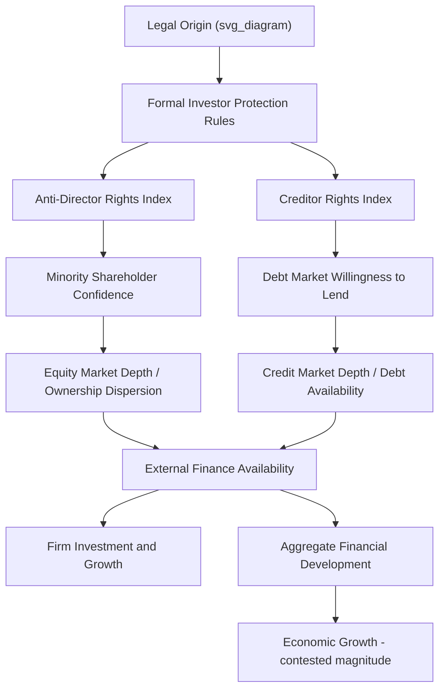

## Law and Finance Across Legal Traditions

### Overview and Field Definition

"Law and finance" designates the research program examining how legal rules — particularly corporate, securities, and creditor-rights law — shape financial market development, corporate ownership structure, and capital allocation across countries. The field emerged from the intersection of the Legal Origins literature (La Porta, Lopez-de-Silanes, Shleifer, and Vishny) and corporate finance, formalized principally in Levine's (1997, 1999) surveys and LLSV's (1997, 1998) foundational empirical papers connecting legal investor-protection rules to measurable financial market outcomes.

**Key Points**

- The central claim: legal rules governing the rights of outside investors (minority shareholders, creditors) relative to corporate insiders (controlling shareholders, managers) causally shape the willingness of investors to supply external finance, and hence the depth and breadth of financial markets.
- The field treats legal tradition (common law versus civil law family) as a key explanatory variable, building directly on legal origins theory but focused specifically on financial-sector outcomes.
- It has generated a large empirical literature connecting law, finance, and growth, while also attracting sustained methodological critique paralleling the broader legal-origins debate.

### The Core Theoretical Mechanism

The law-and-finance framework rests on an agency-theoretic foundation: dispersed outside investors face expropriation risk from corporate insiders (tunneling, self-dealing, dilution), and legal rules that constrain insider expropriation reduce the risk premium investors demand, lowering the cost of capital and expanding the feasible scale of external finance.

$$r_{required} = r_f + \pi_{expropriation}(\text{LegalProtection})$$

where $\pi_{expropriation}$ is decreasing in the strength of legal investor protection. Stronger protection → lower required return → greater willingness to supply capital → deeper financial markets.

**Key Points**

- This differs from a pure "law matters because it's enforced" story — the theory emphasizes law's role in shaping the *ex ante contracting environment* and investor confidence, not only ex post dispute resolution.
- The mechanism applies symmetrically to equity investors (shareholder protection) and debt investors (creditor rights, collateral enforcement, and priority in bankruptcy).

### Key Empirical Measures

#### 1. Anti-Director Rights Index (LLSV 1998)

A composite index scoring countries on six dimensions of minority shareholder protection in corporate law (proxy voting rights, share blocking during voting, cumulative voting, oppressed minority mechanisms, pre-emptive rights, and the shareholder vote threshold required to call an extraordinary meeting).

#### 2. Creditor Rights Index

Scores countries on secured creditor priority in liquidation, restrictions on automatic stay during reorganization, and management displacement upon filing for bankruptcy protection.

#### 3. Rule of Law and Enforcement Indices

Separate from the formal legal-rule indices, LLSV and subsequent researchers also incorporate broader governance indicators (e.g., International Country Risk Guide ratings) capturing enforcement quality, since formal law-on-the-books protections are only meaningful if actually enforced.

$$\text{EffectiveProtection}_i = \text{FormalLawIndex}_i \times \text{EnforcementQuality}_i$$

[Inference] This multiplicative framing is a simplification used to motivate the distinction conceptually; the literature does not universally adopt a strict multiplicative functional form, and the relative weight of formal rules versus enforcement quality in explaining outcomes remains an empirically contested question.

### Diagram: Law-and-Finance Causal Framework (svg_diagram)

### Cross-Legal-Tradition Empirical Patterns

| Legal Tradition | Shareholder Protection (original LLSV finding) | Creditor Rights | Ownership Concentration | Equity Market Depth |
| --- | --- | --- | --- | --- |
| English Common Law | Strongest | Strong | Most dispersed | Deepest |
| German Civil Law | Intermediate | Strong (bank-based system) | Concentrated, bank-monitored | Intermediate |
| French Civil Law | Weakest | Weakest | Most concentrated (often family/state) | Shallowest |
| Scandinavian Civil Law | Intermediate-strong | Intermediate | Moderate | Intermediate-deep |

[Unverified: original LLSV rankings; magnitude, significance, and even directional findings for several of these dimensions have been contested in later replication work, most notably Spamann's (2010) recoding of the anti-director rights index, which found substantially different shareholder-protection rankings than the original study.]

### Bank-Based Versus Market-Based Financial Systems

A parallel and partly overlapping literature (Allen and Gale 2000; Levine 2002) distinguishes **bank-based** financial systems (where banks are the primary intermediary channeling savings to investment, historically associated with German-tradition civil law countries and Japan) from **market-based** systems (where securities markets play the dominant intermediation role, historically associated with common law countries, particularly the U.S. and U.K.).

**Key Points**

- The law-and-finance literature generally argues that the underlying *legal protection of outside investors* matters more for financial development than the bank-based/market-based distinction itself — strong investor protection can support deep markets in either institutional configuration.
- [Inference] This claim is debated: some comparative-finance scholars argue that bank-based systems substitute concentrated bank monitoring for the dispersed-investor legal protections emphasized by LLSV, meaning legal investor-protection strength is a less binding constraint in bank-dominated systems — implying the law-and-finance framework's predictive power may vary by financial-system type, though this remains an area of ongoing empirical disagreement.

### Methodological Approach in Empirical Studies

#### Cross-Sectional Regressions

The dominant early empirical approach regresses financial development outcomes on legal-origin dummies and investor-protection indices across a cross-section of countries:

$$\text{StockMktCap/GDP}_i = \alpha + \beta_1 \text{AntiDirectorRights}_i + \beta_2 \text{RuleOfLaw}_i + X_i'\gamma + \varepsilon_i$$

#### Panel and Event-Study Extensions

More recent work exploits within-country legal reforms over time (e.g., a country strengthening minority shareholder protection through corporate law reform) using panel fixed-effects or event-study designs, addressing some of the cross-sectional endogeneity concerns by holding fixed unobserved, time-invariant country characteristics.

$$\text{FinDev}_{it} = \alpha_i + \gamma_t + \delta \cdot \text{ProtectionReform}_{it} + \varepsilon_{it}$$

**Key Points**

- Panel approaches are generally viewed as offering stronger identification than the original cross-sectional legal-origin regressions, since they exploit within-country variation over time rather than relying solely on cross-country legal-origin classification.
- However, reform timing is not necessarily exogenous — countries may reform investor-protection law in response to financial crises or anticipated market development, reintroducing endogeneity concerns specific to the reform event itself.

### Major Critiques

#### 1. Reverse Causality in Reform Timing

Countries experiencing financial-sector growth or crisis may be more likely to reform investor-protection law, reversing the presumed causal direction from law to finance.

#### 2. Index Construction Sensitivity

As with the broader legal-origins literature, Spamann's (2010) re-coding of the anti-director rights index substantially altered country rankings and weakened several of the original LLSV findings connecting legal origin to shareholder protection, a significant robustness concern for downstream law-and-finance studies built on the original index.

#### 3. Omitted Political-Economy Factors

Political economy scholars (notably Rajan and Zingales 2003, in their "Great Reversals" paper) argue that financial development is better explained by the political power of incumbent interest groups opposing financial-market competition (which erodes incumbents' rents) than by static legal-origin classification — pointing to historical reversals in financial development (e.g., early-20th-century financial retrenchment in countries with stable common law systems) that pure legal-origin theory struggles to explain.

#### 4. Enforcement Versus Formal Rules

Critics note that formal legal rules "on the books" may diverge substantially from actual enforcement practice, and that enforcement quality may be a more proximate determinant of investor confidence than the formal rule structure emphasized in the original indices.

### Diagram: Competing Explanations for Financial Development (svg_diagram)

<svg xmlns="http://www.w3.org/2000/svg" viewBox="0 0 680 300">
<text x="340" y="28" text-anchor="middle" font-size="16" font-weight="bold" fill="#1a1a1a">Competing Theories of Financial Development (svg_diagram)</text>
<rect x="40" y="70" width="180" height="60" rx="6" fill="#e8f1fa" stroke="#2166ac" stroke-width="2" />
<text x="130" y="95" text-anchor="middle" font-size="12">Legal Origins / Law-Finance</text>
<text x="130" y="112" text-anchor="middle" font-size="10">(LLSV, static legal rules)</text>
<rect x="250" y="70" width="180" height="60" rx="6" fill="#fdf0d5" stroke="#b8860b" stroke-width="2" />
<text x="340" y="95" text-anchor="middle" font-size="12">Political Economy</text>
<text x="340" y="112" text-anchor="middle" font-size="10">(Rajan-Zingales, incumbent rents)</text>
<rect x="460" y="70" width="180" height="60" rx="6" fill="#fce4e4" stroke="#b2182b" stroke-width="2" />
<text x="550" y="95" text-anchor="middle" font-size="12">Enforcement Quality</text>
<text x="550" y="112" text-anchor="middle" font-size="10">(Rule of law, institutions)</text>
<line x1="130" y1="130" x2="330" y2="220" stroke="#333" stroke-width="1.5" marker-end="url(#c1)" />
<line x1="340" y1="130" x2="335" y2="220" stroke="#333" stroke-width="1.5" marker-end="url(#c1)" />
<line x1="550" y1="130" x2="345" y2="220" stroke="#333" stroke-width="1.5" marker-end="url(#c1)" />
<rect x="230" y="230" width="220" height="55" rx="6" fill="#f0f0f0" stroke="#666" stroke-width="2" />
<text x="340" y="255" text-anchor="middle" font-size="12">Observed Financial</text>
<text x="340" y="272" text-anchor="middle" font-size="12">Development Outcome</text>
</svg>

### Applications in Law and Economics Research

- **Cost of capital studies**: cross-country tests of whether stronger legal investor protection is associated with lower firm-level cost of equity capital, controlling for country risk factors.
- **Ownership structure research**: explaining cross-country variation in the prevalence of family-controlled, widely-held, and state-controlled firms as a function of legal investor-protection strength (La Porta, Lopez-de-Silanes, and Shleifer 1999, "Corporate Ownership Around the World").
- **Dividend policy comparative studies**: testing whether firms in stronger-investor-protection countries pay higher dividends (as a mechanism disciplining insider expropriation) — the "outcome" versus "substitute" models of dividends and legal protection (La Porta et al. 2000).
- **IPO and going-public decisions**: cross-country comparison of IPO activity and market timing as a function of legal-protection regime strength.
- **Sovereign and corporate bond market development**: extending creditor-rights analysis to sovereign debt markets and cross-border lending behavior.

### Related Topics

- Legal origins theory and economic development
- Common law versus civil law efficiency debates
- Spamann (2010) anti-director rights index recoding
- Corporate ownership concentration and investor protection (La Porta et al. 1999)
- Bank-based versus market-based financial systems
- Rajan-Zingales political economy of financial development
- Creditor rights and bankruptcy law across jurisdictions
- Dividend policy and legal investor protection
- Panel and event-study designs for legal reform evaluation
- Cross-country financial development regressions and endogeneity concerns