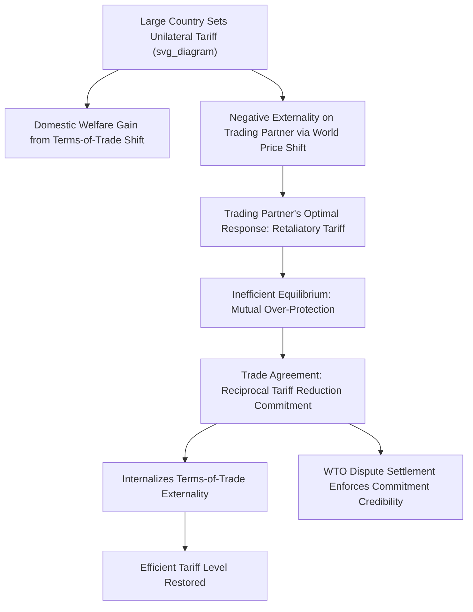

## International Trade Law and Economic Analysis

### Overview and Scope

International trade law and economic analysis examines the legal architecture governing cross-border exchange of goods, services, and investment — principally the World Trade Organization (WTO) framework, regional and bilateral trade agreements, and domestic trade remedy law — through the analytical lens of economics. The field applies core international trade theory (comparative advantage, gains from trade, terms-of-trade effects) to evaluate the design, enforcement, and welfare consequences of trade legal institutions.

**Key Points**

- The field bridges public international law, domestic administrative law (trade remedy proceedings), and economic theory (trade, industrial organization, and political economy).
- Central analytical questions include: why do rational welfare-maximizing states impose tariffs at all (terms-of-trade externality theory); how should trade agreements be designed to be self-enforcing; and how should domestic courts and international tribunals interpret ambiguous treaty commitments.
- Major institutional pillars include the WTO's dispute settlement system, regional trade agreements (RTAs) such as the USMCA and EU, and domestic trade remedy statutes (antidumping, countervailing duty, and safeguard law).

### The Terms-of-Trade Theory of Trade Agreements

The dominant economic theory explaining why trade agreements exist (Bagwell and Staiger's terms-of-trade theory, building on classical trade theory) holds that unilateral tariff-setting by a "large" country (one with market power affecting world prices) generates a negative externality on trading partners through adverse terms-of-trade effects, even though the tariff may appear domestically optimal to the imposing country.

$$\tau^{*}_{unilateral} > \tau^{*}_{efficient}$$

A country's unilaterally optimal tariff $\tau^*_{unilateral}$ exceeds the internationally efficient tariff level because the unilateral optimum internalizes only domestic welfare, ignoring the negative externality imposed on trading partners via shifted world prices. Trade agreements function as a mechanism to internalize this externality through reciprocal tariff reduction commitments.

$$W_{world} = \sum_i W_i(\tau_i, \tau_{-i})$$

**Key Points**

- This theory implies trade agreements are best understood not as correcting a "prisoner's dilemma" over domestic protectionist politics per se, but as solving a **terms-of-trade externality** problem between governments — a distinctly economic (not merely political) rationale for the existence of binding international trade law.
- An alternative and complementary strand (the "commitment theory," associated with Maggi and Rodriguez-Clare) argues trade agreements also serve to help governments commit against time-inconsistent protectionist pressure from domestic interest groups, independent of any terms-of-trade externality.

### GATT/WTO Legal Architecture and Economic Rationale

#### Most-Favored-Nation (MFN) Treatment

Requires WTO members to extend the most favorable tariff treatment granted to any one trading partner to all other WTO members (with exceptions for RTAs meeting specific criteria).

$$\tau_{ij} = \tau_{ik} \quad \forall j, k \in \text{WTO members}$$

Economically, MFN is understood to reduce the ability of large countries to exploit market power differentially across trading partners and to reduce the transaction costs of bilateral negotiation by multilateralizing concessions.

#### National Treatment

Requires imported goods, once past the border, to be treated no less favorably than domestically produced "like products" under domestic regulation — the core non-discrimination principle preventing disguised protectionism through internal regulatory measures.

#### Bound Tariffs and Tariff Bindings

WTO members commit to maximum ("bound") tariff rates, which may exceed applied rates, creating a form of policy space while still constraining maximum protectionism — an economically significant design feature since it allows governments flexibility to raise tariffs temporarily (within bound limits) in response to political-economy shocks without violating commitments.

### Diagram: Trade Agreement Externality Logic (svg_diagram)

### Trade Remedy Law: Economic Analysis

#### Antidumping Law

Antidumping duties are authorized under WTO rules (GATT Article VI, Antidumping Agreement) when a firm exports at a price below its "normal value" (home-market price or constructed cost) and causes material injury to a domestic industry.

$$\text{Dumping Margin} = \frac{\text{Normal Value} - \text{Export Price}}{\text{Export Price}}$$

**Key Points**

- Economic critique of antidumping law is extensive: price discrimination across markets (the economic definition closest to "dumping") is a standard, often procompetitive business practice in industrial organization theory, not necessarily evidence of predatory or anticompetitive intent.
- [Inference] A substantial portion of the trade economics literature (following analyses by Blonigen and Prusa, among others) characterizes antidumping law as functioning largely as a politically available protectionist tool rather than a remedy for genuinely anticompetitive foreign pricing behavior, given the loose "injury" and "dumping margin" standards typically applied in practice — though this remains a normatively and politically contested characterization rather than a settled empirical consensus.

#### Countervailing Duties (Anti-Subsidy Law)

Authorizes duties offsetting the estimated benefit of foreign government subsidies to exporters, where subsidization causes material injury to the importing country's domestic industry.

#### Safeguard Measures

Permit temporary tariff increases or quotas in response to a genuine surge in imports causing serious injury, without requiring a finding of "unfair" trade practice (unlike antidumping/countervailing duty law) — economically framed as a political "safety valve" allowing temporary protection to ease adjustment costs, in exchange for compensating trading partners or facing retaliation.

### WTO Dispute Settlement: Economic Function

The WTO Dispute Settlement Understanding (DSU) provides a quasi-judicial mechanism for resolving disputes over treaty compliance, including binding panel and Appellate Body rulings (the Appellate Body has faced significant operational disruption since 2019 due to the U.S. blocking new appointments, a development affecting the WTO's binding dispute resolution capacity; verify current Appellate Body operational status via WTO sources given the evolving nature of this institutional dispute).

**Key Points**

- Economically, the dispute settlement system functions as an enforcement mechanism increasing the credibility of tariff-binding commitments, which is central to the terms-of-trade theory's account of why agreements are self-enforcing rather than merely aspirational.
- WTO remedies are prospective (requiring future compliance) rather than compensatory for past violations, which some economic analyses characterize as generating weaker deterrence than a damages-based enforcement system would provide, since the expected cost of violation may be lower than the gain captured during the violation period before a ruling is issued.

### Regional Trade Agreements and the "Spaghetti Bowl" Problem

The proliferation of overlapping regional and bilateral trade agreements — each with distinct rules of origin, tariff schedules, and dispute mechanisms — creates what Bhagwati termed the "spaghetti bowl" effect, raising compliance costs for firms navigating multiple overlapping preferential regimes.

$$\text{Effective Tariff}_{ij} = f(\text{RTA membership}, \text{Rules of Origin}, \text{MFN baseline})$$

**Example**

A firm exporting from Country A to Country B may qualify for preferential tariff treatment under an RTA only if it satisfies a rules-of-origin threshold (e.g., a minimum percentage of regional value content), creating administrative compliance costs that can offset some of the tariff-preference benefit, particularly for firms with globally dispersed supply chains.

### Diagram: Trade Law Institutional Architecture (svg_diagram)

<svg xmlns="http://www.w3.org/2000/svg" viewBox="0 0 700 340">
<text x="350" y="28" text-anchor="middle" font-size="16" font-weight="bold" fill="#1a1a1a">International Trade Law Institutional Layers (svg_diagram)</text>
<rect x="270" y="55" width="160" height="55" rx="6" fill="#e8f1fa" stroke="#2166ac" stroke-width="2" />
<text x="350" y="87" text-anchor="middle" font-size="13">WTO Multilateral Rules</text>
<rect x="80" y="150" width="160" height="55" rx="6" fill="#fdf0d5" stroke="#b8860b" stroke-width="2" />
<text x="160" y="175" text-anchor="middle" font-size="12">Regional Agreements</text>
<text x="160" y="192" text-anchor="middle" font-size="10">(USMCA, EU, RCEP)</text>
<rect x="270" y="150" width="160" height="55" rx="6" fill="#fdf0d5" stroke="#b8860b" stroke-width="2" />
<text x="350" y="175" text-anchor="middle" font-size="12">Bilateral Agreements</text>
<rect x="460" y="150" width="170" height="55" rx="6" fill="#fdf0d5" stroke="#b8860b" stroke-width="2" />
<text x="545" y="175" text-anchor="middle" font-size="12">Domestic Trade</text>
<text x="545" y="192" text-anchor="middle" font-size="12">Remedy Law</text>
<rect x="200" y="255" width="300" height="55" rx="6" fill="#fce4e4" stroke="#b2182b" stroke-width="2" />
<text x="350" y="280" text-anchor="middle" font-size="12">Firm-Level Compliance Costs</text>
<text x="350" y="297" text-anchor="middle" font-size="11">("Spaghetti Bowl" of overlapping rules)</text>
<line x1="350" y1="110" x2="160" y2="150" stroke="#333" stroke-width="1.5" marker-end="url(#d1)" />
<line x1="350" y1="110" x2="350" y2="150" stroke="#333" stroke-width="1.5" marker-end="url(#d1)" />
<line x1="350" y1="110" x2="545" y2="150" stroke="#333" stroke-width="1.5" marker-end="url(#d1)" />
<line x1="160" y1="205" x2="300" y2="255" stroke="#666" stroke-width="1.5" marker-end="url(#d1)" />
<line x1="350" y1="205" x2="350" y2="255" stroke="#666" stroke-width="1.5" marker-end="url(#d1)" />
<line x1="545" y1="205" x2="400" y2="255" stroke="#666" stroke-width="1.5" marker-end="url(#d1)" />
</svg>

### Empirical Methods in Trade Law and Economics

| Method | Application |
| --- | --- |
| Gravity models | Estimating the trade-volume effect of specific trade agreements, controlling for distance, GDP, and other bilateral trade determinants |
| Difference-in-differences | Estimating the effect of trade agreement entry into force on bilateral trade flows, tariff pass-through, or firm entry |
| Structural trade models (e.g., Eaton-Kortum, Melitz-type) | Quantifying welfare gains from tariff liberalization, incorporating firm heterogeneity and selection into exporting |
| Event studies on dispute rulings | Assessing market/stock price reactions to WTO panel and Appellate Body rulings affecting specific industries |
| Political economy models (protection-for-sale, Grossman-Helpman) | Explaining cross-industry variation in tariff protection as a function of lobbying organization and political contributions |

$$\ln(\text{Trade}_{ij}) = \beta_0 + \beta_1 \ln(GDP_i) + \beta_2 \ln(GDP_j) + \beta_3 \ln(\text{Distance}_{ij}) + \beta_4 \text{RTA}_{ij} + \varepsilon_{ij}$$

(Standard gravity-model specification used extensively to estimate trade agreement effects.)

### Political Economy of Trade Protection

The **Grossman-Helpman "Protection for Sale"** model (1994) provides the dominant political-economy framework explaining observed cross-industry variation in tariff levels as an equilibrium outcome of lobbying competition between organized industry groups and a government that weighs both social welfare and political campaign contributions.

$$G(\vec{\tau}) = \sum_{i \in L} C_i(\tau_i) + a \cdot W(\vec{\tau})$$

where $G$ is the government's objective function, $C_i$ are contributions from organized lobby $i$, $L$ is the set of politically organized industries, and $a$ weights aggregate social welfare $W$ against contributions.

**Key Points**

- This framework predicts that industries with well-organized lobbies (concentrated, easily coordinated) receive systematically higher protection than diffuse, unorganized industries (e.g., final consumers), independent of underlying comparative-advantage considerations.
- It has been used to explain persistent protection in politically sensitive sectors (agriculture, steel, textiles) despite economic analyses generally finding net welfare losses from such protection.

### Applications and Case Studies

- **Section 301 and Section 232 U.S. trade actions**: economic analysis of unilateral tariff measures justified on national security or unfair-trade-practice grounds, and their compatibility with WTO commitments.
- **China's WTO accession (2001) and its aftermath**: extensively studied using difference-in-differences and structural trade models to estimate the "China shock" effect on manufacturing employment in import-competing regions of developed countries (Autor, Dorn, and Hanson's influential body of work).
- **Investor-state dispute settlement (ISDS)**: economic analysis of investment treaty arbitration mechanisms embedded in many trade and investment agreements, examining their effect on foreign direct investment flows and regulatory chilling effects on host-country policy.
- **Digital trade and data localization rules**: emerging area analyzing the economic costs of data-localization mandates and cross-border data flow restrictions embedded in newer-generation trade agreements.

### Related Topics

- Terms-of-trade theory of trade agreements (Bagwell-Staiger)
- Grossman-Helpman protection-for-sale political economy model
- Gravity models of bilateral trade
- Antidumping and countervailing duty economic critique
- WTO dispute settlement mechanism and Appellate Body function
- Regional trade agreements and rules-of-origin compliance costs
- China shock literature (Autor-Dorn-Hanson)
- Investor-state dispute settlement (ISDS) economic effects
- Structural trade models: Eaton-Kortum and Melitz frameworks
- Comparative advantage theory and welfare gains from trade liberalization