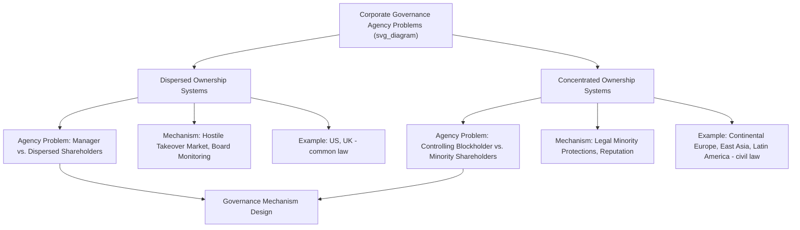

## Comparative Corporate Governance Systems

### Overview and Analytical Framework

Comparative corporate governance examines how legal rules, ownership patterns, and institutional structures governing the relationship between corporate insiders (managers, controlling shareholders) and outside investors vary systematically across countries, and how these variations produce different equilibrium outcomes in firm behavior, capital allocation, and economic performance. The field draws heavily on the law-and-finance and legal-origins literatures while incorporating agency theory, contract theory, and comparative political economy.

**Key Points**

- The central analytical distinction is between **dispersed-ownership systems** (many small shareholders, professional management, separation of ownership and control — the classic Berle-Means 1932 corporation) and **concentrated-ownership systems** (controlling blockholders, often families, banks, or the state, with management closely aligned to or identical with controlling owners).
- The core agency problem differs by system type: dispersed-ownership systems primarily face a **manager-shareholder agency problem** (managers may not act in shareholders' collective interest); concentrated-ownership systems primarily face a **controlling-minority shareholder agency problem** (controlling blockholders may expropriate minority shareholders).
- Legal origin (per La Porta, Lopez-de-Silanes, Shleifer, and Vishny) is a leading explanatory variable for this cross-country variation, though contested on the same grounds as the broader legal-origins literature.

### Diagram: Two Core Agency Problems (svg_diagram)

### Ownership Concentration Patterns

La Porta, Lopez-de-Silanes, and Shleifer's influential 1999 study "Corporate Ownership Around the World" documented that, contrary to the Berle-Means dispersed-ownership model often treated as the default in classic corporate finance theory, **most large corporations worldwide are controlled by a dominant shareholder** — typically a family or the state — rather than being widely held, with dispersed ownership concentrated disproportionately in a small number of common law countries (principally the U.S. and U.K.).

$$\text{ControlStructure}_i = f(\text{LegalOrigin}_i, \text{InvestorProtection}_i, \text{CapitalMarketDepth}_i)$$

**Key Points**

- Weak legal protection for minority shareholders is theorized to make dispersed ownership unsustainable: absent strong legal constraints on expropriation, investors rationally demand a controlling stake (or refuse to invest) rather than accept a minority position vulnerable to insider self-dealing.
- Control is frequently enhanced beyond cash-flow ownership stakes through pyramid ownership structures, dual-class shares, and cross-shareholdings — mechanisms allowing a family or founder to control voting rights disproportionate to their economic (cash-flow) stake.

$$\text{ControlRights} > \text{CashFlowRights} \implies \text{Wedge enables expropriation incentive}$$

The larger this wedge, the stronger the controlling shareholder's incentive to extract private benefits of control at the expense of minority shareholders, since losses are borne disproportionately by minority holders while control benefits accrue to the blockholder.

### Major Governance Models

#### 1. The Anglo-American (Outsider/Market-Based) Model

Characteristic of the U.S. and U.K.: dispersed ownership, liquid equity markets, an active market for corporate control (hostile takeovers as a disciplining mechanism), and reliance on independent boards, disclosure requirements, and litigation (including derivative suits and securities class actions) as primary governance mechanisms.

**Key Points**

- The hostile takeover market is theorized (Manne 1965) to discipline underperforming management: persistently poor performance depresses share price, inviting an acquirer to purchase control and replace management, even without incumbent management's cooperation.
- Extensive mandatory disclosure regimes (in the U.S., primarily SEC-administered) substitute for direct blockholder monitoring by enabling dispersed shareholders and analysts to monitor management indirectly through public information.

#### 2. The Continental European (Insider/Bank-Based or Blockholder) Model

Characteristic of Germany and much of continental Europe: concentrated ownership (often bank, family, or cross-shareholding based), two-tier board structures (in Germany, a separate supervisory board including employee representation under co-determination law), and long-term relationship-based monitoring rather than market-based discipline.

**Example**

German co-determination (*Mitbestimmung*) law requires large corporations to allocate a substantial share of supervisory board seats to employee representatives, embedding a stakeholder-oriented governance philosophy distinct from the shareholder-primacy orientation more characteristic of Anglo-American governance theory.

#### 3. The East Asian (Family/Pyramid-Based) Model

Characteristic of much of East and Southeast Asia (notably Korean *chaebol* and various family-controlled conglomerate structures elsewhere in the region): pyramid ownership structures concentrating control in founding families across diversified business groups, often with historically weaker formal minority-shareholder legal protections (though this has evolved substantially through legal reform in various jurisdictions in recent decades).

#### 4. The State-Controlled Model

Characteristic of China and various other economies with significant state-owned enterprise (SOE) sectors: direct or indirect state ownership and control, with governance mechanisms blending corporate law structures with political and administrative oversight channels, raising distinct agency questions (state-as-controller versus broader public/citizen interests) not well captured by the private-sector-focused Berle-Means or blockholder-expropriation frameworks.

### Diagram: Comparative Governance Model Spectrum (svg_diagram)

<svg xmlns="http://www.w3.org/2000/svg" viewBox="0 0 700 300">
<text x="350" y="28" text-anchor="middle" font-size="16" font-weight="bold" fill="#1a1a1a">Comparative Governance Model Spectrum (svg_diagram)</text>
<line x1="60" y1="150" x2="640" y2="150" stroke="#333" stroke-width="2" />
<text x="60" y="180" font-size="11" fill="#333">Dispersed</text>
<text x="600" y="180" font-size="11" fill="#333">Concentrated</text>
<circle cx="120" cy="150" r="8" fill="#2166ac" />
<text x="120" y="120" text-anchor="middle" font-size="12" fill="#2166ac">US/UK</text>
<text x="120" y="105" text-anchor="middle" font-size="10" fill="#666">Market-based</text>
<circle cx="300" cy="150" r="8" fill="#b8860b" />
<text x="300" y="120" text-anchor="middle" font-size="12" fill="#b8860b">Germany</text>
<text x="300" y="105" text-anchor="middle" font-size="10" fill="#666">Bank/co-determination</text>
<circle cx="470" cy="150" r="8" fill="#b2182b" />
<text x="470" y="120" text-anchor="middle" font-size="12" fill="#b2182b">East Asia</text>
<text x="470" y="105" text-anchor="middle" font-size="10" fill="#666">Family/pyramid</text>
<circle cx="600" cy="150" r="8" fill="#555" />
<text x="600" y="120" text-anchor="middle" font-size="12" fill="#555">China</text>
<text x="600" y="105" text-anchor="middle" font-size="10" fill="#666">State-controlled</text>
<line x1="120" y1="200" x2="120" y2="158" stroke="#2166ac" stroke-width="1" stroke-dasharray="3,3" />
<line x1="300" y1="200" x2="300" y2="158" stroke="#b8860b" stroke-width="1" stroke-dasharray="3,3" />
<line x1="470" y1="200" x2="470" y2="158" stroke="#b2182b" stroke-width="1" stroke-dasharray="3,3" />
<line x1="600" y1="200" x2="600" y2="158" stroke="#555" stroke-width="1" stroke-dasharray="3,3" />
<text x="350" y="240" text-anchor="middle" font-size="11" fill="#333">Primary Governance Mechanism Shifts:</text>
<text x="350" y="258" text-anchor="middle" font-size="11" fill="#333">Market Discipline → Relationship Monitoring → Political/Administrative Oversight</text>
</svg>

### Governance Mechanisms: Comparative Table

| Mechanism | Anglo-American | Continental European | East Asian Family-Based | State-Controlled |
| --- | --- | --- | --- | --- |
| Primary monitor | Dispersed shareholders, market | Banks, large blockholders | Controlling family | State agencies/party organs |
| Board structure | Unitary board, independent directors | Two-tier (management + supervisory) | Often family-dominated board | Mixed corporate/administrative |
| Takeover market | Active, disciplining role | Historically limited | Limited (pyramid structures resist takeover) | Effectively absent for controlled entities |
| Key legal protection | Disclosure, derivative suits, class actions | Co-determination, bank monitoring | Evolving minority-shareholder statutory protections | Administrative/political accountability channels |
| Dominant agency problem | Manager vs. dispersed shareholders | Manager vs. blockholder-monitor (less acute) | Controlling family vs. minority shareholders | State-as-controller vs. broader stakeholders |

[Unverified: this table presents stylized characterizations for comparative teaching purposes; individual countries within each category exhibit substantial internal variation, and governance practices have evolved considerably since the classic literature (much of it dating to the 1990s–2000s) was written — current country-specific governance codes should be consulted for up-to-date detail.]

### Legal Mechanisms Addressing Controlling-Shareholder Expropriation

#### 1. Related-Party Transaction Rules

Require heightened disclosure, independent board or shareholder approval, or fairness opinions for transactions between the controlled company and entities affiliated with the controlling shareholder, addressing the "tunneling" risk (Johnson, La Porta, Lopez-de-Silanes, and Shleifer 2000) of value extraction through non-arm's-length transactions.

#### 2. Cumulative Voting and Board Representation Rights

Mechanisms allowing minority shareholders to pool votes to secure at least some board representation, partially counteracting simple-majority control.

#### 3. Mandatory Bid Rules

Common in many jurisdictions (notably EU member states under the EU Takeover Directive): require an acquirer crossing a specified ownership threshold to make a tender offer to all remaining shareholders at the same price, protecting minority shareholders from being frozen into a newly controlled company without an exit opportunity.

#### 4. Dual-Class Share Restrictions or Sunset Provisions

Some jurisdictions and stock exchanges restrict or impose time limits ("sunset clauses") on dual-class share structures that separate voting control from cash-flow ownership, addressing the control-cash-flow wedge concern directly.

### Empirical Research Applications

**Key Points**

- **Tunneling studies**: empirical identification of controlling-shareholder expropriation through related-party transaction pricing analysis, often using natural experiments around specific legal reforms strengthening related-party transaction disclosure (e.g., studies of Chinese, Korean, and various European reforms).
- **Pyramid discount studies**: estimating the valuation discount ("control premium" inverse) applied by markets to firms with larger control-cash-flow wedges, as a market-based measure of anticipated expropriation risk.
- **Cross-country governance index construction**: composite indices (e.g., the Credit Lyonnais Securities Asia CG Watch index, various academic governance indices) used to test whether firm- or country-level governance quality predicts valuation, cost of capital, or crisis resilience — subject to similar index-construction critiques as the broader legal-origins literature (Spamann-type concerns about coding subjectivity).
- **Comparative law reform evaluation**: difference-in-differences and event-study designs evaluating the effect of specific governance reforms (e.g., board independence mandates, related-party transaction rules) on firm valuation and minority-investor outcomes, offering more credible causal identification than pure cross-sectional comparison.

$$\text{FirmValue}_i = \alpha + \beta_1 \text{ControlWedge}_i + \beta_2 \text{CountryGovernanceIndex}_i + X_i'\gamma + \varepsilon_i$$

### Convergence Debate

**Key Points**

- A substantial literature (Hansmann and Kraakman's 2001 "End of History for Corporate Law" thesis being the most prominent statement) argued that global competitive and market pressures would drive convergence toward the shareholder-primacy, dispersed-ownership Anglo-American model.
- [Inference] This convergence thesis has been substantially qualified in subsequent scholarship: path-dependence theorists (notably Bebchuk and Roe 1999) argue that initial ownership structures and political coalitions supporting them are self-reinforcing, making full convergence unlikely even under sustained competitive pressure, and empirical ownership-concentration patterns in most jurisdictions have shown only partial movement toward dispersed ownership over the subsequent decades — the debate remains actively contested rather than resolved.
- More recent scholarship increasingly emphasizes "functional convergence" (similar governance problems addressed through different formal mechanisms adapted to local ownership structures) over "formal convergence" (adoption of identical legal rules) as the more empirically supported pattern.

### Related Topics

- Legal origins theory and economic development
- Law and finance across legal traditions
- La Porta-Lopez-de-Silanes-Shleifer corporate ownership studies
- Tunneling and related-party transaction regulation
- Hansmann-Kraakman convergence thesis and Bebchuk-Roe path dependence critique
- German co-determination and stakeholder governance theory
- Pyramid ownership structures and control-cash-flow wedges
- Mandatory bid rules and EU Takeover Directive
- State-owned enterprise governance and political economy
- Comparative board structure: unitary versus two-tier systems