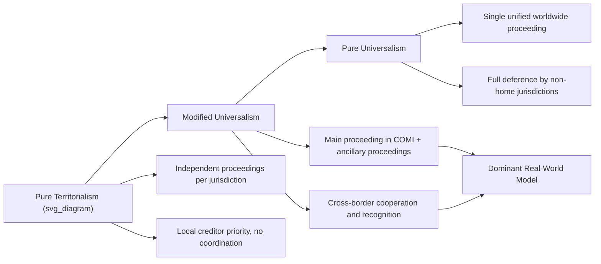

## Cross-Border Insolvency and International Economic Law

### Overview and Core Challenge

Cross-border insolvency addresses the legal and economic problems that arise when a debtor's assets, creditors, and business operations span multiple jurisdictions with distinct, often conflicting, insolvency law regimes. The central challenge is coordinating a collective proceeding — insolvency law's core function is to replace an uncoordinated race among creditors with an orderly, value-maximizing collective process — across national borders where no single sovereign has automatic jurisdiction over all relevant assets and parties.

**Key Points**

- Purely domestic insolvency theory (Jackson's 1986 "creditors' bargain" framework) justifies collective proceedings as solving a coordination failure: absent a collective process, creditors individually racing to seize assets destroy going-concern value that could otherwise be preserved and shared.
- This coordination rationale becomes substantially harder to achieve across borders, since no international sovereign can compel creditors and courts in multiple countries into a single unified proceeding without treaty-based or model-law cooperation.
- The field sits at the intersection of private international law (conflict of laws), international economic law, and law-and-economics analysis of bankruptcy's efficiency functions.

### Two Theoretical Models: Universalism Versus Territorialism

#### Universalism

Under a pure universalist approach, a single "home" jurisdiction (typically the debtor's center of main interests, or COMI) administers a unified insolvency proceeding governing all of the debtor's assets and creditors worldwide, with other jurisdictions deferring to that proceeding's authority.

$$\text{Efficiency Gain}_{universalist} = \text{Coordination Value} - \text{Sovereignty/Enforcement Cost}$$

**Key Points**

- Economic argument for universalism: a single unified proceeding maximizes going-concern value by avoiding duplicative, competing proceedings that fragment the estate and increase administrative costs; it also increases predictability ex ante for creditors extending credit, since a single governing law and forum is known in advance.
- LoPucki's influential critique (1999, 2000) argues pure universalism is unrealistic given persistent divergence in national insolvency policy priorities (e.g., differing treatment of employee claims, tax claims, and secured creditor priority) and the practical unwillingness of national courts to fully cede jurisdiction over local assets and local creditor interests.

#### Territorialism

Under a territorialist approach, each jurisdiction where the debtor has assets administers a separate, independent proceeding governing only assets located within that jurisdiction, with no formal coordination requirement.

**Key Points**

- Territorialism better respects local creditor priorities and local sovereignty over local assets, and avoids the practical difficulty of enforcing a foreign proceeding's authority over domestic assets.
- Economically, pure territorialism is criticized for fragmenting the estate, potentially destroying going-concern value achievable only through unified reorganization, and creating a "race to the courthouse" incentive for local creditors to seize local assets before a foreign proceeding can reach them.

#### Modified Universalism (the Dominant Practical Approach)

Most contemporary cross-border insolvency law adopts a middle path — a primary ("main") proceeding in the debtor's COMI jurisdiction, coordinated with ancillary/secondary proceedings in other jurisdictions where the debtor has assets or establishments, with cooperation mechanisms (recognition, comity, information-sharing) rather than complete subordination of local proceedings.

### Diagram: Universalism-Territorialism Spectrum (svg_diagram)

### The UNCITRAL Model Law on Cross-Border Insolvency

The 1997 UNCITRAL Model Law on Cross-Border Insolvency is the principal international legal instrument implementing modified universalism, adopted (with local variations) by a substantial number of jurisdictions including the United States (as Chapter 15 of the Bankruptcy Code, enacted 2005), the United Kingdom, and numerous other countries.

**Key Points**

- The Model Law establishes procedures for **recognition** of foreign insolvency proceedings, distinguishing "foreign main proceedings" (in the debtor's COMI) from "foreign non-main proceedings" (in jurisdictions where the debtor merely has an "establishment").
- Recognition of a foreign main proceeding triggers an automatic stay against creditor actions in the recognizing jurisdiction, extending the coordination benefits of the home proceeding into the recognizing jurisdiction without requiring a full parallel domestic proceeding.
- The Model Law does **not** harmonize substantive insolvency law (priority rules, avoidance powers, treatment of secured creditors continue to vary by jurisdiction) — it is purely a procedural/recognition framework, leaving substantive divergence in place.

$$\text{COMI} = \text{jurisdiction where debtor conducts administration of its interests on a regular basis, ascertainable by third parties}$$

### Determining "Center of Main Interests" (COMI)

COMI determination is economically significant because it determines which jurisdiction's insolvency law governs the primary proceeding, with major implications for creditor recovery given cross-jurisdictional differences in priority rules, avoidance powers, and reorganization procedures.

**Key Points**

- Courts generally apply a rebuttable presumption that COMI is the debtor's registered office/place of incorporation, but this presumption can be overcome by evidence of actual administrative center location — creating litigation risk and strategic incentive for "COMI shifting" (relocating administrative functions shortly before insolvency to access a more favorable jurisdiction's law).
- [Inference] COMI-shifting litigation has generated a substantial body of case law, particularly in the EU under the EU Insolvency Regulation, since the economic stakes of COMI determination (which jurisdiction's substantive law and priority rules apply) can be very large for major creditor classes, though the specific legal standards for evaluating COMI-shift legitimacy continue to be refined through ongoing litigation across jurisdictions.

### Economic Functions and Trade-offs in Cross-Border Design

#### 1. Reducing Forum Shopping Costs Versus Enabling Beneficial Forum Selection

Cross-border insolvency design must balance discouraging opportunistic forum shopping (debtors relocating COMI purely to access favorable law shortly before insolvency, potentially harming creditors who extended credit expecting a different governing law) against permitting beneficial forum selection (debtors genuinely reorganizing their business in a jurisdiction with more efficient reorganization procedures, which can increase total value available to all creditors).

$$\text{Forum Selection Welfare Effect} = \text{Efficiency Gain from Better Reorganization Regime} - \text{Creditor Expectation Frustration Cost}$$

#### 2. Coordination Costs Versus Local Sovereignty Costs

Full coordination (approaching pure universalism) minimizes duplicative administrative costs and maximizes going-concern value preservation but imposes sovereignty costs on jurisdictions asked to defer to a foreign proceeding's treatment of local assets and local creditors — a persistent political-economy constraint on further harmonization.

#### 3. Choice-of-Law Predictability and Ex Ante Credit Pricing

Economic theory of secured credit (following the broader law-and-finance literature) suggests that predictable, well-defined priority rules reduce the risk premium creditors demand ex ante. Cross-border uncertainty about which jurisdiction's law will ultimately govern in insolvency increases this risk premium, potentially raising the cost of cross-border credit — a key economic argument for continued harmonization efforts despite sovereignty costs.

### Diagram: Cross-Border Insolvency Coordination Workflow (svg_diagram)

<svg xmlns="http://www.w3.org/2000/svg" viewBox="0 0 700 340">
<text x="350" y="28" text-anchor="middle" font-size="16" font-weight="bold" fill="#1a1a1a">Modified Universalism Workflow (svg_diagram)</text>
<rect x="270" y="55" width="160" height="55" rx="6" fill="#e8f1fa" stroke="#2166ac" stroke-width="2" />
<text x="350" y="80" text-anchor="middle" font-size="12">Debtor Insolvent</text>
<text x="350" y="97" text-anchor="middle" font-size="11">COMI Determined</text>
<rect x="270" y="145" width="160" height="55" rx="6" fill="#fdf0d5" stroke="#b8860b" stroke-width="2" />
<text x="350" y="170" text-anchor="middle" font-size="12">Main Proceeding</text>
<text x="350" y="187" text-anchor="middle" font-size="11">(in COMI jurisdiction)</text>
<rect x="60" y="240" width="170" height="60" rx="6" fill="#fce4e4" stroke="#b2182b" stroke-width="2" />
<text x="145" y="262" text-anchor="middle" font-size="11">Non-Main Proceeding A</text>
<text x="145" y="278" text-anchor="middle" font-size="10">(local establishment assets)</text>
<rect x="465" y="240" width="170" height="60" rx="6" fill="#fce4e4" stroke="#b2182b" stroke-width="2" />
<text x="550" y="262" text-anchor="middle" font-size="11">Non-Main Proceeding B</text>
<text x="550" y="278" text-anchor="middle" font-size="10">(local establishment assets)</text>
<rect x="270" y="240" width="160" height="60" rx="6" fill="#f0f0f0" stroke="#666" stroke-width="2" />
<text x="350" y="262" text-anchor="middle" font-size="11">Recognition &amp;</text>
<text x="350" y="278" text-anchor="middle" font-size="11">Cooperation Protocol</text>
<line x1="350" y1="110" x2="350" y2="145" stroke="#333" stroke-width="2" marker-end="url(#e1)" />
<line x1="300" y1="200" x2="180" y2="240" stroke="#333" stroke-width="1.5" marker-end="url(#e1)" />
<line x1="350" y1="200" x2="350" y2="240" stroke="#333" stroke-width="1.5" marker-end="url(#e1)" />
<line x1="400" y1="200" x2="530" y2="240" stroke="#333" stroke-width="1.5" marker-end="url(#e1)" />
</svg>

### Comparative Priority Rules and the Harmonization Challenge

| Jurisdiction/Regime | Secured Creditor Priority | Employee Claims Priority | Tax Claims Priority | Cross-Border Framework |
| --- | --- | --- | --- | --- |
| United States (Chapter 11 / Chapter 15) | Strong, subject to adequate protection rules | Limited statutory priority (capped) | Priority unsecured, subordinate to secured | UNCITRAL Model Law via Chapter 15 |
| United Kingdom | Strong, floating charge subject to prescribed part carve-out | Preferential status (capped amount) | HMRC given "secondary preferential" status post-2020 reform | UNCITRAL Model Law adopted (Cross-Border Insolvency Regulations 2006) |
| European Union (member states, general pattern) | Varies significantly by member state | Often strong priority (varies) | Varies significantly | EU Insolvency Regulation (recast 2015/848) — EU-specific framework distinct from, though influenced by, UNCITRAL principles |
| China | Evolving framework; secured creditors generally prioritized | Statutory priority ahead of general unsecured claims | Priority position varies by claim type | Limited formal cross-border recognition framework; case-by-case judicial cooperation |

[Unverified: insolvency priority schemes are subject to frequent legislative reform in most jurisdictions; the table reflects general structural patterns for comparative teaching purposes and should be verified against current statutory text for any specific jurisdiction and transaction.]

### The EU Insolvency Regulation as a Regional Model

The EU Insolvency Regulation (recast, Regulation 2015/848) provides a more deeply integrated cross-border framework than the UNCITRAL Model Law among EU member states, including automatic recognition of insolvency proceedings across the EU without a separate recognition process, alongside its own COMI-determination framework and coordination rules for corporate groups with entities in multiple member states.

**Key Points**

- The EU framework goes beyond simple recognition toward closer-to-universalist coordination within the EU bloc, reflecting the deeper legal and economic integration of the EU single market relative to the broader international community addressed by the UNCITRAL Model Law.
- Post-Brexit, the United Kingdom is no longer party to the EU Insolvency Regulation and now relies on the UNCITRAL Model Law framework (via its Cross-Border Insolvency Regulations) and other bilateral/common-law recognition mechanisms for coordination with EU proceedings — a significant practical shift in cross-border insolvency coordination between the UK and EU member states.

### Empirical and Applied Research Directions

- **Forum shopping studies**: empirical analysis of COMI-shifting patterns and their association with creditor recovery outcomes, testing whether beneficial forum selection (efficient reorganization regime access) or opportunistic forum shopping (creditor-harming relocation) better characterizes observed patterns.
- **Cross-border recovery rate comparisons**: comparative studies of creditor recovery rates in coordinated (Model-Law-recognized) versus uncoordinated cross-border insolvencies, testing the theoretical prediction that coordination preserves going-concern value.
- **Sovereign and quasi-sovereign debt restructuring**: related but distinct field examining cross-border coordination challenges specific to sovereign debt (where no bankruptcy court has jurisdiction over a sovereign in the domestic-insolvency sense), including collective action clause design and holdout creditor litigation (e.g., the extensively studied *NML Capital v. Argentina* litigation).
- **Multinational corporate group insolvency**: analysis of coordination challenges specific to corporate groups with subsidiaries in multiple jurisdictions, including substantive consolidation doctrine variation and intercompany claim treatment across borders.

### Related Topics

- Law and finance across legal traditions
- Legal origins theory and economic development
- UNCITRAL Model Law on Cross-Border Insolvency and Chapter 15
- EU Insolvency Regulation and COMI determination
- Creditors' bargain theory of bankruptcy (Jackson)
- Sovereign debt restructuring and collective action clauses
- Secured credit theory and priority rule design
- Forum shopping and choice-of-law economics
- Comparative corporate governance systems
- International trade law and economic analysis