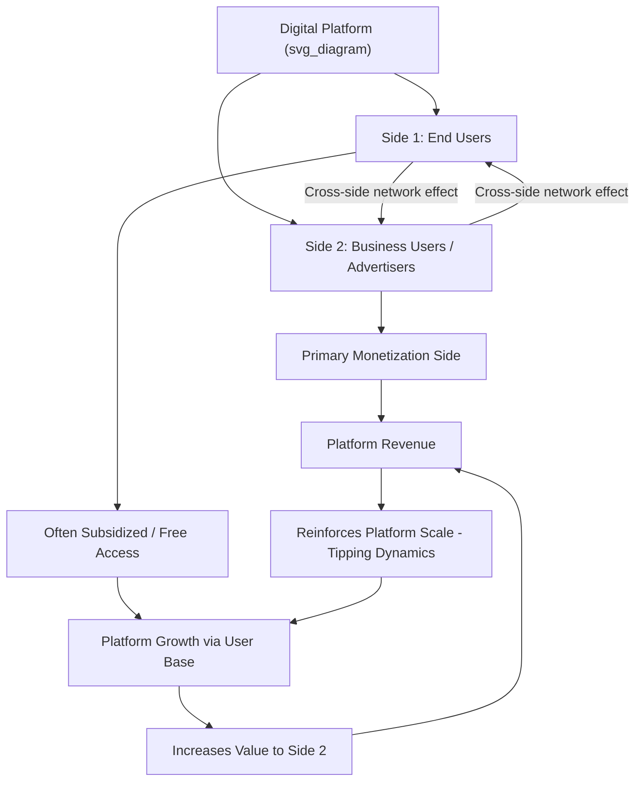

## Economic Analysis of Digital Platform Regulation

### Overview and Economic Distinctiveness of Platform Markets

Digital platform regulation addresses the distinctive competition and consumer-protection challenges posed by multi-sided markets — businesses whose core economic function is intermediating interactions between two or more distinct user groups (e.g., search engines connecting advertisers and searchers; app stores connecting developers and consumers; social networks connecting users and advertisers). The economic analysis of platform regulation draws on the theory of two-sided markets (Rochet and Tirole 2003, 2006) combined with traditional industrial organization and antitrust economics, adapted to features that make digital platforms structurally distinct from conventional single-sided markets.

**Key Points**

- Platforms exhibit **cross-side network effects**: the value of the platform to one user group depends on the number and quality of participants on the other side (more searchers make a search engine more valuable to advertisers, and vice versa).
- Platforms often adopt **skewed pricing structures** — subsidizing or offering free access to one side (e.g., consumers) while monetizing the other side (e.g., advertisers) — a pattern that standard single-market antitrust tools (e.g., price-based dominance tests) can misread as predatory or anticompetitive when it may simply reflect efficient two-sided pricing.
- These features can generate **tipping dynamics**, where strong network effects push a market toward a single dominant platform, raising distinct concerns about durable market power and barriers to entry that traditional merger and conduct analysis were not originally designed to address.

### The Multi-Sided Market Framework

$$\pi_{platform} = \sum_{i=1}^{n} p_i \cdot D_i(p_i, N_{-i})$$

where $D_i$ is demand on side $i$, which depends not only on the price $p_i$ charged to side $i$ but also on $N_{-i}$, the number of participants on the other side(s) of the platform — the defining structural feature distinguishing platform pricing analysis from single-sided market analysis.

**Key Points**

- The Rochet-Tirole framework demonstrates that the *privately optimal* price structure across sides need not align with the *socially optimal* structure, since a profit-maximizing platform internalizes cross-side network externalities only partially, creating a distinct rationale for regulatory attention to platform pricing structure (not merely price level).
- Standard antitrust market-definition tools (e.g., the SSNIP test — "small but significant non-transitory increase in price") require substantial adaptation for multi-sided markets, since raising price on one side while holding the other constant can reduce, rather than increase, platform profit due to cross-side effects — a point emphasized in *Ohio v. American Express* (2018), a major U.S. Supreme Court case addressing two-sided market antitrust analysis in the context of credit card networks.

### Diagram: Two-Sided Platform Structure (svg_diagram)

### Sources of Platform Market Power

#### 1. Network Effects and Tipping

Strong cross-side and same-side network effects can cause a market to "tip" toward a single dominant platform even absent superior underlying quality, since users rationally join the platform with the largest existing user base, creating a self-reinforcing dynamic that raises barriers to entry for potential rivals.

#### 2. Data Advantages and Learning Effects

Incumbent platforms accumulate user data that can improve product quality (better search results, better ad targeting, better recommendation algorithms) over time, potentially creating a data-driven advantage that is difficult for entrants to replicate without an initial user base — though the precise economic magnitude of "data network effects" as a distinct barrier to entry (separate from ordinary scale economies) remains an actively studied and debated empirical question.

#### 3. Switching Costs and Multi-Homing Frictions

Users may face switching costs (data portability friction, learned interface familiarity, social network lock-in) that reduce the competitive discipline that would otherwise come from users being able to costlessly switch or "multi-home" (use multiple competing platforms simultaneously).

#### 4. Vertical Integration and Self-Preferencing

Platforms that both operate a marketplace and compete as a participant within that marketplace (e.g., an app store operator that also sells its own apps, or a search engine that also offers its own comparison-shopping service) face a structural incentive to favor their own offerings — the "self-preferencing" concern central to several major recent enforcement actions.

### Regulatory Approaches: Ex Post Antitrust Versus Ex Ante Regulation

**Key Points**

- Traditional competition law is **ex post**: enforcement occurs after conduct is alleged to have caused competitive harm, requiring case-by-case proof of anticompetitive effect, typically through lengthy litigation.
- A significant recent regulatory trend — most prominently the EU's **Digital Markets Act (DMA)**, which entered into force in 2022 — shifts toward **ex ante** regulation: pre-specified behavioral obligations imposed on designated "gatekeeper" platforms meeting defined size/reach thresholds, without requiring proof of harm in each instance.
- The economic trade-off between these approaches centers on **Type I versus Type II error costs**: ex post enforcement risks under-deterrence and slow remedy given the pace of digital market evolution (tipping can occur before litigation concludes), while ex ante rules risk over-inclusive constraints on efficient business conduct that was never actually anticompetitive, since bright-line thresholds cannot perfectly distinguish welfare-reducing from welfare-neutral or welfare-enhancing platform conduct.

$$\text{Total Regulatory Error Cost} = P(\text{Type I}) \times \text{Cost}_{overdeter} + P(\text{Type II}) \times \text{Cost}_{underdeter}$$

### The EU Digital Markets Act: Structure and Current Enforcement

The DMA designates large platforms meeting specified thresholds (active user counts, market capitalization, and other criteria) as "gatekeepers" subject to a defined list of ex ante obligations and prohibitions, including anti-steering rules (prohibiting platforms from blocking business users from directing customers to alternative purchasing channels), interoperability requirements, and restrictions on self-preferencing and data combination practices.

The Commission fined Apple €500 million in April 2025 for infringing the DMA's anti-steering obligation, which is meant to stop platforms from blocking or penalizing business users who want to tell customers about cheaper offers elsewhere. Meta was also fined for DMA breaches around the same period, and the Commission has additionally initiated specification proceedings to help Google come into compliance with its DMA obligations. In November 2025, the Commission launched parallel market investigations into Amazon Web Services and Microsoft Azure, citing gatekeeper-like features including high entry barriers, significant enterprise switching costs, vertical integration across SaaS/AI/developer tools, and a central structural role in the AI infrastructure stack. [Making the DMA Bite: What Two Years of Enforcement Teaches Us About the Future of Digital Regulation - The Platform Law Blog +2](https://the-platform-law.com/2026/05/15/making-the-dma-bite-what-two-years-of-enforcement-teaches-us-about-the-future-of-digital-regulation/)

Under Article 53 of the DMA, the European Commission is required to conduct a formal review of the legislation by May 3, 2026, repeating the review process every three years thereafter. The Commission's April 2026 review concluded that the DMA remains fit for purpose and was designed to be future-proof, capable of adapting to emerging challenges arising from artificial intelligence and cloud computing. [German Marshall Fund](https://www.gmfus.org/news/eus-digital-markets-act-and-digital-services-act)[Everyday IT](https://www.ai-infra-link.com/how-to-govern-platforms-without-slowing-innovation/)

### Empirical Evidence on Platform Regulation Effects

A central empirical question is whether ex ante digital competition regulation achieves its stated pro-competitive goals or generates unintended costs. A 2025 study found that digital regulations have been associated with increased market concentration and a decline in startup investment — the opposite of what the DMA was designed to achieve, suggesting the regulation may be raising barriers or creating uncertainty that discourages new entrants. [Unverified: this represents one strand of empirical findings in an actively contested and rapidly evolving research area; given the field's recency, cite specific studies directly and check for updated results before relying on any single finding as consensus.] [Everyday IT](https://www.ai-infra-link.com/how-to-govern-platforms-without-slowing-innovation/)

Critics of the ex ante regulatory approach more broadly argue that digital competition regulations, while ostensibly designed to protect competition, may in practice function more to redistribute economic power, protect less efficient competitors, and diminish the competitive advantages of dominant digital platforms than to enhance consumer welfare — a normatively contested characterization reflecting one side of an active policy debate rather than a settled empirical conclusion. [Laweconcenter](https://laweconcenter.org/spotlights/digital-competition-regulations-around-the-world/)

### Diagram: Ex Ante vs. Ex Post Regulatory Trade-off (svg_diagram)

<svg xmlns="http://www.w3.org/2000/svg" viewBox="0 0 680 300">
<text x="340" y="28" text-anchor="middle" font-size="16" font-weight="bold" fill="#1a1a1a">Ex Ante vs. Ex Post Platform Regulation (svg_diagram)</text>
<rect x="40" y="60" width="270" height="90" rx="6" fill="#e8f1fa" stroke="#2166ac" stroke-width="2" />
<text x="175" y="85" text-anchor="middle" font-size="13" font-weight="bold">Ex Post Antitrust</text>
<text x="175" y="105" text-anchor="middle" font-size="11">Case-by-case proof of harm</text>
<text x="175" y="122" text-anchor="middle" font-size="11">Slower, tailored, litigation-heavy</text>
<text x="175" y="139" text-anchor="middle" font-size="11">Risk: under-deterrence, tipping before remedy</text>
<rect x="370" y="60" width="270" height="90" rx="6" fill="#fdf0d5" stroke="#b8860b" stroke-width="2" />
<text x="505" y="85" text-anchor="middle" font-size="13" font-weight="bold">Ex Ante Regulation (DMA)</text>
<text x="505" y="105" text-anchor="middle" font-size="11">Pre-specified obligations for gatekeepers</text>
<text x="505" y="122" text-anchor="middle" font-size="11">Faster, rule-based, bright-line</text>
<text x="505" y="139" text-anchor="middle" font-size="11">Risk: over-inclusion, compliance uncertainty</text>
<rect x="190" y="200" width="300" height="70" rx="6" fill="#fce4e4" stroke="#b2182b" stroke-width="2" />
<text x="340" y="225" text-anchor="middle" font-size="12">Type I / Type II Error Trade-off</text>
<text x="340" y="245" text-anchor="middle" font-size="11">Optimal regulatory design minimizes</text>
<text x="340" y="260" text-anchor="middle" font-size="11">total expected error cost</text>
<line x1="175" y1="150" x2="300" y2="200" stroke="#333" stroke-width="1.5" marker-end="url(#f1)" />
<line x1="505" y1="150" x2="380" y2="200" stroke="#333" stroke-width="1.5" marker-end="url(#f1)" />
</svg>

### Global Regulatory Landscape

**Key Points**

- The DMA has served as a template studied and partially emulated by other jurisdictions, though approaches diverge substantially — the United States has relied primarily on traditional ex post antitrust litigation (e.g., ongoing federal antitrust cases against major platforms) rather than adopting comprehensive ex ante gatekeeper regulation, while various other jurisdictions have pursued intermediate approaches.
- Asia-Pacific competition regulators have shown continued commitment to tighter controls on major technology platforms, with merger control and big-tech scrutiny remaining active regional priorities. [jdsupra](https://www.jdsupra.com/topics/competition/antitrust-provisions/digital-platforms)
- [Inference] Given the pace of legislative and enforcement activity in this area, and material developments occurring on a near-monthly basis (as reflected in the sources reviewed here from late 2025 through mid-2026), any specific regulatory status should be verified against current sources before being relied upon, as this is an unusually fast-moving area of law and economics relative to most other topics in this syllabus.

### Court Doctrine Affecting Platform Interoperability

In a landmark 2025 ruling in the Android Auto case, the Court held that the traditional Bronner essential-facilities criteria do not apply to a dominant company's refusal to allow a third party to interoperate with its digital platform, where that digital infrastructure was developed not solely for the dominant company's own business but with a view to enabling third-party use — a ruling that appears to limit the relevance of the essential facilities doctrine specifically in digital markets, with potentially significant implications for future interoperability-mandate litigation involving dominant platforms. [Quinn Emanuel](https://www.quinnemanuel.com/the-firm/publications/client-alert-key-eu-competition-law-developments-2025-overview-and-2026-predictions/)[Quinn Emanuel](https://www.quinnemanuel.com/the-firm/publications/client-alert-key-eu-competition-law-developments-2025-overview-and-2026-predictions/)

### Economic Tools for Platform Market Analysis

| Tool | Traditional Application | Platform-Specific Adaptation |
| --- | --- | --- |
| SSNIP test (market definition) | Price increase on the single relevant market | Must account for cross-side demand effects (Ohio v. Amex) |
| Herfindahl-Hirschman Index (HHI) | Market concentration measure | Requires side-specific or multi-market treatment given two-sided structure |
| Merger simulation models | Predict post-merger price effects | Must incorporate cross-side network externalities and indirect effects |
| Barriers-to-entry analysis | Capital costs, economies of scale | Must incorporate network-effect-driven tipping dynamics and data advantages |
| Consumer welfare standard | Price and output effects | Debated adequacy for "free" (zero-price) platform sides — attention/data as the relevant price |

### Applications and Case Studies

- **App store commission and anti-steering litigation**: economic analysis of whether mandatory in-app purchase systems and commission structures reflect efficient platform monetization or anticompetitive foreclosure of alternative payment/distribution channels.
- **Self-preferencing in search and e-commerce**: economic modeling of vertical integration incentives when a platform operator competes with participants on its own marketplace (search engines favoring proprietary comparison-shopping results; marketplace operators favoring private-label products).
- **Data portability and interoperability mandates**: economic assessment of whether mandated interoperability (e.g., messaging interoperability requirements under the DMA) meaningfully lowers switching costs and network-effect-driven entry barriers, or imposes compliance costs disproportionate to competitive benefit.
- **Algorithmic pricing and platform-set terms**: economic and legal analysis of platforms' unilateral ability to set terms (commission rates, ranking algorithms) for participants who depend on the platform for market access, and whether this constitutes a distinct form of market power requiring regulatory response beyond conventional price-fixing or monopolization doctrine.

### Related Topics

- Two-sided market theory (Rochet-Tirole) and platform pricing structure
- EU Digital Markets Act gatekeeper obligations and enforcement
- Ohio v. American Express and two-sided market antitrust doctrine
- Essential facilities doctrine and platform interoperability mandates
- Network effects, tipping, and barriers to entry in digital markets
- Ex ante versus ex post regulatory design and error-cost analysis
- Self-preferencing and vertical integration in platform markets
- International trade law and economic analysis
- Comparative corporate governance systems
- Empirical methods for evaluating digital regulation effects on innovation and entry