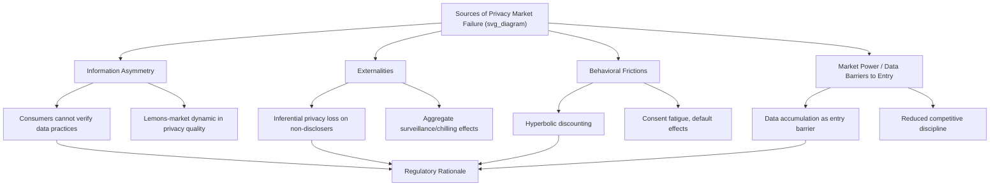

## Data Privacy Law and Economic Trade-offs

### Overview and Core Economic Framing

Data privacy law and economics analyzes personal data as an economic good with unusual properties — non-rivalrous in use, subject to significant externalities, and characterized by persistent information asymmetries between data subjects and data collectors — and evaluates how legal rules governing its collection, use, and transfer affect welfare, innovation incentives, and market competition. The field sits at the intersection of information economics, industrial organization, and behavioral economics, addressing why unregulated data markets may fail to produce privacy-protective outcomes even when individuals value privacy.

**Key Points**

- Personal data functions economically as an input to multiple downstream products (targeted advertising, credit scoring, AI model training, price discrimination), meaning privacy regulation is simultaneously a consumer-protection issue and an industrial-organization/innovation-policy issue.
- The core economic tension is between the **private and social benefits of data flows** (improved products, personalization, research and AI development, reduced search/matching costs) and the **private and social costs** (surveillance harms, discrimination risk, security breach exposure, chilling effects on expression and behavior).
- Privacy law is a rapidly evolving area globally; specific current requirements should be verified against primary regulatory sources given the pace of legislative and enforcement change.

### The Privacy Paradox and Behavioral Foundations

A well-documented empirical regularity in privacy economics is the **privacy paradox**: individuals report valuing privacy highly in surveys but frequently disclose personal data readily in exchange for small, immediate benefits (discounts, convenience, free services), inconsistent with the stated valuation.

$$U_i = u(\text{immediate benefit}) - \delta \cdot E[\text{future privacy harm}]$$

**Key Points**

- Behavioral economics explanations emphasize **hyperbolic discounting** (immediate, salient benefits are overweighted relative to diffuse, uncertain future privacy costs), **bounded rationality** (consumers cannot realistically read or process the volume of privacy disclosures presented to them), and **default effects** (opt-out versus opt-in defaults substantially shape observed "revealed preference" for data sharing, independent of underlying true preference).
- [Inference] These behavioral findings are frequently invoked in the literature to justify departing from a pure notice-and-consent regulatory model, on the argument that observed consent under current disclosure regimes may not reliably reveal genuine informed preference — though the appropriate regulatory response to this critique (stricter opt-in defaults, substantive use restrictions, fiduciary duties) remains actively debated rather than settled.

### Market Failure Rationales for Privacy Regulation

#### 1. Information Asymmetry

Data subjects typically cannot observe or verify how their data will actually be used, stored, secured, or shared downstream — a classic information asymmetry that can lead to a "market for lemons" dynamic (Akerlof 1970) in which firms with poor data-security practices are indistinguishable from firms with strong practices, undermining the market's ability to reward better privacy practices with consumer preference.

#### 2. Externalities

Data disclosure by one individual can impose costs on others — most notably through **inferential privacy loss**, where data about one person (or a group of similar people) enables inferences about others who did not themselves disclose data (e.g., genetic data revealing information about biological relatives; social graph data revealing inferences about non-users).

$$\text{Social Cost of Disclosure}_i > \text{Private Cost of Disclosure}_i$$

when disclosure by $i$ generates negative externalities on third parties, implying privately optimal disclosure levels exceed the socially optimal level absent regulation — a standard externality argument for regulatory intervention.

#### 3. Market Power and Data as a Barrier to Entry

As addressed in the related literature on digital platform regulation, data accumulation by incumbent firms can function as a barrier to entry (a competitor lacking comparable data may be unable to match incumbent product quality), creating an additional competition-policy rationale for data-related regulation (data portability mandates, interoperability requirements) beyond pure consumer-protection concerns.

### Diagram: Privacy Market Failure Taxonomy (svg_diagram)

### Major Regulatory Frameworks and Their Economic Design Features

#### 1. GDPR (EU) — Comprehensive, Rights-Based Model

The General Data Protection Regulation establishes a comprehensive framework built on enumerated legal bases for processing (consent, contract necessity, legitimate interest, and others), data subject rights (access, erasure, portability), and substantial penalty exposure for violations. GDPR has now been in force for a decade as of May 2026, and Europe has issued a substantial volume of fines under the framework — 2025 alone saw roughly €2.3 billion in GDPR fines, marking continued year-over-year growth in enforcement intensity.

**Key Points**

- Economically, GDPR represents an **opt-in-oriented, ex ante regulatory model** — imposing compliance costs (legal basis documentation, data protection impact assessments, data protection officer requirements) regardless of whether any specific processing activity turns out to cause harm, trading off type-II error reduction (fewer undetected privacy harms) against compliance cost burden, particularly for smaller firms with less capacity to absorb fixed compliance costs.
- The EU's **Digital Omnibus** proposal, announced in late 2025, aims to simplify and align parts of the GDPR, the EU AI Act, and the ePrivacy framework, including narrowing certain obligations (such as records-of-processing-activity requirements) for smaller organizations — reflecting an explicit regulatory recognition of the compliance-cost concern and an attempt to rebalance it, particularly for organizations with fewer than 750 employees.
- The European Data Protection Board's coordinated enforcement priorities for 2025 focused specifically on the right to erasure under GDPR Article 17, reflecting how frequently this right is exercised in practice and how often disputes arise over its application.

#### 2. Sectoral/Patchwork Model — United States

The U.S. continues to have no comprehensive federal data privacy law, resulting in a growing state-level patchwork: as of mid-2026, comprehensive data privacy laws have been passed in 23 U.S. states, with additional states' legislation (including Alabama, Louisiana, Oklahoma, and Vermont) becoming enforceable within the following two years.

**Key Points**

- Economically, the U.S. sectoral/patchwork approach is often characterized as minimizing compliance costs for smaller firms relative to comprehensive frameworks like GDPR, but at the cost of regulatory fragmentation — multi-state operating firms face a growing complexity burden in maintaining compliance across divergent state requirements, a cost that itself may function as a barrier disproportionately affecting smaller entrants relative to large incumbents with greater compliance capacity.
- This fragmentation dynamic illustrates a general regulatory-design trade-off: reducing per-jurisdiction stringency does not necessarily reduce aggregate compliance cost if it instead multiplies the number of distinct regimes a multi-jurisdictional firm must satisfy simultaneously.

#### 3. Extraterritorial and Emerging-Market Frameworks

A growing number of jurisdictions have adopted GDPR-influenced frameworks with local variations: Brazil's LGPD closely aligns with GDPR structure; China's PIPL prioritizes national security considerations, imposing strict data localization requirements and a more limited "legitimate interest" processing basis than GDPR; India's Digital Personal Data Protection Act entered an enforcement-heavy phase following the release of operational rules in November 2025, requiring mandatory encryption, masking, tokenization, access controls, and extended activity-log retention; and Chile and Peru have adopted reformed legislation establishing GDPR-aligned frameworks with extraterritorial scope, with Peru imposing particularly stringent breach-notification requirements and both jurisdictions notably defining neurodata as sensitive personal data requiring the highest level of protection — an early regulatory response to emerging neurotechnology.

### The AI-Privacy Regulatory Convergence

A defining recent development is the increasing regulatory intersection between data privacy law and AI governance. The EU AI Act is phasing in on a staggered timeline: prohibited practices and general provisions are already in force, general-purpose AI obligations applied beginning in 2025, and high-risk system requirements are following in 2026 and 2027, with deadlines for high-risk systems used in contexts such as HR and employment having been pushed back to December 2027, while existing general-purpose AI models must comply with watermarking and labeling requirements for AI-generated content by December 2026.

**Key Points**

- Economically, this convergence reflects the recognition that AI training and deployment is fundamentally a large-scale data-processing activity, meaning privacy law's legal-basis and data-minimization requirements interact directly with AI development incentives — creating a live policy question about how to calibrate data protection principles for large language model training without unduly constraining beneficial AI innovation.
- The GDPR Omnibus reforms under discussion specifically address this by introducing new definitions for "scientific research" and clearer rules for training large language models, an explicit attempt to reconcile data protection principles with AI development activity — though as with other elements of the Omnibus package, the reforms had not been finalized as of the most recent available reporting, so their ultimate scope should be verified against final adopted text.

### Diagram: Regulatory Model Comparison (svg_diagram)

<svg xmlns="http://www.w3.org/2000/svg" viewBox="0 0 700 300">
<text x="350" y="28" text-anchor="middle" font-size="16" font-weight="bold" fill="#1a1a1a">Privacy Regulatory Models Compared (svg_diagram)</text>
<rect x="30" y="60" width="200" height="100" rx="6" fill="#e8f1fa" stroke="#2166ac" stroke-width="2" />
<text x="130" y="85" text-anchor="middle" font-size="12" font-weight="bold">GDPR (EU)</text>
<text x="130" y="105" text-anchor="middle" font-size="10">Comprehensive, rights-based</text>
<text x="130" y="120" text-anchor="middle" font-size="10">High compliance cost</text>
<text x="130" y="135" text-anchor="middle" font-size="10">Strong enforcement, high fines</text>
<rect x="250" y="60" width="200" height="100" rx="6" fill="#fdf0d5" stroke="#b8860b" stroke-width="2" />
<text x="350" y="85" text-anchor="middle" font-size="12" font-weight="bold">US State Patchwork</text>
<text x="350" y="105" text-anchor="middle" font-size="10">Sectoral, fragmented</text>
<text x="350" y="120" text-anchor="middle" font-size="10">23+ state laws, growing</text>
<text x="350" y="135" text-anchor="middle" font-size="10">Multi-jurisdiction complexity cost</text>
<rect x="470" y="60" width="200" height="100" rx="6" fill="#fce4e4" stroke="#b2182b" stroke-width="2" />
<text x="570" y="85" text-anchor="middle" font-size="12" font-weight="bold">China PIPL</text>
<text x="570" y="105" text-anchor="middle" font-size="10">National security priority</text>
<text x="570" y="120" text-anchor="middle" font-size="10">Strict data localization</text>
<text x="570" y="135" text-anchor="middle" font-size="10">Limited legitimate-interest basis</text>
<rect x="150" y="210" width="400" height="60" rx="6" fill="#f0f0f0" stroke="#666" stroke-width="2" />
<text x="350" y="235" text-anchor="middle" font-size="12">Common Trade-off:</text>
<text x="350" y="253" text-anchor="middle" font-size="11">Compliance Cost vs. Harm Prevention vs. Innovation Incentive</text>
<line x1="130" y1="160" x2="280" y2="210" stroke="#333" stroke-width="1.5" marker-end="url(#g1)" />
<line x1="350" y1="160" x2="350" y2="210" stroke="#333" stroke-width="1.5" marker-end="url(#g1)" />
<line x1="570" y1="160" x2="420" y2="210" stroke="#333" stroke-width="1.5" marker-end="url(#g1)" />
</svg>

### Economic Analysis of Specific Regulatory Instruments

| Instrument | Economic Rationale | Key Trade-off |
| --- | --- | --- |
| Consent/opt-in requirements | Corrects information asymmetry, restores individual control | Consent fatigue may render consent uninformative in practice; compliance cost |
| Data minimization mandates | Limits externality and breach-exposure risk directly at the source | May constrain beneficial secondary uses (research, AI training, fraud detection) |
| Data portability rights | Reduces switching costs, addresses data-driven entry barriers | Implementation and interoperability cost; potential security risk in data transfer |
| Breach notification requirements | Corrects information asymmetry about firm security quality post hoc | Notification fatigue may reduce marginal informational value over time |
| Purpose limitation rules | Prevents unanticipated secondary uses inconsistent with original consent context | Can constrain beneficial data reuse (e.g., for public health research, AI development) |
| Algorithmic/automated-decision-making rights | Addresses opacity and potential discriminatory effect of automated processing | Interacts directly with AI Act risk-tiering; compliance complexity where GDPR and AI Act obligations overlap |

### Cross-Border Data Flow Economics

**Key Points**

- Data localization requirements (mandating that data about a jurisdiction's residents be stored or processed within that jurisdiction) are economically analyzed similarly to other trade barriers — potentially serving legitimate privacy, security, or law-enforcement-access goals, but imposing compliance costs analogous to non-tariff trade barriers, including duplicated infrastructure costs and reduced economies of scale in data processing.
- The tension between facilitating beneficial cross-border data flows (enabling global digital trade and service delivery) and legitimate jurisdiction-specific privacy/security concerns parallels the broader trade-law analysis of regulatory harmonization versus regulatory sovereignty discussed in international trade law.
- Adequacy-decision mechanisms (as under GDPR, permitting data transfer to jurisdictions deemed to provide "adequate" protection) function economically as a form of mutual recognition, reducing transfer-specific compliance costs relative to case-by-case contractual safeguard mechanisms, at the cost of requiring underlying substantive convergence in privacy standards to qualify.

### Empirical Research Directions

- **Compliance cost studies**: empirical estimation of GDPR-style compliance costs across firm size, testing whether fixed compliance costs disproportionately burden smaller entrants relative to large incumbents (with implications parallel to the digital-platform-regulation entry-barrier literature).
- **Innovation effect studies**: difference-in-differences and event-study designs estimating the effect of privacy regulation adoption (e.g., GDPR's 2018 implementation) on venture investment, app development activity, and AI model training practices in affected jurisdictions relative to unaffected comparison jurisdictions.
- **Price and product-quality effects**: studies estimating how privacy regulation affects advertising-supported product pricing and quality, given that restricting data collection can reduce targeted-advertising effectiveness and thus advertising revenue supporting "free" digital services.
- **Behavioral experiment literature**: randomized experiments testing how consent-interface design (opt-in versus opt-out defaults, disclosure format, "dark pattern" interface design) affects actual disclosure behavior, informing the empirical basis for the behavioral-economics critique of notice-and-consent regulatory models.

### Related Topics

- Economic analysis of digital platform regulation
- Information asymmetry and the market for lemons (Akerlof)
- Behavioral economics of consumer decision-making and default effects
- EU AI Act risk-tiered regulatory framework
- Data portability and interoperability as competition remedies
- Cross-border data flows and international trade law analogies
- Algorithmic discrimination and automated decision-making regulation
- Breach notification law and information-asymmetry correction
- Compliance cost economics and regulatory burden on small firms
- Data localization as a non-tariff trade barrier