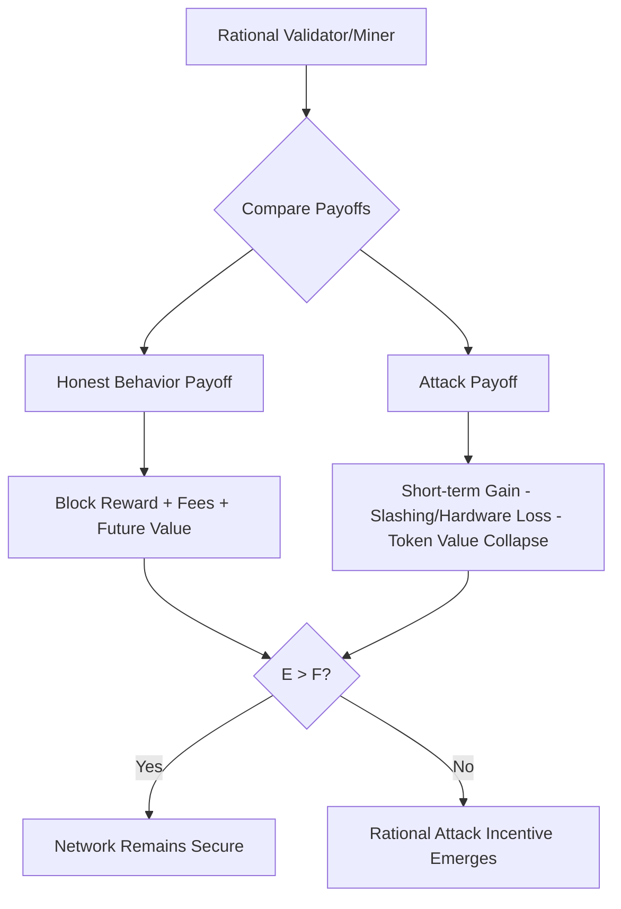

## Blockchain, Smart Contracts, and Economic Analysis


### Overview

Blockchain technology and smart contracts represent a shift in how economic transactions are executed, verified, and enforced. From a law and economics perspective, these technologies are best understood as institutional substitutes: they reduce certain transaction costs (verification, enforcement, trust-building) while introducing new ones (technical failure, code ambiguity, governance gaps). This topic applies core L&E tools—Coase theorem, transaction cost economics, contract theory, and property rights analysis—to distributed ledger systems.

### Foundational Concepts

#### Blockchain as a Trust Technology

A blockchain is a distributed, append-only ledger maintained across a network of nodes using cryptographic hashing and a consensus mechanism (e.g., Proof of Work, Proof of Stake). Economically, its core function is producing **verifiable, tamper-evident records without a centralized intermediary**.

**Key Points**

- Reduces reliance on trusted third parties (banks, registries, notaries) for verification
- Shifts trust from institutions to cryptographic and game-theoretic guarantees
- Creates an immutable audit trail, lowering monitoring costs in principal-agent relationships
- Introduces new costs: energy consumption (PoW), validator concentration risk (PoS), and irreversible errors

#### Smart Contracts Defined

A smart contract is self-executing code deployed on a blockchain that automatically enforces agreed terms when predefined conditions are met. Nick Szabo's original framing (1994) described them as digital protocols that embed contractual clauses into hardware/software to minimize the need for trusted intermediaries.

**Key Points**

- Not necessarily "smart" (no AI/judgment) and not always legally a "contract"
- Execution is deterministic: `if condition X is true, then execute action Y`
- Enforcement is automatic and computational rather than judicial
- Immutability post-deployment is common but not universal (upgradeable proxy patterns exist)

### Law and Economics Framework

#### Transaction Cost Economics (Coase, Williamson)

Ronald Coase's insight is that institutions exist to economize on transaction costs: search costs, bargaining costs, and enforcement costs. Smart contracts can be modeled as a technology that compresses these costs, particularly enforcement.

$$TC = TC_{search} + TC_{bargain} + TC_{enforce}$$

Smart contracts primarily target $TC_{enforce}$, automating performance so that breach becomes technically difficult or impossible (a "self-help" enforcement mechanism), rather than relying on ex post litigation.

**Key Points**

- Traditional contracts rely on courts for costly ex post enforcement
- Smart contracts front-load enforcement into code, reducing reliance on judicial systems
- This works well for verifiable, objective conditions (e.g., "if payment received, release goods")
- It works poorly for conditions requiring subjective interpretation (good faith, reasonableness, force majeure)

#### The Coase Theorem and On-Chain Bargaining

Coase's theorem holds that, absent transaction costs, parties will bargain to an efficient outcome regardless of initial entitlement allocation. Blockchain's low-cost, borderless settlement layer can be seen as approximating the "zero transaction cost" condition for certain classes of exchange (especially digital asset transfers), while smart contracts reduce the cost of specifying and enforcing the bargain.

[Inference] In practice, gas fees, network congestion, and MEV (Maximal Extractable Value) reintroduce meaningful transaction costs, so blockchain markets do not achieve a literal zero-transaction-cost equilibrium; this remains an empirically contested area.

#### Incomplete Contract Theory

Contract theory (Grossman-Hart-Moore) recognizes that real-world contracts are inherently incomplete—parties cannot foresee or specify every contingency. This creates a fundamental tension with smart contracts:

**Key Points**

- Code requires ex ante specification of all triggering conditions; ambiguity is intolerable to a machine
- Natural language contracts tolerate ambiguity, resolved ex post by courts using interpretive doctrines (good faith, custom, reasonableness)
- "Code is law" (a phrase associated with Lawrence Lessig and later crypto-libertarian discourse) implies contract completeness that is often economically infeasible
- Hybrid solutions ("Ricardian contracts") attach legal prose to code to bridge this gap

#### Property Rights and Tokenization

Blockchain enables the tokenization of property rights—representing ownership claims (equity, real estate, commodities) as transferable digital tokens. This relates to Demsetz's theory of property rights emergence: property rights arise when the benefits of internalizing externalities exceed the costs of establishing and enforcing them.

**Key Points**

- Tokenization can lower the cost of fractionalizing and transferring ownership (e.g., real estate, art)
- Clear on-chain title reduces disputes over ownership provenance
- Legal recognition of token ownership as equivalent to underlying asset ownership remains jurisdictionally inconsistent
- Double-spending problem solved computationally (via consensus) rather than legally

### Economic Analysis of Consensus Mechanisms

#### Proof of Work (PoW)

Miners compete to solve a computationally expensive puzzle; the winner appends the next block and receives a block reward plus transaction fees.

$$\text{Expected Miner Profit} = p_i \cdot R - C_i$$

Where $p_i$ is miner $i$'s probability of winning (proportional to hash power share), $R$ is the block reward plus fees, and $C_i$ is the cost of computation (electricity, hardware).

**Key Points**

- Security derives from the cost of a 51% attack exceeding its expected benefit
- Creates a real resource cost (energy) as the price of decentralized trust—an externality often criticized on environmental economics grounds
- Analogous to a "tournament" model in labor economics: many compete, one wins

#### Proof of Stake (PoS)

Validators are selected to propose/validate blocks in proportion to capital staked, with slashing penalties for misbehavior.

**Key Points**

- Replaces resource cost (energy) with capital-at-risk as the security mechanism
- Raises different economic concerns: wealth concentration ("rich get richer"), validator cartelization
- Slashing functions economically like a performance bond or deposit in principal-agent theory—it aligns validator incentives with honest behavior

#### Game-Theoretic Security

Blockchain security models are Nash equilibrium constructions: honest participation must be a dominant or best-response strategy for the majority of economic weight (hash power or stake) in the system.



### Smart Contracts: Legal and Economic Enforceability

#### Contract Formation Doctrine

For a smart contract to be a legally enforceable contract (not merely a self-executing script), it typically must still satisfy traditional elements: offer, acceptance, consideration, and mutual assent (capacity and legality).

**Key Points**

- Courts in several jurisdictions (e.g., U.S. under UETA/E-SIGN, UK Jurisdiction Taskforce 2019 statement) have signaled that code-based agreements can satisfy contract formation requirements
- The "signature" requirement can be satisfied by cryptographic wallet signing
- Ambiguity remains regarding capacity (can a DAO or bot have contractual capacity?) and mistake/unconscionability doctrines when code executes "correctly" but produces an unintended/unfair result (e.g., a bug leading to catastrophic loss)

#### The Oracle Problem

Smart contracts cannot natively access off-chain data (prices, weather, shipment status) and depend on oracles—third-party data feeds bridging on-chain and off-chain information.

**Key Points**

- Reintroduces a trusted intermediary problem the blockchain was meant to eliminate
- Creates a single point of failure/manipulation risk (oracle attacks, e.g., flash-loan-enabled price manipulation)
- Economically, this is a principal-agent problem: the oracle provider's incentives must be aligned (often via staking/slashing, as in Chainlink's design) with accurate reporting

```mermaid
sequenceDiagram
    participant Off-chain Data Source
    participant Oracle Network
    participant Smart Contract
    participant Counterparties
    Off-chain Data Source->>Oracle Network: Real-world data (price, event outcome)
    Oracle Network->>Oracle Network: Aggregate & validate (staking incentives)
    Oracle Network->>Smart Contract: Submit data on-chain
    Smart Contract->>Smart Contract: Evaluate condition (if/then logic)
    Smart Contract->>Counterparties: Execute transfer/settlement automatically
```

#### Immutability and the Efficient Breach Doctrine

Classical L&E theory (Posner) argues efficient breach is socially desirable: a party should breach and pay damages when the cost of performance exceeds the benefit to the counterparty, reallocating resources efficiently.

**Key Points**

- Immutable smart contracts structurally foreclose efficient breach—code executes regardless of whether performance remains efficient given changed circumstances
- This can produce economically inefficient lock-in (e.g., forced execution during extreme market volatility, as seen in DeFi liquidation cascades)
- Some designs incorporate governance overrides, multisig "kill switches," or upgradeable contracts to restore flexibility, at the cost of reintroducing centralization and counterparty trust

#### Case Study: The DAO Hack (2016)

**Example**

The DAO, an Ethereum-based venture fund, suffered a $60M exploit due to a reentrancy vulnerability. The Ethereum community responded with a hard fork to reverse the theft, splitting the chain into Ethereum (ETH) and Ethereum Classic (ETC).

- **Economic lesson**: "Code is law" was revealed to be a social/political choice, not an inevitability—when code output diverged sharply from perceived fairness, human governance intervened
- **L&E lesson**: illustrates the limits of complete contracting; the code was "correctly" executed per its literal terms but failed to reflect the parties' actual bargain, echoing Grossman-Hart-Moore's incomplete contracts problem
- Raises a normative question analogous to *mistake* doctrine in contract law: should exploiting a code vulnerability be treated as breach, theft, or valid performance?

### Decentralized Finance (DeFi) and Market Microstructure

#### Automated Market Makers (AMMs)

DeFi protocols like Uniswap replace order-book exchanges with algorithmic pricing via a constant product formula:

$$x \cdot y = k$$

Where $x$ and $y$ are reserve quantities of two assets and $k$ is held constant; price is determined by the reserve ratio.

**Key Points**

- Eliminates the need for a centralized market maker or specialist, reducing intermediation costs
- Introduces "impermanent loss"—a cost borne by liquidity providers when relative asset prices diverge—analogous to adverse selection cost in market-making theory
- Price discovery is mechanical rather than driven by dealer inventory/information, raising questions about efficiency relative to traditional order-book markets

#### Maximal Extractable Value (MEV)

MEV refers to profit extracted by block producers/validators through transaction ordering (front-running, sandwich attacks, arbitrage).

**Key Points**

- A negative externality economically analogous to rent-seeking: value extracted from ordinary users without producing new value
- Functions as a hidden tax on transactions, reintroducing transaction costs the blockchain was designed to minimize
- Regulatory and mechanism-design responses (e.g., MEV-Boost, encrypted mempools, fair ordering protocols) represent attempts at internalizing this externality

### Regulatory and Institutional Economics Perspective

#### Regulatory Arbitrage

Decentralization complicates the application of jurisdiction-based regulation (securities law, AML/KYC, consumer protection).

**Key Points**

- Howey Test (U.S.) analysis of whether a token constitutes a security hinges on "efforts of others"—a factor complicated by decentralized, code-governed systems
- Regulatory uncertainty itself imposes a transaction cost, chilling investment and innovation ([Inference] the magnitude of this chilling effect is debated among economists and varies significantly by jurisdiction and time period)
- DAOs raise novel questions of legal personhood, liability allocation among token holders, and enforceability of on-chain governance votes

#### Public Goods and Blockchain Governance

Blockchain protocol development (especially open-source base layers) exhibits public goods characteristics: non-excludable, non-rivalrous improvements benefit the entire network.

**Key Points**

- Classic free-rider problem: individual developers/miners underinvest in protocol security/improvements relative to social optimum
- Mechanisms like protocol treasuries, retroactive public goods funding (e.g., Optimism's RPGF), and token-based governance attempt to solve this via Ostrom-style commons governance rather than pure market or state provision

### Comparative Framework: Traditional Contracts vs. Smart Contracts

| Dimension | Traditional Contract | Smart Contract |
| --- | --- | --- |
| Enforcement mechanism | Courts, ex post litigation | Code execution, ex ante automation |
| Interpretation | Flexible (judicial discretion, custom, good faith) | Rigid (literal code execution) |
| Handling of incompleteness | Gap-filling by courts/default rules | Requires exhaustive ex ante specification or oracle/governance patches |
| Breach remedy | Damages, specific performance, efficient breach possible | Often technically prevents breach; efficient breach may be foreclosed |
| Intermediary reliance | High (banks, notaries, registries) | Low, but shifted to oracles/validators |
| Error correction | Reformation, rescission, equitable remedies | Difficult/impossible absent upgradeability or hard fork |
| Primary transaction cost reduced | N/A (baseline) | Enforcement and verification costs |
| Primary transaction cost introduced | N/A (baseline) | Technical risk, oracle risk, governance risk |

### Illustrative Diagram: Transaction Cost Shift

<svg viewBox="0 0 720 380" xmlns="http://www.w3.org/2000/svg">
<text x="360" y="30" text-anchor="middle" font-size="18" font-weight="bold" fill="#1a1a2e">Transaction Cost Reallocation: Traditional vs. Blockchain-Based Exchange (svg_diagram)</text>

<text x="180" y="65" text-anchor="middle" font-size="14" font-weight="bold" fill="`#16213e`">Traditional Contracting</text>

<rect x="40" y="80" width="280" height="50" rx="6" fill="`#e8eaf6`" stroke="`#3f51b5`" stroke-width="1.5"/>

<text x="180" y="110" text-anchor="middle" font-size="12" fill="`#1a1a2e`">Search & Bargaining Costs</text>

<rect x="40" y="145" width="280" height="50" rx="6" fill="#e8eaf6" stroke="#3f51b5" stroke-width="1.5"/>
<text x="180" y="175" text-anchor="middle" font-size="12" fill="#1a1a2e">Drafting &amp; Legal Review Costs</text>
<rect x="40" y="210" width="280" height="50" rx="6" fill="#ffebee" stroke="#c62828" stroke-width="2"/>
<text x="180" y="240" text-anchor="middle" font-size="12" fill="#1a1a2e">High Enforcement Costs (courts)</text>
<rect x="40" y="275" width="280" height="50" rx="6" fill="#e8eaf6" stroke="#3f51b5" stroke-width="1.5"/>
<text x="180" y="305" text-anchor="middle" font-size="12" fill="#1a1a2e">Intermediary/Trust Costs</text>

<text x="540" y="65" text-anchor="middle" font-size="14" font-weight="bold" fill="`#16213e`">Smart-Contract-Based Exchange</text>

<rect x="400" y="80" width="280" height="50" rx="6" fill="`#e8eaf6`" stroke="`#3f51b5`" stroke-width="1.5"/>

<text x="540" y="110" text-anchor="middle" font-size="12" fill="`#1a1a2e`">Search & Bargaining Costs</text>

<rect x="400" y="145" width="280" height="50" rx="6" fill="#fff3e0" stroke="#ef6c00" stroke-width="2"/>
<text x="540" y="168" text-anchor="middle" font-size="12" fill="#1a1a2e">Smart Contract Coding &amp;</text>
<text x="540" y="184" text-anchor="middle" font-size="12" fill="#1a1a2e">Audit Costs (new)</text>
<rect x="400" y="210" width="280" height="50" rx="6" fill="#e8f5e9" stroke="#2e7d32" stroke-width="2"/>
<text x="540" y="240" text-anchor="middle" font-size="12" fill="#1a1a2e">Low Enforcement Costs (automated)</text>
<rect x="400" y="275" width="280" height="50" rx="6" fill="#fff3e0" stroke="#ef6c00" stroke-width="2"/>
<text x="540" y="298" text-anchor="middle" font-size="12" fill="#1a1a2e">Oracle &amp; Consensus/Validator</text>
<text x="540" y="314" text-anchor="middle" font-size="12" fill="#1a1a2e">Costs (shifted, not eliminated)</text>
<line x1="320" y1="235" x2="400" y2="235" stroke="#333" stroke-width="2" marker-end="url(#arrow)"/>
<defs>
<marker id="arrow" markerWidth="10" markerHeight="10" refX="8" refY="3" orient="auto" markerUnits="strokeWidth">
<path d="M0,0 L0,6 L9,3 z" fill="#333"/>
</marker>
</defs>

<text x="360" y="360" text-anchor="middle" font-size="11" font-style="italic" fill="#555">Enforcement cost falls sharply; new technical/oracle costs partially offset gains</text>

</svg>

### Worked Example: Efficiency Analysis of an Escrow Smart Contract

**Example**

Consider a cross-border trade transaction where a buyer and seller do not trust each other. Traditional escrow requires a bank or third-party escrow agent charging a fee $F_{escrow}$ and imposing a delay $t_{escrow}$.

A smart contract escrow instead locks buyer funds and releases them automatically upon oracle-verified proof of shipment delivery.

Efficiency comparison:

$$\text{Net Surplus}_{traditional} = V - F_{escrow} - C_{delay}(t_{escrow})$$


$$\text{Net Surplus}_{smart} = V - F_{gas} - F_{oracle} - C_{delay}(t_{smart}) - E[\text{Loss} \mid \text{oracle failure}] \cdot p_{failure}$$

Where $V$ is the transaction value, $F_{gas}$ is network transaction fees, $F_{oracle}$ is the oracle service fee, and the final term captures expected loss from oracle manipulation or failure.

**Conclusion**: The smart contract is efficient relative to the traditional arrangement only when $F_{gas} + F_{oracle} + E[\text{Loss}] \cdot p_{failure} < F_{escrow}$ and $t_{smart} < t_{escrow}$. [Inference] Empirically, this condition holds more reliably for high-value, digitally-verifiable transactions than for transactions requiring physical-world verification, since oracle risk scales with the difficulty of digitizing the relevant real-world fact.

### Critiques and Open Debates

**Key Points**

- **Libertarian/Austrian view**: blockchain reduces state monopoly on money and contract enforcement, lowering Leviathan-style rent extraction (associated with thinkers influenced by Hayek's "denationalization of money")
- **Institutionalist critique**: Trust and enforcement historically rely on repeated-game reputation and state coercive power; code cannot fully substitute for these, especially for judgment-laden disputes (North's institutional economics)
- **Behavioral economics critique**: users systematically underestimate technical/security risk (private key loss, smart contract bugs), a form of the overconfidence bias well-documented in behavioral finance literature
- **Distributional concerns**: PoW/PoS both risk concentrating economic power (mining pools, large stakers), potentially recreating the intermediary concentration blockchain sought to avoid

### Related Topics

- Coase Theorem and transaction cost economics (foundational)
- Incomplete contracts and the Grossman-Hart-Moore property rights approach
- Law and economics of intellectual property applied to open-source protocol development
- Behavioral law and economics: bounded rationality in DeFi user decision-making
- Antitrust and competition policy for blockchain validator/mining concentration
- Regulatory theory: optimal regulation under jurisdictional fragmentation (crypto-asset regulation)
- Mechanism design and auction theory applied to MEV and block-space markets
- Central Bank Digital Currencies (CBDCs) and monetary economics
- Corporate law: DAOs, legal personhood, and limited liability analogues
- Game theory: repeated games and folk theorems applied to validator cooperation