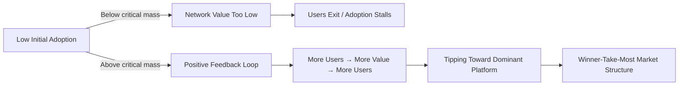

## Network Effects and Technology Market Regulation

### Overview

Network effects occur when a good or service becomes more valuable to each user as more people use it. In technology markets, this dynamic drives concentration, raises distinctive antitrust and regulatory questions, and challenges traditional law and economics tools built around static price theory. This topic applies industrial organization economics, antitrust doctrine, and regulatory theory to platforms, standards, and digital markets exhibiting network effects.

### Foundational Concepts

#### Defining Network Effects

A network effect (or network externality) exists when the utility a user derives from a good depends on the number of other users of that good or a compatible good.

$$U_i = f(q, n)$$

Where $U_i$ is user $i$'s utility, $q$ is the good's intrinsic quality, and $n$ is the number of other users/adopters, with $\partial U_i / \partial n > 0$.

**Key Points**

- Coined and formalized in economics by Katz and Shapiro (1985) in their analysis of network externalities and technology adoption
- Distinguished from economies of scale: network effects operate on the *demand side* (value to users), while scale economies operate on the *supply side* (cost to producers)
- Classic examples: telephone networks, fax machines, social media platforms, operating systems

#### Direct vs. Indirect Network Effects

**Key Points**

- **Direct network effects**: value increases directly with same-side users (e.g., messaging apps—more users of WhatsApp directly benefit other WhatsApp users)
- **Indirect network effects**: value increases via a complementary good or a different user group, typical of two-sided/multi-sided platforms (e.g., more drivers on a rideshare app attract more riders, and vice versa)
- Indirect effects are central to platform economics (Rochet and Tirole's two-sided markets framework)

#### Two-Sided and Multi-Sided Markets

A platform is two-sided when it enables interactions between two distinct user groups and the platform's pricing/design affects the volume of transactions by influencing participation on both sides.

$$\pi_{platform} = \sum_{i} \sum_{j} (p_i \cdot n_i(n_j)) - C$$

Where $n_i$ is the number of participants on side $i$, which depends on the number of participants on side $j$, and $p_i$ is the price charged to side $i$.

**Key Points**

- The Rochet-Tirole framework shows optimal platform pricing is often asymmetric: one side may be subsidized (even priced below marginal cost or free) to attract the other, more price-sensitive or valuable side
- Example: search engines charge advertisers (one side) while providing free search to users (other side), because user volume increases advertiser willingness to pay
- Traditional cost-based pricing analysis (e.g., predatory pricing tests) can misclassify efficient two-sided pricing as anticompetitive if it ignores cross-side effects

### Economic Mechanics of Network Markets

#### Critical Mass and Tipping

Network markets often exhibit a **critical mass threshold**: below it, the network struggles to grow or collapses; above it, self-reinforcing adoption ("tipping") drives rapid, often winner-take-most, outcomes.

**Key Points**

- Positive feedback loops can produce **multiple equilibria**: the same underlying technology can either fail or dominate depending on early adoption dynamics
- This creates path dependence—early, possibly arbitrary, advantages (timing, marketing, luck) can lock in a market leader independent of long-run product quality (echoes of the QWERTY keyboard debate in economic history, associated with Paul David and later contested by Liebowitz and Margolis)
- [Inference] The extent to which "lock-in" reflects genuine market failure versus efficient standardization is empirically contested and depends heavily on switching cost magnitude and the pace of innovation in the specific market

#### Switching Costs and Lock-In

Network markets frequently combine network effects with **switching costs**—the costs a user incurs when moving from one platform/standard to another (data migration, retraining, loss of accumulated network value).

$$SC_{total} = SC_{direct} + SC_{learning} + SC_{network\ loss}$$

**Key Points**

- $SC_{network\ loss}$ is unique to network markets: switching means losing access to the network of contacts/complements built on the incumbent platform
- High switching costs can allow incumbents to raise effective prices or degrade quality without triggering exit, a classic **lock-in** problem (Klemperer's switching cost economics)
- Regulatory responses include interoperability mandates and data portability requirements aimed at lowering $SC_{network\ loss}$

#### Standards Competition and Compatibility

Firms in network markets choose between **competing incompatible standards** (format wars, e.g., Betamax vs. VHS) and **compatible/open standards** (shared protocols, e.g., TCP/IP, USB).

**Key Points**

- Incompatible standards competition can produce excessive early investment ("penguin effect"—no one wants to be first, then a rush once a leader emerges) and duplicated sunk costs
- Compatibility (via industry consortia or mandated interoperability) can expand total market size by pooling network effects, but reduces firms' ability to differentiate and capture network-effect rents
- Antitrust treatment of interoperability refusals varies: essential facilities doctrine may apply if compatibility is necessary to compete, but courts are generally reluctant to impose broad interoperability duties absent clear anticompetitive intent

### Antitrust Analysis of Network Markets

#### Market Definition Challenges

Traditional antitrust market definition relies on the **SSNIP test** (Small but Significant Non-transitory Increase in Price) via the hypothetical monopolist framework. This is complicated in network markets, especially where a core product is priced at zero.

$$\text{SSNIP: would a 5-10\% price increase be profitable for a hypothetical monopolist?}$$

**Key Points**

- Zero-price products (many search engines, social networks, app platforms) make price-increase-based market definition inapplicable; agencies increasingly use quality, attention, or data-based substitutes (degradation SSNIP, or "SSNDQ"—small but significant non-transitory decrease in quality)
- Multi-sided platforms complicate market definition further: should each side be analyzed as a separate market, or should the platform be treated as a single market? (Central issue in *Ohio v. American Express*, 2018, U.S. Supreme Court)
- The Court in *Amex* held that credit card networks should be analyzed as a single two-sided transaction market rather than separately for merchants and cardholders, reflecting the need for antitrust doctrine to internalize cross-side network effects

#### Monopolization and Network-Effect-Driven Dominance

**Key Points**

- Network effects alone are not illegal; dominance achieved through superior products that happen to benefit from network effects is generally lawful (consistent with the *Grinnell* standard: willful acquisition/maintenance of monopoly power distinguished from growth via superior skill, foresight, or industry)
- Antitrust concern arises when a dominant firm leverages network-effect-driven power through **exclusionary conduct**: self-preferencing, tying, exclusive dealing, or strategic incompatibility designed to entrench dominance rather than compete on merits
- Refusal to deal / essential facilities claims arise when access to a network is argued to be necessary for competitors to reach viable scale (contested doctrinally after *Trinko*, 2004, which narrowed U.S. duty-to-deal obligations)

#### Case Illustration: Killer Acquisitions and Nascent Competition

**Example**

A dominant platform acquires a small firm building a potentially competing network-effect product before it reaches critical mass, eliminating a future competitive threat while it is still cheap to buy.

- Traditional merger review (Herfindahl-Hirschman Index, unilateral effects analysis) is calibrated to *current* market shares and struggles to evaluate *nascent* or *potential* competition in network markets
- Regulatory responses include lowering merger notification thresholds (e.g., transaction-value-based thresholds independent of the target's current revenue) and heightened scrutiny of acquisitions by dominant platforms
- [Unverified] The overall empirical incidence and welfare effect of "killer acquisitions" in digital markets specifically (as opposed to pharmaceuticals, where the term originated in the Cunningham, Ederer, and Ma literature) remains an active area of empirical research with mixed findings across studies

### Regulatory Frameworks for Digital/Network Markets

#### Ex Ante vs. Ex Post Regulation

**Key Points**

- **Ex post (traditional antitrust)**: intervenes after harm is demonstrated through case-by-case litigation; slow, but tailored to specific facts
- **Ex ante (structural regulation)**: imposes rules in advance on designated "gatekeeper" firms, based on the theory that network-effect markets tip quickly and antitrust litigation timelines cannot correct harm before durable dominance is entrenched
- The EU's **Digital Markets Act (DMA, effective 2023)** exemplifies the ex ante approach, imposing obligations (interoperability, anti-self-preferencing, data portability) on designated "gatekeepers" without requiring proof of specific anticompetitive effect in each instance

#### Interoperability Mandates

**Key Points**

- Interoperability mandates directly target $SC_{network\ loss}$, aiming to let users switch platforms without forfeiting network value (e.g., DMA's messaging interoperability requirements for large platforms)
- Economic trade-off: interoperability can increase consumer welfare via lower lock-in and more competition, but may reduce firms' incentive to invest in network-building innovation ex ante if returns to building a proprietary network are diminished by mandated sharing (a dynamic efficiency vs. static efficiency tension long recognized in innovation economics)
- Security and design complexity costs of mandated interoperability are frequently cited by platforms as a countervailing concern in this debate

#### Data Portability and Switching Cost Reduction

**Key Points**

- Portability rules (e.g., GDPR Article 20 in the EU) require platforms to let users export their data in a usable format, directly reducing $SC_{learning}$ and part of $SC_{network\ loss}$
- Economic effect is analogous to a **number portability** requirement in telecommunications, which historically increased consumer switching in mobile markets by removing an artificial lock-in cost unrelated to product quality

### Comparative Table: Regulatory Tools for Network Markets

| Tool | Target Mechanism | Example Regime | Economic Rationale |
| --- | --- | --- | --- |
| Ex post antitrust enforcement | Exclusionary conduct by dominant firms | Sherman Act §2 (U.S.), Art. 102 TFEU (EU) | Case-specific harm requires proof; preserves innovation incentives |
| Ex ante gatekeeper regulation | Structural entrenchment via tipping | EU Digital Markets Act | Litigation too slow relative to tipping speed |
| Interoperability mandate | Switching cost from network loss | DMA messaging interoperability | Restores contestability post-tipping |
| Data portability | Switching cost from data lock-in | GDPR Art. 20 | Lowers artificial (non-quality-based) switching costs |
| Merger threshold reform | Killer acquisitions of nascent rivals | Lowered transaction-value thresholds | Traditional HHI-based review misses future competitors |
| Essential facilities doctrine | Access denial to network infrastructure | Case-by-case (narrowed post-*Trinko*) | Prevents leveraging of network chokepoints |

### Illustrative Diagram: Positive Feedback Loop in Network Markets

<svg xmlns="http://www.w3.org/2000/svg" viewBox="0 0 700 420">
<text x="350" y="30" text-anchor="middle" font-size="17" font-weight="bold" fill="#1a1a2e">Network Effect Feedback Loop and Tipping Dynamics (svg_diagram)</text>
<circle cx="350" cy="220" r="150" fill="none" stroke="#9fa8da" stroke-width="1.5" stroke-dasharray="4,3" />
<rect x="280" y="70" width="140" height="55" rx="8" fill="#e3f2fd" stroke="#1565c0" stroke-width="2" />
<text x="350" y="100" text-anchor="middle" font-size="12" fill="#1a1a2e">More Users Join</text>
<text x="350" y="115" text-anchor="middle" font-size="12" fill="#1a1a2e">Platform</text>
<rect x="490" y="180" width="150" height="55" rx="8" fill="#e8f5e9" stroke="#2e7d32" stroke-width="2" />
<text x="565" y="205" text-anchor="middle" font-size="12" fill="#1a1a2e">Value per User</text>
<text x="565" y="220" text-anchor="middle" font-size="12" fill="#1a1a2e">Increases</text>
<rect x="280" y="300" width="140" height="55" rx="8" fill="#fff3e0" stroke="#ef6c00" stroke-width="2" />
<text x="350" y="325" text-anchor="middle" font-size="12" fill="#1a1a2e">Platform Attracts</text>
<text x="350" y="340" text-anchor="middle" font-size="12" fill="#1a1a2e">Even More Users</text>
<rect x="60" y="180" width="150" height="55" rx="8" fill="#fce4ec" stroke="#c2185b" stroke-width="2" />
<text x="135" y="205" text-anchor="middle" font-size="12" fill="#1a1a2e">Competitors Lose</text>
<text x="135" y="220" text-anchor="middle" font-size="12" fill="#1a1a2e">Relative Value</text>
<path d="M 415 105 Q 490 130 520 180" fill="none" stroke="#333" stroke-width="2" marker-end="url(#arrow2)" />
<path d="M 555 235 Q 480 290 420 315" fill="none" stroke="#333" stroke-width="2" marker-end="url(#arrow2)" />
<path d="M 285 320 Q 200 290 165 235" fill="none" stroke="#333" stroke-width="2" marker-end="url(#arrow2)" />
<path d="M 150 180 Q 200 130 285 100" fill="none" stroke="#333" stroke-width="2" marker-end="url(#arrow2)" />
<text x="350" y="400" text-anchor="middle" font-size="11" font-style="italic" fill="#555">Self-reinforcing loop drives tipping toward market concentration absent countervailing switching-cost reduction</text>

</svg>

### Worked Example: Two-Sided Platform Pricing

**Example**

A ride-hailing platform sets price $p_R$ for riders and $p_D$ (as a commission) for drivers. Demand on each side depends on participation on the other side:

$$n_R = a - b\,p_R + c\,n_D \qquad n_D = d - e\,p_D + f\,n_R$$

Platform profit:

$$\pi = p_R n_R + p_D n_D - C(n_R, n_D)$$

Solving the system shows that optimal $p_R$ and $p_D$ are interdependent: if driver participation is highly sensitive to rider volume ($f$ large), the platform's profit-maximizing strategy may involve subsidizing drivers (low or negative effective $p_D$, e.g., driver bonuses) to boost $n_D$, which increases $n_R$ and rider-side revenue enough to offset the subsidy.

**Conclusion**: A below-cost price on one side of a two-sided platform is not necessarily predatory pricing—it can be the profit-maximizing response to cross-side network effects. Antitrust analysis that examines only one side's price-cost margin in isolation (the approach the dissent favored in *Ohio v. Amex*) risks condemning efficient conduct. [Inference] The correct antitrust treatment of below-cost pricing on one side of a genuinely two-sided market remains doctrinally unsettled outside the specific facts of *Amex*, and lower courts have applied its single-market framework inconsistently.

### Regulatory and Theoretical Debates

**Key Points**

- **Chicago School view**: network markets are self-correcting—dominance is contestable because a superior new technology can trigger rapid re-tipping (e.g., MySpace to Facebook); intervention risks deterring the innovation race itself
- **Neo-Brandeisian / structuralist view**: network effects plus data advantages create durable, largely uncontestable moats; ex post antitrust is systematically too slow, justifying ex ante structural rules or even breakups
- **Ordoliberal/EU regulatory tradition**: emphasizes market structure and "fairness" (contestability and fairness are the DMA's own stated goals) independent of proven consumer harm, contrasting with the U.S. consumer welfare standard emphasis
- **Innovation economics critique of intervention**: Schumpeterian arguments hold that temporary dominance from network effects is the reward that incentivizes risky platform investment; excessive regulation may reduce the expected payoff to building new networks, deterring future entry

### Related Topics

- Two-sided market theory and platform pricing (Rochet-Tirole framework)
- Essential facilities doctrine and refusal-to-deal antitrust analysis
- EU Digital Markets Act and Digital Services Act compliance frameworks
- Merger control reform for nascent and potential competition
- Standard-essential patents (SEPs) and FRAND licensing disputes
- Data as a competitive asset: data-driven network effects and privacy regulation intersections
- Law and economics of switching costs (Klemperer framework)
- Behavioral economics of platform "dark patterns" and consumer lock-in
- Blockchain and decentralized alternatives to platform intermediation (cross-reference to prior chapter item)
- Telecommunications regulation history as a precedent for network market intervention (AT&T breakup, number portability)