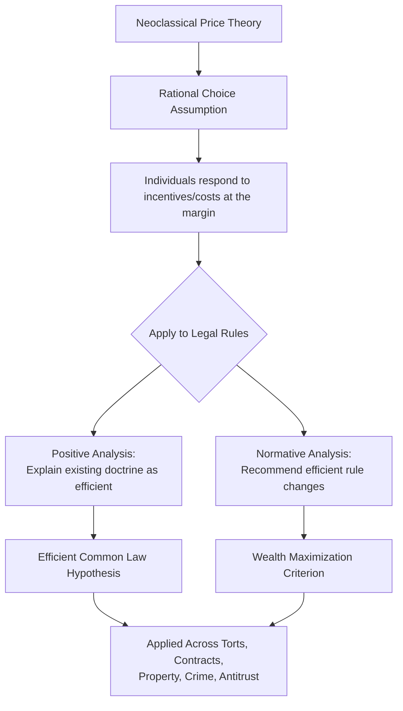

## The Chicago School of Law and Economics

### Overview

The Chicago School of law and economics is the intellectual movement, centered at the University of Chicago Law School from the 1960s onward, that applies neoclassical price theory systematically to legal doctrine and institutions. It treats efficiency (typically wealth maximization) as both a descriptive lens for understanding legal rules and a central normative criterion for evaluating them. This school founded the modern law and economics discipline and remains its most influential, and most contested, branch.

### Intellectual Origins and Key Figures

#### Foundational Contributors

**Key Points**

- **Ronald Coase** — "The Problem of Social Cost" (1960) argued that in a world without transaction costs, the initial legal allocation of rights would not affect the efficiency of the resulting resource allocation, since parties would bargain to the efficient outcome regardless (later termed the Coase Theorem, a label Coase himself did not originate and viewed somewhat skeptically)
- **Aaron Director** — often credited as the intellectual founder of Chicago law and economics; his antitrust economics teaching at the University of Chicago Law School shaped a generation of scholars skeptical of interventionist antitrust doctrine
- **Richard Posner** — synthesized the movement in *Economic Analysis of Law* (1973), applying price-theoretic reasoning across nearly the entire common law (torts, contracts, property, criminal law) and articulating wealth maximization as a normative standard
- **Gary Becker** — extended economic analysis beyond markets to non-market behavior: crime, discrimination, family law, and human capital, providing the microeconomic toolkit later applied throughout Chicago-school legal scholarship
- **George Stigler** — developed the economic theory of regulation (regulatory capture), arguing regulation is often supplied to serve the interests of regulated industries rather than the public

#### Institutional Home

**Key Points**

- University of Chicago Law School and Department of Economics, reinforced by the *Journal of Law and Economics* (founded 1958) as the movement's primary publication outlet
- The Law and Economics Program at Chicago trained influential judges and scholars (notably Frank Easterbrook and Richard Posner, both of whom became federal appellate judges applying these ideas from the bench)

### Core Theoretical Commitments

#### Wealth Maximization as a Normative Standard

Posner proposed that legal rules should be evaluated (and, descriptively, tend to evolve) according to their capacity to maximize social wealth, defined as the sum of values as measured by what individuals are willing to pay.

$$W = \sum_i (\text{WTP}_i - \text{cost}_i)$$

**Key Points**

- Distinct from utilitarianism: wealth maximization uses *willingness to pay* (bounded by ability to pay) rather than subjective utility, avoiding interpersonal utility comparisons that plagued classical utilitarian welfare economics
- Posner's strongest claim (developed in *The Economics of Justice*, 1981) was that wealth maximization has independent ethical appeal, tied to notions of consent and ex ante Pareto-superiority — a position he substantially retreated from in later work amid sustained philosophical criticism
- Critics (notably Ronald Dworkin) argued wealth maximization has no independent moral weight absent a prior theory of just entitlements, since "willingness to pay" presupposes an already-given distribution of wealth and rights

#### The Efficient Common Law Hypothesis

A signature Chicago-school claim, most associated with Posner, is that the common law (judge-made law, as opposed to statute) tends toward economic efficiency over time, even though judges rarely articulate economic reasoning explicitly.

**Key Points**

- Mechanism proposed: inefficient rules generate more or costlier litigation than efficient ones (parties have stronger incentives to relitigate against inefficient precedent), so efficient rules survive disproportionately through a selective litigation/evolutionary process (formalized by Paul Rubin and George Priest in the late 1970s–80s)
- This is a *positive* (descriptive) claim, distinct from and sometimes conflated with the *normative* claim that law *should* be efficient
- [Unverified] The empirical validity of the efficient common law hypothesis remains contested; critics note the theory struggles to explain persistent doctrinal variation across jurisdictions applying similar common-law methods, and the litigation-selection mechanism itself has been challenged on game-theoretic grounds

#### The Coase Theorem and Transaction Costs

Coase's central insight, foundational to the entire field, is that when transaction costs are zero, the assignment of legal entitlements does not affect allocative efficiency—parties bargain around inefficient assignments to reach the efficient outcome; it only affects the distribution of wealth.

$$\text{If } TC = 0: \text{ Efficient outcome is invariant to initial entitlement } \Rightarrow \text{ only distribution changes}$$

**Key Points**

- The theorem's practical import is precisely the inverse of its zero-transaction-cost premise: since real-world transaction costs are rarely zero, the theorem redirects legal analysis toward asking which initial rights assignment minimizes the effect of transaction costs, or "mimics" what parties would have bargained for absent those costs
- This reframes legal rules (property rules vs. liability rules, following the later Calabresi-Melamed framework) as tools for allocating rights to the party who would have acquired them via costless bargaining
- Coase's own purpose in the 1960 article was substantially about critiquing Pigouvian externality theory (taxes/subsidies as the default remedy) more than establishing a freestanding "theorem" — a nuance often lost in later textbook treatments

### Application Across Legal Doctrines

#### Tort Law: The Learned Hand Formula and Efficient Deterrence

Chicago-school tort theory (developed extensively by Posner and later William Landes) treats negligence liability as a mechanism for inducing cost-justified precaution, formalizing Judge Learned Hand's 1947 *United States v. Carroll Towing* negligence test:

$$\text{Negligence if } B < P \times L$$

Where $B$ is the burden (cost) of precaution, $P$ is the probability of the accident, and $L$ is the magnitude of loss if it occurs.

**Key Points**

- A negligence rule using this formula, properly applied, induces injurers to take precisely the efficient (cost-minimizing) level of care — more precaution than efficient wastes resources, less exposes society to expected accident costs exceeding avoidance costs
- Strict liability versus negligence choice is reframed as a question of which rule better induces efficient *activity levels* (not just care levels) and economizes on administrative/information costs
- [Inference] Real-world judicial application of the Hand Formula is often qualitative and rarely involves explicit quantification of $B$, $P$, and $L$; the formula's primary influence is as an analytical framework rather than a literal calculation courts perform

#### Contract Law: Efficient Breach

**Key Points**

- Posner's efficient breach theory holds that a promisor should be permitted (and even encouraged) to breach and pay expectation damages whenever the cost of performance exceeds the value of performance to the promisee, since this reallocates the resource to its higher-value use
- Expectation damages (rather than specific performance or punitive damages) are favored because they are calibrated to make efficient breach possible while still compensating the promisee to their contractual expectation
- Critics (notably Daniel Friedmann and later relational-contract scholars) argue this undervalues the moral significance of promise-keeping and ignores that many real contracts are relational and incomplete, so damages rarely perfectly compensate

#### Property Law: Rules vs. Standards and Rights Allocation

**Key Points**

- Property rules (requiring consensual transfer at a mutually agreed price) are efficient when transaction costs are low, since they preserve bargaining and correct information; liability rules (compelled transfer at court-determined damages) are preferred when transaction costs are high (bilateral monopoly, holdout problems), following the seminal Calabresi-Melamed (1972) taxonomy — itself a direct extension of Coasean logic, though authored outside strict "Chicago School" institutional lines
- Chicago-school property scholarship (e.g., Demsetz's theory of property rights emergence) explains the historical emergence of private property as arising when the benefits of internalizing externalities exceed the costs of establishing enforceable rights

#### Criminal Law: Crime as Rational Choice

Gary Becker's "Crime and Punishment: An Economic Approach" (1968) modeled criminal behavior as a rational response to expected costs and benefits.

$$E[\text{Payoff to Crime}] = \text{Gain} - p \times f$$

Where $p$ is the probability of apprehension/conviction and $f$ is the magnitude of the sanction.

**Key Points**

- Implies that deterrence can be achieved through either increased detection probability ($p$) or increased sanction severity ($f$); since detection is costly to produce, Becker's model suggests substituting toward higher fines/severity and lower (cheaper) enforcement probability where offenders are risk-neutral, though risk-aversion and offender wealth constraints complicate this in practice
- Provided the analytical foundation for later law and economics treatment of criminal procedure, sentencing guidelines, and plea bargaining as resource-allocation problems
- Criticized for abstracting from the sociological, psychological, and distributive dimensions of criminal behavior, and for producing normative implications (e.g., substituting fines for imprisonment when offenders are judgment-proof) that can be practically and politically difficult to implement

#### Antitrust Law: Consumer Welfare and Skepticism of Intervention

The Chicago School's most durable real-world policy influence has been in U.S. antitrust law.

**Key Points**

- Aaron Director and later Robert Bork (*The Antitrust Paradox*, 1978) argued that antitrust law's sole legitimate goal should be consumer welfare (often operationalized as allocative efficiency/total welfare), not protection of competitors, small business, or diffuse political/structural concerns
- Chicago-school antitrust scholars argued many practices previously treated as presumptively anticompetitive (vertical restraints, tying, resale price maintenance) are typically efficiency-enhancing and should be evaluated under a rule-of-reason standard rather than per se illegality
- This framework was substantially adopted by U.S. courts from the late 1970s onward (e.g., *Continental T.V. v. GTE Sylvania*, 1977, replacing per se treatment of vertical non-price restraints with rule-of-reason analysis), representing one of the most significant real-world doctrinal shifts attributable to an academic law and economics movement
- The contemporary Neo-Brandeisian antitrust movement (discussed further below) directly targets this legacy as its primary object of critique

### Methodological Approach

#### Positive and Normative Economic Analysis

**Key Points**

- **Positive analysis**: uses economic models to *predict and explain* existing legal rules and their effects (e.g., "why does contract law award expectation rather than reliance damages by default?")
- **Normative analysis**: uses economic criteria (efficiency, wealth maximization) to *evaluate and recommend* legal rules (e.g., "should negligence liability replace strict liability for this activity?")
- A recurring methodological critique is that Chicago-school scholarship sometimes elides positive and normative claims: demonstrating that a rule is efficient is treated as if it settles the question of whether the rule is desirable, without addressing distributive or non-consequentialist objections

### Worked Example: Coasean Bargaining and Legal Entitlement Choice

**Example**

A factory emits noise affecting a neighboring resident. Consider two entitlement assignments: (1) the factory has a right to emit noise, or (2) the resident has a right to quiet.

Let the factory's value of continuing to emit be $V_F = \$50{,}000$ and the resident's cost of the noise be $V_R = \$30{,}000$, with negligible transaction costs.

- **Under assignment (1)**: resident would need to pay the factory more than $\$50{,}000$ to stop emitting; since $V_R = \$30{,}000 < \$50{,}000$, no bargain occurs — factory continues emitting (efficient, since $V_F > V_R$)
- **Under assignment (2)**: factory would need to pay the resident more than $\$30{,}000$ to continue; since $V_F = \$50{,}000 > \$30{,}000$, factory pays resident (e.g., $\$40{,}000$) and continues emitting — same efficient outcome (factory keeps operating), but wealth distribution differs (resident is $\$40,000$ richer under assignment 2 than assignment 1)

**Conclusion**: This illustrates the Coase Theorem's core claim — the *efficient* outcome (factory continues operating) is identical under both entitlement assignments given zero transaction costs; only the *distribution* of wealth changes. Where transaction costs are significant (e.g., many affected residents facing collective-action problems), the initial assignment would instead determine the outcome, which is precisely the scenario Coase's original article used to critique simple Pigouvian tax solutions to externalities.

### Comparative Table: Chicago School vs. Rival Law and Economics Schools

| Dimension | Chicago School | New Haven School (Yale) | Behavioral Law and Economics | Neo-Brandeisian / Post-Chicago |
| --- | --- | --- | --- | --- |
| Core assumption | Rational, wealth-maximizing actors | Law as policy science serving broader public values | Bounded rationality; systematic cognitive biases | Skeptical of pure efficiency; structural/political concerns matter |
| Primary normative criterion | Efficiency / wealth maximization | Multiple values (order, human dignity, etc.) alongside efficiency | Efficiency, but redefined via actual (not idealized) behavior | Fairness, market structure, and diffusion of power, not just consumer price effects |
| View of markets | Generally self-correcting; skeptical of regulation | More open to regulatory/institutional intervention | Markets can fail due to predictable biases, not just externalities | Markets prone to durable concentration requiring structural intervention |
| Antitrust stance | Narrow consumer welfare standard; skeptical of intervention | N/A (not primarily antitrust-focused) | Skeptical of assuming rational consumer behavior in market definition | Broader harms beyond price (labor, innovation, political power) justify intervention |
| Key figures | Coase, Posner, Becker, Stigler, Director | Guido Calabresi (partly bridges both traditions) | Cass Sunstein, Richard Thaler, Christine Jolls | Lina Khan, Tim Wu |

### Major Critiques of the Chicago School

**Key Points**

- **Distributive neutrality objection**: focusing on efficiency (wealth maximization) brackets distributive justice questions, treating a dollar's value as identical regardless of the recipient's wealth, which critics argue smuggles in an implicit conservative political commitment under the guise of value-neutral science
- **Behavioral economics critique**: the rational-actor assumption underlying nearly all Chicago-school models is empirically undermined by decades of behavioral research documenting systematic heuristics and biases (loss aversion, hyperbolic discounting, status quo bias), undermining predictions built on frictionless rational bargaining
- **Critical Legal Studies critique**: argues law is not a neutral efficiency-optimizing mechanism but reflects and reproduces power relations; efficiency analysis obscures rather than resolves normative conflicts inherent in legal disputes
- **Neo-Brandeisian antitrust critique**: contemporary scholars and enforcers (associated with Lina Khan's 2017 "Amazon's Antitrust Paradox" and subsequent FTC leadership) argue the Chicago-school consumer welfare standard is too narrow for digital-era markets exhibiting network effects, data advantages, and non-price harms, reviving concerns about market structure and diffused economic power that pre-date the Chicago School's rise (echoing the Brandeisian tradition Bork's work was originally named against)
- **Internal Chicago-school evolution**: Posner himself moved toward pragmatism in later career, increasingly qualifying wealth maximization's normative force and emphasizing that economic analysis is one useful tool among several rather than a complete theory of law

### Related Topics

- Post-Chicago and Neo-Brandeisian antitrust economics (contemporary rival paradigm)
- Behavioral law and economics (Sunstein, Thaler, Jolls) as a direct critique/extension
- The Coase Theorem and transaction cost economics (deep-dive foundational topic)
- Public choice theory and Stigler's economic theory of regulation/regulatory capture
- Calabresi and Melamed's property rules vs. liability rules framework
- Critical Legal Studies as an ideological counter-movement
- Law and economics of criminal deterrence (Becker's rational crime model, deep-dive)
- Wealth maximization vs. utilitarianism as competing normative theories of law
- Empirical/econometric testing of the efficient common law hypothesis
- Network effects and technology market regulation (cross-reference: contemporary Chicago vs. structuralist antitrust debate)